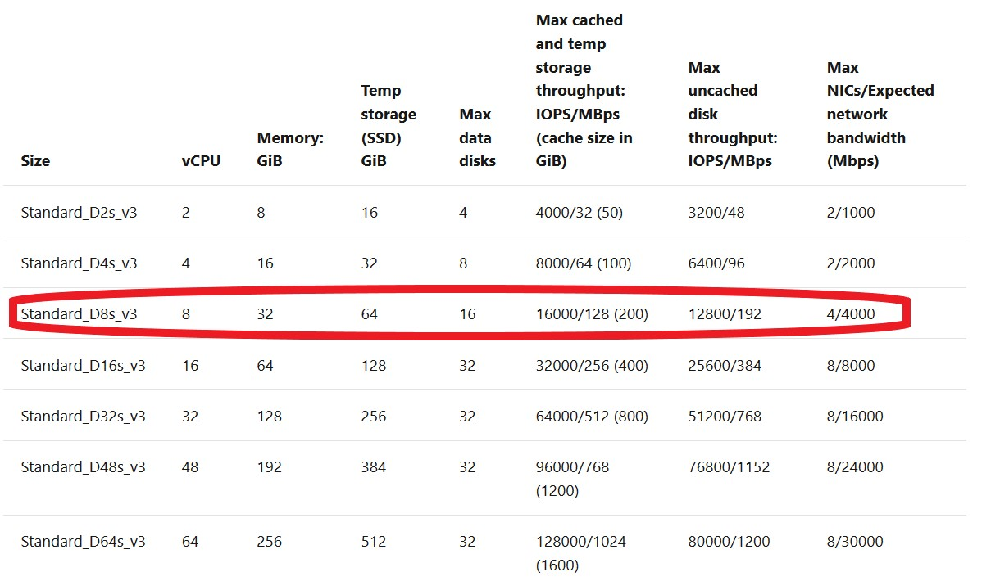
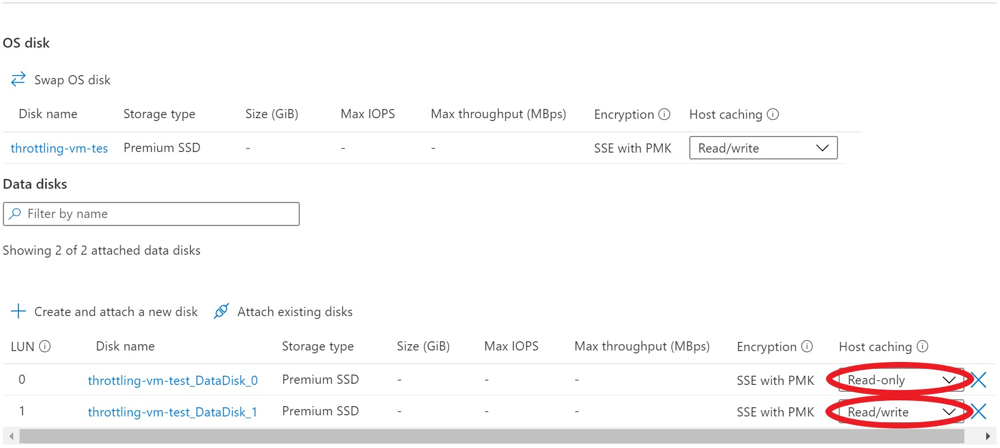
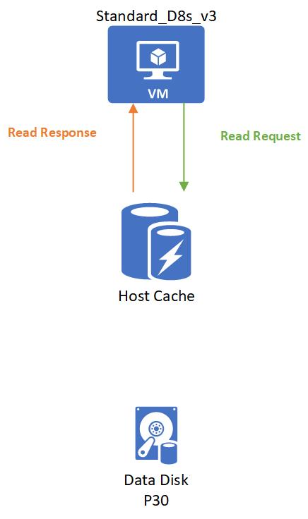
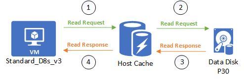
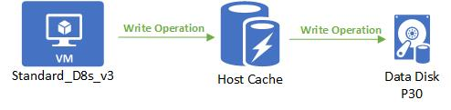
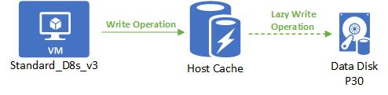
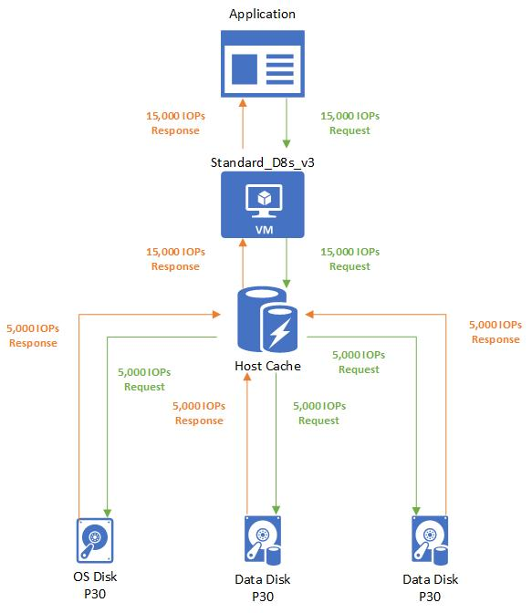
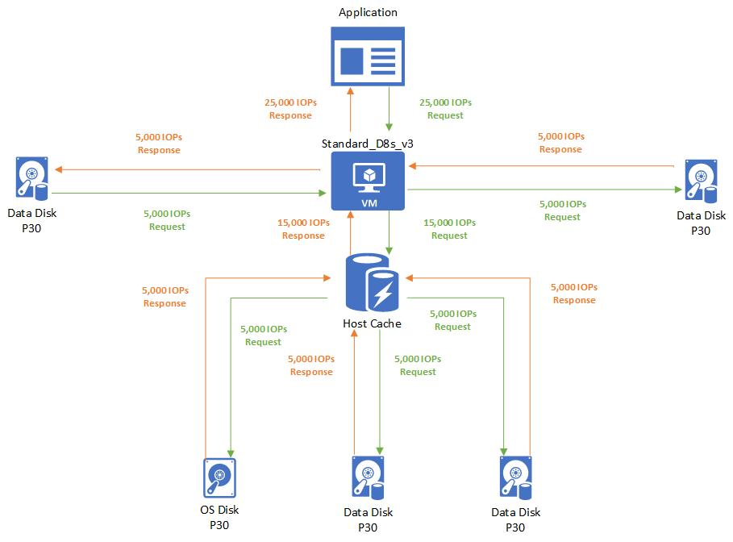

* The max *uncached* disk throughput is the default storage maximum limit that the virtual machine can handle.
* The max *cached* storage throughput limit is a separate limit when you enable host caching.

Host caching works by bringing storage closer to the VM that can be written or read to quickly. The amount of storage that is available to the VM for host caching is in the documentation. For example, you can see the Standard_D8s_v3 comes with 200 GB of cache storage.

You can enable host caching when you create your virtual machine and attach disks. You can also turn on and off host caching on your disks on an existing VM.

You can adjust the host caching to match your workload requirements for each disk. You can set your host caching to be:

* **Read-only** for workloads that only do read operations
* **Read/write** for workloads that do a balance of read and write operations

If your workload doesn't follow either of these patterns, we don't recommend that you use host caching.

Let's run through a couple examples of different host cache settings to see how it affects the data flow and performance. In this first example, we will take a look at what happens with IO requests when the host caching setting is set to **Read-only**.

Setup:
* Standard_D8s_v3 
    * Cached IOPS: 16,000
    * Uncached IOPS: 12,800
* P30 data disk
    * IOPS: 5,000
    * Host caching: **Read-only**

When a read is performed and the desired data is available on the cache, the cache returns the requested data. There is no need to read from the disk. This read is counted toward the VM's cached limits.

When a read is performed and the desired data is *not* available on the cache, the read request is relayed to the disk. Then the disk surfaces it to both the cache and the VM. This read is counted toward both the VM's uncached limit and the VM's cached limit.

When a write is performed, the write has to be written to both the cache and the disk before it is considered complete. This write is counted toward the VM's uncached limit and the VM's cached limit.

In this next example, let's take a look at what happens with IO requests when the host cache setting is set to **Read/write**.

**Setup:**

* Standard_D8s_v3
  * Cached IOPS: 16,000
  * Uncached IOPS: 12,800
* P30 data disk
  * IOPS: 5,000
  * Host caching: **Read/write**

A read is handled the same way as a read-only. Writes are the only thing that's different with read/write caching. When writing with host caching set to **Read/write**, the write only needs to be written to the host cache to be considered complete. The write is then lazily written to the disk as a background process. This means that a write is counted toward cached IO when it is written to the cache. When it is lazily written to the disk it counts toward the uncached IO.

Let’s continue with our Standard_D8s_v3 virtual machine. Except this time, we'll enable host caching on the disks. Also, now the VM's IOPS limit is 16,000 IOPS. Attached to the VM are three underlying P30 disks that can each handle 5,000 IOPS.

**Setup:**

* Standard_D8s_v3
  * Cached IOPS: 16,000
  * Uncached IOPS: 12,800
* P30 OS disk
  * IOPS: 5,000
  * Host caching: **Read/write**
* 2 P30 data disks
  * IOPS: 5,000
  * Host caching: **Read/write**

The application uses a Standard_D8s_v3 virtual machine with caching enabled. It makes a request for 15,000 IOPS. The requests are broken down as 5,000 IOPS to each underlying disk attached. No performance capping occurs.

## Combined uncached and cached limits

A virtual machine's cached limits are separate from their uncached limits. This means you can enable host caching on disks attached to a VM while  not enabling host caching on other disks. This configuration allows your virtual machines to get a total storage IO of the cached limit plus the uncached limit.

Let's run through an example to help you understand how these limits work together. We'll continue with the Standard_D8s_v3 virtual machine and premium disks attached configuration.

**Setup:**

* Standard_D8s_v3
  * Cached IOPS: 16,000
  * Uncached IOPS: 12,800
* P30 OS disk
  * IOPS: 5,000
  * Host caching: **Read/write**
* 2 P30 data disks X 2
  * IOPS: 5,000
  * Host caching: **Read/write**
* 2 P30 data disks X 2
  * IOPS: 5,000
  * Host caching: **Disabled**

In this case, the application running on a Standard_D8s_v3 virtual machine makes a request for 25,000 IOPS. The request is broken down as 5,000 IOPS to each of the attached disks. Three disks use host caching and two disks don't use host caching.

* Since the three disks that use host caching are within the cached limits of 16,000, those requests are successfully completed. No storage performance capping occurs.
* Since the two disks that don't use host caching are within the uncached limits of 12,800, those requests are also successfully completed. No capping occurs.

## Disk performance metrics

We have metrics on Azure that provide insight on how your virtual machines and disks are performing. These metrics can be viewed through the Azure portal or they can be retrieved through an API call. Metrics are calculated over one-minute intervals. The following metrics are available to get insight on VM and Disk IO, and also on throughput performance:

* **OS Disk Queue Depth**: The number of current outstanding IO requests that are waiting to be read from or written to the OS disk.
* **OS Disk Read Bytes/Sec**: The number of bytes that are read in a second from the OS disk.
* **OS Disk Read Operations/Sec**: The number of input operations that are read in a second from the OS disk.
* **OS Disk Write Bytes/Sec**: The number of bytes that are written in a second from the OS disk.
* **OS Disk Write Operations/Sec**: The number of output operations that are written in a second from the OS disk.
* **Data Disk Queue Depth**: The number of current outstanding IO requests that are waiting to be read from or written to the data disk(s).
* **Data Disk Read Bytes/Sec**: The number of bytes that are read in a second from the data disk(s).
* **Data Disk Read Operations/Sec**: The number of input operations that are read in a second from a data disk(s).
* **Data Disk Write Bytes/Sec**: The number of bytes that are written in a second from the data disk(s).
* **Data Disk Write Operations/Sec**: The number of output operations that are written in a second from a data disk(s).
* **Disk Read Bytes/Sec**: The number of total bytes that are read in a second from all disks attached to a VM.
* **Disk Read Operations/Sec**: The number of input operations that are read in a second from all disks attached to a VM.
* **Disk Write Bytes/Sec**: The number of bytes that are written in a second from all disks attached to a VM.
* **Disk Write Operations/Sec**: The number of output operations that are written in a second from all disks attached to a VM.

## Storage IO utilization metrics

Metrics that help diagnose disk IO capping:

* **Data Disk IOPS Consumed Percentage**: The percentage calculated by the data disk IOPS completed over the provisioned data disk IOPS. If this amount is at 100%, your application running is IO capped from your data disk's IOPS limit.
* **Data Disk Bandwidth Consumed Percentage**: The percentage calculated by the data disk throughput completed over the provisioned data disk throughput. If this amount is at 100%, your application running is IO capped from your data disk's bandwidth limit.
* **OS Disk IOPS Consumed Percentage**: The percentage calculated by the OS disk IOPS completed over the provisioned OS disk IOPS. If this amount is at 100%, you'll your application running is IO capped from your OS disk's IOPS limit.
* **OS Disk Bandwidth Consumed Percentage**: The percentage calculated by the OS disk throughput completed over the provisioned OS disk throughput. If this amount is at 100%, your application running is IO capped from your OS disk's bandwidth limit.

Metrics that help diagnose VM IO capping:

* **VM Cached IOPS Consumed Percentage**: The percentage calculated by the total IOPS completed over the max cached virtual machine IOPS limit. If this amount is at 100%, your application running is IO capped from your VM's cached IOPS limit.
* **VM Cached Bandwidth Consumed Percentage**: The percentage calculated by the total disk throughput completed over the max cached virtual machine throughput. If this amount is at 100%, your application running is IO capped from your VM's cached bandwidth limit.
* **VM uncached IOPS Consumed Percentage**: The percentage calculated by the total IOPS on a virtual machine completed over the max uncached  virtual machine IOPS limit. If this amount is at 100%, your application running is IO capped from your VM's uncached IOPS limit.
* **VM Uncached Bandwidth Consumed Percentage**: The percentage calculated by the total disk throughput on a virtual machine completed over the max provisioned virtual machine throughput. If this amount is at 100%, your application running is IO capped from your VM's uncached bandwidth limit.

## Storage IO utilization metrics example

Let's run through an example of how to use these new Storage IO utilization metrics to help us debug where a bottleneck is in our system. The system setup is exactly what we had in the previous example, except this time the attached OS disk is *not* cached.

**Setup:**

* Standard_D8s_v3
  * Cached IOPS: 16,000
  * Uncached IOPS: 12,800
* P30 OS disk
  * IOPS: 5,000
  * Host caching: **Disabled**
* 2 P30 data disks X 2
  * IOPS: 5,000
  * Host caching: **Read/write**
* 2 P30 data disks X 2
  * IOPS: 5,000
  * Host caching: **Disabled**
