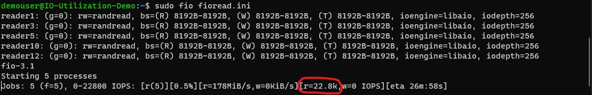
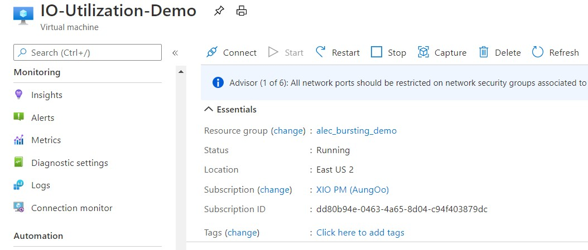

However, the Standard_D8s_v3 can achieve a total of 28,600 IOPs, using the metrics lets investigate what is going on and identify our storage IO bottleneck. First, locate the metrics button left-hand side menu and select it:

Let's first take a look at our **VM Cached IOPS Consumed Percentage** metric:

This metric is telling us out of the 16,000 IOPs allotted to the cached IOPs on the VM, 61% is being used. This means that the storage IO bottleneck is not with the disks that are cached because it is not at 100%. So let's now take a look at our **VM Uncached IOPS Consumed Percentage** metric:

This metric is at 100%, telling us that all of the 12,800 IOPs allotted to the uncached IOPs on the VM are being used. One way we can remediate this is by changing the size of our VM to a larger size that can handle the additional IO. But before we do that, let's take a look at the disk attached to see how many IOPs they are seeing. Let's first take a look at the OS Disk by looking at the **OS Disk IOPS Consumed Percentage**:

This metric is telling us that of the 5,000 IOPs provisioned for this P30 OS disk, around 90% of it is being used. This means there is no bottleneck here at the OS Disk. Now let's take a look at the data disks that are attached to the VM by looking at the **Data Disk IOPS Consumed Percentage**:

This metric is telling us that the average IOPs consumed percentage across all the disks attached is around 42%. This percentage is calculated based on the IOPs that are used by the disks and are not being served from the host cache. Let's drill deeper into this metric to see the by applying **splitting** on these metrics and splitting by the LUN value:

This metric is telling us the data disks attached on LUN 3 and 2 are being using around 85% of their provisioned IOPs. Here is a diagram of what the IO is looking like from the VM and Disks architecture:

