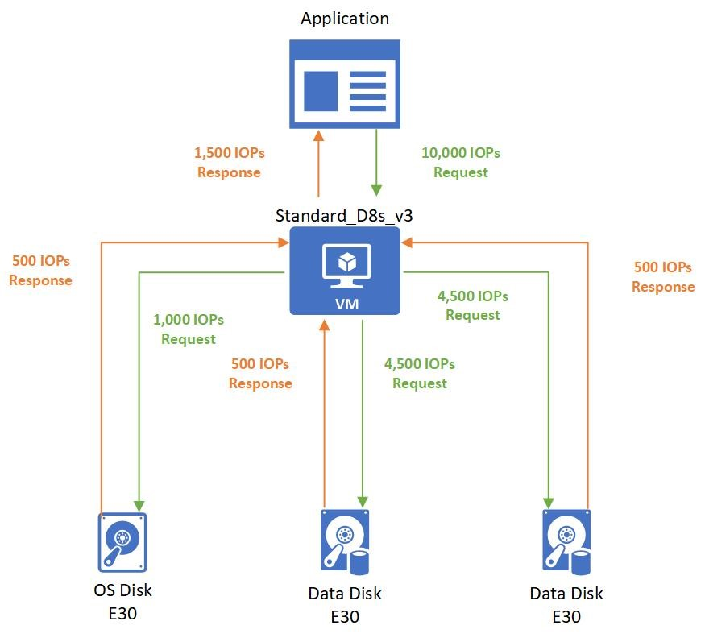
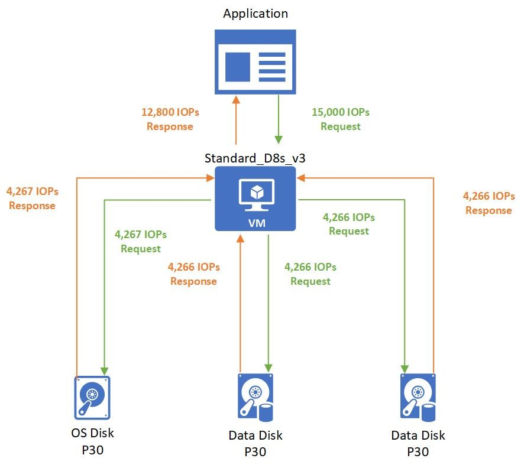

This article helps clarify disk performance and how it works when you combine Azure Virtual Machines and Azure disks. It also describes how you can diagnose bottlenecks for your disk IO and the changes you can make to optimize for performance.

## How does disk performance work?
Azure virtual machines have input/output operations per second (IOPS) and throughput performance limits based on the virtual machine type and size. OS disks and data disks can be attached to virtual machines. The disks have their own IOPS and throughput limits.

Your application's performance gets capped when it requests more IOPS or throughput than what is allotted for the virtual machines or attached disks. When capped, the application experiences suboptimal performance. This can lead to negative consequences like increased latency. Let's run through a couple of examples to clarify this concept. To make these examples easy to follow, we'll only look at IOPS. But, the same logic applies to throughput.

## Disk IO capping

**Setup:**

- Standard_D8s_v3
  - Uncached IOPS: 12,800
- E30 OS disk
  - IOPS: 500
- Two E30 data disks × 2
  - IOPS: 500

The application running on the virtual machine makes a request that requires 10,000 IOPS to the virtual machine. All of which are allowed by the VM because the Standard_D8s_v3 virtual machine can execute up to 12,800 IOPS.

The 10,000 IOPS requests are broken down into three different requests to the different disks:

- 1,000 IOPS are requested to the operating system disk.
- 4,500 IOPS are requested to each data disk.

All attached disks are E30 disks and can only handle 500 IOPS. So, they respond back with 500 IOPS each. The application's performance is capped by the attached disks, and it can only process 1,500 IOPS. The application could work at peak performance at 10,000 IOPS if better-performing disks are used, such as Premium SSD P30 disks.

## Virtual machine IO capping

**Setup:**

- Standard_D8s_v3
  - Uncached IOPS: 12,800
- P30 OS disk
  - IOPS: 5,000
- Two P30 data disks × 2
  - IOPS: 5,000

The application running on the virtual machine makes a request that requires 15,000 IOPS. Unfortunately, the Standard_D8s_v3 virtual machine is only provisioned to handle 12,800 IOPS. The application is capped by the virtual machine limits and must allocate the allotted 12,800 IOPS.

Those 12,800 IOPS requested are broken down into three different requests to the different disks:

- 4,267 IOPS are requested to the operating system disk.
- 4,266 IOPS are requested to each data disk.

All attached disks are P30 disks that can handle 5,000 IOPS. So, they respond back with their requested amounts.
