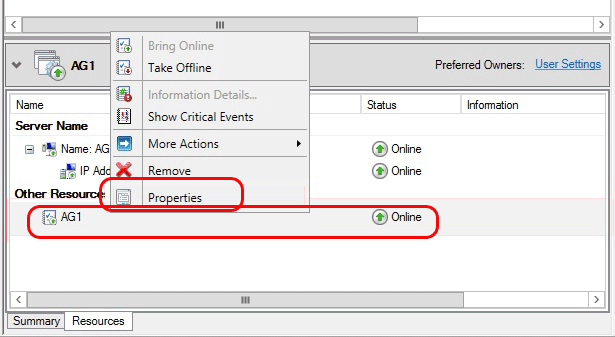
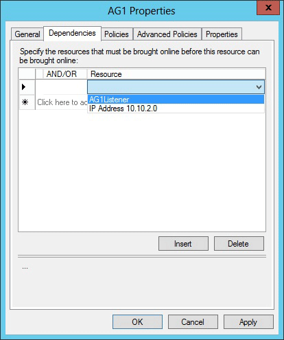

1. Navigate back to Failover Cluster Manager.  Expand **Roles** and then highlight your Availability Group.  On the **Resources** tab, right-click the listener name and click Properties.

1. Click the **Dependencies** tab. If there are multiple resources listed, verify that the IP addresses have OR, not AND, dependencies.  Click **OK**.

1. Right-click the listener name and click **Bring Online**.

1. Once the listener is online, from the **Resources** tab, right-click the availability group and click **Properties**.

	

1. Create a dependency on the listener name resource (not the IP address resources name). Click **OK**.

	

1. Launch **SQL Server Management Studio** and connect to the primary replica.

1. Navigate to **AlwaysOn High Availability** | **Availability Groups** | **<AvailabilityGroupName>** | **Availability Group Listeners**. 

3. You should now see the listener name that you created in Failover Cluster Manager. Right-click the listener name and click **Properties**.

1. In the **Port** box, specify the port number for the availability group listener by using the $EndpointPort you used earlier (in this tutorial, 1433 was the default), then click **OK**.
