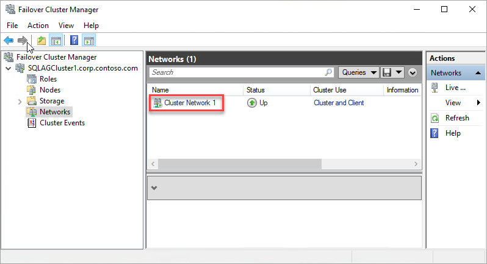
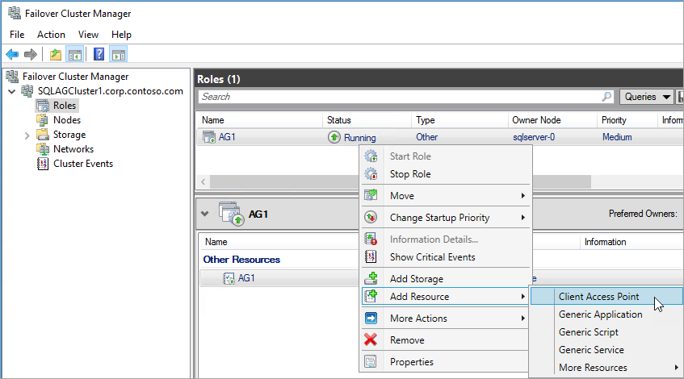
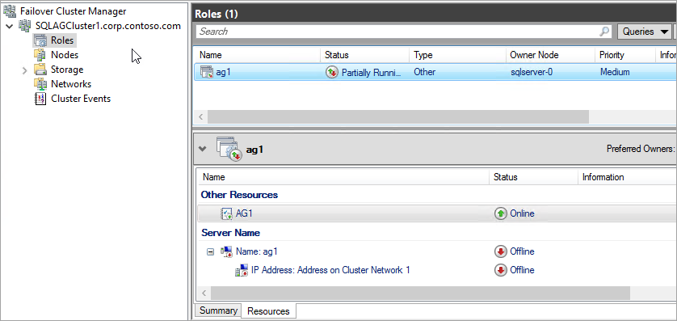
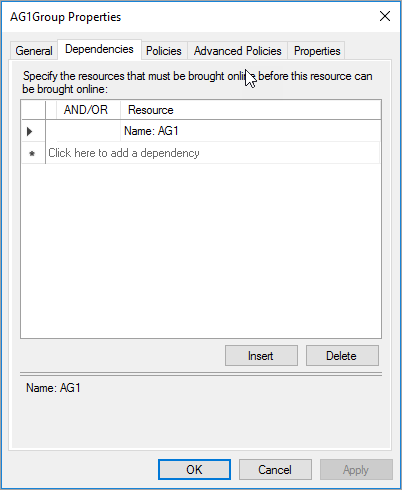
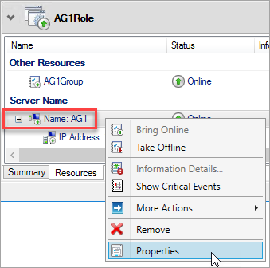
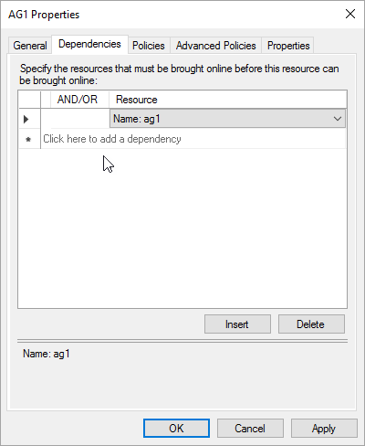

The Availability Group listener is an IP address and network name that the SQL Server Availability Group listens on. To create the Availability Group listener, do the following steps:

1. [Get the name of the cluster network resource](#getnet).

1. [Add the client access point](#addcap).

1. [Configure the IP resource for the Availability Group](#congroup).

1. [Make the SQL Server availability group resource dependent on the client access point](#dependencyGroup)

1. [Make the client access point resource dependent on the IP address](#listname).

1. [Set the cluster parameters in PowerShell](#setparam).

The following sections provide detailed instructions for each of these steps. 

#### <a name="getnet"></a>Get the name of the cluster network resource

1. Use RDP to connect to the Azure virtual machine that hosts the primary replica. 

1. Open Failover Cluster Manager.

1. Select the **Networks** node, and note the cluster network name. Use this name in the `$ClusterNetworkName` variable in the PowerShell script.

   In the following picture the cluster network name is **Cluster Network 1**:

   

#### <a name="addcap"></a>Add the client access point

The client access point is the network name that applications use to connect to the databases in an availability group. Create the client access point in Failover Cluster Manager. 

1. Expand the cluster name, and then click **Roles**.

1. In the **Roles** pane, right-click the Availability Group name and then select **Add Resource** > **Client Access Point**.

   

1. In the **Name** box, create a name for this new listener. 

   The name for the new listener is the network name that applications use to connect to databases in the SQL Server Availability Group.
   
   To finish creating the listener, click **Next** twice, and then click **Finish**. Do not bring the listener or resource online at this point.
   
#### <a name="congroup"></a>Configure the IP resource for the Availability Group

1. Click the **Resources** tab, then expand the client access point you created. The client access point is offline.

    

1. Right-click the IP resource and click properties. Note the name of the IP address. Use this name in the `$IPResourceName` variable in the PowerShell script.

1. Under **IP Address**, click **Static IP Address**. Set the IP address to the same address that you used when you set the load balancer address on the Azure portal.

    

<!-----------------------I don't see this option on server 2016
1. Disable NetBIOS for this address and click **OK**. Repeat this step for each IP resource if your solution spans multiple Azure VNets. 
------------------------->

#### <a name = "dependencyGroup"></a>Make the SQL Server availability group resource dependent on the client access point

1. In Failover Cluster Manager, click **Roles** and click your Availability Group.

1. On the **Resources** tab, right-click the availability resource group under **Other Resources** and click **Properties**. 

1. On the dependencies tab, add the name of the client access point (the listener) resource.

    

1. Click **OK**.

#### <a name="listname"></a>Verify that the client access point resource is dependent on the IP address

1. In Failover Cluster Manager, click **Roles** and click your Availability Group. 

1. On the **Resources** tab, right-click the client access point resource under **Server Name** and click **Properties**. 

    

1. Click the **Dependencies** tab. Verify that the IP address is a dependency. If it is not, set a dependency on the IP address. If there are multiple resources listed, verify that the IP addresses have OR, not AND, dependencies. Click **OK**. 

    

1. Right-click the listener name and click **Bring Online**. 

>[!TIP]
>You can validate that the dependencies are correctly configured. In Failover Cluster Manager, go to Roles, right-click the availability group, click **More Actions**, and click  **Show Dependency Report**. Correctly configured, the availability group is dependent on the network name, and the network name is dependent on the IP address. 


#### <a name="setparam"></a>Set the cluster parameters in PowerShell

1. Copy the following PowerShell script to one of your SQL Servers. Update the variables for your environment.     
   ```PowerShell
   $ClusterNetworkName = "<MyClusterNetworkName>" # the cluster network name (Use Get-ClusterNetwork on Windows Server 2012 of higher to find the name)
   $IPResourceName = "<IPResourceName>" # the IP Address resource name
   $ILBIP = “<n.n.n.n>” # the IP Address of the Internal Load Balancer (ILB). This is the static IP address for the load balancer you configured in the Azure portal.
   [int]$ProbePort = <nnnnn>

   Import-Module FailoverClusters

   Get-ClusterResource $IPResourceName | Set-ClusterParameter -Multiple @{"Address"="$ILBIP";"ProbePort"=$ProbePort;"SubnetMask"="255.255.255.255";"Network"="$ClusterNetworkName";"EnableDhcp"=0}
   ```

2. Set the cluster parameters by running the PowerShell script on one of the cluster nodes.  

> [!NOTE]
> If your SQL Servers are in separate regions, you need to run the PowerShell script twice. The first time, use the `$ILBIP` and `$ProbePort` from the first region. The second time, use the `$ILBIP` and `$ProbePort` from the second region. The cluster network name, and the cluster IP resource name are the same. 


