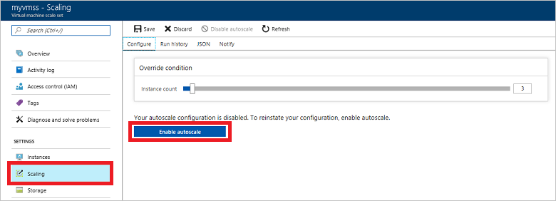
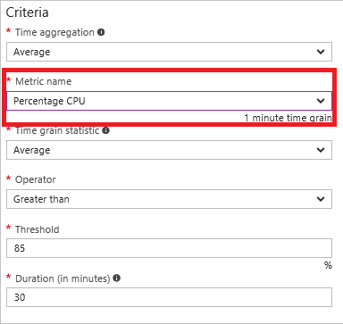
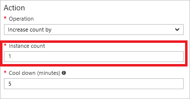

You can easily [automatically scale](../articles/monitoring-and-diagnostics/insights-autoscale-best-practices.md) your [virtual machines (VMs)](../articles/virtual-machines/windows/overview.md) when you use [virtual machine scale sets](../articles/virtual-machine-scale-sets/virtual-machine-scale-sets-overview.md) and the [autoscaling feature of Azure Monitor](../articles/monitoring-and-diagnostics/monitoring-overview-autoscale.md). Your VMs need to be members of a scale set to be automatically scaled. This article provides information that enables you to better understand how to scale your VMs both vertically and horizontally using automatic and manual methods.

## Horizontal or vertical scaling

The autoscale feature of Azure Monitor only scales horizontally, which is an increase ("out") or decrease ("in") of the number of VMs. Horizontal scaling is more flexible in a cloud situation as it allows you to run potentially thousands of VMs to handle load. You scale horizontally by either automatically or manually changing the capacity (or instance count) of the scale set. 

Vertical scaling keeps the same number of VMs, but makes the VMs more ("up") or less ("down") powerful. Power is measured in attributes such as memory, CPU speed, or disk space. Vertical scaling is dependent on the availability of larger hardware, which quickly hits an upper limit and can vary by region. Vertical scaling also usually requires a VM to stop and restart. You scale vertically by setting a new size in the configuration of the VMs in the scale set.

Using runbooks in [Azure Automation](../articles/automation/automation-intro.md), you can easily [scale VMs in a scale set](../articles/virtual-machine-scale-sets/virtual-machine-scale-sets-vertical-scale-reprovision.md) up or down.

## Create a virtual machine scale set

Scale sets make it easy for you to deploy and manage identical VMs as a set. You can create Linux or Windows scale sets using the [Azure portal](../articles/virtual-machine-scale-sets/virtual-machine-scale-sets-portal-create.md), [Azure PowerShell](../articles/virtual-machines/windows/tutorial-create-vmss.md), or the [Azure CLI](../articles/virtual-machines/linux/tutorial-create-vmss.md). You can also create and manage scale sets with SDKs such as [Python](https://azure.microsoft.com/develop/python/) or [Node.js](/nodejs/azure), or directly with the [REST APIs](/rest/api/compute/virtualmachinescalesets). Automatic scaling of VMs is accomplished by applying metrics and rules to the scale set.

## Configure autoscale for a scale set

Automatic scaling provides the right number of VMs to handle the load on your application. It enables you to add VMs to handle increases in load and save money by removing VMs that are sitting idle. You specify a minimum and maximum number of VMs to run based on a set of rules. Having a minimum makes sure your application is always running even under no load. Having a maximum value limits your total possible hourly cost.

You can enable autoscale when you create the scale set using [Azure PowerShell](../articles/monitoring-and-diagnostics/insights-powershell-samples.md#create-and-manage-autoscale-settings) or [Azure CLI](https://docs.microsoft.com/cli/azure/monitor/autoscale-settings). You can also enable it after the scale set is created. You can create a scale set, install the extension, and configure autoscale using an [Azure Resource Manager template](../articles/virtual-machine-scale-sets/virtual-machine-scale-sets-windows-autoscale.md). In the Azure portal, enable autoscale from Azure Monitor, or enable autoscale from the scale set settings.

 
### Metrics

The autoscale feature of Azure Monitor enables you to scale the number of running VMs up or down based on [metrics](../articles/monitoring-and-diagnostics/insights-autoscale-common-metrics.md). By default, VMs provide basic host-level metrics for disk, network, and CPU usage. When you configure the collection of diagnostics data using the diagnostic extension, additional guest OS performance counters become available for disk, CPU, and memory.

If your application needs to scale based on metrics that are not available through the host, then the VMs in the scale set need to have either the [Linux diagnostic extension](../articles/virtual-machines/linux/diagnostic-extension.md) or [Windows diagnostics extension](../articles/virtual-machines/windows/ps-extensions-diagnostics.md) installed. If you create a scale set using the Azure portal, you need to also use Azure PowerShell or the Azure CLI to install the extension with the diagnostics configuration that you need.
 
### Rules

[Rules](../articles/monitoring-and-diagnostics/monitoring-autoscale-scale-by-custom-metric.md) combine a metric with an action to be performed. When rule conditions are met, one or more autoscale actions are triggered. For example, you might have a rule defined that increases the number of VMs by 1 if the average CPU usage goes above 85 percent.

 
### Notifications

You can [set up triggers](../articles/monitoring-and-diagnostics/insights-autoscale-to-webhook-email.md) so that specific web URLs are called or emails are sent based on the autoscale rules that you create. Webhooks allow you to route the Azure alert notifications to other systems for post-processing or custom notifications.

## Manually scale VMs in a scale set

### Horizontal

You can add or remove VMs by changing the capacity of the scale set. In the Azure portal, you can decrease or increase the number of VMs (shown as **instance count**) in the scale set by sliding the Override condition bar on the Scaling screen left or right.

Using Azure PowerShell, you need to get the scale set object using [Get-AzureRmVmss](https://docs.microsoft.com/powershell/module/azurerm.compute/get-azurermvmss). You then set the **sku.capacity** property to the number of VMs that you want and update the scale set with [Update-AzureRmVmss](https://docs.microsoft.com/powershell/module/azurerm.compute/update-azurermvmss). Using Azure CLI, you change the capacity with the **--new-capacity** parameter for the [az vmss scale](https://docs.microsoft.com/cli/azure/vmss#az_vmss_scale) command.

### Vertical

You can manually change the size of the VMs in the Azure portal on the Size screen for the scale set. You can use Azure PowerShell with Get-AzureRmVmss, setting the image reference sku property, and then using [Update-AzureRmVmss](https://docs.microsoft.com/powershell/module/azurerm.compute/update-azurermvmss) and [Update-AzureRmVmssInstance](https://docs.microsoft.com/powershell/module/azurerm.compute/update-azurermvmssinstance).

## Next steps

- Learn more about scale sets in [Design Considerations for Scale Sets](../articles/virtual-machine-scale-sets/virtual-machine-scale-sets-design-overview.md).

