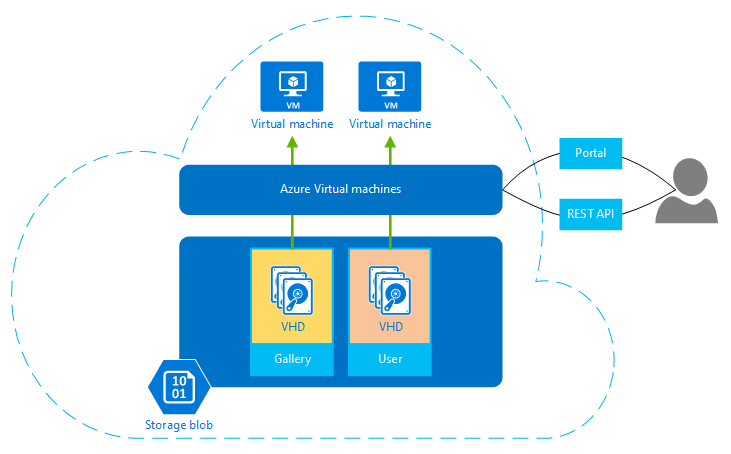

## Tell me about virtual machines

Azure Virtual Machines lets developers, IT operations people, and others create and use virtual machines in the cloud. Providing what's known as *Infrastructure as a Service (IaaS)*, this technology can be used in variety of ways. This figure shows its basic components.

**Figure: Azure Virtual Machines provides Infrastructure as a Service.**

As the figure shows, you can create virtual machines using either the Azure Management Portal or the REST-based Azure Service Management API. The Management Portal can be accessed from any popular browser, including Internet Explorer, Mozilla, and Chrome. For the REST API, Microsoft provides client scripting tools for Windows, Linux, and Macintosh systems. Other software is also free to use this interface.

However you access the platform, creating a new VM requires choosing a virtual hard disk (VHD) for the VM's image. These VHDs are stored in [Azure blobs](http://www.asp.net/aspnet/overview/developing-apps-with-windows-azure/building-real-world-cloud-apps-with-windows-azure/unstructured-blob-storage). 

To get started you have two choices 

1. Upload your own VHD 
2. Use VHDs provided by Microsoft and its partners in the Azure Virtual Machines gallery or on the Microsoft open source [VMDepot](http://vmdepot.msopentech.com/) website. 

The VHDs in the gallery and on VMDepot include clean Microsoft and Linux operating system images as well as images that include Microsoft and other third party products installed on them.  The options are growing all the time. Examples include various versions, editions and configurations of:
 
-	Windows Server 
-	Linux servers such as Suse, Ubuntu and CentOS
-	SQL Server
-	BizTalk Server 
-	SharePoint Server

Along with a VHD, you specify the size of your new VM.  The full stats for each size are listed [in the Azure library](http://msdn.microsoft.com/library/windowsazure/dn197896.aspx).  

-	**Extra Small**, with a shared core and 768MB  of memory.
-	**Small**, with 1 core and 1.75GB  of memory.
-	**Medium**, with 2 cores and 3.5GB  of memory.
-	**Large**, with 4 cores and 7GB of memory.
-	**Extra Large**, with 8 cores and 14GB of memory.
-	**A6**, with 4 cores and 28GB of memory.
-	**A7**, with 8 cores and 56GB of memory.

Finally, you choose which Azure datacenter your new VM should run in, whether in the US, Europe, or Asia. 

Once a VM is running, you pay for each hour it runs, and you stop paying when you remove that VM. The amount you pay doesn't depend on how much your VM is used -- it's based solely on wall-clock time. A VM that sits idle for an hour costs the same as one that's heavily loaded. 

Each running VM has an associated *OS disk*, kept in a blob. When you create a VM using a gallery VHD, that VHD is copied to your VM's OS disk. Any changes you make to the operating system of your running VM are stored here. For example, if you install an application that modifies the Windows registry, that change will be stored in your VM's OS disk. The next time you create a VM from that OS disk, the VM continues running in the same state you left it in. For VHDs stored in the gallery, Microsoft applies updates when needed, such as operating system patches. For the VHDs in your own OS disks, however, you're responsible for applying these updates (although Windows Update is turned on by default).

Running VMs can also be modified and then captured using the sysprep tool. Sysprep removes specifics like the machine name so that a VHD image can be used to create additional VMs with the same general configuration. These images are stored in the Management portal alongside your uploaded images so they can be used as a starting point for additional VMs. 

Virtual Machines also monitors the hardware hosting each VM you create. If a physical server running a VM fails, the platform notices this and starts the same VM on another machine. And assuming you have the right licensing, you can copy a changed VHD out of your OS disk, then run it someplace else, such as in your own on-premises datacenter or at another cloud provider. 

Along with its OS disk, your VM has one or more data disks. Even though each of these looks like a mounted disk drive to your VM, the contents of each one is in fact stored in a blob. Every write made to a data disk is stored persistently in the underlying blob. As with all blobs, Azure replicates these both within a single datacenter and across datacenters to guard against failures.

Running VMs can be managed using the Management Portal, PowerShell and other scripting tools, or directly through the REST API. (In fact, whatever you can do through the Management Portal can be done programmatically through this API.) Microsoft partners such as RightScale and ScaleXtreme also provide management services that rely on the REST API.

Azure Virtual Machines can be used in a variety of ways. The primary scenarios that Microsoft targets include these:

- **VMs for development and test.** Development groups commonly need VMs with specific configurations for creating applications. Azure Virtual Machines provides a straightforward and economical way to create these VMs, use them, then remove them when they're no longer needed.
- **Running applications in the cloud.** For some applications, running on the public cloud makes economic sense. Think about an application with large spikes in demand, for example. It's always possible to buy enough machines for your own datacenter to run this application, but most of those machines are likely to sit unused much of the time. Running this application on Azure lets you pay for extra VMs only when you need them, shutting them down when a demand spike has ended. Or suppose you're a start-up that needs on-demand computing resources quickly and with no commitment. Once again, Azure can be the right choice.
- **Extending your own datacenter into the public cloud.** With Azure Virtual Network, your organization can create a virtual network (VNET) that makes a group of Azure VMs appear to be part of your own on-premises network. This allows running applications such as SharePoint and others on Azure, an approach that might be easier to deploy and/or less expensive than running them in your own datacenter. You can also run [SQL Server on VMs](http://www.asp.net/aspnet/overview/developing-apps-with-windows-azure/building-real-world-cloud-apps-with-windows-azure/data-storage-options/#sqliaas) if that meets your needs better than Azure SQL Database.  
- **Disaster recovery.** Rather than paying continuously for a backup datacenter that's rarely used, IaaS-based disaster recovery lets you pay for the computing resources you need only when you really need them.  For example, if your primary datacenter goes down, you can create VMs running on Azure to run essential applications, then shut them down when they're no longer needed.

These aren't the only possibilities, but they're good examples of how you might use Azure Virtual Machines.  
