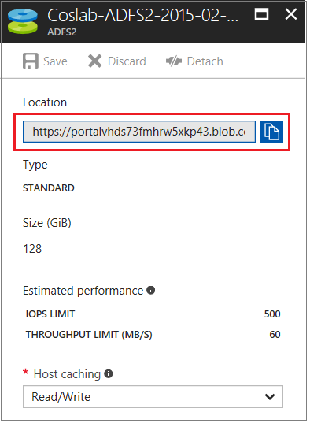

If your virtual machine (VM) in Azure encounters a boot or disk error, you may need to perform troubleshooting steps on the virtual hard disk itself. A common example would be a failed application update that prevents the VM from booting successfully. This article describes how to use Azure portal to connect your virtual hard disk to another VM to fix any errors and then re-create your original VM.

## Recovery process overview
The troubleshooting process is as follows:

1. Delete the VM that's encountering issues, but retain the virtual hard disks.
2. Attach and mount the virtual hard disk to another VM for troubleshooting.
3. Connect to the troubleshooting VM. Edit files or run tools to fix errors on the original virtual hard disk.
4. Unmount and detach the virtual hard disk from the troubleshooting VM.
5. Create a VM by using the original virtual hard disk.

## Delete the original VM
Virtual hard disks and VMs are two distinct resources in Azure. A virtual hard disk is where the operating system, applications, and configurations are stored. The VM is just metadata that defines the size or location and that references resources such as a virtual hard disk or virtual network interface card (NIC). Each virtual hard disk gets a lease assigned when that disk is attached to a VM. Although data disks can be attached and detached even while the VM is running, the OS disk cannot be detached unless the VM resource is deleted. The lease continues to associate the OS disk to a VM even when that VM is in a stopped and deallocated state.

The first step to recovering your VM is to delete the VM resource itself. Deleting the VM leaves the virtual hard disks in your storage account. After the VM is deleted, you can attach the virtual hard disk to another VM to troubleshoot and resolve the errors. 

1. Sign in to the [Azure portal](https://portal.azure.com). 
2. On the menu on the left side, click **Virtual Machines (classic)**.
3. Select the VM that has the problem, click **Disks**, and then identify the name of the virtual hard disk. 
4. Select the OS virtual hard disk and check the **Location** to identify the storage account that contains that virtual hard disk. In the following example, the string immediately before ".blob.core.windows.net" is the storage account name.

    ```
    https://portalvhds73fmhrw5xkp43.blob.core.windows.net/vhds/SCCM2012-2015-08-28.vhd
    ```

    

5. Right-click the VM and then select **Delete**. Make sure that the disks are not selected when you delete the VM.
6. Create a new recovery VM. This VM must be in the same region and resource group (Cloud Service) as the problem VM.
7. Select the recovery VM, and then select **Disks** > **Attach Existing**.
8. To select your existing virtual hard disk, click **VHD File**:

    

9. Select the storage account > VHD container > the virtual hard disk, click the **Select** button to confirm your choice.

    

10. With your VHD now selected, select **OK** to attach the existing virtual hard disk.
11. After a few seconds, the **Disks** pane for your VM will display your existing virtual hard disk connected as a data disk:

    

## Fix issues on the original virtual hard disk
When the existing virtual hard disk is mounted, you can now perform any maintenance and troubleshooting steps as needed. Once you have addressed the issues, continue with the following steps.

## Unmount and detach the original virtual hard disk
Once any errors are resolved, unmount and detach the existing virtual hard disk from your troubleshooting VM. You cannot use your virtual hard disk together with any other VM until the lease that attaches the virtual hard disk to the troubleshooting VM is released.  

1. Sign in to the [Azure portal](https://portal.azure.com). 
2. On the menu on the left side, select **Virtual Machines (classic)**.
3. Locate the recovery VM. Select Disks, right-click the disk, and then select **Detach**.

## Create a VM from the original hard disk

To create a VM from your original virtual hard disk, use [Azure classic portal](https://manage.windowsazure.com).

1. Sign into [Azure classic portal](https://manage.windowsazure.com).
2. At the bottom of the portal, select **New** > **Compute** > **Virtual Machine** > **From Gallery**.
3. In the **Choose an Image** section, select **My disks**, and then select the original virtual hard disk. Check the location information. This is the region where the VM must be deployed. Select the next button.
4. In the **Virtual machine configuration** section, type the VM name and select a size for the VM.