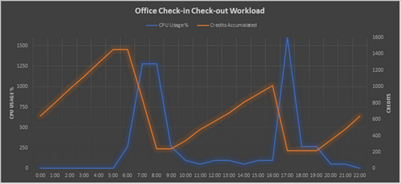

The B-series VM family allows you to choose which VM size provides you the necessary base level performance for your workload, with the ability to burst CPU performance up to 100% of an Intel® Broadwell E5-2673 v4 2.3 GHz, or an Intel® Haswell 2.4 GHz E5-2673 v3 processor vCPU.

The B-series VMs are ideal for workloads that do not need the full performance of the CPU continuously, like web servers, proof of concepts,  small databases and development build environments. These workloads typically have burstable performance requirements. The B-series provides you with the ability to purchase a VM size with baseline performance and the VM instance builds up credits when it is using less than its baseline. When the VM has accumulated credit, the VM can burst above the baseline using up to 100% of the vCPU when your application requires higher CPU performance.

The B-series comes in the following VM sizes:

| Size             | vCPU  | Memory: GiB | Temp storage (SSD) GiB | Base CPU Perf of VM | Max CPU Perf of VM | Initial Credits | Credits Earned / hour | Max Earned Credits | Max data disks | Max cached and temp storage throughput: IOPS / MBps | Max uncached disk throughput: IOPS / MBps | Max NICs |          
|---------------|-------------|----------------|----------------------------|-----------------------|--------------------|--------------------|--------------------|----------------|----------------------------------------|-------------------------------------------|-------------------------------------------|----------|
| Standard_B1ls1  | 1           | 0.5              | 4                          | 5%                   | 100%                   | 30                   | 3                  | 72            | 2                                      | 200 / 10                                  | 160 / 10                                  | 2  |
| Standard_B1s  | 1           | 1              | 4                          | 10%                   | 100%                   | 30                   | 6                  | 144            | 2 					     | 400 / 10                                  | 320 / 10                                  | 2  |
| Standard_B1ms | 1           | 2              | 4                          | 20%                   | 100%                   | 30                   | 12                 | 288           | 2 					     | 800 / 10                                  | 640 / 10                                  | 2  |
| Standard_B2s  | 2           | 4              | 8                          | 40%                   | 200%                   | 60                   | 24                 | 576            | 4                                      | 1600 / 15                                 | 1280 / 15                                 | 3  |
| Standard_B2ms | 2           | 8              | 16                         | 60%                   | 200%                   | 60                   | 36                 | 864            | 4                                      | 2400 / 22.5                               | 1920 / 22.5                               | 3  |
| Standard_B4ms | 4           | 16             | 32                         | 90%                   | 400%                   | 120                   | 54                 | 1296           | 8                                      | 3600 / 35                                 | 2880 / 35                                 | 4  |
| Standard_B8ms | 8           | 32             | 64                         | 135%                  | 800%                   | 240                   | 81                 | 1944           | 16                                     | 4320 / 50                                 | 4320 / 50                                 | 4  |
| Standard_B12ms | 12           | 48             | 96                         | 202%                  | 1200%                   | 360                   | 121                 | 2909           | 16                                     | 6480 / 75                                 | 4320 / 50                                  | 6  |
| Standard_B16ms | 16           | 64             | 128                         | 270%                  | 1600%                   | 480                   | 162                 | 3888           | 32                                     | 8640 / 100                                 | 4320 / 50                                 | 8  |
| Standard_B20ms | 20           | 80             | 160                         | 337%                  | 2000%                   | 600                   | 203                 | 4860           | 32                                     | 10800 / 125                                 | 4320 / 50                                 | 8  |

1 B1ls is supported only on Linux

## Workload example

Consider an office check-in/out application. The application needs CPU bursts during business hours, but not a lot of computing power during off hours. In this example, the workload requires a 16vCPU virtual machine with 64GiB of RAM to work efficiently.

The table shows the hourly traffic data and the chart is a visual representation of that traffic.

B16 characteristics:

Max CPU perf: 16vCPU * 100% = 1600%

Baseline: 270%

| Scenario | Time | CPU usage (%) | Credits accumulated1 | Credits available |
| --- | --- | --- | --- | --- |
| B16ms Deployment | Deployment | Deployment  | 480 (Initial Credits) | 480 |
| No traffic | 0:00 | 0 | 162 | 642 |
| No traffic | 1:00 | 0 | 162 | 804 |
| No traffic | 2:00 | 0 | 162 | 966 |
| No traffic | 3:00 | 0 | 162 | 1128 |
| No traffic | 4:00 | 0 | 162 | 1290 |
| No traffic | 5:00 | 0 | 162 | 1452 |
| Low Traffic | 6:00 | 270 | 0 | 1452 |
| Employees come to office (app needs 80% vCPU) | 7:00 | 1280 | -606 | 846 |
| Employees continue coming to office (app needs 80% vCPU) | 8:00 | 1280 | -606 | 240 |
| Low Traffic | 9:00 | 270 | 0 | 240 |
| Low Traffic | 10:00 | 100 | 102 | 342 |
| Low Traffic | 11:00 | 50 | 132 | 474 |
| Low Traffic | 12:00 | 100 | 102 | 576 |
| Low Traffic | 13:00 | 100 | 102 | 678 |
| Low Traffic | 14:00 | 50 | 132 | 810 |
| Low Traffic | 15:00 | 100 | 102 | 912 |
| Low Traffic | 16:00 | 100 | 102 | 1014 |
| Employees checking out (app needs 100% vCPU) | 17:00 | 1600 | -798 | 216 |
| Low Traffic | 18:00 | 270 | 0 | 216 |
| Low Traffic | 19:00 | 270 | 0 | 216 |
| Low Traffic | 20:00 | 50 | 132 | 348 |
| Low Traffic | 21:00 | 50 | 132 | 480 |
| No traffic | 22:00 | 0 | 162 | 642 |
| No traffic | 23:00 | 0 | 162 | 804 |

1 Credits accumulated/credits used in an hour is equivalent to: `((Base CPU perf of VM - CPU Usage) / 100) * 60 minutes`.  

For a D16s_v3 which has 16 vCPUs and 64 GiB of memory the hourly rate is $0.936 per hour (monthly $673.92) and for B16ms with 16 vCPUs and 64 GiB memory  the rate is $0.794 per hour (monthly $547.86). <b> This results in 15% savings!</b>

## Q & A

### Q: How do you get 135% baseline performance from a VM?
**A**: The 135% is shared amongst the 8 vCPU’s that make up the VM size. For example, if your application uses 4 of the 8 cores working on batch processing and each of those 4 vCPU’s are running at 30% utilization the total amount of VM CPU performance would equal 120%.  Meaning that your VM would be building credit time based on the 15% delta from your baseline performance.  But it also means that when you have credits available that same VM can use 100% of all 8 vCPU’s giving that VM a Max CPU performance of 800%.

### Q: How can I monitor my credit balance and consumption
**A**: We will be introducing 2 new metrics in the coming weeks, the **Credit** metric will allow you to view how many credits your VM has earned and the **ConsumedCredit** metric will show how many CPU credits your VM has consumed from the bank.    You will be able to view these metrics from the metrics pane in the portal or programmatically through the Azure Monitor APIs.

For more information on how to access the metrics data for Azure, see [Overview of metrics in Microsoft Azure](../articles/monitoring-and-diagnostics/monitoring-overview-metrics.md).

### Q: How are credits accumulated?
**A**: The VM accumulation and consumption rates are set such that a VM running at exactly its base performance level will have neither a net accumulation or consumption of bursting credits.  A VM will have a net increase in credits whenever it is running below its base performance level and will have a net decrease in credits whenever the VM is utilizing the CPU more than its base performance level.

**Example**:  I deploy a VM using the B1ms size for my small time and attendance database application. This size allows my application to use up to 20% of a vCPU as my baseline, which is 0.2 credits per minute I can use or bank. 

My application is busy at the beginning and end of my employees work day, between 7:00-9:00 AM and 4:00 - 6:00PM. During the other 20 hours of the day, my application is typically at idle, only using 10% of the vCPU. For the non-peak hours, I earn 0.2 credits per minute but only consume 0.l credits per minute, so my VM will bank 0.1 x 60 = 6 credits per hour.  For the 20 hours that I am off-peak, I will bank 120 credits.  

During peak hours my application averages 60% vCPU utilization, I still earn 0.2 credits per minute but I consume 0.6 credits per minute, for a net cost of 0.4 credits a minute or 0.4 x 60 = 24 credits per hour. I have 4 hours per day of peak usage, so it costs 4 x 24 = 96 credits for my peak usage.

If I take the 120 credits I earned off-peak and subtract the 96 credits I used for my peak times, I bank an additional 24 credits per day that I can use for other bursts of activity.

### Q: How can I calculate credits accumulated and used?
**A**: You can use the following formula: 

(Base CPU perf of VM - CPU Usage) / 100 = Credits bank or use per minute

e.g in above instance your baseline is 20% and if you use 10% of the CPU you are accumulating (20%-10%)/100 = 0.1 credit per minute.

### Q: Does the B-Series support Premium Storage data disks?
**A**: Yes, all B-Series sizes support Premium Storage data disks.   
	
### Q: Why is my remaining credit set to 0 after a redeploy or a stop/start?
**A** : When a VM is “REDPLOYED” and the VM  moves to another node, the accumulated credit is lost. If the VM is stopped/started, but remains on the same node, the VM retains the accumulated credit. Whenever the VM starts fresh on a node, it gets an initial credit,  for Standard_B8ms it is 240 mins.
	
### Q: What happens if I deploy an unsupported OS image on B1ls?
**A** : B1ls only supports Linux images and if you deploy any another OS image you might not get the best customer experience.

### Q: What happens if I run out of credits?
**A** : If the VM spends all the available credits, then its allowed to use only the Baseline CPU and will not be able to burst above that baseline. 
