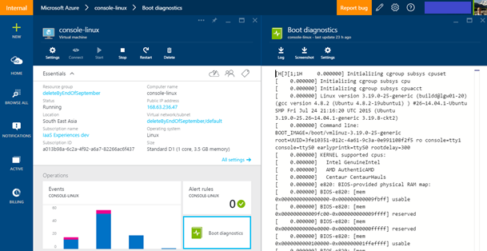
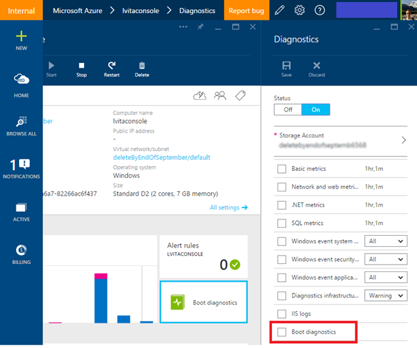

Support for two debugging features is now available in Azure: Console Output and Screenshot support for Azure Virtual Machines Resource Manager deployment model. 

When bringing your own image to Azure or even booting one of the platform images, there can be many reasons why a Virtual Machine gets into a non-bootable state. These features enable you to easily diagnose and recover your Virtual Machines from boot failures.

For Linux Virtual Machines, you can easily view the output of your console log from the Portal:


 
However, for both Windows and Linux Virtual Machines, Azure also enables you to see a screenshot of the VM from the hypervisor:


Both of these features are supported for Azure Virtual Machines in all regions. Note, screenshots, and output can take up to 10 minutes to appear in your storage account.

## Enable diagnostics on a new virtual machine
1. When creating a new Virtual Machine from the Preview Portal, select the **Azure Resource Manager** from the deployment model dropdown:
 
    

2. Configure the Monitoring option to select the storage account where you would like to place these diagnostic files.
 
    

3. If you are deploying from an Azure Resource Manager template, navigate to your Virtual Machine resource and append the diagnostics profile section. Remember to use the “2015-06-15” API version header.

    ```json
    {
          "apiVersion": "2015-06-15",
          "type": "Microsoft.Compute/virtualMachines",
          … 
    ```

4. The diagnostics profile enables you to select the storage account where you want to put these logs.

    ```json
            "diagnosticsProfile": {
                "bootDiagnostics": {
                "enabled": true,
                "storageUri": "[concat('http://', parameters('newStorageAccountName'), '.blob.core.windows.net')]"
                }
            }
            }
        }
    ```

To deploy a sample Virtual Machine with boot diagnostics enabled, check out our repo here.

## Update an existing virtual machine ##

To enable boot diagnostics through the Portal, you can also update an existing Virtual Machine through the Portal. Select the Boot Diagnostics option and Save. Restart the VM to take effect.



