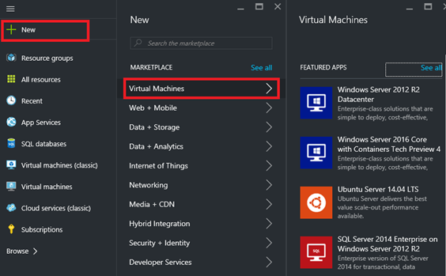
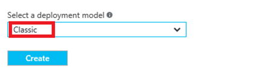
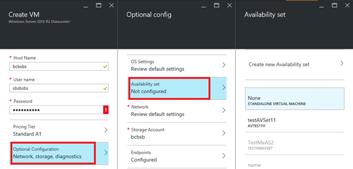
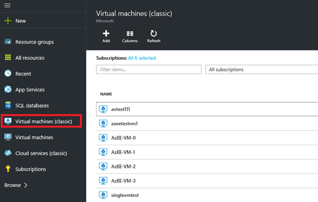
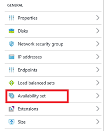
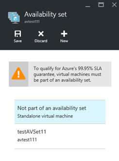

An availability set helps keep your virtual machines available during downtime, such as during maintenance. Placing two or more similarly configured virtual machines in an availability set creates the redundancy needed to maintain availability of the applications or services that your virtual machine runs. For details about how this works, see [Manage the availability of virtual machines] [].

It's a best practice to use both availability sets and load-balancing endpoints to help ensure that your application is always available and running efficiently. For details about load-balanced endpoints, see [Load balancing for Azure infrastructure services] [].

You can add classic virtual machines into an availability set by using one of two options:

- [Option 1: Create a virtual machine and an availability set at the same time] []. Then, add new virtual machines to the set when you create those virtual machines.
- [Option 2: Add an existing virtual machine to an availability set] [].

>[AZURE.NOTE] In the classic model, virtual machines that you want to put in the same availability set must belong to the same cloud service.

## Option 1: Create a virtual machine and an availability set at the same time##

You can use either the Azure portal or Azure PowerShell commands to do this.

To use the Azure portal:

1. If you haven't already done so, sign in to the [Azure portal](https://portal.azure.com).

2. On the hub menu, click **+ New**, and then click **Virtual Machine**.
    
    

3. Select the Marketplace virtual machine image you wish to use. You can choose to create a Linux or Windows virtual machine.

4. For the selected virtual machine, verify that the deployment model is set to **Classic** and then click **Create**
    
    

5. Enter a virtual machine name, user name and password (for Windows machines) or SSH public key (for Linux machines). 

6. Choose the VM size and then click **Select** to continue.

7. Choose **Optional Configuration > Availability set**, and select the availability set you wish to add the virtual machine to.
    
     

8. Review your configuration settings. When you're done, click **Create**.

9. While Azure creates your virtual machine, you can track the progress under **Virtual Machines** in the hub menu.

To use Azure PowerShell commands to create an Azure virtual machine and add it to a new or existing availability set, see [Use Azure PowerShell to create and preconfigure Windows-based virtual machines](../articles/virtual-machines/virtual-machines-windows-classic-create-powershell.md)

## Option 2: Add an existing virtual machine to an availability set##

In the Azure portal, you can add existing classic virtual machines to an existing availability set
 or create a new one for them. (Keep in mind that the virtual machines in the same availability set must belong to the same cloud service.) The steps are almost the same. With Azure PowerShell, you can add the virtual machine to an existing availability set.

1. If you have not already done so, sign in to the [Azure portal](https://portal.azure.com).

2. On the Hub menu, click **Virtual Machines (classic)**.
    
    

3. From the list of virtual machines, select the name of the virtual machine that you want to add to the set.

4. Choose **Availability set** from the virtual machine **Settings**.
    
    

5. Select the availability set you wish to add the virtual machine to. The virtual machine must belong to the same cloud service as the availability set.
    
    

6. Click **Save**.

To use Azure PowerShell commands, open an administrator-level Azure PowerShell session and run the following command. For the placeholders (such as &lt;VmCloudServiceName&gt;), replace everything within the quotes, including the < and > characters, with the correct names.

	Get-AzureVM -ServiceName "<VmCloudServiceName>" -Name "<VmName>" | Set-AzureAvailabilitySet -AvailabilitySetName "<AvSetName>" | Update-AzureVM

>[AZURE.NOTE] The virtual machine might have to be restarted to finish adding it to the availability set.

<!-- LINKS -->
[Option 1: Create a virtual machine and an availability set at the same time]: #createset
[Option 2: Add an existing virtual machine to an availability set]: #addmachine

[Load balancing for Azure infrastructure services]: ../articles/virtual-machines/virtual-machines-linux-load-balance.md
[Manage the availability of virtual machines]: ../articles/virtual-machines/virtual-machines-linux-manage-availability.md

[Create a virtual machine running Windows]: ../articles/virtual-machines/virtual-machines-windows-hero-tutorial.md
[Virtual Network overview]: ../articles/virtual-network/virtual-networks-overview.md

