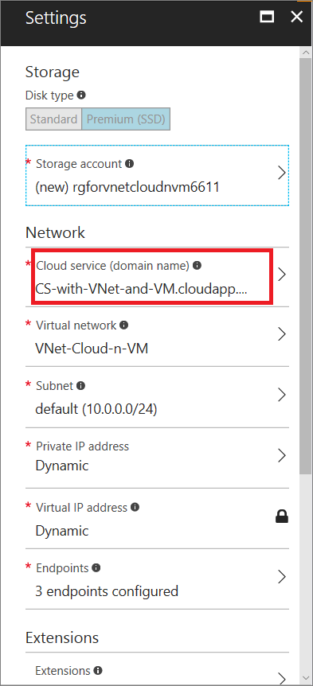
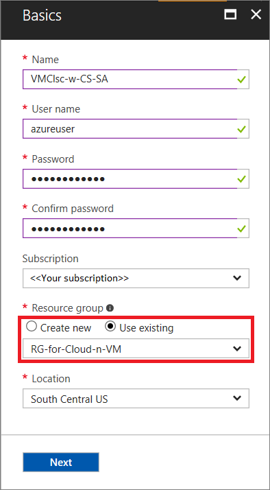
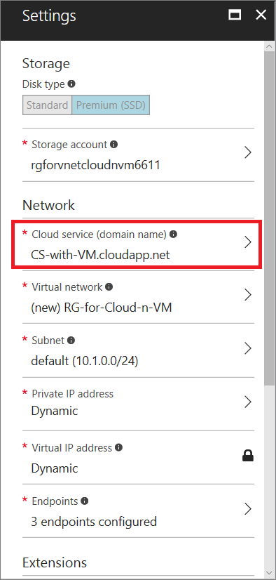

If you place your virtual machines in a virtual network, you can decide how many cloud services you want to use for load balancing and availability sets. Additionally, you can organize the virtual machines on subnets in the same way as your on-premises network and connect the virtual network to your on-premises network. Here's an example:

Virtual networks are the recommended way to connect virtual machines in Azure. The best practice is to configure each tier of your application in a separate cloud service. However, you may need to combine some virtual machines from different application tiers into the same cloud service to remain within the maximum of 200 cloud services per subscription. To review this and other limits, see [Azure Subscription and Service Limits, Quotas, and Constraints](../articles/azure-subscription-service-limits.md).

## Connect VMs in a virtual network
To connect virtual machines in a virtual network:

1. Create the virtual network in the [Azure portal](../articles/virtual-network/virtual-networks-create-vnet-classic-pportal.md) and specify 'classic deployment'.
2. Create the set of cloud services for your deployment to reflect your design for availability sets and load balancing. In the Azure portal, click **New > Compute > Cloud service** for each cloud service.

  As you fill out the cloud service details, choose the same _resource group_ used with the virtual network.

3. To create each new virtual machine, click **New > Compute**, then select the appropriate VM image from the **Featured apps**.

  In the VM **Basics** blade, choose the same _resource group_ used with the virtual network.

  

4. As you fill out the VM **Settings**, choose the correct _Cloud service_ or _virtual network_ for the VM.

  Azure will select the other item based on your selection.

  

## Connect VMs in a standalone cloud service
To connect virtual machines in a standalone cloud service:

1. Create the cloud service in the [Azure portal](http://portal.azure.com). Click **New > Compute > Cloud service**. Or, you can create the cloud service for your deployment when you create your first virtual machine.
2. When you create the virtual machines, choose the same resource group used with the cloud service.

  

3.  As you fill out the VM details, choose the name of cloud service created in the first step.

  
