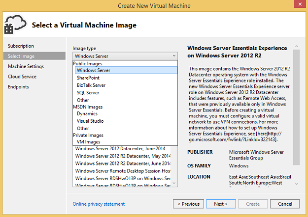
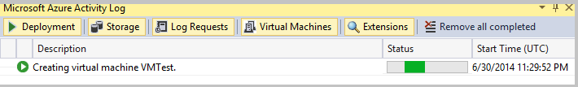
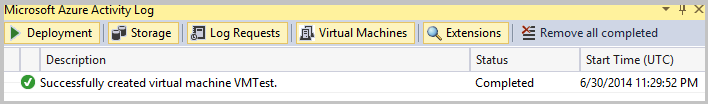
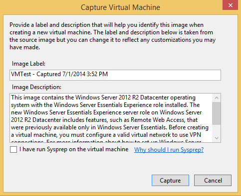
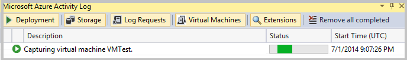

You can create virtual machines in Azure by using Server Explorer in Visual Studio.

## Create an Azure virtual machine in Server Explorer

While you can create a virtual machine in the [Azure Management Portal](http://go.microsoft.com/fwlink/?LinkID=253103), you can also create a virtual machine in Azure by using commands in Server Explorer. Virtual machines can be used, for example, to provide a front end behind a common load-balanced public endpoint.

### To create a new virtual machine

1. In Server Explorer, open the **Azure** node and click **Virtual Machines**.

1. On the context menu, click **Create Virtual Machine**.

    The **Create a New Virtual Machine** wizard appears.

    

1. On the **Choose a Subscription** page, select a subscription to use when creating the virtual machine and then click **Next**.

    If you aren’t signed in to Azure, click **Sign In** to sign in. Then, select your Azure subscription in the dropdown list box if it’s not already selected.

1. On the **Select a Virtual Machine Image** page, select an image type in the **Image type** dropdown list box, and then select a virtual machine images in the **Image name** list box. When you're done, click **Next**.

    

    You can choose the following image types.

    - **Public Images** lists virtual machine images of operating systems and server software such as Windows Server and SQL Server.

    - **MSDN Images** lists virtual machine images of software available to MSDN subscribers, such as Visual Studio and Microsoft Dynamics.

    - **Private Images** lists specialized and generalized virtual machine images that you've created.

    To learn about specialized and generalized virtual machines, see [VM Image](https://azure.microsoft.com/blog/2014/04/14/vm-image-blog-post/). See [How to Capture a Windows Virtual Machine to Use as a Template](https://azure.microsoft.com/documentation/articles/virtual-machines-capture-image-windows-server/) for information about how to turn a virtual machine into a template that you can use to quickly create new pre-configured virtual machines.

    You can click a virtual machine image name to see information about the image on the right side of the page.

    >[AZURE.NOTE] You can't add virtual machine images to the **Public Images** or **MSDN Images** lists because they are read-only. All virtual machines that you create are added to the **Private Images** list.

    If you're an MSDN subscriber with a Visual Studio-level subscription, you can create a pre-built Azure virtual machine that contains Visual Studio, as well as several other images. For more information, see [Create a Virtual Machine in Visual Studio by Using Images Visual Studio 2013 Gallery image for MSDN subscribers](http://visualstudio2013msdngalleryimage.azurewebsites.net) and [MSDN subscriptions](https://www.visualstudio.com/products/msdn-subscriptions-vs).|

1. On the **Virtual Machine Basic Settings** page, enter a machine name and then add the specifications for the virtual machine, including the size, and a user name and password. When you're done, click **Next**.

    You’ll use the new name and password to log into the machine using remote desktop, so it’s a good idea to write them down in case you forget. After you create an Azure virtual machine in Visual Studio, you can change its size and other settings in the [Azure Management Portal](http://go.microsoft.com/fwlink/?LinkID=253103).

    >[AZURE.NOTE] If you choose larger sizes for the virtual machine, extra charges may apply. See [Virtual Machines Pricing Details](https://azure.microsoft.com/pricing/details/virtual-machines/) for more information.

1. Virtual machines created in Visual Studio require a cloud service. On the **Cloud Service Settings** page, select a cloud service for the virtual machine, or click **<Create New…>** in the dropdown list if you don’t already have a cloud service or want to use a new one. A storage account is also required, so choose a storage account (or create a new storage account) in the **Storage account** dropdown list box. See [Introduction to Microsoft Azure Storage](../articles/storage/storage-introduction/) for more information.

1. If you want to specify a virtual network (which is optional), select it in the Virtual Network and Subnet dropdown list boxes.

    Virtual machines that are members of an availability set are deployed to different fault domains. See [Azure Virtual Network](https://azure.microsoft.com/services/virtual-network/) for more information.

1. If you want your virtual machine to belong to an availability set (also optional), select the **Specify an availability set** check box and then choose an availability set in the dropdown list box. When you're done, choose the **Next** button.

    Adding your virtual machine to an availability set helps your application stay available during network failures, local disk hardware failures, and any planned downtime. You need to use the [Azure Management Portal](http://go.microsoft.com/fwlink/?LinkID=253103) to create virtual networks, subnets, and availability sets. See [Manage the Availability of Virtual Machines](https://azure.microsoft.com/documentation/articles/manage-availability-virtual-machines/) for more information.

1. On the **Endpoints** page, specify the public endpoints that you want available to users of your virtual machine. For example, you might choose to enable HTTP (Port 80) in addition to the Remote Desktop and PowerShell endpoints, which are enabled by default. To add an endpoint, choose one in the **Port Name** dropdown list box and then choose the **Add** button. To remove an endpoint, choose the red **X** next to the name in the endpoints list.

    

    The endpoints that are available depend on the cloud service you selected for your virtual machine. See [Azure Service Endpoints](https://azure.microsoft.com/documentation/articles/virtual-machines-set-up-endpoints/) for more information.

    >[AZURE.NOTE] Enabling public endpoints makes services on your virtual machine available to the internet. Be sure to install and properly configure the endpoints and services on your virtual machine, such as setting access control lists (ACLs) for the endpoints. See [How to Set Up Endpoints to a Virtual Machine](https://azure.microsoft.com/documentation/articles/virtual-machines-set-up-endpoints/) for more information.

1. After you’re done configuring the virtual machine settings, choose the **Create** button to create the virtual machine.

    As Azure creates the virtual machine, the **Azure Activity Log** shows the progress of the virtual machine creation operation.

    

    To view only virtual machine information, choose the **Virtual Machines** tab in the **Azure Activity Log**.

    

    If the operation completes successfully, the new virtual machine appears under the **Virtual Machines** node in Server Explorer. You can log into it by clicking the **Connect using Remote Desktop** shortcut.

    

## Manage your virtual machines

On the virtual machine configuration page, in addition to shutting down, connecting, refreshing, and adding checkpoints to the selected virtual machine, you can also view or change settings for the virtual machine. You can:

- Change the virtual machine size.

- Select the availability set to use with the virtual machine.

- Add, remove, or change settings for public endpoints.

- Add, remove, or configure virtual machine extensions.

- View information about the disks associated with the virtual machine.

### View or change virtual machine settings

1. In Server Explorer, choose your virtual machine in the **Azure Virtual Machines** node.

1. On the shortcut menu, choose **Configure** to view the virtual machine configuration page.

    

1. View the virtual machine information or change it.

### Save or restore the status of your virtual machine

As you configure your virtual machine and install software on it, it's a good idea to regularly save your progress by creating virtual machine checkpoints. A checkpoint is a snapshot, or image, of the current state of your virtual machine. If something goes wrong with the virtual machine, or you want to reconfigure the virtual machine, you can save time by restoring it to a previous checkpoint state rather than starting over from scratch.

### To create a virtual machine checkpoint

1. In Server Explorer, choose your virtual machine in the **Azure Virtual Machines** node.

1. On the shortcut menu, choose **Configure** to view the virtual machine configuration page.

1. On the configuration page, choose the **Capture Image** button.

    

    The **Capture Virtual Machine** dialog appears.

    

1. Provide an image label and description. A default label and description are provided, but you can overwrite them with your own if you like.

1. If you have already run Sysprep on this virtual machine, select the **I have run Sysprep on the virtual machine** box.

    Sysprep is a tool that, among other things, removes systems-specific data from the virtual machine’s version of Windows, making it template that others can use. See [How to Capture a Windows Virtual Machine to Use as a Template](https://azure.microsoft.com/documentation/articles/virtual-machines-capture-image-windows-server/) for more information.

1. After you’re done configuring the capture settings, choose the **Capture** button to create the checkpoint.

    As Azure creates the checkpoint, the **Azure Activity Log** shows the progress of the operation.

    

    When the checkpoint operation completes, you’ll see it in the **Azure Activity Log**.

    

## To manage virtual machine checkpoints

### To restore a virtual machine to a previously saved state

- Follow the steps outlined in [Step-by-Step: Perform Cloud Restores of Microsoft Azure Virtual Machines using PowerShell - Part 2](http://blogs.technet.com/b/keithmayer/archive/2014/02/04/step-by-step-perform-cloud-restores-of-windows-azure-virtual-machines-using-powershell-part-2.aspx).

### To delete a checkpoint

1. Go to the [Azure Management Portal](http://go.microsoft.com/fwlink/?LinkID=253103).

1. On the virtual machine configuration page, choose the **Images** tab at the top of the page.

1. Choose the checkpoint you want to delete, and then choose the **Delete**  button at the bottom of the page.

## Shut down your virtual machine

1. In Server Explorer, choose the virtual machine you want to shut down in the **Azure Virtual Machines** node.

1. On the shortcut menu, either choose the **Shutdown** command, or choose **Configure** to view the virtual machine configuration page, and then choose the **Shutdown** button.

## Next steps

To learn more about creating virtual machines, see [Create a Virtual Machine Running Linux](../articles/virtual-machines/virtual-machines-linux-quick-create-cli.md) and [Create a virtual machine running Windows in the Azure preview portal](../articles/virtual-machines/virtual-machines-windows-hero-tutorial.md).
