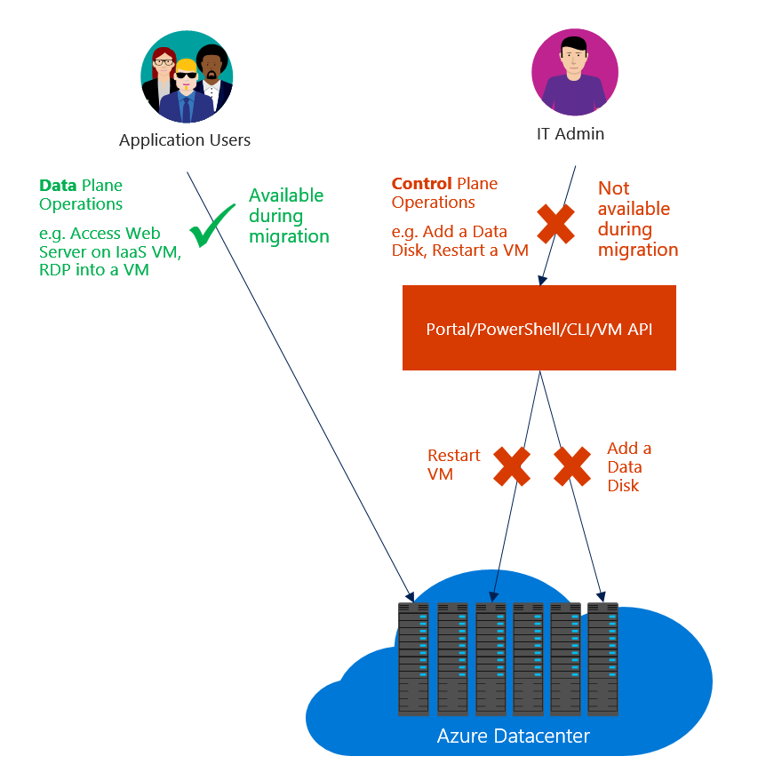
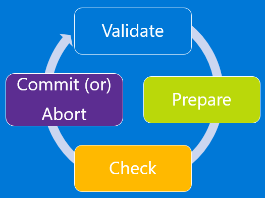
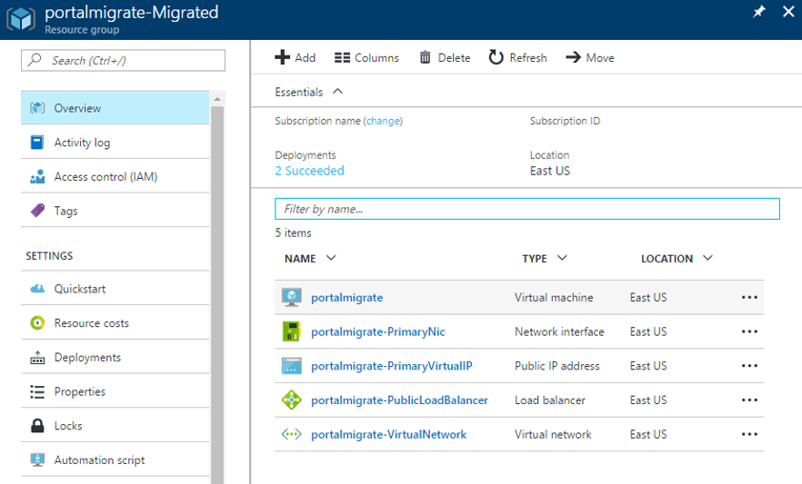

## Meaning of migration of IaaS resources from classic to Resource Manager
Before we drill down into the details, let's look at the difference between data-plane and management-plane operations on the IaaS resources.

* *Management/Control plane* describes the calls that come into the management/control plane or the API for modifying resources. For example, operations like creating a VM, restarting a VM, and updating a virtual network with a new subnet manage the running resources. They don't directly affect connecting to the instances.
* *Data plane* (application) describes the runtime of the application itself and involves interaction with instances that don’t go through the Azure API. Accessing your website or pulling data from a running SQL Server instance or a MongoDB server would be considered data plane or application interaction. Copying a blob from a storage account and accessing a public IP address to RDP or SSH into the virtual machine also are data plane. These operations keep the application running across compute, networking, and storage.

> [!NOTE]
> In some migration scenarios, the Azure platform stops, deallocates, and restarts your virtual machines. This incurs a short data-plane downtime.
>
>

## The migration experience
Before you start the migration experience, the following is recommended:

* Ensure that the resources that you want to migrate don't use any unsupported features or configurations. Usually the platform detects these issues and generates an error.
* If you have VMs that are not in a virtual network, they will be stopped and deallocated as part of the prepare operation. If you don't want to lose the public IP address, look into reserving the IP address before triggering the prepare operation. However, if the VMs are in a virtual network, they are not stopped and deallocated.
* Plan your migration during non-business hours to accommodate for any unexpected failures that might happen during migration.
* Download the current configuration of your VMs by using PowerShell, command-line interface (CLI) commands, or REST APIs to make it easier for validation after the prepare step is complete.
* Update your automation/operationalization scripts to handle the Resource Manager deployment model before you start the migration. You can optionally do GET operations when the resources are in the prepared state.
* Evaluate the RBAC policies that are configured on the classic IaaS resources, and plan for after the migration is complete.

The migration workflow is as follows

> [!NOTE]
> All the operations described in the following sections are idempotent. If you have a problem other than an unsupported feature or a configuration error, it is recommended that you retry the prepare, abort, or commit operation. The Azure platform tries the action again.
>
>

### Validate
The validate operation is the first step in the migration process. The goal of this step is to analyze data in the background for the resources under migration and return success/failure if the resources are capable of migration.

You select the virtual network or the hosted service (if it’s not a virtual network) that you want to validate for migration.

* If the resource is not capable of migration, the Azure platform lists all the reasons for why it’s not supported for migration.

When validating storage services you will find the migrated account in a resource group named the same as your storage account with "-Migrated" appended.  For example if your storage account is named "mystorage" you will find the Azure Resource Manager enabled resource in a resource group named "mystorage-Migrated" and it will contain a storage account named "mystorage".

### Prepare
The prepare operation is the second step in the migration process. The goal of this step is to simulate the transformation of the IaaS resources from classic to Resource Manager resources and present this side by side for you to visualize.

You select the virtual network or the hosted service (if it’s not a virtual network) that you want to prepare for migration.

* If the resource is not capable of migration, the Azure platform stops the migration process and lists the reason why the prepare operation failed.
* If the resource is capable of migration, the Azure platform first locks down the management-plane operations for the resources under migration. For example, you are not able to add a data disk to a VM under migration.

The Azure platform then starts the migration of metadata from classic to Resource Manager for the migrating resources.

After the prepare operation is complete, you have the option of visualizing the resources in both classic and Resource Manager. For every cloud service in the classic deployment model, the Azure platform creates a resource group name that has the pattern `cloud-service-name>-Migrated`.

> [!NOTE]
> It is not possible to select the name of Resource Group created for migrated resources (i.e. "-Migrated") but after migration is complete, you can use Azure Resource Manager move feature to move resources to any Resource Group you want. To read more about this see [Move resources to new resource group or subscription](../articles/resource-group-move-resources.md)

Here are two screens that show the result after a succesful Prepare operation. First screen shows a Resource Group that contains the original cloud service. Second screen shows the new "-Migrated" resource group that contains the equivalent Azure Resource Manager resources.

> [!NOTE]
> Virtual Machines that are not in a classic Virtual Network are stopped deallocated in this phase of migration.
>
>

### Check (manual or scripted)
In the check step, you can optionally use the configuration that you downloaded earlier to validate that the migration looks correct. Alternatively, you can sign in to the portal and spot check the properties and resources to validate that metadata migration looks good.

If you are migrating a virtual network, most configuration of virtual machines is not restarted. For applications on those VMs, you can validate that the application is still up and running.

You can test your monitoring/automation and operational scripts to see if the VMs are working as expected and if your updated scripts work correctly. Only GET operations are supported when the resources are in the prepared state.

There is no set time window before which you need to commit the migration. You can take as much time as you want in this state. However, the management plane is locked for these resources until you either abort or commit.

If you see any issues, you can always abort the migration and go back to the classic deployment model. After you go back, the Azure platform will open the management-plane operations on the resources so that you can resume normal operations on those VMs in the classic deployment model.

### Abort
Abort is an optional step that you can use to revert your changes to the classic deployment model and stop the migration.

> [!NOTE]
> This operation cannot be executed after you have triggered the commit operation.     
>
>

### Commit
After you finish the validation, you can commit the migration. Resources do not appear anymore in classic and are available only in the Resource Manager deployment model. The migrated resources can be managed only in the new portal.

> [!NOTE]
> This is an idempotent operation. If it fails, it is recommended that you retry the operation. If it continues to fail, create a support ticket or create a forum post with a ClassicIaaSMigration tag on our [VM forum](https://social.msdn.microsoft.com/Forums/azure/home?forum=WAVirtualMachinesforWindows).
>
>
 
Here is a flowchart of the steps during a migration process

## Translation of classic to Azure Resource Manager resources
You can find the classic and Resource Manager representations of the resources in the following table. Other features and resources are not currently supported.

| Classic representation | Resource Manager representation | Detailed notes |
| --- | --- | --- |
| Cloud service name |DNS name |During migration, a new resource group is created for every cloud service with the naming pattern `<cloudservicename>-migrated`. This resource group contains all your resources. The cloud service name becomes a DNS name that is associated with the public IP address. |
| Virtual machine |Virtual machine |VM-specific properties are migrated unchanged. Certain osProfile information, like computer name, is not stored in the classic deployment model and remains empty after migration. |
| Disk resources attached to VM |Implicit disks attached to VM |Disks are not modeled as top-level resources in the Resource Manager deployment model. They are migrated as implicit disks under the VM. Only disks that are attached to a VM are currently supported. Resource Manager VMs can now use classic storage accounts, which allows the disks to be easily migrated without any updates. |
| VM extensions |VM extensions |All the resource extensions, except XML extensions, are migrated from the classic deployment model. |
| Virtual machine certificates |Certificates in Azure Key Vault |If a cloud service contains service certificates, a new Azure key vault per cloud service and moves the certificates into the key vault. The VMs are updated to reference the certificates from the key vault.    **NOTE:** Please do not delete the keyvault as it can cause the VM to go into a failed state. We're working on improving things in the backend so that Key Vaults can be deleted safely or moved along with the VM to a new subscription. |
| WinRM configuration |WinRM configuration under osProfile |Windows Remote Management configuration is moved unchanged, as part of the migration. |
| Availability-set property |Availability-set resource | Availability-set specification was a property on the VM in the classic deployment model. Availability sets become a top-level resource as part of the migration. The following configurations are not supported: multiple availability sets per cloud service, or one or more availability sets along with VMs that are not in any availability set in a cloud service. |
| Network configuration on a VM |Primary network interface |Network configuration on a VM is represented as the primary network interface resource after migration. For VMs that are not in a virtual network, the internal IP address changes during migration. |
| Multiple network interfaces on a VM |Network interfaces |If a VM has multiple network interfaces associated with it, each network interface becomes a top-level resource as part of the migration in the Resource Manager deployment model, along with all the properties. |
| Load-balanced endpoint set |Load balancer |In the classic deployment model, the platform assigned an implicit load balancer for every cloud service. During migration, a new load-balancer resource is created, and the load-balancing endpoint set becomes load-balancer rules. |
| Inbound NAT rules |Inbound NAT rules |Input endpoints defined on the VM are converted to inbound network address translation rules under the load balancer during the migration. |
| VIP address |Public IP address with DNS name |The virtual IP address becomes a public IP address and is associated with the load balancer. |
| Virtual network |Virtual network |The virtual network is migrated, with all its properties, to the Resource Manager deployment model. A new resource group is created with the name `-migrated`. |
| Reserved IPs |Public IP address with static allocation method |Reserved IPs associated with the load balancer are migrated, along with the migration of the cloud service or the virtual machine. Unassociated reserved IP migration is not currently supported. |
| Public IP address per VM |Public IP address with dynamic allocation method |The public IP address associated with the VM is converted as a public IP address resource, with the allocation method set to static. |
| NSGs |NSGs |Network security groups associated with a subnet are cloned as part of the migration to the Resource Manager deployment model. The NSG in the classic deployment model is not removed during the migration. However, the management-plane operations for the NSG are blocked when the migration is in progress. |
| DNS servers |DNS servers |DNS servers associated with a virtual network or the VM are migrated as part of the corresponding resource migration, along with all the properties. |
| UDRs |UDRs |User-defined routes associated with a subnet are cloned as part of the migration to the Resource Manager deployment model. The UDR in the classic deployment model is not removed during the migration. The management-plane operations for the UDR are blocked when the migration is in progress. |
| IP forwarding property on a VM's network configuration |IP forwarding property on the NIC |The IP forwarding property on a VM is converted to a property on the network interface during the migration. |
| Load balancer with multiple IPs |Load balancer with multiple public IP resources |Every public IP associated with the load balancer is converted to a public IP resource and associated with the load balancer after migration. |
| Internal DNS names on the VM |Internal DNS names on the NIC |During migration, the internal DNS suffixes for the VMs are migrated to a read-only property named “InternalDomainNameSuffix” on the NIC. The suffix remains unchanged after migration and VM resolution should continue to work as previously. |
| Virtual Network Gateway |Virtual Network Gateway |Virtual Network Gateway properties are migrated unchanged. The VIP associated with the gateway does not change either. |
| Local network site |Local Network Gateway |Local network site properties are migrated unchanged to a new resource called Local Network Gateway. This represent on premises address prefixes and remote gateway IP. |
| Connections references |Connection |Connectivity references between gateway and local network site in network configuration is represented by a newly created resource called Connection in resource manager after migration. All properties of connectivity reference in network configuration files are copied unchanged to the newly created Connection resource. VNet to VNet connectivity in classic is achieved by creating two IPsec tunnels to local network sites representing the VNets. This is transformed to Vnet2Vnet connection type in resource manager model without requiring local network gateways. |

## Changes to your automation and tooling after migration
As part of migrating your resources from the Classic deployment model to the Resource Manager deployment model, you have to update your existing automation or tooling to ensure that it continues to work after the migration.
