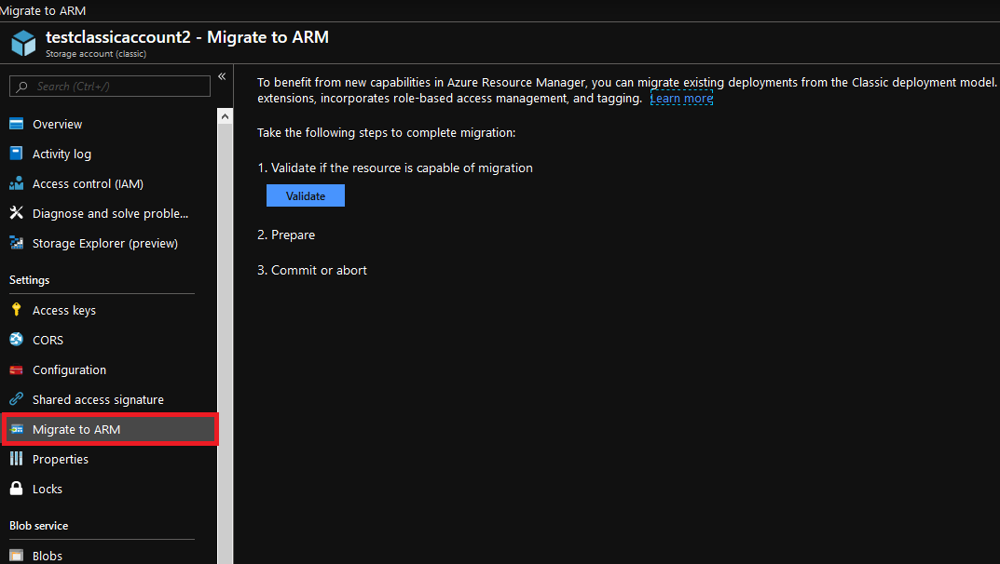
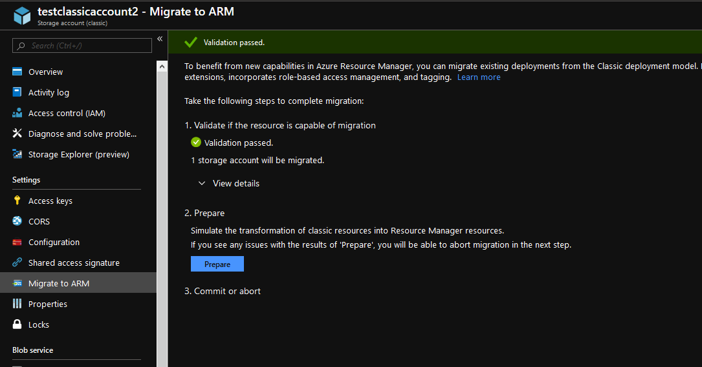
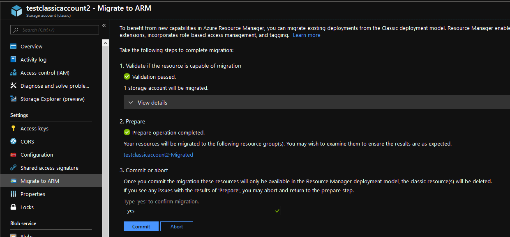

This article describes how to migrate infrastructure as a service (IaaS) resources from the Classic to Resource Manager deployment models and details how to connect resources from the two deployment models that coexist in your subscription by using virtual network site-to-site gateways. You can read more about [Azure Resource Manager features and benefits](../articles/azure-resource-manager/management/overview.md). 

## Goal for migration
Resource Manager enables deploying complex applications through templates, configures virtual machines by using VM extensions, and incorporates access management and tagging. Azure Resource Manager includes scalable, parallel deployment for virtual machines into availability sets. The new deployment model also provides lifecycle management of compute, network, and storage independently. Finally, there’s a focus on enabling security by default with the enforcement of virtual machines in a virtual network.

Almost all the features from the classic deployment model are supported for compute, network, and storage under Azure Resource Manager. To benefit from the new capabilities in Azure Resource Manager, you can migrate existing deployments from the Classic deployment model.

## Supported resources for migration
These classic IaaS resources are supported during migration

* Virtual Machines
* Availability Sets
* Storage Accounts
* Virtual Networks
* VPN Gateways
* Express Route Gateways _(in the same subscription as Virtual Network only)_
* Network Security Groups
* Route Tables
* Reserved IPs

## Supported scopes of migration
There are four different ways to complete migration of compute, network, and storage resources:

* [Migration of virtual machines (NOT in a virtual network)](#migration-of-virtual-machines-not-in-a-virtual-network)
* [Migration of virtual machines (in a virtual network)](#migration-of-virtual-machines-in-a-virtual-network)
* [Migration of storage accounts](#migration-of-storage-accounts)
* [Migration of unattached resources](#migration-of-unattached-resources)

### Migration of virtual machines (NOT in a virtual network)
In the Resource Manager deployment model, security is enforced for your applications by default. All VMs need to be in a virtual network in the Resource Manager model. The Azure platform restarts (`Stop`, `Deallocate`, and `Start`) the VMs as part of the migration. You have two options for the virtual networks that the Virtual Machines will be migrated to:

* You can request the platform to create a new virtual network and migrate the virtual machine into the new virtual network.
* You can migrate the virtual machine into an existing virtual network in Resource Manager.

> [!NOTE]
> In this migration scope, both the management-plane operations and the data-plane operations may not be allowed for a period of time during the migration.
>

### Migration of virtual machines (in a virtual network)
For most VM configurations, only the metadata is migrating between the Classic and Resource Manager deployment models. The underlying VMs are running on the same hardware, in the same network, and with the same storage. The management-plane operations may not be allowed for a certain period of time during the migration. However, the data plane continues to work. That is, your applications running on top of VMs (classic) do not incur downtime during the migration.

The following configurations are not currently supported. If support is added in the future, some VMs in this configuration might incur downtime (go through stop, deallocate, and restart VM operations).

* You have more than one availability set in a single cloud service.
* You have one or more availability sets and VMs that are not in an availability set in a single cloud service.

> [!NOTE]
> In this migration scope, the management plane may not be allowed for a period of time during the migration. For certain configurations as described earlier, data-plane downtime occurs.
>

### Migration of storage accounts
To allow seamless migration, you can deploy Resource Manager VMs in a classic storage account. With this capability, compute and network resources can and should be migrated independently of storage accounts. Once you migrate over your Virtual Machines and Virtual Network, you need to migrate over your storage accounts to complete the migration process.

If your storage account does not have any associated disks or Virtual Machines data and only has blobs, files, tables, and queues then the migration to Azure Resource Manager can be done as a standalone migration without dependencies.

> [!NOTE]
> The Resource Manager deployment model doesn't have the concept of Classic images and disks. When the storage account is migrated, Classic images and disks are not visible in the Resource Manager stack but the backing VHDs remain in the storage account.

The following screenshots show how to upgrade a Classic storage account to an Azure Resource Manager storage account using Azure portal:
1. Sign in to the [Azure portal](https://portal.azure.com).
2. Navigate to your storage account.
3. In the **Settings** section, click **Migrate to ARM**.
4. Click on **Validate** to determine migration feasibility.
5. If validation passes, click on **Prepare** to create a migrated storage account.
6. Type **yes** to confirm migration and click **Commit** to finish the migration.

    
    
    
    
    

### Migration of unattached resources
Storage Accounts with no associated disks or Virtual Machines data may be migrated independently.

Network Security Groups, Route Tables & Reserved IPs that are not attached to any Virtual Machines and Virtual Networks can also be migrated independently.

 

## Unsupported features and configurations
Some features and configurations are not currently supported; the following sections describe our recommendations around them.

### Unsupported features
The following features are not currently supported. You can optionally remove these settings, migrate the VMs, and then re-enable the settings in the Resource Manager deployment model.

| Resource provider | Feature | Recommendation |
| --- | --- | --- |
| Compute | Unassociated virtual machine disks. | The VHD blobs behind these disks will get migrated when the Storage Account is migrated |
| Compute | Virtual machine images. | The VHD blobs behind these disks will get migrated when the Storage Account is migrated |
| Network | Endpoint ACLs. | Remove Endpoint ACLs and retry migration. |
| Network | Application Gateway | Remove the Application Gateway before beginning migration and then recreate the Application Gateway once migration is complete. |
| Network | Virtual networks using VNet Peering. | Migrate Virtual Network to Resource Manager, then peer. Learn more about [VNet Peering](../articles/virtual-network/virtual-network-peering-overview.md). |

### Unsupported configurations
The following configurations are not currently supported.

| Service | Configuration | Recommendation |
| --- | --- | --- |
| Resource Manager |Role-Based Access Control (RBAC) for classic resources |Because the URI of the resources is modified after migration, it is recommended that you plan the RBAC policy updates that need to happen after migration. |
| Compute |Multiple subnets associated with a VM |Update the subnet configuration to reference only one subnet. This may require you to remove a secondary NIC (that is referring to another subnet) from the VM and reattach it after migration has completed. |
| Compute |Virtual machines that belong to a virtual network but don't have an explicit subnet assigned |You can optionally delete the VM. |
| Compute |Virtual machines that have alerts, Autoscale policies |The migration goes through and these settings are dropped. It is highly recommended that you evaluate your environment before you do the migration. Alternatively, you can reconfigure the alert settings after migration is complete. |
| Compute |XML VM extensions (BGInfo 1.*, Visual Studio Debugger, Web Deploy, and Remote Debugging) |This is not supported. It is recommended that you remove these extensions from the virtual machine to continue migration or they will be dropped automatically during the migration process. |
| Compute |Boot diagnostics with Premium storage |Disable Boot Diagnostics feature for the VMs before continuing with migration. You can re-enable boot diagnostics in the Resource Manager stack after the migration is complete. Additionally, blobs that are being used for screenshot and serial logs should be deleted so you are no longer charged for those blobs. |
| Compute | Cloud services that contain web/worker roles | This is currently not supported. |
| Compute | Cloud services that contain more than one availability set or multiple availability sets. |This is currently not supported. Please move the Virtual Machines to the same availability set before migrating. |
| Compute | VM with Azure Security Center extension | Azure Security Center automatically installs extensions on your Virtual Machines to monitor their security and raise alerts. These extensions usually get installed automatically if the Azure Security Center policy is enabled on the subscription. To migrate the Virtual Machines, disable the security center policy on the subscription, which will remove the Security Center monitoring extension from the Virtual Machines. |
| Compute | VM with backup or snapshot extension | These extensions are installed on a Virtual Machine configured with the Azure Backup service. While the migration of these VMs is not supported, follow the guidance [here](/azure/virtual-machines/windows/migration-classic-resource-manager-faq#i-backed-up-my-classic-vms-in-a-vault-can-i-migrate-my-vms-from-classic-mode-to-resource-manager-mode-and-protect-them-in-a-recovery-services-vault) to keep backups that were taken prior to migration.  |
| Compute | VM with Azure Site Recovery extension | These extensions are installed on a Virtual Machine configured with the Azure Site Recovery service. While the migration of storage used with Site Recovery will work, current replication will be impacted. You need to disable and enable VM replication after storage migration. |
| Network |Virtual networks that contain virtual machines and web/worker roles |This is currently not supported. Please move the Web/Worker roles to their own Virtual Network before migrating. Once the classic Virtual Network is migrated, the migrated Azure Resource Manager Virtual Network can be peered with the classic Virtual Network to achieve similar configuration as before.|
| Network | Classic Express Route circuits |This is currently not supported. These circuits need to be migrated to Azure Resource Manager before beginning IaaS migration. To learn more, see [Moving ExpressRoute circuits from the classic to the Resource Manager deployment model](../articles/expressroute/expressroute-move.md).|
| Azure App Service |Virtual networks that contain App Service environments |This is currently not supported. |
| Azure HDInsight |Virtual networks that contain HDInsight services |This is currently not supported. |
| Microsoft Dynamics Lifecycle Services |Virtual networks that contain virtual machines that are managed by Dynamics Lifecycle Services |This is currently not supported. |
| Azure AD Domain Services |Virtual networks that contain Azure AD Domain services |This is currently not supported. |
| Azure API Management |Virtual networks that contain Azure API Management deployments |This is currently not supported. To migrate the IaaS VNET, change the VNET of the API Management deployment, which is a no downtime operation. |
