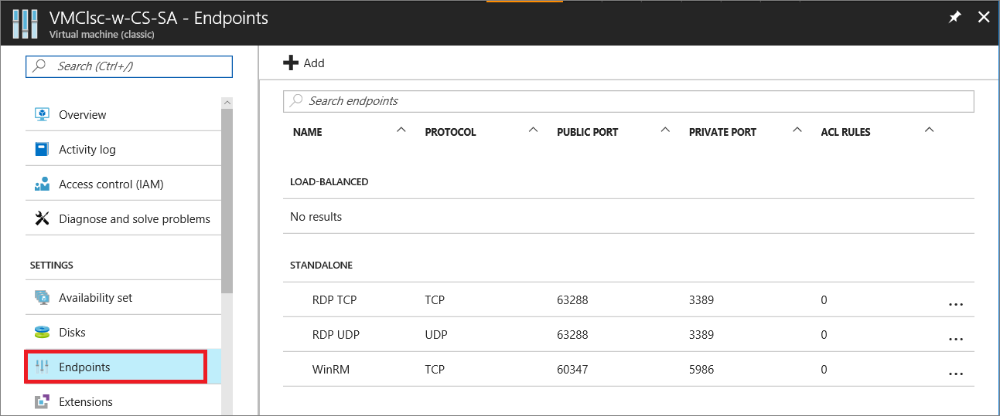
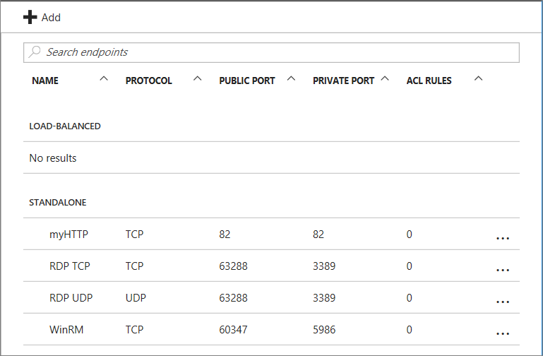
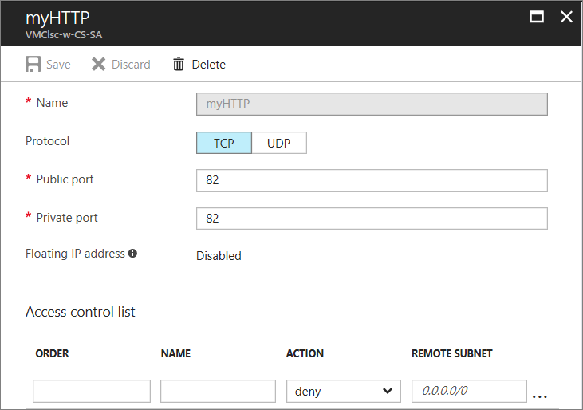
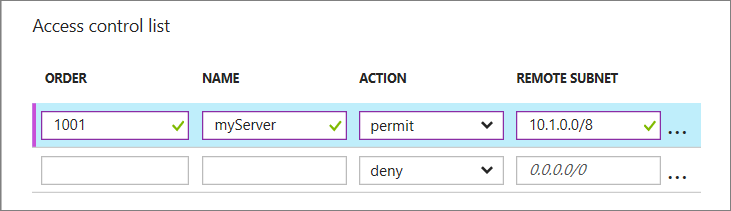

Each endpoint has a *public port* and a *private port*:

* The public port is used by the Azure load balancer to listen for incoming traffic to the virtual machine from the internet.
* The private port is used by the virtual machine to listen for incoming traffic, typically destined to an application or service running on the virtual machine.

Default values for the IP protocol and TCP or UDP ports for well-known network protocols are provided when you create endpoints with the Azure portal. For custom endpoints, specify the correct IP protocol (TCP or UDP) and the public and private ports. To distribute incoming traffic randomly across multiple virtual machines, create a load-balanced set consisting of multiple endpoints.

After you create an endpoint, you can use an access control list (ACL) to define rules that permit or deny the incoming traffic to the public port of the endpoint based on its source IP address. However, if the virtual machine is in an Azure virtual network, use network security groups instead. For more information, see [About network security groups](../articles/virtual-network/security-overview.md).

> [!NOTE]
> Firewall configuration for Azure virtual machines is done automatically for ports associated with remote connectivity endpoints that Azure sets up automatically. For ports specified for all other endpoints, no configuration is done automatically to the firewall of the virtual machine. When you create an endpoint for the virtual machine, ensure that the firewall of the virtual machine also allows the traffic for the protocol and private port corresponding to the endpoint configuration. To configure the firewall, see the documentation or on-line help for the operating system running on the virtual machine.
>
>

## Create an endpoint
1. Sign in to the [Azure portal](https://portal.azure.com).

2. Select **Virtual machines**, and then select the virtual machine that you want to configure.

3. Select **Endpoints** in the **Settings** group. The **Endpoints** page appears, which lists all the current endpoints for the virtual machine. (This example is for a Windows VM. A Linux VM will by default show an endpoint for SSH.)

   <!--  -->
   

4. In the command bar above the endpoint entries, select **Add**. The **Add endpoint** page appears.

5. For **Name**, enter a name for the endpoint.

6. For **Protocol**, choose either **TCP** or **UDP**.

7. For **Public port**, enter the port number for the incoming traffic from the internet. 

8. For **Private port**, enter the port number on which the virtual machine is listening. The public and private port numbers can be different. Ensure that the firewall on the virtual machine has been configured to allow the traffic corresponding to the protocol and private port.

9. Select **OK**.

The new endpoint is listed on the **Endpoints** page.

## Manage the ACL on an endpoint
To define the set of computers that can send traffic, the ACL on an endpoint can restrict traffic based upon source IP address. Follow these steps to add, modify, or remove an ACL on an endpoint.

> [!NOTE]
> If the endpoint is part of a load-balanced set, any changes you make to the ACL on an endpoint are applied to all endpoints in the set.
>
>

If the virtual machine is in an Azure virtual network, use network security groups instead of ACLs. For more information, see [About network security groups](../articles/virtual-network/security-overview.md).

1. Sign in to the Azure portal.

2. Select **Virtual machines**, and then select the name of the virtual machine that you want to configure.

3. Select **Endpoints**. From the endpoints list, select the appropriate endpoint. The ACL list is at the bottom of the page.

   

4. Use rows in the list to add, delete, or edit rules for an ACL and change their order. The **REMOTE SUBNET** value is an IP address range for incoming traffic from the internet that the Azure load balancer uses to permit or deny the traffic based on its source IP address. Be sure to specify the IP address range in classless inter-domain routing (CIDR) format, also known as address prefix format. For example, `10.1.0.0/8`.

 

You can use rules to allow only traffic from specific computers corresponding to your computers on the internet or to deny traffic from specific, known address ranges.

The rules are evaluated in order starting with the first rule and ending with the last rule. Therefore, rules should be ordered from least restrictive to most restrictive. For more information, see [What is a Network Access Control List](../articles/virtual-network/virtual-networks-acl.md).
