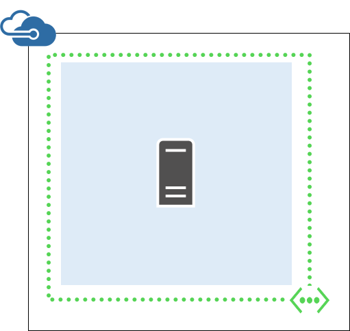

- [Quick-create a virtual machine in Azure](#quick-create-a-vm-in-azure)
- [Deploy a virtual machine in Azure from a template](#deploy-a-vm-in-azure-from-a-template)
- [Create a virtual machine from a custom image](#create-a-custom-vm-image)
- [Deploy a virtual machine that uses a virtual network and a load balancer](#deploy-a-multi-vm-application-that-uses-a-virtual-network-and-an-external-load-balancer)
- [Remove a resource group](#remove-a-resource-group)
- [Show the log for a resource group deployment](#show-the-log-for-a-resource-group-deployment)
- [Display information about a virtual machine](#display-information-about-a-virtual-machine)
- [Connect to a Linux-based virtual machine](#log-on-to-a-linux-based-virtual-machine)
- [Stop a virtual machine](#stop-a-virtual-machine)
- [Start a virtual machine](#start-a-virtual-machine)
- [Attach a data disk](#attach-a-data-disk)

## Getting ready

Before you can use the Azure CLI with Azure resource groups, you need to have the right Azure CLI version and an Azure account. If you don't have the Azure CLI, [install it](../articles/xplat-cli-install.md).

### Update your Azure CLI version to 0.9.0 or later

Type `azure --version` to see whether you have already installed version 0.9.0 or later. 

	azure --version
    0.9.0 (node: 0.10.25)

If your version is not 0.9.0 or later, you need to update it by using one of the native installers or through **npm** by typing `npm update -g azure-cli`.

You can also run Azure CLI as a Docker container by using the following [Docker image](https://registry.hub.docker.com/u/microsoft/azure-cli/). From a Docker host, run the following command:

	docker run -it microsoft/azure-cli

### Set your Azure account and subscription

If you don't already have an Azure subscription but you do have an MSDN subscription, you can activate your [MSDN subscriber benefits](https://azure.microsoft.com/pricing/member-offers/msdn-benefits-details/). Or you can sign up for a [free trial](https://azure.microsoft.com/pricing/free-trial/).

Now [log in to your Azure account interactively](../articles/xplat-cli-connect.md#use-the-log-in-method) by typing `azure login` and following the prompts for an interactive login experience to your Azure account. 

> [AZURE.NOTE] If you have a work or school ID and you know you do not have two-factor authentication enabled, you can **also** use `azure login -u` along with the work or school ID to log in *without* an interactive session. If you don't have a work or school ID, you can [create a work or school id from your personal Microsoft account](../articles/virtual-machines/virtual-machines-windows-create-aad-work-id.md) to log in the same way.

Your account may have more than one subscription. You can list your subscriptions by typing `azure account list`, which might look something like this:

    azure account list
    info:    Executing command account list
    data:    Name                              Id                                    Tenant Id                            Current
    data:    --------------------------------  ------------------------------------  ------------------------------------  -------
    data:    Contoso Admin                     xxxxxxxx-xxxx-xxxx-xxxx-xxxxxxxxxxxx  xxxxxxxx-xxxx-xxxx-xxxx-xxxxxxxxxxxx  true
    data:    Fabrikam dev                      xxxxxxxx-xxxx-xxxx-xxxx-xxxxxxxxxxxx  xxxxxxxx-xxxx-xxxx-xxxx-xxxxxxxxxxxx  false  
    data:    Fabrikam test                     xxxxxxxx-xxxx-xxxx-xxxx-xxxxxxxxxxxx  xxxxxxxx-xxxx-xxxx-xxxx-xxxxxxxxxxxx  false  
    data:    Contoso production                xxxxxxxx-xxxx-xxxx-xxxx-xxxxxxxxxxxx  xxxxxxxx-xxxx-xxxx-xxxx-xxxxxxxxxxxx  false  

You can set the current Azure subscription by typing the following. Use the subscription name or the ID that has the resources you want to manage.

	azure account set <subscription name or ID> true

### Switch to the Azure CLI resource group mode

By default, the Azure CLI starts in the service management mode (**asm** mode). Type the following to switch to resource group mode.

	azure config mode arm

## Understanding Azure resource templates and resource groups

Most applications are built from a combination of different resource types (such as one or more VMs and storage accounts, a SQL database, a virtual network, or a content delivery network). The default Azure service management API and the Azure classic portal represented these items by using a service-by-service approach. This approach requires you to deploy and manage the individual services individually (or find other tools that do so), and not as a single logical unit of deployment.

*Azure Resource Manager templates*, however, make it possible for you to deploy and manage these different resources as one logical deployment unit in a declarative fashion. Instead of imperatively telling Azure what to deploy one command after another, you describe your entire deployment in a JSON file -- all of the resources and associated configuration and deployment parameters -- and tell Azure to deploy those resources as one group.

You can then manage the overall life cycle of the group's resources by using Azure CLI resource management commands to:

- Stop, start, or delete all of the resources within the group at once.
- Apply Role-Based Access Control (RBAC) rules to lock down security permissions on them.
- Audit operations.
- Tag resources with additional metadata for better tracking.

You can learn lots more about Azure resource groups and what they can do for you in the [Azure Resource Manager overview](../articles/resource-group-overview.md). If you're interested in authoring templates, see [Authoring Azure Resource Manager templates](../articles/resource-group-authoring-templates.md).

## Task: Quick-create a VM in Azure

Sometimes you know what image you need, and you need a VM from that image right now and you don't care too much about the infrastructure -- maybe you have to test something on a clean VM. That's when you want to use the `azure vm quick-create` command, and pass the arguments necessary to create a VM and its infrastructure.

First, create your resource group.

    azure group create coreos-quick westus
    info:    Executing command group create
    + Getting resource group coreos-quick
    + Creating resource group coreos-quick
    info:    Created resource group coreos-quick
    data:    Id:                  /subscriptions/xxxxxxxx-xxxx-xxxx-xxxx-xxxxxxxxxxxx/resourceGroups/coreos-quick
    data:    Name:                coreos-quick
    data:    Location:            westus
    data:    Provisioning State:  Succeeded
    data:    Tags:
    data:
    info:    group create command OK

Second, you'll need an image. To find an image with the Azure CLI, see [Navigating and selecting Azure virtual machine images with PowerShell and the Azure CLI](../articles/virtual-machines/virtual-machines-linux-cli-ps-findimage.md). But for this article, here's a short list of popular images. We'll use CoreOS's Stable image for this quick-create.

> [AZURE.NOTE] For ComputeImageVersion, you can also simply supply 'latest' as the parameter in both the template language and in the Azure CLI. This will allow you to always use the latest and patched version of the image without having to modify your scripts or templates. This is shown below.

| PublisherName                        | Offer                                 | Sku                         | Version |
|:---------------------------------|:-------------------------------------------|:---------------------------------|:--------------------|
| OpenLogic                        | CentOS                                     | 7                                | 7.0.201503          |
| OpenLogic                        | CentOS                                     | 7.1                              | 7.1.201504          |
| CoreOS                           | CoreOS                                     | Beta                             | 647.0.0             |
| CoreOS                           | CoreOS                                     | Stable                           | 633.1.0             |
| MicrosoftDynamicsNAV             | DynamicsNAV                                | 2015                             | 8.0.40459           |
| MicrosoftSharePoint              | MicrosoftSharePointServer                  | 2013                             | 1.0.0               |
| msopentech                       | Oracle-Database-12c-Weblogic-Server-12c    | Standard                         | 1.0.0               |
| msopentech                       | Oracle-Database-12c-Weblogic-Server-12c    | Enterprise                       | 1.0.0               |
| MicrosoftSQLServer               | SQL2014-WS2012R2                           | Enterprise-Optimized-for-DW      | 12.0.2430           |
| MicrosoftSQLServer               | SQL2014-WS2012R2                           | Enterprise-Optimized-for-OLTP    | 12.0.2430           |
| Canonical                        | UbuntuServer                               | 12.04.5-LTS                      | 12.04.201504230     |
| Canonical                        | UbuntuServer                               | 14.04.2-LTS                      | 14.04.201503090     |
| MicrosoftWindowsServer           | WindowsServer                              | 2012-Datacenter                  | 3.0.201503          |
| MicrosoftWindowsServer           | WindowsServer                              | 2012-R2-Datacenter               | 4.0.201503          |
| MicrosoftWindowsServer           | WindowsServer                              | Windows-Server-Technical-Preview | 5.0.201504          |
| MicrosoftWindowsServerEssentials | WindowsServerEssentials                    | WindowsServerEssentials          | 1.0.141204          |
| MicrosoftWindowsServerHPCPack    | WindowsServerHPCPack                       | 2012R2                           | 4.3.4665            |

Just create your VM by entering the `azure vm quick-create` command and being ready for the prompts. It should look something like this:

    azure vm quick-create
    info:    Executing command vm quick-create
    Resource group name: coreos-quick
    Virtual machine name: coreos
    Location name: westus
    Operating system Type [Windows, Linux]: linux
    ImageURN (format: "publisherName:offer:skus:version"): coreos:coreos:stable:latest
    User name: ops
    Password: *********
    Confirm password: *********
    + Looking up the VM "coreos"
    info:    Using the VM Size "Standard_A1"
    info:    The [OS, Data] Disk or image configuration requires storage account
    + Retrieving storage accounts
    info:    Could not find any storage accounts in the region "westus", trying to create new one
    + Creating storage account "cli9fd3fce49e9a9b3d14302" in "westus"
    + Looking up the storage account cli9fd3fce49e9a9b3d14302
    + Looking up the NIC "coreo-westu-1430261891570-nic"
    info:    An nic with given name "coreo-westu-1430261891570-nic" not found, creating a new one
    + Looking up the virtual network "coreo-westu-1430261891570-vnet"
    info:    Preparing to create new virtual network and subnet
    / Creating a new virtual network "coreo-westu-1430261891570-vnet" [address prefix: "10.0.0.0/16"] with subnet "coreo-westu-1430261891570-sne+" [address prefix: "10.0.1.0/24"]
    + Looking up the virtual network "coreo-westu-1430261891570-vnet"
    + Looking up the subnet "coreo-westu-1430261891570-snet" under the virtual network "coreo-westu-1430261891570-vnet"
    info:    Found public ip parameters, trying to setup PublicIP profile
    + Looking up the public ip "coreo-westu-1430261891570-pip"
    info:    PublicIP with given name "coreo-westu-1430261891570-pip" not found, creating a new one
    + Creating public ip "coreo-westu-1430261891570-pip"
    + Looking up the public ip "coreo-westu-1430261891570-pip"
    + Creating NIC "coreo-westu-1430261891570-nic"
    + Looking up the NIC "coreo-westu-1430261891570-nic"
    + Creating VM "coreos"
    + Looking up the VM "coreos"
    + Looking up the NIC "coreo-westu-1430261891570-nic"
    + Looking up the public ip "coreo-westu-1430261891570-pip"
    data:    Id                              :/subscriptions/xxxxxxxx-xxxx-xxxx-xxxx-xxxxxxxxxxxx/resourceGroups/coreos-quick/providers/Microsoft.Compute/virtualMachines/coreos
    data:    ProvisioningState               :Succeeded
    data:    Name                            :coreos
    data:    Location                        :westus
    data:    FQDN                            :coreo-westu-1430261891570-pip.westus.cloudapp.azure.com
    data:    Type                            :Microsoft.Compute/virtualMachines
    data:
    data:    Hardware Profile:
    data:      Size                          :Standard_A1
    data:
    data:    Storage Profile:
    data:      Image reference:
    data:        Publisher                   :coreos
    data:        Offer                       :coreos
    data:        Sku                         :stable
    data:        Version                     :633.1.0
    data:
    data:      OS Disk:
    data:        OSType                      :Linux
    data:        Name                        :cli9fd3fce49e9a9b3d-os-1430261892283
    data:        Caching                     :ReadWrite
    data:        CreateOption                :FromImage
    data:        Vhd:
    data:          Uri                       :https://cli9fd3fce49e9a9b3d14302.blob.core.windows.net/vhds/cli9fd3fce49e9a9b3d-os-1430261892283.vhd
    data:
    data:    OS Profile:
    data:      Computer Name                 :coreos
    data:      User Name                     :ops
    data:      Linux Configuration:
    data:        Disable Password Auth       :false
    data:
    data:    Network Profile:
    data:      Network Interfaces:
    data:        Network Interface #1:
    data:          Id                        :/subscriptions/xxxxxxxx-xxxx-xxxx-xxxx-xxxxxxxxxxxx/resourceGroups/coreos-quick/providers/Microsoft.Network/networkInterfaces/coreo-westu-1430261891570-nic
    data:          Primary                   :true
    data:          MAC Address               :00-0D-3A-30-72-E3
    data:          Provisioning State        :Succeeded
    data:          Name                      :coreo-westu-1430261891570-nic
    data:          Location                  :westus
    data:            Private IP alloc-method :Dynamic
    data:            Private IP address      :10.0.1.4
    data:            Public IP address       :104.40.24.124
    data:            FQDN                    :coreo-westu-1430261891570-pip.westus.cloudapp.azure.com
    info:    vm quick-create command OK

And away you go with your new VM.

## Task: Deploy a VM in Azure from a template

Use the instructions in these sections to deploy a new Azure VM by using a template with the Azure CLI. This template creates a single virtual machine in a new virtual network with a single subnet, and unlike `azure vm quick-create`, enables you to describe what you want precisely and repeat it without errors. Here's what this template creates:

### Step 1: Examine the JSON file for the template parameters

Here are the contents of the JSON file for the template. (The template is also located in [GitHub](https://raw.githubusercontent.com/Azure/azure-quickstart-templates/master/101-vm-simple-linux/azuredeploy.json).)

Templates are flexible, so the designer may have chosen to give you lots of parameters or chosen to offer only a few by creating a template that is more fixed. In order to collect the information you need to pass the template as parameters, open the template file (this topic has a template inline, below) and examine the **parameters** values.

In this case, the template below will ask for:

- A unique storage account name.
- An admin user name for the VM.
- A password.
- A domain name for the outside world to use.
- An Ubuntu Server version number -- but it will accept only one of a list.

Once you decide on these values, you're ready to create a group for and deploy this template into your Azure subscription.

    {
    "$schema": "https://schema.management.azure.com/schemas/2015-01-01/deploymentTemplate.json#",
    "contentVersion": "1.0.0.0",
    "parameters": {
        "newStorageAccountName": {
        "type": "string",
        "metadata": {
            "description": "Unique DNS name for the storage account where the virtual machine's disks will be placed."
        }
        },
        "adminUsername": {
        "type": "string",
        "metadata": {
            "description": "User name for the virtual machine."
        }
        },
        "adminPassword": {
        "type": "securestring",
        "metadata": {
            "description": "Password for the virtual machine."
        }
        },
        "dnsNameForPublicIP": {
        "type": "string",
        "metadata": {
            "description": "Unique DNS name for the public IP used to access the virtual machine."
        }
        },
        "ubuntuOSVersion": {
        "type": "string",
        "defaultValue": "14.04.2-LTS",
        "allowedValues": [
            "12.04.5-LTS",
            "14.04.2-LTS",
            "15.04"
        ],
        "metadata": {
            "description": "The Ubuntu version for the VM. This will pick a fully patched image of this given Ubuntu version. Allowed values: 12.04.5-LTS, 14.04.2-LTS, 15.04."
        }
        }
    },
    "variables": {
        "location": "West US",
        "imagePublisher": "Canonical",
        "imageOffer": "UbuntuServer",
        "OSDiskName": "osdiskforlinuxsimple",
        "nicName": "myVMNic",
        "addressPrefix": "10.0.0.0/16",
        "subnetName": "Subnet",
        "subnetPrefix": "10.0.0.0/24",
        "storageAccountType": "Standard_LRS",
        "publicIPAddressName": "myPublicIP",
        "publicIPAddressType": "Dynamic",
        "vmStorageAccountContainerName": "vhds",
        "vmName": "MyUbuntuVM",
        "vmSize": "Standard_D1",
        "virtualNetworkName": "MyVNET",
        "vnetID": "[resourceId('Microsoft.Network/virtualNetworks',variables('virtualNetworkName'))]",
        "subnetRef": "[concat(variables('vnetID'),'/subnets/',variables('subnetName'))]"
    },
    "resources": [
        {
        "type": "Microsoft.Storage/storageAccounts",
        "name": "[parameters('newStorageAccountName')]",
        "apiVersion": "2015-05-01-preview",
        "location": "[variables('location')]",
        "properties": {
            "accountType": "[variables('storageAccountType')]"
        }
        },
        {
        "apiVersion": "2015-05-01-preview",
        "type": "Microsoft.Network/publicIPAddresses",
        "name": "[variables('publicIPAddressName')]",
        "location": "[variables('location')]",
        "properties": {
            "publicIPAllocationMethod": "[variables('publicIPAddressType')]",
            "dnsSettings": {
            "domainNameLabel": "[parameters('dnsNameForPublicIP')]"
            }
        }
        },
        {
        "apiVersion": "2015-05-01-preview",
        "type": "Microsoft.Network/virtualNetworks",
        "name": "[variables('virtualNetworkName')]",
        "location": "[variables('location')]",
        "properties": {
            "addressSpace": {
            "addressPrefixes": [
                "[variables('addressPrefix')]"
            ]
            },
            "subnets": [
            {
                "name": "[variables('subnetName')]",
                "properties": {
                "addressPrefix": "[variables('subnetPrefix')]"
                }
            }
            ]
        }
        },
        {
        "apiVersion": "2015-05-01-preview",
        "type": "Microsoft.Network/networkInterfaces",
        "name": "[variables('nicName')]",
        "location": "[variables('location')]",
        "dependsOn": [
            "[concat('Microsoft.Network/publicIPAddresses/', variables('publicIPAddressName'))]",
            "[concat('Microsoft.Network/virtualNetworks/', variables('virtualNetworkName'))]"
        ],
        "properties": {
            "ipConfigurations": [
            {
                "name": "ipconfig1",
                "properties": {
                "privateIPAllocationMethod": "Dynamic",
                "publicIPAddress": {
                    "id": "[resourceId('Microsoft.Network/publicIPAddresses',variables('publicIPAddressName'))]"
                },
                "subnet": {
                    "id": "[variables('subnetRef')]"
                }
                }
            }
            ]
        }
        },
        {
        "apiVersion": "2015-05-01-preview",
        "type": "Microsoft.Compute/virtualMachines",
        "name": "[variables('vmName')]",
        "location": "[variables('location')]",
        "dependsOn": [
            "[concat('Microsoft.Storage/storageAccounts/', parameters('newStorageAccountName'))]",
            "[concat('Microsoft.Network/networkInterfaces/', variables('nicName'))]"
        ],
        "properties": {
            "hardwareProfile": {
            "vmSize": "[variables('vmSize')]"
            },
            "osProfile": {
            "computername": "[variables('vmName')]",
            "adminUsername": "[parameters('adminUsername')]",
            "adminPassword": "[parameters('adminPassword')]"
            },
            "storageProfile": {
            "imageReference": {
                "publisher": "[variables('imagePublisher')]",
                "offer": "[variables('imageOffer')]",
                "sku": "[parameters('ubuntuOSVersion')]",
                "version": "latest"
            },
            "osDisk": {
                "name": "osdisk",
                "vhd": {
                "uri": "[concat('http://',parameters('newStorageAccountName'),'.blob.core.windows.net/',variables('vmStorageAccountContainerName'),'/',variables('OSDiskName'),'.vhd')]"
                },
                "caching": "ReadWrite",
                "createOption": "FromImage"
            }
            },
            "networkProfile": {
            "networkInterfaces": [
                {
                "id": "[resourceId('Microsoft.Network/networkInterfaces',variables('nicName'))]"
                }
            ]
            }
        }
        }
    ]
    }

### Step 2: Create the virtual machine by using the template

Once you have your parameter values ready, you must create a resource group for your template deployment and then deploy the template.

To create the resource group, type `azure group create <group name> <location>` with the name of the group you want and the datacenter location into which you want to deploy. This happens quickly:

    azure group create myResourceGroup westus
    info:    Executing command group create
    + Getting resource group myResourceGroup
    + Creating resource group myResourceGroup
    info:    Created resource group myResourceGroup
    data:    Id:                  /subscriptions/xxxxxxxx-xxxx-xxxx-xxxx-xxxxxxxxxxxx/resourceGroups/myResourceGroup
    data:    Name:                myResourceGroup
    data:    Location:            westus
    data:    Provisioning State:  Succeeded
    data:    Tags:
    data:
    info:    group create command OK

Now to create the deployment, call `azure group deployment create` and pass:

- The template file (if you saved the above JSON template to a local file).
- A template URI (if you want to point at the file in GitHub or some other web address).
- The resource group into which you want to deploy.
- An optional deployment name.

You will be prompted to supply the values of parameters in the "parameters" section of the JSON file. When you have specified all the parameter values, your deployment will begin.

Here is an example:

    azure group deployment create --template-uri https://raw.githubusercontent.com/Azure/azure-quickstart-templates/master/101-vm-simple-linux/azuredeploy.json myResourceGroup firstDeployment
    info:    Executing command group deployment create
    info:    Supply values for the following parameters
    newStorageAccountName: storageaccount
    adminUsername: ops
    adminPassword: password
    dnsNameForPublicIP: newdomainname

You will receive the following type of information:

    + Initializing template configurations and parameters
    + Creating a deployment
    info:    Created template deployment "firstDeployment"
    + Registering providers
    info:    Registering provider microsoft.storage
    info:    Registering provider microsoft.network
    info:    Registering provider microsoft.compute
    + Waiting for deployment to complete
    data:    DeploymentName     : firstDeployment
    data:    ResourceGroupName  : myResourceGroup
    data:    ProvisioningState  : Succeeded
    data:    Timestamp          : 2015-04-28T07:53:55.1828878Z
    data:    Mode               : Incremental
    data:    TemplateLink       : https://raw.githubusercontent.com/Azure/azure-quickstart-templates/master/101-simple-linux-vm/azuredeploy.json
    data:    ContentVersion     : 1.0.0.0
    data:    Name                   Type          Value
    data:    ---------------------  ------------  -------------
    data:    newStorageAccountName  String        storageaccount
    data:    adminUsername          String        ops
    data:    adminPassword          SecureString  undefined
    data:    dnsNameForPublicIP     String        newdomainname
    data:    ubuntuOSVersion        String        14.10
    info:    group deployment create command OK

## Task: Create a custom VM image

You've seen the basic usage of templates above, so now we can use similar instructions to create a custom VM from a specific .vhd file in Azure by using a template via the Azure CLI. The difference here is that this template creates a single virtual machine from a specified virtual hard disk (VHD).

### Step 1: Examine the JSON file for the template

Here are the contents of the JSON file for the template that this section uses as an example. (The template is also located in [GitHub](https://raw.githubusercontent.com/Azure/azure-quickstart-templates/master/101-vm-from-user-image/azuredeploy.json).)

Again, you will need to find the values you want to enter for the parameters that do not have default values. When you run the `azure group deployment create` command, the Azure CLI will prompt you to enter those values.

    {
        "$schema": "http://schema.management.azure.com/schemas/2014-04-01-preview/deploymentTemplate.json",
        "contentVersion": "1.0.0.0",
        "parameters" : {
            "userImageStorageAccountName": {
                "type": "string",
                "defaultValue" : "userImageStorageAccountName"
            },
            "userImageStorageContainerName" : {
                "type" : "string",
                "defaultValue" : "userImageStorageContainerName"
            },
            "userImageVhdName" : {
                "type" : "string",
                "defaultValue" : "userImageVhdName"
            },
            "dnsNameForPublicIP" : {
                "type" : "string",
                "defaultValue": "uniqueDnsNameForPublicIP"
            },
            "adminUserName": {
                "type": "string"
            },
            "adminPassword": {
                "type": "securestring"
            },
            "osType" : {
                "type" : "string",
                "allowedValues" : [
                    "windows",
                    "linux"
                ]
            },
            "subscriptionId":{
                "type" : "string"
            },
            "location": {
                "type": "String",
                "defaultValue" : "West US"
            },
            "vmSize": {
                "type": "string",
                "defaultValue": "Standard_A2"
            },
            "publicIPAddressName": {
                "type": "string",
                "defaultValue" : "myPublicIP"
            },
            "vmName": {
                "type": "string",
                "defaultValue" : "myVM"
            },
            "virtualNetworkName":{
                "type" : "string",
                "defaultValue" : "myVNET"
            },
            "nicName":{
                "type" : "string",
                "defaultValue":"myNIC"
            }
        },
        "variables": {
            "addressPrefix":"10.0.0.0/16",
            "subnet1Name": "Subnet-1",
            "subnet2Name": "Subnet-2",
            "subnet1Prefix" : "10.0.0.0/24",
            "subnet2Prefix" : "10.0.1.0/24",
            "publicIPAddressType" : "Dynamic",
            "vnetID":"[resourceId('Microsoft.Network/virtualNetworks',parameters('virtualNetworkName'))]",
            "subnet1Ref" : "[concat(variables('vnetID'),'/subnets/',variables('subnet1Name'))]",
            "userImageName" : "[concat('http://',parameters('userImageStorageAccountName'),'.blob.core.windows.net/',parameters('userImageStorageContainerName'),'/',parameters('userImageVhdName'))]",
            "osDiskVhdName" : "[concat('http://',parameters('userImageStorageAccountName'),'.blob.core.windows.net/',parameters('userImageStorageContainerName'),'/',parameters('vmName'),'osDisk.vhd')]"
        },
        "resources": [
        {
            "apiVersion": "2014-12-01-preview",
            "type": "Microsoft.Network/publicIPAddresses",
            "name": "[parameters('publicIPAddressName')]",
            "location": "[parameters('location')]",
            "properties": {
                "publicIPAllocationMethod": "[variables('publicIPAddressType')]",
                "dnsSettings": {
                    "domainNameLabel": "[parameters('dnsNameForPublicIP')]"
                }
            }
        },
        {
          "apiVersion": "2014-12-01-preview",
          "type": "Microsoft.Network/virtualNetworks",
          "name": "[parameters('virtualNetworkName')]",
          "location": "[parameters('location')]",
          "properties": {
            "addressSpace": {
              "addressPrefixes": [
                "[variables('addressPrefix')]"
              ]
            },
            "subnets": [
              {
                "name": "[variables('subnet1Name')]",
                "properties" : {
                    "addressPrefix": "[variables('subnet1Prefix')]"
                }
              },
              {
                "name": "[variables('subnet2Name')]",
                "properties" : {
                    "addressPrefix": "[variables('subnet2Prefix')]"
                }
              }
            ]
          }
        },
        {
            "apiVersion": "2014-12-01-preview",
            "type": "Microsoft.Network/networkInterfaces",
            "name": "[parameters('nicName')]",
            "location": "[parameters('location')]",
            "dependsOn": [
                "[concat('Microsoft.Network/publicIPAddresses/', parameters('publicIPAddressName'))]",
                "[concat('Microsoft.Network/virtualNetworks/', parameters('virtualNetworkName'))]"
            ],
            "properties": {
                "ipConfigurations": [
                {
                    "name": "ipconfig1",
                    "properties": {
                        "privateIPAllocationMethod": "Dynamic",
                        "publicIPAddress": {
                            "id": "[resourceId('Microsoft.Network/publicIPAddresses',parameters('publicIPAddressName'))]"
                        },
                        "subnet": {
                            "id": "[variables('subnet1Ref')]"
                        }
                    }
                }
                ]
            }
        },
        {
            "apiVersion": "2014-12-01-preview",
            "type": "Microsoft.Compute/virtualMachines",
            "name": "[parameters('vmName')]",
            "location": "[parameters('location')]",
            "dependsOn": [
                "[concat('Microsoft.Network/networkInterfaces/', parameters('nicName'))]"
            ],
            "properties": {
                "hardwareProfile": {
                    "vmSize": "[parameters('vmSize')]"
                },
                "osProfile": {
                    "computername": "[parameters('vmName')]",
                    "adminUsername": "[parameters('adminUsername')]",
                    "adminPassword": "[parameters('adminPassword')]"
                },
                "storageProfile": {
                    "osDisk" : {
                        "name" : "[concat(parameters('vmName'),'-osDisk')]",
                        "osType" : "[parameters('osType')]",
                        "caching" : "ReadWrite",
                        "image" : {
                            "uri" : "[variables('userImageName')]"
                        },
                        "vhd" : {
                            "uri" : "[variables('osDiskVhdName')]"
                        }
                    }
                },
                "networkProfile": {
                    "networkInterfaces" : [
                    {
                        "id": "[resourceId('Microsoft.Network/networkInterfaces',parameters('nicName'))]"
                    }
                    ]
                }
            }
        }
        ]
    }

### Step 2: Obtain the VHD

Obviously, you'll need a .vhd for this. You can use one you already have in Azure, or you can upload one.

For a Windows-based virtual machine, see [Create and upload a Windows Server VHD to Azure](../articles/virtual-machines/virtual-machines-windows-classic-createupload-vhd.md).

For a Linux-based virtual machine, see [Creating and uploading a virtual hard disk that contains the Linux operating system](../articles/virtual-machines/virtual-machines-linux-classic-create-upload-vhd.md).

### Step 3: Create the virtual machine by using the template

Now you're ready to create a new virtual machine based on the .vhd. Create a group to deploy into, by using `azure group create <location>`:

    azure group create myResourceGroupUser eastus
    info:    Executing command group create
    + Getting resource group myResourceGroupUser
    + Creating resource group myResourceGroupUser
    info:    Created resource group myResourceGroupUser
    data:    Id:                  /subscriptions/xxxxxxxx-xxxx-xxxx-xxxx-xxxxxxxxxxxx/resourceGroups/myResourceGroupUser
    data:    Name:                myResourceGroupUser
    data:    Location:            eastus
    data:    Provisioning State:  Succeeded
    data:    Tags:
    data:
    info:    group create command OK

Then create the deployment by using the `--template-uri` option to call in the template directly (or you can use the `--template-file` option to use a file that you have saved locally). Note that because the template has defaults specified, you are prompted for only a few things. If you deploy the template in different places, you may find that some naming collisions occur with the default values (particularly the DNS name you create).

    azure group deployment create \
    > --template-uri https://raw.githubusercontent.com/Azure/azure-quickstart-templates/master/101-vm-from-user-image/azuredeploy.json \
    > myResourceGroup \
    > customVhdDeployment
    info:    Executing command group deployment create
    info:    Supply values for the following parameters
    adminUserName: ops
    adminPassword: password
    osType: linux
    subscriptionId: xxxxxxxx-xxxx-xxxx-xxxx-xxxxxxxxxxxx

Output looks something like the following:

    + Initializing template configurations and parameters
    + Creating a deployment
    info:    Created template deployment "customVhdDeployment"
    + Registering providers
    info:    Registering provider microsoft.network
    info:    Registering provider microsoft.compute
    + Waiting for deployment to complete
    error:   Deployment provisioning state was not successful
    data:    DeploymentName     : customVhdDeployment
    data:    ResourceGroupName  : myResourceGroupUser
    data:    ProvisioningState  : Succeeded
    data:    Timestamp          : 2015-04-28T14:55:48.0963829Z
    data:    Mode               : Incremental
    data:    TemplateLink       : https://raw.githubusercontent.com/Azure/azure-quickstart-templates/master/101-vm-from-user-image/azuredeploy.json
    data:    ContentVersion     : 1.0.0.0
    data:    Name                           Type          Value
    data:    -----------------------------  ------------  ------------------------------------
    data:    userImageStorageAccountName    String        userImageStorageAccountName
    data:    userImageStorageContainerName  String        userImageStorageContainerName
    data:    userImageVhdName               String        userImageVhdName
    data:    dnsNameForPublicIP             String        uniqueDnsNameForPublicIP
    data:    adminUserName                  String        ops
    data:    adminPassword                  SecureString  undefined
    data:    osType                         String        linux
    data:    subscriptionId                 String        xxxxxxxx-xxxx-xxxx-xxxx-xxxxxxxxxxxx
    data:    location                       String        West US
    data:    vmSize                         String        Standard_A2
    data:    publicIPAddressName            String        myPublicIP
    data:    vmName                         String        myVM
    data:    virtualNetworkName             String        myVNET
    data:    nicName                        String        myNIC
    info:    group deployment create command OK

## Task: Deploy a multi-VM application that uses a virtual network and an external load balancer

This template allows you to create two virtual machines under a load balancer and configure a load-balancing rule on Port 80. This template also deploys a storage account, virtual network, public IP address, availability set, and network interfaces.

Follow these steps to deploy a multi-VM application that uses a virtual network and a load balancer by using a Resource Manager template in the GitHub template repository via Azure PowerShell commands.

### Step 1: Examine the JSON file for the template

Here are the contents of the JSON file for the template. If you want the most recent version, it's located [at the Github repository for templates](https://raw.githubusercontent.com/Azure/azure-quickstart-templates/master/201-2-vms-loadbalancer-lbrules/azuredeploy.json). This topic uses the `--template-uri` switch to call in the template, but you can also use the `--template-file` switch to pass a local version.

    {
        "$schema": "http://schema.management.azure.com/schemas/2014-04-01-preview/deploymentTemplate.json",
        "contentVersion": "1.0.0.0",
        "parameters": {
            "location": {
                "type": "string",
                "metadata": {
                  "description": "Location of resources"
                }
            },
            "storageAccountName": {
                "type": "string",
                "metadata": {
                  "description": "Name of storage account"
                }
            },
            "adminUsername": {
                "type": "string",
                "metadata": {
                  "description": "Admin user name"
                }
            },
            "adminPassword": {
                "type": "securestring",
                "metadata": {
                  "description": "Admin password"
                }
            },
            "dnsNameforLBIP": {
                "type": "string",
                "metadata": {
                  "description": "DNS for load balancer IP"
                }
            },
            "backendPort": {
                "type": "int",
                "defaultValue": 3389,
                "metadata": {
                  "description": "Back-end port"
                }
            },
            "vmNamePrefix": {
                "type": "string",
                "defaultValue": "myVM",
                "metadata": {
                  "description": "Prefix to use for VM names"
                }
            },
            "vmSourceImageName": {
                "type": "string",
                "defaultValue": "a699494373c04fc0bc8f2bb1389d6106__Windows-Server-2012-R2-201412.01-en.us-127GB.vhd"
            },
            "lbName": {
                "type": "string",
                "defaultValue": "myLB",
                "metadata": {
                  "description": "Load balancer name"
                }
            },
            "nicNamePrefix": {
                "type": "string",
                "defaultValue": "nic",
                "metadata": {
                  "description": "Network interface name prefix"
                }
            },
            "publicIPAddressName": {
                "type": "string",
                "defaultValue": "myPublicIP",
                "metadata": {
                  "description": "Public IP name"
                }
            },
            "vnetName": {
                "type": "string",
                "defaultValue": "myVNET",
                "metadata": {
                  "description": "Virtual network name"
                }
            },
            "vmSize": {
                "type": "string",
                "defaultValue": "Standard_A1",
                "metadata": {
                  "description": "Size of the VM"
                }
            }
        },
        "variables": {
            "storageAccountType": "Standard_LRS",
            "vmStorageAccountContainerName": "vhds",
            "availabilitySetName": "myAvSet",
            "addressPrefix": "10.0.0.0/16",
            "subnetName": "Subnet-1",
            "subnetPrefix": "10.0.0.0/24",
            "publicIPAddressType": "Dynamic",
            "vnetID": "[resourceId('Microsoft.Network/virtualNetworks',parameters('vnetName'))]",
            "subnetRef": "[concat(variables('vnetID'),'/subnets/',variables ('subnetName'))]",
            "publicIPAddressID": "[resourceId('Microsoft.Network/publicIPAddresses',parameters('publicIPAddressName'))]",
            "lbID": "[resourceId('Microsoft.Network/loadBalancers',parameters('lbName'))]",
            "numberOfInstances": 2,
            "nicId1": "[resourceId('Microsoft.Network/networkInterfaces',concat(parameters('nicNamePrefix'), 0))]",
            "nicId2": "[resourceId('Microsoft.Network/networkInterfaces',concat(parameters('nicNamePrefix'), 1))]",
            "frontEndIPConfigID": "[concat(variables('lbID'),'/frontendIPConfigurations/LBFE')]",
            "backEndIPConfigID1": "[concat(variables('nicId1'),'/ipConfigurations/ipconfig1')]",
            "backEndIPConfigID2": "[concat(variables('nicId2'),'/ipConfigurations/ipconfig1')]",
            "sourceImageName": "[concat('/', subscription().subscriptionId,'/services/images/',parameters('vmSourceImageName'))]",
            "lbPoolID": "[concat(variables('lbID'),'/backendAddressPools/LBBE')]",
            "lbProbeID": "[concat(variables('lbID'),'/probes/tcpProbe')]"
        },
        "resources": [
            {
                "type": "Microsoft.Storage/storageAccounts",
                "name": "[parameters('storageAccountName')]",
                "apiVersion": "2015-05-01-preview",
                "location": "[parameters('location')]",
                "properties": {
                    "accountType": "[variables('storageAccountType')]"
                }
            },
            {
                "type": "Microsoft.Compute/availabilitySets",
                "name": "[variables('availabilitySetName')]",
                "apiVersion": "2015-05-01-preview",
                "location": "[parameters('location')]",
                "properties": { }
            },
            {
                "apiVersion": "2015-05-01-preview",
                "type": "Microsoft.Network/publicIPAddresses",
                "name": "[parameters('publicIPAddressName')]",
                "location": "[parameters('location')]",
                "properties": {
                    "publicIPAllocationMethod": "[variables('publicIPAddressType')]",
                    "dnsSettings": {
                        "domainNameLabel": "[parameters('dnsNameforLBIP')]"
                    }
                }
            },
            {
                "apiVersion": "2015-05-01-preview",
                "type": "Microsoft.Network/virtualNetworks",
                "name": "[parameters('vnetName')]",
                "location": "[parameters('location')]",
                "properties": {
                    "addressSpace": {
                        "addressPrefixes": [
                            "[variables('addressPrefix')]"
                        ]
                    },
                    "subnets": [
                        {
                            "name": "[variables('subnetName')]",
                            "properties": {
                                "addressPrefix": "[variables('subnetPrefix')]"
                            }
                        }
                    ]
                }
            },
            {
                "apiVersion": "2015-05-01-preview",
                "type": "Microsoft.Network/networkInterfaces",
                "name": "[concat(parameters('nicNamePrefix'), copyindex())]",
                "location": "[parameters('location')]",
                "copy": {
                    "name": "nicLoop",
                    "count": "[variables('numberOfInstances')]"
                },
                "dependsOn": [
                    "[concat('Microsoft.Network/virtualNetworks/', parameters('vnetName'))]"
                ],
                "properties": {
                    "ipConfigurations": [
                        {
                            "name": "ipconfig1",
                            "properties": {
                                "privateIPAllocationMethod": "Dynamic",
                                "subnet": {
                                    "id": "[variables('subnetRef')]"
                                }
                            },
                            "loadBalancerBackendAddressPools": [
                                {
                                    "id": "[concat('Microsoft.Network/loadBalancers/',parameters('lbName'),'/backendAddressPools/LBBE')]"
                                }
                            ],
                            "loadBalancerInboundNatRules": [
                                {
                                    "id": "[concat('Microsoft.Network/loadBalancers/',parameters('lbName'),'/inboundNatRule/RDP-VM', copyindex())]"
                                }
                            ]

                        }
                    ]

                }
            },
            {
                "apiVersion": "2015-05-01-preview",
                "name": "[parameters('lbName')]",
                "type": "Microsoft.Network/loadBalancers",
                "location": "[parameters('location')]",
                "dependsOn": [
                    "nicLoop",
                    "[concat('Microsoft.Network/publicIPAddresses/', parameters('publicIPAddressName'))]"
                ],
                "properties": {
                    "frontendIPConfigurations": [
                        {
                            "name": "LBFE",
                            "properties": {
                                "publicIPAddress": {
                                    "id": "[variables('publicIPAddressID')]"
                                }
                            }
                        }
                    ],
                    "backendAddressPools": [
                        {
                            "name": "LBBE"

                        }
                    ],
                    "inboundNatRules": [
                        {
                            "name": "RDP-VM1",
                            "properties": {
                                "frontendIPConfiguration":
                                    {
                                        "id": "[variables('frontEndIPConfigID')]"
                                    },
                                "protocol": "tcp",
                                "frontendPort": 50001,
                                "backendPort": 3389,
                                "enableFloatingIP": false
                            }
                        },
                        {
                            "name": "RDP-VM2",
                            "properties": {
                                "frontendIPConfiguration":
                                    {
                                        "id": "[variables('frontEndIPConfigID')]"
                                    },
                                "protocol": "tcp",
                                "frontendPort": 50002,
                                "backendPort": 3389,
                                "enableFloatingIP": false
                            }
                        }
                    ],
                    "loadBalancingRules": [
                        {
                            "name": "LBRule",
                            "properties": {
                                "frontendIPConfiguration": {
                                    "id": "[variables('frontEndIPConfigID')]"
                                },
                                "backendAddressPool": {
                                    "id": "[variables('lbPoolID')]"
                                },
                                "protocol": "tcp",
                                "frontendPort": 80,
                                "backendPort": 80,
                                "enableFloatingIP": false,
                                "idleTimeoutInMinutes": 5,
                                "probe": {
                                    "id": "[variables('lbProbeID')]"
                                }
                            }
                        }
                    ],
                    "probes": [
                        {
                            "name": "tcpProbe",
                            "properties": {
                                "protocol": "tcp",
                                "port": 80,
                                "intervalInSeconds": "5",
                                "numberOfProbes": "2"
                            }
                        }
                    ]
                }
            },
            {
                "apiVersion": "2015-05-01-preview",
                "type": "Microsoft.Compute/virtualMachines",
                "name": "[concat(parameters('vmNamePrefix'), copyindex())]",
                "copy": {
                    "name": "virtualMachineLoop",
                    "count": "[variables('numberOfInstances')]"
                },
                "location": "[parameters('location')]",
                "dependsOn": [
                    "[concat('Microsoft.Storage/storageAccounts/', parameters('storageAccountName'))]",
                    "[concat('Microsoft.Network/networkInterfaces/', parameters('nicNamePrefix'), copyindex())]",
                    "[concat('Microsoft.Compute/availabilitySets/', variables('availabilitySetName'))]"
                ],
                "properties": {
                    "availabilitySet": {
                        "id": "[resourceId('Microsoft.Compute/availabilitySets',variables('availabilitySetName'))]"
                    },
                    "hardwareProfile": {
                        "vmSize": "[parameters('vmSize')]"
                    },
                    "osProfile": {
                        "computername": "[concat(parameters('vmNamePrefix'), copyIndex())]",
                        "adminUsername": "[parameters('adminUsername')]",
                        "adminPassword": "[parameters('adminPassword')]"
                    },
                    "storageProfile": {
                        "sourceImage": {
                            "id": "[variables('sourceImageName')]"
                        },
                        "destinationVhdsContainer": "[concat('http://',parameters('storageAccountName'),'.blob.core.windows.net/',variables('vmStorageAccountContainerName'),'/')]"
                    },
                    "networkProfile": {
                        "networkInterfaces": [
                            {
                                "id": "[resourceId('Microsoft.Network/networkInterfaces',concat(parameters('nicNamePrefix'),copyindex()))]"
                            }
                        ]
                    }
                }
            }
        ]
    }

### Step 2: Create the deployment by using the template

Create a resource group for the template by using `azure group create <location>`. Then, create a deployment into that resource group by using `azure group deployment create` and passing the resource group, passing a deployment name, and answering the prompts for parameters in the template that did not have default values.

    azure group create lbgroup westus
    info:    Executing command group create
    + Getting resource group lbgroup
    + Creating resource group lbgroup
    info:    Created resource group lbgroup
    data:    Id:                  /subscriptions/xxxxxxxx-xxxx-xxxx-xxxx-xxxxxxxxxxxx/resourceGroups/lbgroup
    data:    Name:                lbgroup
    data:    Location:            westus
    data:    Provisioning State:  Succeeded
    data:    Tags:
    data:
    info:    group create command OK

Now use the `azure group deployment create` command and the `--template-uri` option to deploy the template. Be ready with your parameter values when it prompts you, as shown below.

    azure group deployment create \
    > --template-uri https://raw.githubusercontent.com/Azure/azure-quickstart-templates/master/201-2-vms-loadbalancer-lbrules/azuredeploy.json \
    > lbgroup \
    > newdeployment
    info:    Executing command group deployment create
    info:    Supply values for the following parameters
    location: westus
    newStorageAccountName: storagename
    adminUsername: ops
    adminPassword: password
    dnsNameforLBIP: lbdomainname
    + Initializing template configurations and parameters
    + Creating a deployment
    info:    Created template deployment "newdeployment"
    + Registering providers
    info:    Registering provider microsoft.storage
    info:    Registering provider microsoft.compute
    info:    Registering provider microsoft.network
    + Waiting for deployment to complete
    data:    DeploymentName     : newdeployment
    data:    ResourceGroupName  : lbgroup
    data:    ProvisioningState  : Succeeded
    data:    Timestamp          : 2015-04-28T20:58:40.1678876Z
    data:    Mode               : Incremental
    data:    TemplateLink       : https://raw.githubusercontent.com/Azure/azure-quickstart-templates/master/201-2-vms-loadbalancer-lbrules/azuredeploy.json
    data:    ContentVersion     : 1.0.0.0
    data:    Name                   Type          Value
    data:    ---------------------  ------------  ----------------------
    data:    location               String        westus
    data:    newStorageAccountName  String        storagename
    data:    adminUsername          String        ops
    data:    adminPassword          SecureString  undefined
    data:    dnsNameforLBIP         String        lbdomainname
    data:    backendPort            Int           3389
    data:    vmNamePrefix           String        myVM
    data:    imagePublisher         String        MicrosoftWindowsServer
    data:    imageOffer             String        WindowsServer
    data:    imageSKU               String        2012-R2-Datacenter
    data:    lbName                 String        myLB
    data:    nicNamePrefix          String        nic
    data:    publicIPAddressName    String        myPublicIP
    data:    vnetName               String        myVNET
    data:    vmSize                 String        Standard_A1
    info:    group deployment create command OK

Note that this template deploys a Windows Server image; however, it could easily be replaced by any Linux image. Want to create a Docker cluster with multiple swarm managers? [You can do it](https://azure.microsoft.com/documentation/templates/docker-swarm-cluster/).

## Task: Remove a resource group

Remember that you can redeploy to a resource group, but if you are done with one, you can delete it by using `azure group delete <group name>`.

    azure group delete myResourceGroup
    info:    Executing command group delete
    Delete resource group myResourceGroup? [y/n] y
    + Deleting resource group myResourceGroup
    info:    group delete command OK

## Task: Show the log for a resource group deployment

This one is common while you're creating or using templates. The call to display the deployment logs for a group is `azure group log show <groupname>`, which displays quite a bit of information that's useful for understanding why something happened -- or didn't. (For more information on troubleshooting your deployments, as well as other information about issues, see [Troubleshooting resource group deployments in Azure](../articles/resource-manager-troubleshoot-deployments-cli.md).)

To target specific failures, for example, you might use tools like **jq** to query things a bit more precisely, such as which individual failures you need to correct. The following example uses **jq** to parse a deployment log for **lbgroup**, looking for failures.

    azure group log show lbgroup -l --json | jq '.[] | select(.status.value == "Failed") | .properties'

You can discover very quickly what went wrong, fix, and retry. In the following case, the template had been creating two VMs at the same time, which created a lock on the .vhd. (After we modified the template, the deployment succeeded quickly.)

    {
      "statusCode": "Conflict",
      "statusMessage": "{\"status\":\"Failed\",\"error\":{\"code\":\"ResourceDeploymentFailure\",\"message\":\"The resource operation completed with terminal provisioning state 'Failed'.\",\"details\":[{\"code\":\"AcquireDiskLeaseFailed\",\"message\":\"Failed to acquire lease while creating disk 'osdisk' using blob with URI http://storage.blob.core.windows.net/vhds/osdisk.vhd.\"}]}}"
    }

## Task: Display information about a virtual machine

You can see information about specific VMs in your resource group by using the `azure vm show <groupname> <vmname>` command. If you have more than one VM in your group, you might first need to list the VMs in a group by using `azure vm list <groupname>`.

    azure vm list zoo
    info:    Executing command vm list
    + Getting virtual machines
    data:    Name   ProvisioningState  Location  Size
    data:    -----  -----------------  --------  -----------
    data:    myVM0  Succeeded          westus    Standard_A1
    data:    myVM1  Failed             westus    Standard_A1

And then, looking up myVM1:

    azure vm show zoo myVM1
    info:    Executing command vm show
    + Looking up the VM "myVM1"
    + Looking up the NIC "nic1"
    data:    Id                              :/subscriptions/xxxxxxxx-xxxx-xxxx-xxxx-xxxxxxxxxxxx/resourceGroups/zoo/providers/Microsoft.Compute/virtualMachines/myVM1
    data:    ProvisioningState               :Failed
    data:    Name                            :myVM1
    data:    Location                        :westus
    data:    Type                            :Microsoft.Compute/virtualMachines
    data:
    data:    Hardware Profile:
    data:      Size                          :Standard_A1
    data:
    data:    Storage Profile:
    data:      Image reference:
    data:        Publisher                   :MicrosoftWindowsServer
    data:        Offer                       :WindowsServer
    data:        Sku                         :2012-R2-Datacenter
    data:        Version                     :latest
    data:
    data:      OS Disk:
    data:        OSType                      :Windows
    data:        Name                        :osdisk
    data:        Caching                     :ReadWrite
    data:        CreateOption                :FromImage
    data:        Vhd:
    data:          Uri                       :http://zoostorageralph.blob.core.windows.net/vhds/osdisk.vhd
    data:
    data:    OS Profile:
    data:      Computer Name                 :myVM1
    data:      User Name                     :ops
    data:      Windows Configuration:
    data:        Provision VM Agent          :true
    data:        Enable automatic updates    :true
    data:
    data:    Network Profile:
    data:      Network Interfaces:
    data:        Network Interface #1:
    data:          Id                        :/subscriptions/xxxxxxxx-xxxx-xxxx-xxxx-xxxxxxxxxxxx/resourceGroups/zoo/providers/Microsoft.Network/networkInterfaces/nic1
    data:          Primary                   :false
    data:          Provisioning State        :Succeeded
    data:          Name                      :nic1
    data:          Location                  :westus
    data:            Private IP alloc-method :Dynamic
    data:            Private IP address      :10.0.0.5
    data:
    data:    AvailabilitySet:
    data:      Id                            :/subscriptions/xxxxxxxx-xxxx-xxxx-xxxx-xxxxxxxxxxxx/resourceGroups/zoo/providers/Microsoft.Compute/availabilitySets/MYAVSET
    info:    vm show command OK

> [AZURE.NOTE] If you want to programmatically store and manipulate the output of your console commands, you may want to use a JSON parsing tool such as **[jq](https://github.com/stedolan/jq)** or **[jsawk](https://github.com/micha/jsawk)**, or language libraries that are good for the task.

## Task: Log on to a Linux-based virtual machine

Typically Linux machines are connected to through SSH. For more information, see [How to use SSH with Linux on Azure](../articles/virtual-machines/virtual-machines-linux-ssh-from-linux.md).

## Task: Stop a VM

Run this command:

    azure vm stop <group name> <virtual machine name>

>[AZURE.IMPORTANT] Use this parameter to keep the virtual IP (VIP) of the vnet in case it's the last VM in that vnet.    If you use the `StayProvisioned` parameter, you'll still be billed for the VM.

## Task: Start a VM

Run this command:

    azure vm start <group name> <virtual machine name>

## Task: Attach a data disk

You'll also need to decide whether to attach a new disk or one that contains data. For a new disk, the command creates the .vhd file and attaches it in the same command.

To attach a new disk, run this command:

     azure vm disk attach-new <resource-group> <vm-name> <size-in-gb>

To attach an existing data disk, run this command:

    azure vm disk attach <resource-group> <vm-name> [vhd-url]

Then you'll need to mount the disk, as you normally would in Linux.

## Next steps

For far more examples of Azure CLI usage with the **arm** mode, see [Using the Azure CLI for Mac, Linux, and Windows with Azure Resource Manager](../articles/xplat-cli-azure-resource-manager.md). To learn more about Azure resources and their concepts, see [Azure Resource Manager overview](../articles/resource-group-overview.md).

For more templates you can use, see [Azure Quickstart templates](https://azure.microsoft.com/documentation/templates/) and [Application frameworks using templates](../articles/virtual-machines/virtual-machines-linux-app-frameworks.md).

