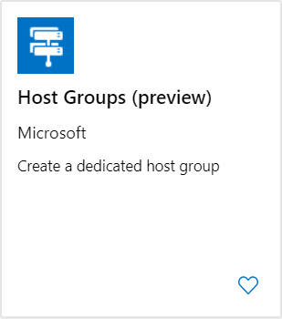
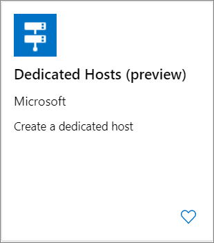
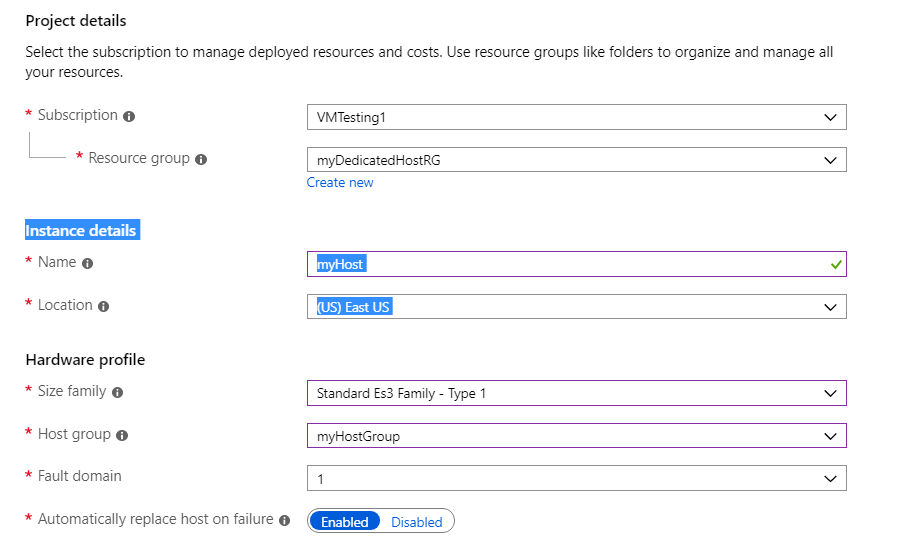

> [!IMPORTANT]
> Azure Dedicated Hosts is currently in public preview.
> This preview version is provided without a service level agreement, and it's not recommended for production workloads. Certain features might not be supported or might have constrained capabilities. 
> For more information, see [Supplemental Terms of Use for Microsoft Azure Previews](https://azure.microsoft.com/support/legal/preview-supplemental-terms/).
>
> **Known preview limitations**
> - Virtual machine scale sets are not currently supported on dedicated hosts.
> - The preview initial release supports the following VM series: DSv3 and ESv3. 

## Create a host group

A **host group** is a new resource that represents a collection of dedicated hosts. You create a host group in a region and an availability zone, and add hosts to it. When planning for high availability, there are additional options. You can use one or both of the following options with your dedicated hosts: 
- Span across multiple availability zones. In this case, you are required to have a host group in each of the zones you wish to use.
- Span across multiple fault domains which are mapped to physical racks. 
 
In either case, you are need to provide the fault domain count for your host group. If you do not want to span fault domains in your group, use a fault domain count of 1. 

You can also decide to use both availability zones and fault domains. 

In this example, we will create a host group using 1 availability zone and 2 fault domains. 

1. Open the Azure [portal](https://portal.azure.com).
1. Select **Create a resource** in the upper left corner.
1. Search for **Host group** and then select **Host Groups (preview)** from the results.

	
1. In the **Host Groups (preview)** page, select **Create**.
1. Select the subscription you would like to use, and then select **Create new** to create a new resource group.
1. Type *myDedicatedHostsRG* as the **Name** and then select **OK**.
1. For **Host group name**, type *myHostGroup*.
1. For **Location**, select **East US**.
1. For **Availability Zone**, select **1**.
1. For **Fault domain count**, select **2**.
1. Select **Review + create** and then wait for validation.

	
1. Once you see the **Validation passed** message, select **Create** to create the host group.

It should only take a few moments to create the host group.

## Create a dedicated host

Now create a dedicated host in the host group. In addition to a name for the host, you are required to provide the SKU for the host. Host SKU captures the supported VM series as well as the hardware generation for your dedicated host.  During the preview, we will support the following host SKU values: DSv3_Type1 and ESv3_Type1.

For more information about the host SKUs and pricing, see [Azure Dedicated Host pricing](https://aka.ms/ADHPricing).

If you set a fault domain count for your host group, you will be asked to specify the fault domain for your host.  

1. Select **Create a resource** in the upper left corner.
1. Search for **Dedicated host** and then select **Dedicated hosts (preview)** from the results.

	
1. In the **Dedicated Hosts (preview)** page, select **Create**.
1. Select the subscription you would like to use.
1. Select *myDedicatedHostsRG* as the **Resource group**.
1. In **Instance details**, type *myHost* for the **Name** and select *East US* for the location.
1. In **Hardware profile**, select *Standard Es3 family - Type 1* for the **Size family**, select *myHostGrup* for the **Host group** and then select *1* for the **Fault domain**. Leave the defaults for the rest of the fields.
1. When you are done, select **Review + create** and wait for validation.

	
1. Once you see the **Validation passed** message, select **Create** to create the host.

