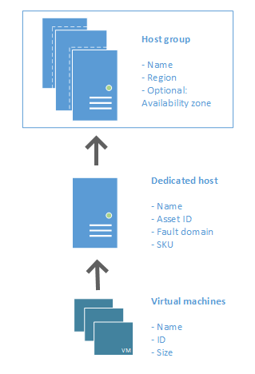

Microsoft Azure Dedicated Host is a new Azure Compute service that provides physical servers - able to host one or more virtual machines - dedicated to one Azure subscription. Dedicated hosts are the same physical servers we have in our data centers, provided as a new resource. You can provision dedicated hosts in a region, availability zone, and fault domain. Then, you can place VMs directly into your provisioned hosts. in whatever configuration best meets your needs.

> [!IMPORTANT]
> Azure Dedicated Hosts is currently in public preview.
> This preview version is provided without a service level agreement, and it's not recommended for production workloads. Certain features might not be supported or might have constrained capabilities. 
> For more information, see [Supplemental Terms of Use for Microsoft Azure Previews](https://azure.microsoft.com/support/legal/preview-supplemental-terms/).
>
> Known Preview limitation
> -   Virtual machine scale sets are not currently supported on dedicated hosts.
> -   The preview initial release supports the following VM series: DSv3, ESv3, FSv2. 
> -   During the preview, you won't be able to resize a virtual machine deployed to a dedicated host.

## Benefits 

Reserving the entire host with Azure Dedicated Hosts provides the following benefits:

-   Hardware isolation at the physical server level. No other VMs will be placed on your hosts. Dedicated hosts are deployed in the same data centers and share the same network and underlying storage infrastructure as other, non-isolated virtual machines.
-   Control over maintenance events initiated by the Azure platform. While the majority of maintenance events have little to no impact on your virtual machines, there are sensitive workloads where each second of pause can have an impact. With dedicated hosts you can opt-in to a maintenance window to reduce the impact to your service.
-   With the Azure hybrid benefit, you can bring your own licenses for Windows and SQL to Azure. Using the hybrid benefits provides you with additional benefits. For more information, see [Azure Hybrid Benefit](https://azure.microsoft.com/pricing/hybrid-benefit/).

## Regions

The following regions are supported for the public preview:

- 

## Limits

- Suscription limits?
- The number of hosts is limited to XX per subscription.

## Groups, hosts, and VMs  

A **host group** is a new resource that represents a collection of dedicated hosts. You create a host group in a region and an availability zone, and add hosts to it.

A **host** is a resource, mapped to a physical server in our data center. The physical server is allocated when the host is created. A host is created within a host group. A host has a SKU describing which VMs sizes can be created. Each host can host multiple VMs, from different sizes, as long as they are from the same size series.

When creating a VM in Azure, you can select which dedicated host to use for your VM. You have full control as to which VMs are placed on your hosts.

## High Availability considerations 

For high availability, you should deploy multiple VMs, spread across multiple hosts (minimum of 2). Unlike virtual machines, you should create your hosts in a way which will provide high availability to your service. With Azure Dedicated Hosts, you have several options to provision your infrastructure which will shape your fault isolation boundaries.

### Use Availability Zones for fault isolation

Availability zones are unique physical locations within an Azure region. Each zone is made up of one or more datacenters equipped with independent power, cooling, and networking. A Host group may be created in a single availability zone. Once created, all hosts will be placed within that zone. To achieve high availability across zones, you need to create multiple host groups (one per zone) and spread your hosts accordingly.

If you assign a host group to an availability zone, all VMs created on that host must be in the same zone.

### Use Fault Domains for fault isolation

A host can be created in a specific fault domain. Just like VM in a scale set or availability set, hosts in different fault domains will be placed on different physical racks in the data center. When you create a host group, you are required to specify the fault domain count. When you you create dedicated hosts within that group, you will assign fault domain for each host. The VMs do not require any fault domain assignment.

Fault domains are not the same as collocation. Having the same fault domain for two hosts does not mean they are in proximity with each other.

Fault domains are scoped to the host group. You should not make any assumption on anti-affinity between two host groups (unless they are in different availability zones).

VMs deployed to hosts with different fault domains, will have their underlying managed disks services on multiple storage stamps to increase the fault isolation protection.

### Using Availability Zones and Fault Domains

You can use both capabilities to achieve even more fault isolation domains. In this case, you will specify the availability zone and fault domain count in for each group, assign a fault domain to each of your hosts in the group, and assign an availability zone to each of your VMs

The Resource Manager sample template found [here](https://github.com/Azure/azure-quickstart-templates/blob/master/201-vm-dedicated-hosts/README.md) uses zones and fault domains to spread hosts for maximum resiliency in a region.

## Maintenance control

The infrastructure required to support your virtual machines is frequently updated to improve reliability, performance, security, and to launch new features. The Azure platform tries to minimize the impact of platform maintenance whenever possible, but customers with *maintenance sensitive* workloads can't tolerate even few seconds that the VM needs to be frozen or disconnected for maintenance.

**Maintenance Control** provides customers with an option to skip regular platform updates schedule on their dedicated hosts, then apply it at the time of their choice within a 35-day rolling window.

> [!NOTE]
>  Maintenance control is currently in a limited preview stage and requires onboarding process. 
> Apply for this preview by submitting a [nomination survey](https://forms.office.com/Pages/ResponsePage.aspx?id=v4j5cvGGr0GRqy180BHbR6lJf7DwiQxNmz51ksQvxV9UNUM3UllWUjBMTFZQUFhHUDI0VTBPQlJFNS4u).

## Capacity considerations and reservations

Once a dedicated host is provisioned, Azure assigns it to physical server. This guarantees the availability of the capacity when you need to provision your VM. Azure uses the entire capacity in the region (or zone) to pick a physical server for your host. It also means that customers can expect to be able to grow their dedicated host footprint without the concern of running out of space in the cluster.

> [!NOTE]
> During the preview we won't be offering the option for reserved capacity. 

## Pricing

Users are charged per dedicated host, regardless how many VMs are deployed. In your monthly statement you will see a new billable resource type of hosts. Virtual machines hosted within a dedicated hosts will still be shown in your statement, but will carry a price of 0.

The host price is set based on VM family, type (hardware size), and region. A host price is relative to the largest VM size supported on the host.

Software licensing, storage and network usage are billed separately from the host and VMs. There is no change to those billable items.

For more information, see [Azure Dedicated Host pricing](https://aka.ms/ADHPricing).
 
## VM families and Hardware generations

A dedicated host has a SKU representing the VM series and type. You can mix multiple VMs of different sizes within a single host as long as they are of the same series. The type matches the hardware generation currently available in the region.

Different types supporting the same VM series (family) will be different by their CPU vendor, generation and number of cores.

Refer to the hosts [pricing page] (https://aka.ms/ADHPricing) to learn about supported size series and their price.

## SKUs

During the preview, we will support the following host SKUs:

 
 
| Host SKU   | Supported Family | CPU                                                 | Max occupancy    | VM Count |
|------------|------------------|-----------------------------------------------------|------------------|----------|
| DSv3_Type1 | Standard_Ds_v3   | 2 x E5-2673 v4 2.3 GHz (40 cores) – 64 usable vCPUs |                  |          |
|            |                  |                                                     | Standard_D2s_v3  | 32       |
|            |                  |                                                     | Standard_D4s_v3  | 16       |
|            |                  |                                                     | Standard_D8s_v3  | 8        |
|            |                  |                                                     | Standard_D16s_v3 | 4        |
|            |                  |                                                     | Standard_D32s_v3 | 2        |
|            |                  |                                                     | Standard_D64s_v3 | 1        |
| ESv3_Type1 | Standard_Es_v3   | 2 x E5-2673 v4 2.3 GHz (40 cores) – 64 usable vCPUs |                  |          |
|            |                  |                                                     | Standard_E2s_v3  | 28       |
|            |                  |                                                     | Standard_E4s_v3  | 14       |
|            |                  |                                                     | Standard_E8s_v3  | 7        |
|            |                  |                                                     | Standard_E16s_v3 | 3        |
|            |                  |                                                     | Standard_E32s_v3 | 1        |
|            |                  |                                                     | Standard_E64s_v3 | 1        |
| FSv2_Type2 | Standard_Fs_v2   | 2 x 2.7Ghz Skylake (48 core) – 72 usable vCPUs      |                  |          |
|            |                  |                                                     | Standard_F2s_v2  | 32       |
|            |                  |                                                     | Standard_F4s_v2  | 18       |
|            |                  |                                                     | Standard_F8s_v2  | 9        |
|            |                  |                                                     | Standard_F16s_v2 | 4        |
|            |                  |                                                     | Standard_F32s_v2 | 2        |
|            |                  |                                                     | Standard_F64s_v2 | 1        |
|            |                  |                                                     | Standard_F72s_v2 | 1        |

## Host life cycle

Azure monitors and manages the health status of your hosts. The following states will be returned when you query your host:

| Health State   | Description       |
|----------|----------------|
| Host Available     | There are no known issues with your host.   |
| Host Under Investigation  | We’re having some issues with the host which we’re looking into. This is a transitional state required for Azure to try and identify the scope and root cause for the issue identified. Virtual machines running on the host may be impacted. |
| Host Pending Deallocate   | Azure can’t restore the host back to a healthy state and ask you to redeploy your virtual machines out of this host. If `autoHealingOnFailure` is enabled, your virtual machines are *service healed* to a healthy hardware. Otherwise, your virtual machine may be running on a host which is about to fail.|
| Host deallocated  | All virtual machines have been removed from the host. You are no longer being charged for this host since the hardware was taken out of rotation.   |

