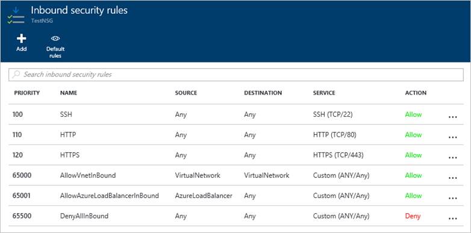
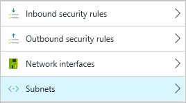
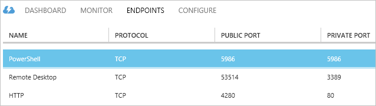
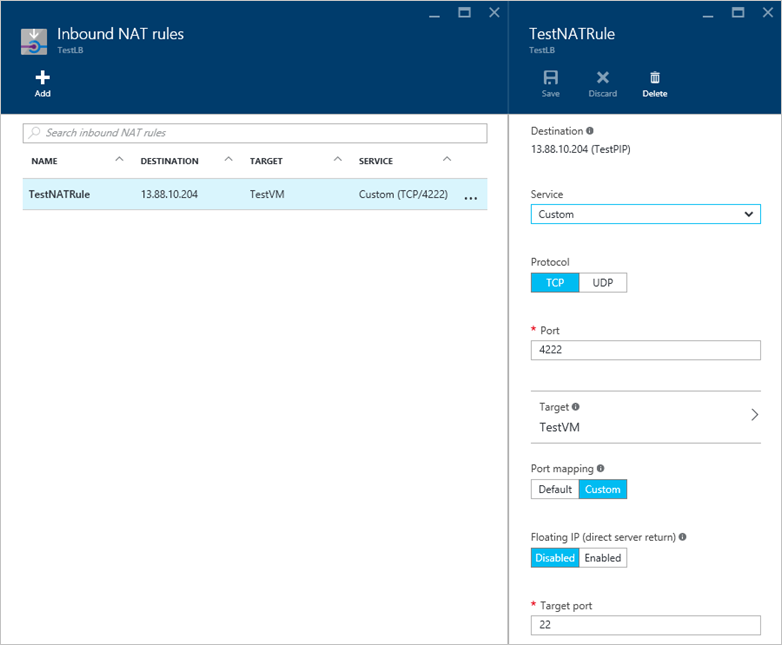

The approach to Azure endpoints works a little differently between the Classic and Resource Manager deployment models. You now have the flexibility to create network filters that control the flow of traffic in and out of your VMs, allowing you to create complex networking environments beyond a simple endpoint as in the Classic deployment model. This article provides an overview of network security groups and how they differ from using Classic endpoints, creating there filtering rules, and sample deployment scenarios.

## Overview of Resource Manager deployments
Endpoints in the Classic deployment model are replaced by Network Security Groups and access control list (ACL) rules. Quick steps for implementing Network Security Group ACL rules are:

- Create a Network Security Group
- Define your Network Security Group ACL rules to allow or deny traffic
- Assign your Network Security Group to a network interface or virtual network subnet

If you are wanting to also perform port-forwarding, you need to place a load balancer in front of your VM and use NAT rules. Quick steps for implementing a load balancer and NAT rules would be as follows:

- Create a load balancer
- Create a backend pool and add your VMs to the pool
- Define your NAT rules for the required port forwarding
- Assign your NAT rules to your VMs

## Network Security Group overview
Network Security Groups are a new feature that provide a layer of security for you to allow specific ports and subnets to access your VMs. You typically always have a Network Security Group providing this layer of security between your VMs and the outside world. Network Security Groups can be applied to a virtual network subnet or a specific network interface for a VM. Rather than creating endpoint ACL rules, you now create Network Security Group ACL rules. These ACL rules provide much greater control than simply creating an endpoint to forward a given port. You can [read more about Network Security Groups](../articles/virtual-network/virtual-networks-nsg.md).

> [AZURE.TIP] You can assign Network Security Groups to multiple subnets or network interfaces. There is no 1:1 mapping, meaning that you can create a Network Security Group with a common set of of ACL rules and apply to multiple subnets or network interfaces. Further, your Network Security Group can applied to resources across your subscription (based on [Role Based Access Controls](../articles/active-directory/role-based-access-control-what-is.md).

## Load Balancers overview
In the Classic deployment model, Azure would perform all the Network Address Translation (NAT) and port forwarding on a Cloud Service for you. When creating an endpoint, you would specify the external port to expose along with the internal port to direct traffic to. Network Security Groups by themselves do not perform this same NAT and port forwarding. 

An Azure load balancer needs to be created in your resource group that allows you to create NAT rules for such port forwarding. Again, this is granular enough to only apply to specific VMs if needed. The Azure load balancer NAT rules work in conjunction with Network Security Group ACL rules to provide much more flexibility and control than was achievable using Cloud Service endpoints. You can read more about [load balancer overview](../articles/load-balancer/load-balancer-overview.md).

## Network Security Group ACL rules
ACL rules let you define what traffic can flow in and out of your VM based on specific ports, port ranges, or protocols, and assign these rules to either individual VMs or to a subnet. The following screenshot is an example of ACL rules for a common webserver:

ACL rules are applied based on a priority metric that you specify - the higher the value, the lower the priority. Every Network Security Group has three default rules that are designed to handle the flow of Azure networking traffic, with an explicit `DenyAllInbound` as the final rule. Default ACL rules are given a very low priority so as to not interfere with rules you create.

## Assigning Network Security Groups
You assign a Network Security Group to a subnet or a network interface. This approach allows you to be as granular as needed when applying your ACL rules to only a specific VM, or ensure a common set of ACL rules are applied to all VMs part of a subnet:

The behavior of the Network Security Group doesn't change depending on being assigned to a subnet or a network interface. A common deployment scenario has the Network Security Group assigned to a subnet in order to ensure compliance of all VMs attached to that subnet. You can read more about [applying Network Security groups to resources](../virtual-nework/virtual-networks-nsg.md#associating-nsgs).

## Default behavior of Network Security Groups
Depending on how and when you create your network security group, default rules may be created to permit RDP access on TCP port 3389 (Linux VMs will permit TCP port 22). These automatic ACL rules will be created under the following conditions:

- If you create a Windows VM through the portal and accept the default action to create a new Network Security Group, an ACL rule to allow TCP port 3389 (RDP) will be created.
- If you create a Linux VM through the portal and accept the default action to create a new Network Security Group, an ACL rule to allow TCP port 22 (SSH) will be created.

Under all other conditions, these default ACL rules will not be created. You will be unable to connect to your VM with creating the appropriate ACL rules. This would include the following common actions:

- Creating a Network Security Group through the portal as a separate action to creating the VM.
- Creating a Network Security Group programmatically through PowerShell, Azure CLI, Rest APIs, etc.
- Creating a VM and assigning it to an existing Network Security Group that does not already have the appropriate ACL rule defined.

In all of the above cases, you will need to create ACL rules for your VM to allow the appropriate remote management connections.

## Default behavior of a VM without a Network Security Group
You can create a VM without creating a Network Security Group. In these situations, you can connect to your VM using RDP or SSH without creating any ACL rules. Similarly, if you installed a web service on port 80, that service will automatically be accessible remotely. The VM has all ports open.

> [AZURE.NOTE] You still need to have a public IP address assigned to a VM in order for any remote connections. Not having a Network Security Group for the subnet or network interface doesn't expose the VM to any external traffic. The default action when creating a VM through the portal is to create a new public IP. For all other forms of creating a VM such as PowerShell, Azure CLI, or Resource Manager template, a public IP won't be automatically created unless explicitly requested. Note that the default action through the portal is also to create a Network Security Group, so you shouldn't end up in a situation with an exposed VM that has no network filtering in place.

## Understanding Load Balancers and NAT rules
In the Classic deployment model, you could create endpoints that also performed port forwarding. When you create a VM in the Classic deployment model, ACL rules for RDP or SSH would be automatically created, however they would not expose TCP port 3389 or TCP port 22 respectively to the outside world. Instead, a high-value TCP port would be exposed that maps to the appropriate internal port. You could also create your own ACL rules in a similar manner, such as expose a webserver on TCP port 4280 to the outside world. You can see these ACL rules and port mappings in the following screenshot from the Classic portal:

With Network Security Groups, that port-forwarding function is handled by a load balancer. You can read more about [load balancers in Azure](../articles/load-balancer/load-balancer-overview.md). An example of a load balancer with a NAT rule to perform port-forwarding of TCP port 4222 to the internal TCP port 22 a VM is shown in the following screenshot from the portal:

> [AZURE.NOTE] When you implement a load balancer, you typically won't assign the VM itself a public IP address. Instead, the load balancer will have a public IP address assigned to it. You still need to create your Network Security Group and ACL rules to define the flow of traffic in and out of your VM. The load balancer NAT rules are simply to define what ports are allowed through the load balancer and how they get distributed across the backend VMs. As such, you need to create a NAT rule for traffic to flow through the load balancer and then create a Network Security Group ACL rule to allow the traffic to actually reach the VM.