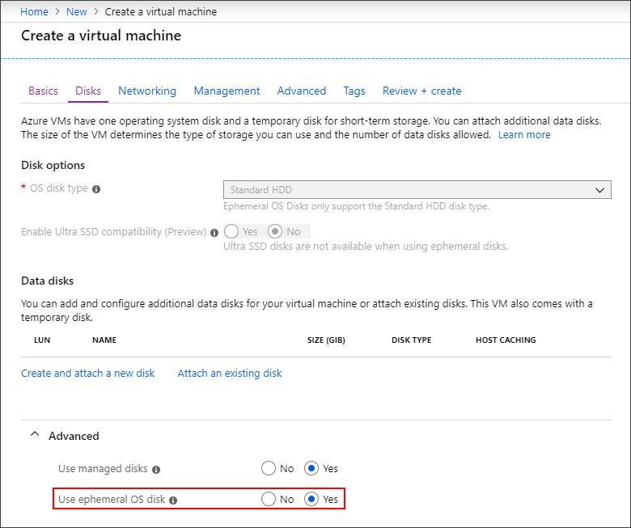
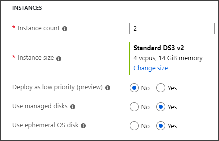

Ephemeral OS disks are created on the local virtual machine (VM) storage and not saved to the remote Azure Storage. Ephemeral OS disks work well for stateless workloads, where applications are tolerant of individual VM failures, but are more affected by VM deployment time or reimaging the individual VM instances. With Ephemeral OS disk, you get lower read/write latency to the OS disk and faster VM reimage. 
 
The key features of ephemeral disks are: 
- Ideal for stateless applications.
- They can be used with both Marketplace and custom images.
- Ability to fast reset or reimage VMs and scale set instances to the original boot state.  
- Lower latency, similar to a temporary disk. 
- Ephemeral OS disks are free, you incur no storage cost for OS disk.
- They are available in all Azure regions. 
- Ephemeral OS Disk is supported by [Shared Image Gallery](/azure/virtual-machines/linux/shared-image-galleries). 
 

 
Key differences between persistent and ephemeral OS disks:

|                             | Persistent OS Disk                          | Ephemeral OS Disk                              |    |
|-----------------------------|---------------------------------------------|------------------------------------------------|
| Size limit for OS disk      | 2 TiB                                                                                        | Cache size for the VM size or 2TiB, whichever is smaller. For the **cache size in GiB**, see [DS](../articles/virtual-machines/linux/sizes-general.md), [ES](../articles/virtual-machines/linux/sizes-memory.md), [M](../articles/virtual-machines/linux/sizes-memory.md), [FS](../articles/virtual-machines/linux/sizes-compute.md), and [GS](/azure/virtual-machines/linux/sizes-previous-gen#gs-series)              |
| VM sizes supported          | All                                                                                          | DSv1, DSv2, DSv3, Esv3, Fs, FsV2, GS, M                                               |
| Disk type support           | Managed and unmanaged OS disk                                                                | Managed OS disk only                                                               |
| Region support              | All regions                                                                                  | All regions                              |
| Data persistence            | OS disk data written to OS disk are stored in Azure Storage                                  | Data written to OS disk is stored to the local VM storage and is not persisted to Azure Storage. |
| Stop-deallocated state      | VMs and scale set instances can be stop-deallocated and restarted from the stop-deallocated state | VMs and scale set instances cannot be stop-deallocated                                  |
| Specialized OS disk support | Yes                                                                                          | No                                                                                 |
| OS disk resize              | Supported during VM creation and after VM is stop-deallocated                                | Supported during VM creation only                                                  |
| Resizing to a new VM size   | OS disk data is preserved                                                                    | Data on the OS disk is deleted, OS is re-provisioned                                      |

## Size requirements

You can deploy VM and instance images up to the size of the VM cache. For example, Standard Windows Server images from the marketplace are about 127 GiB,  which means that you need a VM size that has a cache larger than 127 GiB. In this case, the [Standard_DS2_v2](~/articles/virtual-machines/dv2-dsv2-series.md) has a cache size of 86 GiB, which is not large enough. The Standard_DS3_v2 has a cache size of 172 GiB, which is large enough. In this case, the Standard_DS3_v2 is the smallest size in the DSv2 series that you can use with this image. Basic Linux images in the Marketplace and Windows Server images that are denoted by `[smallsize]` tend to be around 30 GiB and can use most of the available VM sizes.

Ephemeral disks also require that the VM size supports Premium storage. The sizes usually (but not always) have an `s` in the name, like DSv2 and EsV3. For more information, see [Azure VM sizes](../articles/virtual-machines/linux/sizes.md) for details around which sizes support Premium storage.

## PowerShell

To use an ephemeral disk for a PowerShell VM deployment, use [Set-AzVMOSDisk](/powershell/module/az.compute/set-azvmosdisk) in your VM configuration. Set the `-DiffDiskSetting` to `Local` and `-Caching` to `ReadOnly`.     

```powershell
Set-AzVMOSDisk -DiffDiskSetting Local -Caching ReadOnly
```

For scale set deployments, use the [Set-AzVmssStorageProfile](/powershell/module/az.compute/set-azvmssstorageprofile) cmdlet in your configuration. Set the `-DiffDiskSetting` to `Local` and `-Caching` to `ReadOnly`.


```powershell
Set-AzVmssStorageProfile -DiffDiskSetting Local -OsDiskCaching ReadOnly
```

## CLI

To use an ephemeral disk for a CLI VM deployment, set the `--ephemeral-os-disk` parameter in [az vm create](/cli/azure/vm#az-vm-create) to `true` and the `--os-disk-caching` parameter to `ReadOnly`.

```azurecli-interactive
az vm create \
  --resource-group myResourceGroup \
  --name myVM \
  --image UbuntuLTS \
  --ephemeral-os-disk true \
  --os-disk-caching ReadOnly \
  --admin-username azureuser \
  --generate-ssh-keys
```

For scale sets, you use the same `--ephemeral-os-disk true` parameter for [az-vmss-create](/cli/azure/vmss#az-vmss-create) and set the `--os-disk-caching` parameter to `ReadOnly`.

## Portal	

In the Azure portal, you can choose to use ephemeral disks when deploying a VM by opening the **Advanced** section of the **Disks** tab. For **Use ephemeral OS disk** select **Yes**.



If the option for using an ephemeral disk is greyed out, you might have selected a VM size that does not have a cache size larger than the OS image or that doesn't support Premium storage. Go back to the **Basics** page and try choosing another VM size.

You can also create scale-sets with ephemeral OS disks using the portal. Just make sure you select a VM size with a large enough cache size and then in **Use ephemeral OS disk** select **Yes**.



## Scale set template deployment  
The process to create a scale set that uses an ephemeral OS disk is to add the `diffDiskSettings` property to the 
`Microsoft.Compute/virtualMachineScaleSets/virtualMachineProfile` resource type in the template. Also, the caching policy must be set to `ReadOnly` for the ephemeral OS disk. 


```json
{ 
  "type": "Microsoft.Compute/virtualMachineScaleSets", 
  "name": "myScaleSet", 
  "location": "East US 2", 
  "apiVersion": "2018-06-01", 
  "sku": { 
    "name": "Standard_DS2_v2", 
    "capacity": "2" 
  }, 
  "properties": { 
    "upgradePolicy": { 
      "mode": "Automatic" 
    }, 
    "virtualMachineProfile": { 
       "storageProfile": { 
        "osDisk": { 
          "diffDiskSettings": { 
	           	"option": "Local" 
          }, 
          "caching": "ReadOnly", 
          "createOption": "FromImage" 
        }, 
        "imageReference":  { 
          "publisher": "Canonical", 
          "offer": "UbuntuServer", 
          "sku": "16.04-LTS", 
          "version": "latest" 
        } 
      }, 
      "osProfile": { 
        "computerNamePrefix": "myvmss", 
        "adminUsername": "azureuser", 
        "adminPassword": "P@ssw0rd!" 
      } 
    } 
  } 
}  
```

## VM template deployment 
You can deploy a VM with an ephemeral OS disk using a template. The process to create a VM that uses ephemeral OS disks is to add the `diffDiskSettings` property to the Microsoft.Compute/virtualMachines resource type in the template. Also, the caching policy must be set to `ReadOnly` for the ephemeral OS disk. 

```json
{ 
  "type": "Microsoft.Compute/virtualMachines", 
  "name": "myVirtualMachine", 
  "location": "East US 2", 
  "apiVersion": "2018-06-01", 
  "properties": { 
       "storageProfile": { 
            "osDisk": { 
              "diffDiskSettings": { 
               	"option": "Local" 
              }, 
              "caching": "ReadOnly", 
              "createOption": "FromImage" 
            }, 
            "imageReference": { 
                "publisher": "MicrosoftWindowsServer", 
                "offer": "WindowsServer", 
                "sku": "2016-Datacenter-smalldisk", 
                "version": "latest" 
            }, 
            "hardwareProfile": { 
                 "vmSize": "Standard_DS2_v2" 
             } 
      }, 
      "osProfile": { 
        "computerNamePrefix": "myvirtualmachine", 
        "adminUsername": "azureuser", 
        "adminPassword": "P@ssw0rd!" 
      } 
    } 
 } 
```


## Reimage a VM using REST
You can reimage a Virtual Machine instance with ephemeral OS disk using REST API as described below and via Azure Portal by going to Overview pane of the VM. For scale sets, reimaging is already available through Powershell, CLI, and the portal.

```
POST https://management.azure.com/subscriptions/{sub-
id}/resourceGroups/{rgName}/providers/Microsoft.Compute/VirtualMachines/{vmName}/reimage?a pi-version=2018-06-01" 
```
 
## Frequently asked questions

**Q: What is the size of the local OS Disks?**

A: We support platform and custom images, up to the VM cache size, where all read/writes to the OS disk will be local on the same node as the Virtual Machine. 

**Q: Can the ephemeral OS disk be resized?**

A: No, once the ephemeral OS disk is provisioned, the OS disk cannot be resized. 

**Q: Can I attach a Managed Disks to an Ephemeral VM?**

A: Yes, you can attach a managed data disk to a VM that uses an ephemeral OS disk. 

**Q: Will all VM sizes be supported for ephemeral OS disks?**

A: No, all Premium Storage VM sizes are supported (DS, ES, FS, GS and M) except the B-series, N-series, and H-series sizes.  
 
**Q: Can the ephemeral OS disk be applied to existing VMs and scale sets?**

A: No, ephemeral OS disk can only be used during VM and scale set creation. 

**Q: Can you mix ephemeral and normal OS disks in a scale set?**

A: No, you can't have a mix of ephemeral and persistent OS disk instances within the same scale set. 

**Q: Can the ephemeral OS disk be created using Powershell or CLI?**

A: Yes, you can create VMs with Ephemeral OS Disk using REST, Templates, PowerShell and CLI.

**Q: What features are not supported with ephemeral OS disk?**

A: Ephemeral disks do not support:
- Capturing VM images
- Disk snapshots 
- Azure Disk Encryption 
- Azure Backup
- Azure Site Recovery  
- OS Disk Swap 
