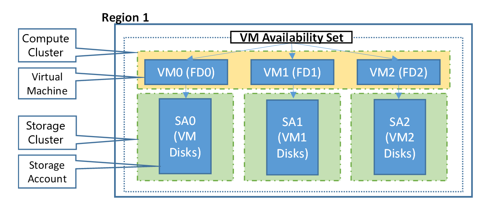

## Understand VM Reboots - maintenance vs. downtime
There are three scenarios which can lead to virtual machine in Azure being impacted: unplanned hardware maintenance, unexpected downtime and planned maintenance.

* **Unplanned Hardware Maintenance Event** occurs when the Azure platform performs a maintenance operation due to changes required in the underlying hardware hosting a Virtual Machine. If the Azure platform predicts the hardware or any platform component associated to a physical machine is about to fail, the platform will issue an unplanned hardware maintenance operation to avoid or reduce the impact to the virtual machines running on that hardware. Azure uses Live Migration technology to migrate the Virtual Machines from the failing hardware to a healthy physical machine. Live Migration is a VM preserving operation resulting in a very short pause to the Virtual Machine (memory, open files and network connections are maintained but performance might be reduced for some period before and/or after the VM Preserving Maintenance operation). 

In cases where Live Migration cannot be used to protect the VM from the predicted hardware failure, then the VM will experience Unexpected Downtime, as described below, if or when the hardware does fail as predicted.

* **An Unexpected Downtime** impacting virtual machines rarely occurs when the hardware or the physical infrastructure underlying your Virtual Machine has faulted in some way. This may include local network failures, local disk failures, or other rack level failures. When such a failure is detected, the Azure platform automatically migrates (heals) your virtual machine from the unhealthy physical machine hosting your virtual machine to a healthy physical machine. During the healing procedure, virtual machines experience downtime (reboot) and in some cases loss of the temporary drive. Note that Virtual Disks are always preserved. 

* **Planned Maintenance events** are periodic updates made by Microsoft to the underlying Azure platform to improve overall reliability, performance, and security of the platform infrastructure that your virtual machines run on. Most of these updates are performed without any impact upon your Virtual Machines or Cloud Services (see VM Preserving Maintenance). Platform attempts to use VM Preserving Maintenance in all possible occasions. However, there are rare instances when these updates require a reboot of your virtual machine to apply the required updates to the underlying infrastructure. Platform will attempt to avoid any reboot due to Planned Maintenance but if in a rare case such a reboot is unavoidable, customer can perform Azure Planned Maintenance with Maintenance-Redeploy operation by initiating the maintenance for his/hers VMs in the suitable time window. For more information, see [Planned Maintenance for Virtual Machines](https://docs.microsoft.com/en-us/azure/virtual-machines/windows/planned-maintenance/).

To reduce the impact of downtime due to one or more of these events, we recommend the following high availability best practices for your virtual machines:

* [Configure multiple virtual machines in an availability set for redundancy]
* [Use managed disks for VMs in an availability set]
* [Use Scheduled Events to proactively response to VM impacting events ] (https://docs.microsoft.com/en-us/azure/virtual-machines/virtual-machines-scheduled-events)
* [Configure each application tier into separate availability sets]
* [Combine a Load Balancer with availability sets]

## Configure multiple virtual machines in an availability set for redundancy
To provide redundancy to your application, we recommend that you group two or more virtual machines in an availability set. This configuration ensures that during either a planned or unplanned maintenance event, at least one virtual machine is available and meets the 99.95% Azure SLA. For more information, see the [SLA for Virtual Machines](https://azure.microsoft.com/support/legal/sla/virtual-machines/).

> [!IMPORTANT]
> Avoid leaving a single instance virtual machine in an availability set by itself. VMs in this configuration do not qualify for a SLA guarantee and face downtime during Azure planned maintenance events, except when a single VM is using [Azure Premium Storage](../articles/storage/storage-premium-storage.md). For single VMs using premium storage, the Azure SLA applies.

Each virtual machine in your availability set is assigned an **update domain** and a **fault domain** by the underlying Azure platform. For a given availability set, five non-user-configurable update domains are assigned by default (Resource Manager deployments can then be increased to provide up to 20 update domains) to indicate groups of virtual machines and underlying physical hardware that can be rebooted at the same time. When more than five virtual machines are configured within a single availability set, the sixth virtual machine is placed into the same update domain as the first virtual machine, the seventh in the same update domain as the second virtual machine, and so on. The order of update domains being rebooted may not proceed sequentially during planned maintenance, but only one update domain is rebooted at a time.

Fault domains define the group of virtual machines that share a common power source and network switch. By default, the virtual machines configured within your availability set are separated across up to three fault domains for Resource Manager deployments (two fault domains for Classic). While placing your virtual machines into an availability set does not protect your application from operating system or application-specific failures, it does limit the impact of potential physical hardware failures, network outages, or power interruptions.

<!--Image reference-->
   

## Use managed disks for VMs in an availability set
If you are currently using VMs with unmanaged disks, we highly recommend you [convert VMs in Availability Set to use Managed Disks](../articles/virtual-machines/windows/convert-unmanaged-to-managed-disks.md).

[Managed disks](../articles/storage/storage-managed-disks-overview.md) provides better reliability for Availability Sets by ensuring that the disks of VMs in an Availability Set are sufficiently isolated from each other to avoid single points of failure. It does this by automatically placing the disks in different storage clusters. If a storage cluster fails due to hardware or software failure, only the VM instances with disks on those stamps fail.

> [!IMPORTANT]
> The number of fault domains for managed availability sets varies by region - either two or three per region. The following table shows the number per region

[!INCLUDE [managed-disks-common-fault-domain-region-list](managed-disks-common-fault-domain-region-list.md)]

If you plan to use VMs with [unmanaged disks](../articles/storage/storage-about-disks-and-vhds-windows.md#types-of-disks), follow below best practices for Storage accounts where virtual hard disks (VHDs) of VMs are stored as [page blobs](https://docs.microsoft.com/rest/api/storageservices/Understanding-Block-Blobs--Append-Blobs--and-Page-Blobs#about-page-blobs).

1. **Keep all disks (OS and data) associated with a VM in the same storage account**
2. **Review the [limits](../articles/storage/storage-scalability-targets.md) on the number of unmanaged disks in a Storage account** before adding more VHDs to a storage account
3. **Use separate storage account for each VM in an Availability Set.** Do not share Storage accounts with multiple VMs in the same Availability Set. It is acceptable for VMs across different Availability Sets to share storage accounts if above best practices are followed

## Configure each application tier into separate availability sets
If your virtual machines are all nearly identical and serve the same purpose for your application, we recommend that you configure an availability set for each tier of your application.  If you place two different tiers in the same availability set, all virtual machines in the same application tier can be rebooted at once. By configuring at least two virtual machines in an availability set for each tier, you guarantee that at least one virtual machine in each tier is available.

For example, you could put all the virtual machines in the front-end of your application running IIS, Apache, Nginx in a single availability set. Make sure that only front-end virtual machines are placed in the same availability set. Similarly, make sure that only data-tier virtual machines are placed in their own availability set, like your replicated SQL Server virtual machines or your MySQL virtual machines.

<!--Image reference-->
   

## Combine a load balancer with availability sets
Combine the [Azure Load Balancer](../articles/load-balancer/load-balancer-overview.md) with an availability set to get the most application resiliency. The Azure Load Balancer distributes traffic between multiple virtual machines. For our Standard tier virtual machines, the Azure Load Balancer is included. Not all virtual machine tiers include the Azure Load Balancer. For more information about load balancing your virtual machines, see [Load Balancing virtual machines](../articles/virtual-machines/virtual-machines-linux-load-balance.md).

If the load balancer is not configured to balance traffic across multiple virtual machines, then any planned maintenance event affects the only traffic-serving virtual machine, causing an outage to your application tier. Placing multiple virtual machines of the same tier under the same load balancer and availability set enables traffic to be continuously served by at least one instance.

<!-- Link references -->
[Configure multiple virtual machines in an availability set for redundancy]: #configure-multiple-virtual-machines-in-an-availability-set-for-redundancy
[Configure each application tier into separate availability sets]: #configure-each-application-tier-into-separate-availability-sets
[Combine a Load Balancer with availability sets]: #combine-a-load-balancer-with-availability-sets
[Avoid single instance virtual machines in availability sets]: #avoid-single-instance-virtual-machines-in-availability-sets
[Use managed disks for VMs in an availability set]: #use-managed-disks-for-vms-in-an-availability-set
