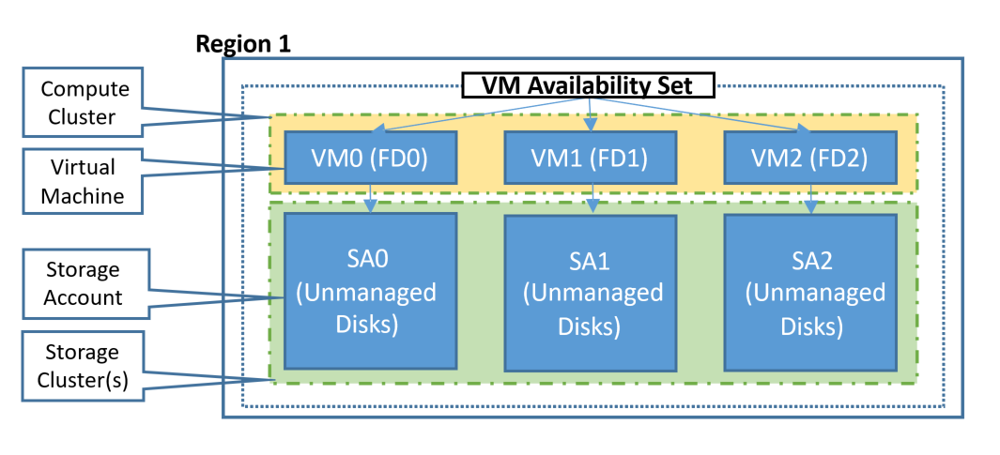

## Understand VM Reboots - maintenance vs. downtime
There are three scenarios that can lead to virtual machine in Azure being impacted: unplanned hardware maintenance, unexpected downtime, and planned maintenance.

* **Unplanned Hardware Maintenance Event** occurs when the Azure platform predicts that the hardware or any platform component associated to a physical machine, is about to fail. When the platform predicts a failure, it will issue an unplanned hardware maintenance event to reduce the impact to the virtual machines hosted on that hardware. Azure uses [Live Migration](https://docs.microsoft.com/azure/virtual-machines/linux/maintenance-and-updates) technology to migrate the Virtual Machines from the failing hardware to a healthy physical machine. Live Migration is a VM preserving operation that only pauses the Virtual Machine for a short time. Memory, open files, and network connections are maintained, but performance might be reduced before and/or after the event. In cases where Live Migration cannot be used, the VM will experience Unexpected Downtime, as described below.


* **An Unexpected Downtime** is when the hardware or the physical infrastructure for the virtual machine fails unexpectedly. This can include local network failures, local disk failures, or other rack level failures. When detected, the Azure platform automatically migrates (heals) your virtual machine to a healthy physical machine in the same datacenter. During the healing procedure, virtual machines experience downtime (reboot) and in some cases loss of the temporary drive. The attached OS and data disks are always preserved.

  Virtual machines can also experience downtime in the unlikely event of an outage or disaster that affects an entire datacenter, or even an entire region. For these scenarios, Azure provides protection options including  [availability zones](../articles/availability-zones/az-overview.md) and [paired regions](../articles/best-practices-availability-paired-regions.md#what-are-paired-regions).

* **Planned Maintenance events** are periodic updates made by Microsoft to the underlying Azure platform to improve overall reliability, performance, and security of the platform infrastructure that your virtual machines run on. Most of these updates are performed without any impact upon your Virtual Machines or Cloud Services (see [VM Preserving Maintenance](https://docs.microsoft.com/azure/virtual-machines/windows/preserving-maintenance)). While the Azure platform attempts to use VM Preserving Maintenance in all possible occasions, there are rare instances when these updates require a reboot of your virtual machine to apply the required updates to the underlying infrastructure. In this case, you can perform Azure Planned Maintenance with Maintenance-Redeploy operation by initiating the maintenance for their VMs in the suitable time window. For more information, see [Planned Maintenance for Virtual Machines](https://docs.microsoft.com/azure/virtual-machines/windows/planned-maintenance/).


To reduce the impact of downtime due to one or more of these events, we recommend the following high availability best practices for your virtual machines:

* [Configure multiple virtual machines in an availability set for redundancy]
* [Use managed disks for VMs in an availability set]
* [Use scheduled events to proactively response to VM impacting events](https://docs.microsoft.com/azure/virtual-machines/virtual-machines-scheduled-events)
* [Configure each application tier into separate availability sets]
* [Combine a Load Balancer with availability sets]
* [Use availability zones to protect from datacenter level failures]

## Use availability zones to protect from datacenter level failures

[Availability zones](../articles/availability-zones/az-overview.md) expand the level of control you have to maintain the availability of the applications and data on your VMs. Availability Zones are unique physical locations within an Azure region. Each zone is made up of one or more datacenters equipped with independent power, cooling, and networking. To ensure resiliency, there are a minimum of three separate zones in all enabled regions. The physical separation of Availability Zones within a region protects applications and data from datacenter failures. Zone-redundant services replicate your applications and data across Availability Zones to protect from single-points-of-failure.

An Availability Zone in an Azure region is a combination of a **fault domain** and an **update domain**. For example, if you create three or more VMs across three zones in an Azure region, your VMs are effectively distributed across three fault domains and three update domains. The Azure platform recognizes this distribution across update domains to make sure that VMs in different zones are not updated at the same time.

With Availability Zones, Azure offers industry best 99.99% VM uptime SLA. By architecting your solutions to use replicated VMs in zones, you can protect your applications and data from the loss of a datacenter. If one zone is compromised, then replicated apps and data are instantly available in another zone.


Learn more about deploying a [Windows](../articles/virtual-machines/windows/create-powershell-availability-zone.md) or [Linux](../articles/virtual-machines/linux/create-cli-availability-zone.md) VM in an Availability Zone.

## Configure multiple virtual machines in an availability set for redundancy
Availability sets are another datacenter configuration to provide VM redundancy and availability. This configuration within a datacenter ensures that during either a planned or unplanned maintenance event, at least one virtual machine is available and meets the 99.95% Azure SLA. For more information, see the [SLA for Virtual Machines](https://azure.microsoft.com/support/legal/sla/virtual-machines/).

> [!IMPORTANT]
> Avoid leaving a single instance virtual machine in an availability set by itself. VMs in this configuration do not qualify for a SLA guarantee and face downtime during Azure planned maintenance events, except when a single VM is using [Azure premium SSDs](../articles/virtual-machines/windows/disks-types.md#premium-ssd). For single VMs using premium SSDs, the Azure SLA applies.

Each virtual machine in your availability set is assigned an **update domain** and a **fault domain** by the underlying Azure platform. For a given availability set, five non-user-configurable update domains are assigned by default (Resource Manager deployments can then be increased to provide up to 20 update domains) to indicate groups of virtual machines and underlying physical hardware that can be rebooted at the same time. When more than five virtual machines are configured within a single availability set, the sixth virtual machine is placed into the same update domain as the first virtual machine, the seventh in the same update domain as the second virtual machine, and so on. The order of update domains being rebooted may not proceed sequentially during planned maintenance, but only one update domain is rebooted at a time. A rebooted update domain is given 30 minutes to recover before maintenance is initiated on a different update domain.

Fault domains define the group of virtual machines that share a common power source and network switch. By default, the virtual machines configured within your availability set are separated across up to three fault domains for Resource Manager deployments (two fault domains for Classic). While placing your virtual machines into an availability set does not protect your application from operating system or application-specific failures, it does limit the impact of potential physical hardware failures, network outages, or power interruptions.

<!--Image reference-->
   

## Use managed disks for VMs in an availability set
If you are currently using VMs with unmanaged disks, we highly recommend you [convert VMs in Availability Set to use Managed Disks](../articles/virtual-machines/windows/convert-unmanaged-to-managed-disks.md).

[Managed disks](../articles/virtual-machines/windows/managed-disks-overview.md) provide better reliability for Availability Sets by ensuring that the disks of VMs in an Availability Set are sufficiently isolated from each other to avoid single points of failure. It does this by automatically placing the disks in different storage fault domains (storage clusters) and aligning them with the VM fault domain. If a storage fault domain fails due to hardware or software failure, only the VM instance with disks on the storage fault domain fails.


> [!IMPORTANT]
> The number of fault domains for managed availability sets varies by region - either two or three per region. You can see the fault domain for each region by running the following scripts.

```azurepowershell-interactive
Get-AzComputeResourceSku | where{$_.ResourceType -eq 'availabilitySets' -and $_.Name -eq 'Aligned'}
```

```azurecli-interactive 
az vm list-skus --resource-type availabilitySets --query '[?name==`Aligned`].{Location:locationInfo[0].location, MaximumFaultDomainCount:capabilities[0].value}' -o Table
```

> Note:
> Under certain circumstances, it might happen that 2 VMs part of the same AvailabilitySet are sharing the same FaultDomain. This can be confirmed by going into your AvailabilitySet and check the "Fault Domain" column.
> This behavior can be observed when the following sequence happened while deploying the VMs:
> - Deploy the 1st VM
> - Stop/Deallocate the 1st VM
> - Deploy the 2nd VM
> Under these circumstances, the OS Disk of the 2nd VM might be created on the same Fault Domain as the 1st VM, and so the 2nd VM will also land on the same FaultDomain. 
> To avoid this issue, it's recommended to not stop/deallocate the VM between their deployments.

If you plan to use VMs with unmanaged disks, follow below best practices for Storage accounts where virtual hard disks (VHDs) of VMs are stored as [page blobs](https://docs.microsoft.com/rest/api/storageservices/Understanding-Block-Blobs--Append-Blobs--and-Page-Blobs#about-page-blobs).

1. **Keep all disks (OS and data) associated with a VM in the same storage account**
2. **Review the [limits](../articles/storage/blobs/scalability-targets-premium-page-blobs.md) on the number of unmanaged disks in an Azure Storage account** before adding more VHDs to a storage account
3. **Use a separate storage account for each VM in an Availability Set.** Do not share Storage accounts with multiple VMs in the same Availability Set. It is acceptable for VMs across different Availability Sets to share storage accounts if above best practices are followed


## Use scheduled events to proactively respond to VM impacting events

When you subscribe to [scheduled events](https://docs.microsoft.com/azure/virtual-machines/virtual-machines-scheduled-events), your VM is notified about upcoming maintenance events that can impact your VM. When scheduled events are enabled, your virtual machine is given a minimum amount of time before the maintenance activity is performed. For example, Host OS updates that might impact your VM are queued up as events that specify the impact, as well as a time at which the maintenance will be performed if no action is taken. Schedule events are also queued up when Azure detects imminent hardware failure that might impact your VM, which allows you to decide when the healing should be performed. Customers can use the event to perform tasks prior to the maintenance, such as saving state, failing over to the secondary, and so on. After you complete your logic for gracefully handling the maintenance event, you can approve the outstanding scheduled event to allow the platform to proceed with maintenance.

## Configure each application tier into separate availability zones or availability sets
If your virtual machines are all nearly identical and serve the same purpose for your application, we recommend that you configure an availability zone or availability set for each tier of your application.  If you place two different tiers in the same availability zone or set, all virtual machines in the same application tier can be rebooted at once. By configuring at least two virtual machines in an availability zone or set for each tier, you guarantee that at least one virtual machine in each tier is available.

For example, you could put all the virtual machines in the front end of your application running IIS, Apache, and Nginx in a single availability zone or set. Make sure that only front-end virtual machines are placed in the same availability zone or set. Similarly, make sure that only data-tier virtual machines are placed in their own availability zone or set, like your replicated SQL Server virtual machines, or your MySQL virtual machines.

<!--Image reference-->
   

## Combine a load balancer with availability zones or sets
Combine the [Azure Load Balancer](../articles/load-balancer/load-balancer-overview.md) with an availability zone or set to get the most application resiliency. The Azure Load Balancer distributes traffic between multiple virtual machines. For our Standard tier virtual machines, the Azure Load Balancer is included. Not all virtual machine tiers include the Azure Load Balancer. For more information about load balancing your virtual machines, see [Load Balancing virtual machines](../articles/virtual-machines/virtual-machines-linux-load-balance.md).

If the load balancer is not configured to balance traffic across multiple virtual machines, then any planned maintenance event affects the only traffic-serving virtual machine, causing an outage to your application tier. Placing multiple virtual machines of the same tier under the same load balancer and availability set enables traffic to be continuously served by at least one instance.

For a tutorial on how to load balance across availability zones, see [Load balance VMs across all availability zones by using the Azure CLI](../articles/load-balancer/load-balancer-standard-public-zone-redundant-cli.md).


<!-- Link references -->
[Configure multiple virtual machines in an availability set for redundancy]: #configure-multiple-virtual-machines-in-an-availability-set-for-redundancy
[Configure each application tier into separate availability sets]: #configure-each-application-tier-into-separate-availability-zones-or-availability-sets
[Combine a Load Balancer with availability sets]: #combine-a-load-balancer-with-availability-zones-or-sets
[Avoid single instance virtual machines in availability sets]: #avoid-single-instance-virtual-machines-in-availability-sets
[Use managed disks for VMs in an availability set]: #use-managed-disks-for-vms-in-an-availability-set
[Use availability zones to protect from datacenter level failures]: #use-availability-zones-to-protect-from-datacenter-level-failures
