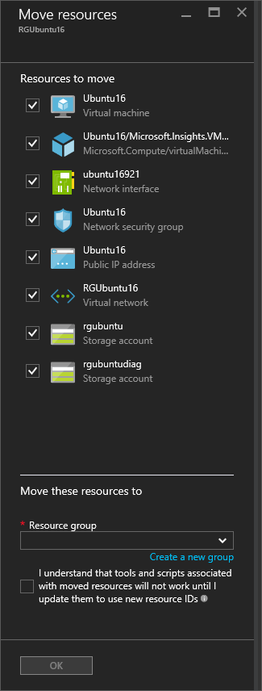

## Use the portal to move a VM to a different subscription

You can move a VM and it's associated resources to a different subscription using the portal.

1. Open the [Azure portal](https://portal.azure.com).
2. Click **Browse** > **Virtual machines** and select the VM you would like to move from the list.
	
	
	
3. In the **Essentials** section, click on the **Change subscription** pencil icon next to the subscription name. The **Move resources** blade will open.
	
	
	
4. Select each of the resources to move. In most cases, you should move all of the listed optional resources.
5. Select the **Subscription** where you want the VM to be moved.
6. Select an existing **Resource group** or type a name to have a new resource group created.
7. When you are done, select that you understand that new resource IDs will be created and those need to be used with the VM once it is moved, then click **OK**.

## Use the portal to move a VM to another resource group

You can move a VM and it's associated resources to another resource group using the portal.

1. Open the [Azure portal](https://portal.azure.com).
2. Click **Browse** > **Resource groups** and select the resource group that contains the VM.
3. In the **Resource group** blade, select **Move** from the menu.
	
	
	
3. In the **Move resources** blade, select the resources to be moved and then either type an existing resource group name or choose to create a new resource group. When you are done, select that you understand that new resource IDs will be created and those need to be used with the VM once it is moved, then click **OK**
	
	

