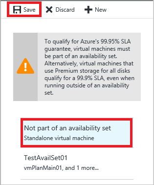

## Multi and Single Instance VMs
Many customers running on Azure count it critical that they can schedule when their VMs undergo planned maintenance due to the downtime--about 15 minutes--that occurs during maintenance. You can use availability sets to help control when provisioned VMs receive planned maintenance.

There are two possible configurations for VMs running on Azure. VMs are either configured as multi-instance or single-instance. If VMs are in an availability set, then they are configured as multi-instance. Note, even single VMs can be deployed in an availability set, so that they are treated as multi-instance. If VMs are NOT in an availability set, then they are configured as single-instance.  For details on availability sets, see [Manage the Availability of your Windows Virtual Machines](../articles/virtual-machines/windows/manage-availability.md?toc=%2fazure%2fvirtual-machines%2fwindows%2ftoc.json) or [Manage the Availability of your Linux Virtual Machines](../articles/virtual-machines/linux/manage-availability.md?toc=%2fazure%2fvirtual-machines%2flinux%2ftoc.json).

Planned maintenance updates to single-instance and multi-instance VMs happen separately. By reconfiguring your VMs to be single-instance (if they are multi-instance) or to be multi-instance (if they are single-instance), you can control when their VMs receive the planned maintenance. See [Planned maintenance for Azure Linux virtual machines](../articles/virtual-machines/linux/planned-maintenance.md?toc=%2fazure%2fvirtual-machines%2flinux%2ftoc.json) or [Planned maintenance for Azure Windows virtual machines](../articles/virtual-machines/windows/planned-maintenance.md?toc=%2fazure%2fvirtual-machines%2fwindows%2ftoc.json) for details on planned maintenance for Azure VMs.

## For Multi-instance Configuration
You can select the time planned maintenance impacts your VMs that are deployed in an Availability Set configuration by removing these VMs from availability sets.

1. An email is sent to you seven calendar days before the planned maintenance to your VMs in a Multi-instance configuration. The subscription IDs and names of the affected Multi-instance VMs are included in the body of the email.
2. During those seven days, you can choose the time your instances are updated by removing your multi-instance VMs in that region from their availability set. This change in configuration causes a reboot, as the Virtual Machine is moving from one physical host, targeted for maintenance, to another physical host that isn’t targeted for maintenance.
3. You can remove the VM from its availability set in the Azure portal.

   1. In the portal, select the VM to remove from the Availability Set.  

   2. Under **settings**, click **Availability set**.

      

   3. In the availability set dropdown menu, select “Not part of an availability set.”

      

   4. At the top, click **Save**. Click **Yes** to acknowledge that this action restarts the VM.

   >[!TIP]
   >You can reconfigure the VM to multi-instance later by selecting one of the listed availability sets.

4. VMs removed from availability sets are moved to Single-Instance hosts and are not updated during the planned maintenance to Availability Set Configurations.
5. Once the update to Availability Set VMs is complete (according to schedule outlined in the original email), you should add the VMs back into their availability sets. Becoming part of an Availability set reconfigures the VMs as multi-instance, and results in a reboot. Typically, once all multi-instance updates are completed across the entire Azure environment, single-instance maintenance follows.

Removing a VM from an availability set can also be achieved using Azure PowerShell:

```
Get-AzureVM -ServiceName "<VmCloudServiceName>" -Name "<VmName>" | Remove-AzureAvailabilitySet | Update-AzureVM
```

## For Single-instance Configuration
You can select the time planned maintenance impacts you VMs in a Single-instance configuration by adding these VMs into availability sets.

Step-by-step

1. An email is sent to you seven calendar days before the planned maintenance to VMs in a Single-instance configuration. The subscription IDs and names of the affected Single-Instance VMs are included in the body of the email.
2. During those seven days, you can choose the time your instance reboots by adding your Single-instance VMs to an availability set in that same region. This change in configuration causes a reboot, as the Virtual Machine is moving from one physical host, targeted for maintenance, to another physical host that isn’t targeted for maintenance.
3. Follow instructions here to add existing VMs into availability sets using the Azure portal and Azure PowerShell. (See the Azure PowerShell sample that follows these steps.)
4. Once these VMs are reconfigured as Multi-instance, they are excluded from the planned maintenance to Single-instance VMs.
5. Once the single-instance VM update completes (according to schedule in the original email), you can return the VMs to single-instance by removing the VMs from their availability sets.

Adding a VM to an availability set also can be achieved using Azure PowerShell:

    Get-AzureVM -ServiceName "<VmCloudServiceName>" -Name "<VmName>" | Set-AzureAvailabilitySet -AvailabilitySetName "<AvSetName>" | Update-AzureVM

<!--Anchors-->


<!--Link references-->
[Virtual Machines Manage Availability]: virtual-machines-windows-tutorial.md
[Understand planned versus unplanned maintenance]: virtual-machines-manage-availability.md#Understand-planned-versus-unplanned-maintenance/
