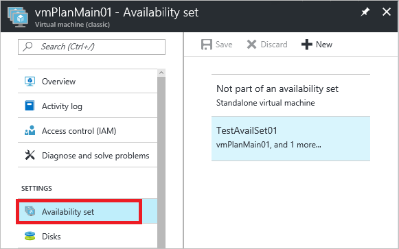
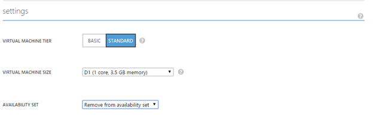



## Multi and Single Instance VMs
For many customers running on Azure, it is critical that they are able to schedule when their VMs undergo planned maintenance, since this results in ~15 minutes of downtime. You can leverage availability sets to help control when provisioned VMs receive planned maintenance.

There are two possible configurations for VMs running on Azure. VMs are either configured as multi-instance or single-instance. If VMs are in an availability set, then they are configured as multi-instance. Note, even single VMs can be deployed in an availability set and they will be treated as multi-instance. If VMs are NOT in an availability set, then they are configured as single-instance.  For details on availability sets, please see either [Manage the Availability of your Windows Virtual Machines](../articles/virtual-machines/virtual-machines-windows-manage-availability.md) or [Manage the Availability of your Linux Virtual Machines](../articles/virtual-machines/virtual-machines-linux-manage-availability.md).

Planned maintenance updates to single-instance and multi-instance VMs happen separately. By reconfiguring your VMs to be single-instance (if they are multi-instance) or to be multi-instance (if they are single-instance), you can control when their VMs receive the planned maintenance. Please see either [Planned maintenance for Azure Linux virtual machines](../articles/virtual-machines/virtual-machines-linux-planned-maintenance.md) or [Planned maintenance for Azure Windows virtual machines](../articles/virtual-machines/virtual-machines-windows-planned-maintenance.md) for details on planned maintenance for Azure VMs.

## For Multi-instance Configuration
You can select the time planned maintenance impacts your VMs that are deployed in an Availability Set configuration by removing these VMs from availability sets.

1.	An email will be sent to you 7 calendar days before the planned maintenance to your VMs in a Multi-instance configuration. The subscription IDs and names of the affected Multi-instance VMs will be included in the body of the email.

2.	During those 7 days, you can choose the time your instances are updated by removing your multi-instance VMs in that region from their availability set. This change in configuration will result in a reboot, as the Virtual Machine is moving from one physical host, targeted for maintenance, to another physical host that isn’t targeted for maintenance. 

3.	You can remove the VM from its availability set in the classic portal. 
   
    1.	In the Classic portal, click on the VM and then select “configure.” 

    2.	Under “settings”, you can see which Availability Set the VM is in.

        

    3.	In the availability set dropdown menu, select “remove from availability set.”

        

    4.	At the bottom, select “save.” Select “yes” to acknowledge that this action will restart the VM.

4.	These VMs will be moved to Single-Instance hosts and will not be updated during the planned maintenance to Availability Set Configurations.

5.	Once the update to Availability Set VMs is complete (according to schedule outlined in the original email), you should add the VMs back into their availability sets, and they will be re-configured as multi-instance VMs. Moving the VMs from Single-instance back to Multi-instance will result in a reboot. Typically, once all multi-instance updates are completed across the entire Azure environment, single-instance maintenance follows.

This can also be achieved using Azure PowerShell:

```
Get-AzureVM -ServiceName "<VmCloudServiceName>" -Name "<VmName>" | Remove-AzureAvailabilitySet | Update-AzureVM
```

## For Single-instance Configuration
You can select the time planned maintenance impacts you VMs in a Single-instance configuration by adding these VMs into availability sets.

Step-by-step

1.	An email will be sent to you 7 calendar days before the planned maintenance to VMs in a Single-instance configuration. The subscription IDs and names of the affected Single-Instance VMs will be included in the body of the email. 

2.	During those 7 days, you can choose the time your instance reboots by moving your Single-instance VMs by moving them into an availability set in that same region. This change in configuration will result in a reboot, as the Virtual Machine is moving from one physical host, targeted for maintenance, to another physical host that isn’t targeted for maintenance.

3.	Follow instructions here to add existing VMs into availability sets using the Classic Portal and Azure PowerShell (see Azure PowerShell sample in the note below).

4.	Once these VMs are re-configured as Multi-instance, they will be excluded from the planned maintenance to Single-instance VMs.

5.	Once the update to single-instance VMs is complete (according to schedule outlined in the original email), you can remove the VMs from their availability sets, and they will be re-configured as single-instance VMs.

This can also be achieved using Azure PowerShell:

    Get-AzureVM -ServiceName "<VmCloudServiceName>" -Name "<VmName>" | Set-AzureAvailabilitySet -AvailabilitySetName "<AvSetName>" | Update-AzureVM

<!--Anchors-->


<!--Link references-->
[Virtual Machines Manage Availability]: virtual-machines-windows-tutorial.md
[Understand planned versus unplanned maintenance]: virtual-machines-manage-availability.md#Understand-planned-versus-unplanned-maintenance/
