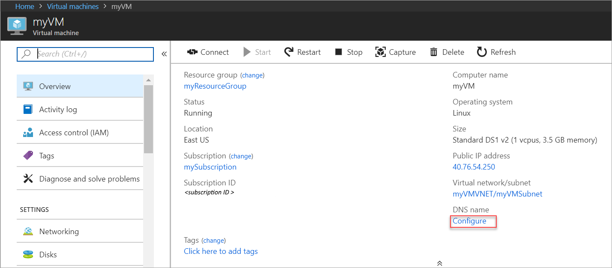
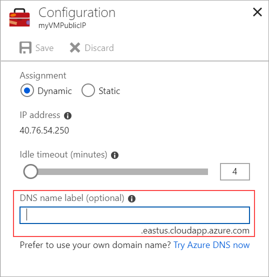

1. Select your VM in the portal. Under **DNS name**, click **Configure**.
   
   

2. Enter the desired DNS name and then select **Save**.
   
   

3. To return to the VM overview blade, close the *Public IP address* blade. Verify that the *DNS name* is now shown.
   

