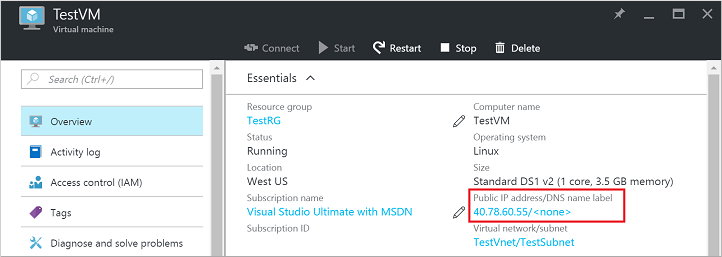
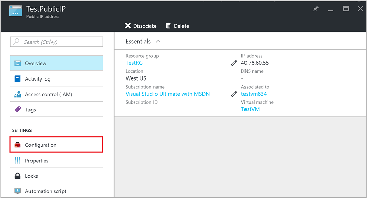
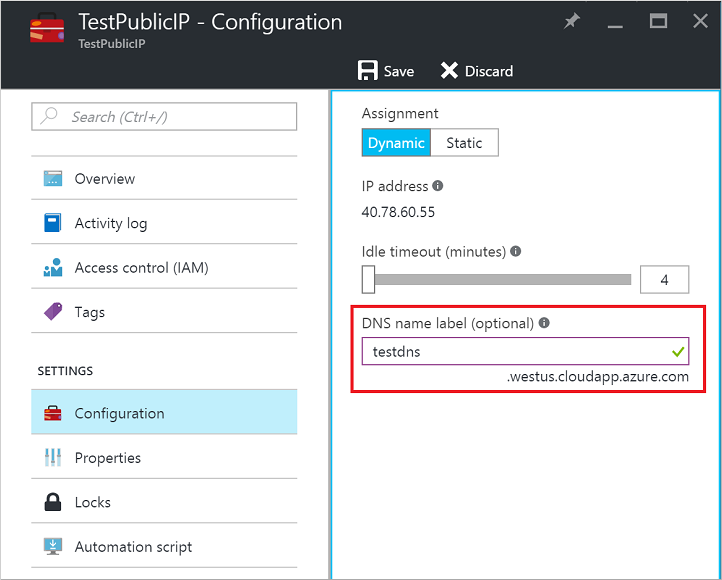
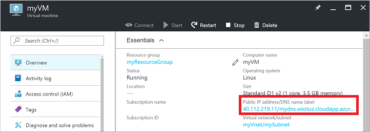

## Quick steps 

The article assumes that you have logged in to your subscription in the portal, and created a virtual machine with the available images using the Resource Manager deployment model. Follow these steps once your virtual machine starts running.

1.  View the virtual machine settings on the portal and click on the Public IP address.

    

2.  Note that the DNS name for the Public IP is blank. Click **All settings** for the Public IP blade.

    

3.  Open the **Configuration** tab in the Public IP Settings. Enter the desired DNS name label and **Save** this configuration.

    

    The Public IP resource will now show this new DNS label on its blade.

4.  Close the Public IP blades and go back to the virtual machine blade in the portal. Verify that the DNS name/FQDN appears next to the IP address for the Public IP resource.

    