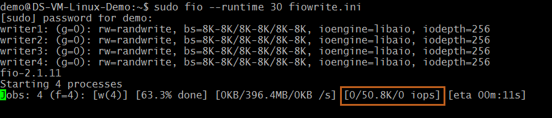

---
 title: include file
 description: include file
 services: virtual-machines
 author: roygara
 ms.service: virtual-machines
 ms.topic: include
 ms.date: 09/24/2018
 ms.author: rogarana
 ms.custom: include file
---

# Azure Premium Storage: Design for High Performance

This article provides guidelines for building high performance applications using Azure Premium Storage. You can use the instructions provided in this document combined with performance best practices applicable to technologies used by your application. To illustrate the guidelines, we have used SQL Server running on Premium Storage as an example throughout this document.

While we address performance scenarios for the Storage layer in this article, you will need to optimize the application layer. For example, if you are hosting a SharePoint Farm on Azure Premium Storage, you can use the SQL Server examples from this article to optimize the database server. Additionally, optimize the SharePoint Farm's Web server and Application server to get the most performance.

This article will help answer following common questions about optimizing application performance on Azure Premium Storage,

* How to measure your application performance?  
* Why are you not seeing expected high performance?  
* Which factors influence your application performance on Premium Storage?  
* How do these factors influence performance of your application on Premium Storage?  
* How can you optimize for IOPS, Bandwidth and Latency?  

We have provided these guidelines specifically for Premium Storage because workloads running on Premium Storage are highly performance sensitive. We have provided examples where appropriate. You can also apply some of these guidelines to applications running on IaaS VMs with Standard Storage disks.

Before you begin, if you are new to Premium Storage, first read the [Premium Storage: High-Performance Storage for Azure Virtual Machine Workloads](../articles/virtual-machines/windows/premium-storage.md) and [Azure Storage Scalability and Performance Targets](../articles/storage/common/storage-scalability-targets.md) articles.

## Application Performance Indicators

We assess whether an application is performing well or not using performance indicators like, how fast an application is processing a user request, how much data an application is processing per request, how many requests is an application processing in a specific period of time, how long a user has to wait to get a response after submitting their request. The technical terms for these performance indicators are, IOPS, Throughput or Bandwidth, and Latency.

In this section, we will discuss the common performance indicators in the context of Premium Storage. In the following section, Gathering Application Requirements, you will learn how to measure these performance indicators for your application. Later in Optimizing Application Performance, you will learn about the factors affecting these performance indicators and recommendations to optimize them.

## IOPS

IOPS is number of requests that your application is sending to the storage disks in one second. An input/output operation could be read or write, sequential or random. OLTP applications like an online retail website need to process many concurrent user requests immediately. The user requests are insert and update intensive database transactions, which the application must process quickly. Therefore, OLTP applications require very high IOPS. Such applications handle millions of small and random IO requests. If you have such an application, you must design the application infrastructure to optimize for IOPS. In the later section, *Optimizing Application Performance*, we discuss in detail all the factors that you must consider to get high IOPS.

When you attach a premium storage disk to your high scale VM, Azure provisions for you a guaranteed number of IOPS as per the disk specification. For example, a P50 disk provisions 7500 IOPS. Each high scale VM size also has a specific IOPS limit that it can sustain. For example, a Standard GS5 VM has 80,000 IOPS limit.

## Throughput

Throughput or Bandwidth is the amount of data that your application is sending to the storage disks in a specified interval. If your application is performing input/output operations with large IO unit sizes, it requires high Throughput. Data warehouse applications tend to issue scan intensive operations that access large portions of data at a time and commonly perform bulk operations. In other words, such applications require higher Throughput. If you have such an application, you must design its infrastructure to optimize for Throughput. In the next section, we discuss in detail the factors you must tune to achieve this.

When you attach a premium storage disk to a high scale VM, Azure provisions Throughput as per that disk specification. For example, a P50 disk provisions 250 MB per second disk Throughput. Each high scale VM size also has as specific Throughput limit that it can sustain. For example, Standard GS5 VM has a maximum throughput of 2,000 MB per second. 

There is a relation between Throughput and IOPS as shown in the formula below.


Therefore, it is important to determine the optimal Throughput and IOPS values that your application requires. As you try to optimize one, the other also gets affected. In a later section, *Optimizing Application Performance*, we will discuss in more details about optimizing IOPS and Throughput.

## Latency

Latency is the time it takes an application to receive a single request, send it to the storage disks and send the response to the client. This is a critical measure of an application's performance in addition to IOPS and Throughput. The Latency of a premium storage disk is the time it takes to retrieve the information for a request and communicate it back to your application. Premium Storage provides consistent low latencies. If you enable ReadOnly host caching on premium storage disks, you can get much lower read latency. We will discuss Disk Caching in more detail in later section on *Optimizing Application Performance*.

When you are optimizing your application to get higher IOPS and Throughput, it will affect the Latency of your application. After tuning the application performance, always evaluate the Latency of the application to avoid unexpected high latency behavior.

## Gather Application Performance Requirements

The first step in designing high performance applications running on Azure Premium Storage is, to understand the performance requirements of your application. After you gather performance requirements, you can optimize your application to achieve the most optimal performance.

In the previous section, we explained the common performance indicators, IOPS, Throughput and Latency. You must identify which of these performance indicators are critical to your application to deliver the desired user experience. For example, high IOPS matters most to OLTP applications processing millions of transactions in a second. Whereas, high Throughput is critical for Data Warehouse applications processing large amounts of data in a second. Extremely low Latency is crucial for real-time applications like live video streaming websites.

Next, measure the maximum performance requirements of your application throughout its lifetime. Use the sample checklist below as a start. Record the maximum performance requirements during normal, peak and off-hours workload periods. By identifying requirements for all workloads levels, you will be able to determine the overall performance requirement of your application. For example, the normal workload of an e-commerce website will be the transactions it serves during most days in a year. The peak workload of the website will be the transactions it serves during holiday season or special sale events. The peak workload is typically experienced for a limited period, but can require your application to scale two or more times its normal operation. Find out the 50 percentile, 90 percentile and 99 percentile requirements. This helps filter out any outliers in the performance requirements and you can focus your efforts on optimizing for the right values.

### Application Performance Requirements Checklist

| **Performance requirements** | **50 Percentile** | **90 Percentile** | **99  Percentile** |
| --- | --- | --- | --- |
| Max. Transactions per second | | | |
| % Read operations | | | |
| % Write operations | | | |
| % Random operations | | | |
| % Sequential operations | | | |
| IO request size | | | |
| Average Throughput | | | |
| Max. Throughput | | | |
| Min. Latency | | | |
| Average Latency | | | |
| Max. CPU | | | |
| Average CPU | | | |
| Max. Memory | | | |
| Average Memory | | | |
| Queue Depth | | | |

> [!NOTE]
> You should consider scaling these numbers based on expected future growth of your application. It is a good idea to plan for growth ahead of time, because it could be harder to change the infrastructure for improving performance later.

If you have an existing application and want to move to Premium Storage, first build the checklist above for the existing application. Then, build a prototype of your application on Premium Storage and design the application based on guidelines described in *Optimizing Application Performance* in a later section of this document. The next section describes the tools you can use to gather the performance measurements.

Create a checklist similar to your existing application for the prototype. Using Benchmarking tools you can simulate the workloads and measure performance on the prototype application. See the section on [Benchmarking](#benchmarking) to learn more. By doing so you can determine whether Premium Storage can match or surpass your application performance requirements. Then you can implement the same guidelines for your production application.

### Counters to measure application performance requirements

The best way to measure performance requirements of your application, is to use performance-monitoring tools provided by the operating system of the server. You can use PerfMon for Windows and iostat for Linux. These tools capture counters corresponding to each measure explained in the above section. You must capture the values of these counters when your application is running its normal, peak and off-hours workloads.

The PerfMon counters are available for processor, memory and, each logical disk and physical disk of your server. When you use premium storage disks with a VM, the physical disk counters are for each premium storage disk, and logical disk counters are for each volume created on the premium storage disks. You must capture the values for the disks that host your application workload. If there is a one to one mapping between logical and physical disks, you can refer to physical disk counters; otherwise refer to the logical disk counters. On Linux, the iostat command generates a CPU and disk utilization report. The disk utilization report provides statistics per physical device or partition. If you have a database server with its data and log on separate disks, collect this data for both disks. Below table describes counters for disks, processor and memory:

| Counter | Description | PerfMon | Iostat |
| --- | --- | --- | --- |
| **IOPS or Transactions per second** |Number of I/O requests issued to the storage disk per second. |Disk Reads/sec <br> Disk Writes/sec |tps <br> r/s <br> w/s |
| **Disk Reads and Writes** |% of Reads and Write operations performed on the disk. |% Disk Read Time <br> % Disk Write Time |r/s <br> w/s |
| **Throughput** |Amount of data read from or written to the disk per second. |Disk Read Bytes/sec <br> Disk Write Bytes/sec |kB_read/s <br> kB_wrtn/s |
| **Latency** |Total time to complete a disk IO request. |Average Disk sec/Read <br> Average disk sec/Write |await <br> svctm |
| **IO size** |The size of I/O requests issues to the storage disks. |Average Disk Bytes/Read <br> Average Disk Bytes/Write |avgrq-sz |
| **Queue Depth** |Number of outstanding I/O requests waiting to be read from or written to the storage disk. |Current Disk Queue Length |avgqu-sz |
| **Max. Memory** |Amount of memory required to run application smoothly |% Committed Bytes in Use |Use vmstat |
| **Max. CPU** |Amount CPU required to run application smoothly |% Processor time |%util |

Learn more about [iostat](https://linux.die.net/man/1/iostat) and [PerfMon](https://msdn.microsoft.com/library/aa645516.aspx).

## Optimizing Application Performance

The main factors that influence performance of an application running on Premium Storage are Nature of IO Requests, VM size, Disk size, Number of disks, Disk Caching, Multithreading and Queue Depth. You can control some of these factors with knobs provided by the system. Most applications may not give you an option to alter the IO size and Queue Depth directly. For example, if you are using SQL Server, you cannot choose the IO size and queue depth. SQL Server chooses the optimal IO size and queue depth values to get the most performance. It is important to understand the effects of both types of factors on your application performance, so that you can provision appropriate resources to meet performance needs.

Throughout this section, refer to the application requirements checklist that you created, to identify how much you need to optimize your application performance. Based on that, you will be able to determine which factors from this section you will need to tune. To witness the effects of each factor on your application performance, run benchmarking tools on your application setup. Refer to the [Benchmarking](#Benchmarking) section at the end of this article for steps to run common benchmarking tools on Windows and Linux VMs.

### Optimizing IOPS, Throughput and Latency at a glance

The table below summarizes performance factors and the steps necessary to optimize IOPS, throughput and latency. The sections following this summary will describe each factor is much more depth.

For more information on VM sizes and on the IOPS, throughput, and latency available for each type of VM, see [Linux VM sizes](../articles/virtual-machines/linux/sizes.md) or [Windows VM sizes](../articles/virtual-machines/windows/sizes.md).

| &nbsp; | **IOPS** | **Throughput** | **Latency** |
| --- | --- | --- | --- |
| **Example Scenario** |Enterprise OLTP application requiring very high transactions per second rate. |Enterprise Data warehousing application processing large amounts of data. |Near real-time applications requiring instant responses to user requests, like online gaming. |
| Performance factors | &nbsp; | &nbsp; | &nbsp; |
| **IO size** |Smaller IO size yields higher IOPS. |Larger IO size to yields higher Throughput. | &nbsp;|
| **VM size** |Use a VM size that offers IOPS greater than your application requirement. |Use a VM size with throughput limit greater than your application requirement. |Use a VM size that offers scale limits greater than your application requirement. |
| **Disk size** |Use a disk size that offers IOPS greater than your application requirement. |Use a disk size with Throughput limit greater than your application requirement. |Use a disk size that offers scale limits greater than your application requirement. |
| **VM and Disk Scale Limits** |IOPS limit of the VM size chosen should be greater than total IOPS driven by premium storage disks attached to it. |Throughput limit of the VM size chosen should be greater than total Throughput driven by premium storage disks attached to it. |Scale limits of the VM size chosen must be greater than total scale limits of attached premium storage disks. |
| **Disk Caching** |Enable ReadOnly Cache on premium storage disks with Read heavy operations to get higher Read IOPS. | &nbsp; |Enable ReadOnly Cache on premium storage disks with Ready heavy operations to get very low Read latencies. |
| **Disk Striping** |Use multiple disks and stripe them together to get a combined higher IOPS and Throughput limit. Note that the combined limit per VM should be higher than the combined limits of attached premium disks. | &nbsp; | &nbsp; |
| **Stripe Size** |Smaller stripe size for random small IO pattern seen in OLTP applications. E.g., use stripe size of 64KB for SQL Server OLTP application. |Larger stripe size for sequential large IO pattern seen in Data Warehouse applications. E.g., use 256KB stripe size for SQL Server Data warehouse application. | &nbsp; |
| **Multithreading** |Use multithreading to push higher number of requests to Premium Storage that will lead to higher IOPS and Throughput. For example, on SQL Server set a high MAXDOP value to allocate more CPUs to SQL Server. | &nbsp; | &nbsp; |
| **Queue Depth** |Larger Queue Depth yields higher IOPS. |Larger Queue Depth yields higher Throughput. |Smaller Queue Depth yields lower latencies. |

## Nature of IO Requests

An IO request is a unit of input/output operation that your application will be performing. Identifying the nature of IO requests, random or sequential, read or write, small or large, will help you determine the performance requirements of your application. It is very important to understand the nature of IO requests, to make the right decisions when designing your application infrastructure.

IO size is one of the more important factors. The IO size is the size of the input/output operation request generated by your application. The IO size has a significant impact on performance especially on the IOPS and Bandwidth that the application is able to achieve. The following formula shows the relationship between IOPS, IO size and Bandwidth/Throughput.  
    

Some applications allow you to alter their IO size, while some applications do not. For example, SQL Server determines the optimal IO size itself, and does not provide users with any knobs to change it. On the other hand, Oracle provides a parameter called [DB\_BLOCK\_SIZE](https://docs.oracle.com/cd/B19306_01/server.102/b14211/iodesign.htm#i28815) using which you can configure the I/O request size of the database.

If you are using an application, which does not allow you to change the IO size, use the guidelines in this article to optimize the performance KPI that is most relevant to your application. For example,

* An OLTP application generates millions of small and random IO requests. To handle these type of IO requests, you must design your application infrastructure to get higher IOPS.  
* A data warehousing application generates large and sequential IO requests. To handle these type of IO requests, you must design your application infrastructure to get higher Bandwidth or Throughput.

If you are using an application, which allows you to change the IO size, use this rule of thumb for the IO size in addition to other performance guidelines,

* Smaller IO size to get higher IOPS. For example, 8 KB for an OLTP application.  
* Larger IO size to get higher Bandwidth/Throughput. For example, 1024 KB for a data warehouse application.

Here is an example on how you can calculate the IOPS and Throughput/Bandwidth for your application. Consider an application using a P30 disk. The maximum IOPS and Throughput/Bandwidth a P30 disk can achieve is 5000 IOPS and 200 MB per second respectively. Now, if your application requires the maximum IOPS from the P30 disk and you use a smaller IO size like 8 KB, the resulting Bandwidth you will be able to get is 40 MB per second. However, if your application requires the maximum Throughput/Bandwidth from P30 disk, and you use a larger IO size like 1024 KB, the resulting IOPS will be less, 200 IOPS. Therefore, tune the IO size such that it meets both your application's IOPS and Throughput/Bandwidth requirement. Table below summarizes the different IO sizes and their corresponding IOPS and Throughput for a P30 disk.

| Application Requirement | I/O size | IOPS | Throughput/Bandwidth |
| --- | --- | --- | --- |
| Max IOPS |8 KB |5,000 |40 MB per second |
| Max Throughput |1024 KB |200 |200 MB per second |
| Max Throughput + high IOPS |64 KB |3,200 |200 MB per second |
| Max IOPS + high Throughput |32 KB |5,000 |160 MB per second |

To get IOPS and Bandwidth higher than the maximum value of a single premium storage disk, use multiple premium disks striped together. For example, stripe two P30 disks to get a combined IOPS of 10,000 IOPS or a combined Throughput of 400 MB per second. As explained in the next section, you must use a VM size that supports the combined disk IOPS and Throughput.

> [!NOTE]
> As you increase either IOPS or Throughput the other also increases, make sure you do not hit throughput or IOPS limits of the disk or VM when increasing either one.

To witness the effects of IO size on application performance, you can run benchmarking tools on your VM and disks. Create multiple test runs and use different IO size for each run to see the impact. Refer to the [Benchmarking](#Benchmarking) section at the end of this article for more details.

## High Scale VM Sizes

When you start designing an application, one of the first things to do is, choose a VM to host your application. Premium Storage comes with High Scale VM sizes that can run applications requiring higher compute power and a high local disk I/O performance. These VMs provide faster processors, a higher memory-to-core ratio, and a Solid-State Drive (SSD) for the local disk. Examples of High Scale VMs supporting Premium Storage are the DS, DSv2 and GS series VMs.

High Scale VMs are available in different sizes with a different number of CPU cores, memory, OS and temporary disk size. Each VM size also has maximum number of data disks that you can attach to the VM. Therefore, the chosen VM size will affect how much processing, memory, and storage capacity is available for your application. It also affects the Compute and Storage cost. For example, below are the specifications of the largest VM size in a DS series, DSv2 series and a GS series:

| VM size | CPU cores | Memory | VM disk sizes | Max. data disks | Cache size | IOPS | Bandwidth Cache IO limits |
| --- | --- | --- | --- | --- | --- | --- | --- |
| Standard_DS14 |16 |112 GB |OS = 1023 GB <br> Local SSD = 224 GB |32 |576 GB |50,000 IOPS <br> 512 MB per second |4,000 IOPS and 33 MB per second |
| Standard_GS5 |32 |448 GB |OS = 1023 GB <br> Local SSD = 896 GB |64 |4224 GB |80,000 IOPS <br> 2,000 MB per second |5,000 IOPS and 50 MB per second |

To view a complete list of all available Azure VM sizes, refer to [Windows VM sizes](../articles/virtual-machines/windows/sizes.md) or [Linux VM sizes](../articles/virtual-machines/linux/sizes.md). Choose a VM size that can meet and scale to your desired application performance requirements. In addition to this, take into account following important considerations when choosing VM sizes.

*Scale Limits*  
The maximum IOPS limits per VM and per disk are different and independent of each other. Make sure that the application is driving IOPS within the limits of the VM as well as the premium disks attached to it. Otherwise, application performance will experience throttling.

As an example, suppose an application requirement is a maximum of 4,000 IOPS. To achieve this, you provision a P30 disk on a DS1 VM. The P30 disk can deliver up to 5,000 IOPS. However, the DS1 VM is limited to 3,200 IOPS. Consequently, the application performance will be constrained by the VM limit at 3,200 IOPS and there will be degraded performance. To prevent this situation, choose a VM and disk size that will both meet application requirements.

*Cost of Operation*  
In many cases, it is possible that your overall cost of operation using Premium Storage is lower than using Standard Storage.

For example, consider an application requiring 16,000 IOPS. To achieve this performance, you will need a Standard\_D14 Azure IaaS VM, which can give a maximum IOPS of 16,000 using 32 standard storage 1TB disks. Each 1TB standard storage disk can achieve a maximum of 500 IOPS. The estimated cost of this VM per month will be $1,570. The monthly cost of 32 standard storage disks will be $1,638. The estimated total monthly cost will be $3,208.

However, if you hosted the same application on Premium Storage, you will need a smaller VM size and fewer premium storage disks, thus reducing the overall cost. A Standard\_DS13 VM can meet the 16,000 IOPS requirement using four P30 disks. The DS13 VM has a maximum IOPS of 25,600 and each P30 disk has a maximum IOPS of 5,000. Overall, this configuration can achieve 5,000 x 4 = 20,000 IOPS. The estimated cost of this VM per month will be $1,003. The monthly cost of four P30 premium storage disks will be $544.34. The estimated total monthly cost will be $1,544.

Table below summarizes the cost breakdown of this scenario for Standard and Premium Storage.

| &nbsp; | **Standard** | **Premium** |
| --- | --- | --- |
| **Cost of VM per month** |$1,570.58 (Standard\_D14) |$1,003.66 (Standard\_DS13) |
| **Cost of Disks per month** |$1,638.40 (32 x 1 TB disks) |$544.34 (4 x P30 disks) |
| **Overall Cost per month** |$3,208.98 |$1,544.34 |

*Linux Distros*  

With Azure Premium Storage, you get the same level of Performance for VMs running Windows and Linux. We support many flavors of Linux distros, and you can see the complete list [here](../articles/virtual-machines/linux/endorsed-distros.md?toc=%2fazure%2fvirtual-machines%2flinux%2ftoc.json). It is important to note that different distros are better suited for different types of workloads. You will see different levels of performance depending on the distro your workload is running on. Test the Linux distros with your application and choose the one that works best.

When running Linux with Premium Storage, check the latest updates about required drivers to ensure high performance.

## Premium Storage Disk Sizes

Azure Premium Storage offers eight GA disk sizes and three disk sizes which are in preview, currently. Each disk size has a different scale limit for IOPS, Bandwidth and Storage. Choose the right Premium Storage Disk size depending on the application requirements and the high scale VM size. The table below shows the eleven disks sizes and their capabilities. P4, P6, P15, P60, P70, and P80 sizes are currently only supported for Managed Disks.

| Premium Disks Type  | P4    | P6    | P10   | P15 | P20   | P30   | P40   | P50   | P60   | P70   | P80   |
|---------------------|-------|-------|-------|-------|-------|-------|-------|-------|-------|-------|-------|
| Disk size           | 32 GiB | 64 GiB | 128 GiB| 256 GiB| 512 GB            | 1,024 GiB (1 TiB)    | 2,048 GiB (2 TiB)    | 4,095 GiB (4 TiB)    | 8,192 GiB (8 TiB)    | 16,384 GiB (16 TiB)    | 32,767 GiB (32 GiB)    |
| IOPS per disk       | 120   | 240   | 500   | 1100 | 2300              | 5000              | 7500              | 7500              | 12,500              | 15,000              | 20,000              |
| Throughput per disk | 25 MiB per second  | 50 MiB per second  | 100 MiB per second |125 MiB per second | 150 MiB per second | 200 MiB per second | 250 MiB per second | 250 MiB per second | 480 MiB per second | 750 MiB per second | 750 MiB per second |

How many disks you choose depends on the disk size chosen. You could use a single P50 disk or multiple P10 disks to meet your application requirement. Take into account considerations listed below when making the choice.

*Scale Limits (IOPS and Throughput)*  
The IOPS and Throughput limits of each Premium disk size is different and independent from the VM scale limits. Make sure that the total IOPS and Throughput from the disks are within scale limits of the chosen VM size.

For example, if an application requirement is a maximum of 250 MB/sec Throughput and you are using a DS4 VM with a single P30 disk. The DS4 VM can give up to 256 MB/sec Throughput. However, a single P30 disk has Throughput limit of 200 MB/sec. Consequently, the application will be constrained at 200 MB/sec due to the disk limit. To overcome this limit, provision more than one data disks to the VM or resize your disks to P40 or P50.

> [!NOTE]
> Reads served by the cache are not included in the disk IOPS and Throughput, hence not subject to disk limits. Cache has its separate IOPS and Throughput limit per VM.
>
> For example, initially your reads and writes are 60MB/sec and 40MB/sec respectively. Over time, the cache warms up and serves more and more of the reads from the cache. Then, you can get higher write Throughput from the disk.

*Number of Disks*  
Determine the number of disks you will need by assessing application requirements. Each VM size also has a limit on the number of disks that you can attach to the VM. Typically, this is twice the number of cores. Ensure that the VM size you choose can support the number of disks needed.

Remember, the Premium Storage disks have higher performance capabilities compared to Standard Storage disks. Therefore, if you are migrating your application from Azure IaaS VM using Standard Storage to Premium Storage, you will likely need fewer premium disks to achieve the same or higher performance for your application.

## Disk Caching

High Scale VMs that leverage Azure Premium Storage have a multi-tier caching technology called BlobCache. BlobCache uses a combination of the Virtual Machine RAM and local SSD for caching. This cache is available for the Premium Storage persistent disks and the VM local disks. By default, this cache setting is set to Read/Write for OS disks and ReadOnly for data disks hosted on Premium Storage. With disk caching enabled on the Premium Storage disks, the high scale VMs can achieve extremely high levels of performance that exceed the underlying disk performance.

> [!WARNING]
> Disk Caching is only supported for disk sizes up to 4 TiB.
> Changing the cache setting of an Azure disk detaches and re-attaches the target disk. If it is the operating system disk, the VM is restarted. Stop all applications/services that might be affected by this disruption before changing the disk cache setting.

To learn more about how BlobCache works, refer to the Inside [Azure Premium Storage](https://azure.microsoft.com/blog/azure-premium-storage-now-generally-available-2/) blog post.

It is important to enable cache on the right set of disks. Whether you should enable disk caching on a premium disk or not will depend on the workload pattern that disk will be handling. Table below shows the default cache settings for OS and Data disks.

| **Disk Type** | **Default Cache Setting** |
| --- | --- |
| OS disk |ReadWrite |
| Data disk |ReadOnly |

Following are the recommended disk cache settings for data disks,

| **Disk Caching Setting** | **Recommendation on when to use this setting** |
| --- | --- |
| None |Configure host-cache as None for write-only and write-heavy disks. |
| ReadOnly |Configure host-cache as ReadOnly for read-only and read-write disks. |
| ReadWrite |Configure host-cache as ReadWrite only if your application properly  handles writing cached data to persistent disks when needed. |

*ReadOnly*  
By configuring ReadOnly caching on Premium Storage data disks, you can achieve low Read latency and get very high Read IOPS and Throughput for your application. This is due two reasons,

1. Reads performed from cache, which is on the VM memory and local SSD, are much faster than reads from the data disk, which is on the Azure blob storage.  
1. Premium Storage does not count the Reads served from cache, towards the disk IOPS and Throughput. Therefore, your application is able to achieve higher total IOPS and Throughput.

*ReadWrite*  
By default, the OS disks have ReadWrite caching enabled. We have recently added support for ReadWrite caching on data disks as well. If you are using ReadWrite caching, you must have a proper way to write the data from cache to persistent disks. For example, SQL Server handles writing cached data to the persistent storage disks on its own. Using ReadWrite cache with an application that does not handle persisting the required data can lead to data loss, if the VM crashes.

As an example, you can apply these guidelines to SQL Server running on Premium Storage by doing the following,

1. Configure "ReadOnly" cache on premium storage disks hosting data files.  
   a.  The fast reads from cache lower the SQL Server query time since data pages are retrieved much faster from the cache compared to directly from the data disks.  
   b.  Serving reads from cache, means there is additional Throughput available from premium data disks. SQL Server can use this additional Throughput towards retrieving more data pages and other operations like backup/restore, batch loads, and index rebuilds.  
1. Configure "None" cache on premium storage disks hosting the log files.  
   a.  Log files have primarily write-heavy operations. Therefore, they do not benefit from the ReadOnly cache.

## Disk Striping

When a high scale VM is attached with several premium storage persistent disks, the disks can be striped together to aggregate their IOPs, bandwidth, and storage capacity.

On Windows, you can use Storage Spaces to stripe disks together. You must configure one column for each disk in a pool. Otherwise, the overall performance of striped volume can be lower than expected, due to uneven distribution of traffic across the disks.

Important: Using Server Manager UI, you can set the total number of columns up to 8 for a striped volume. When attaching more than 8 disks, use PowerShell to create the volume. Using PowerShell, you can set the number of columns equal to the number of disks. For example, if there are 16 disks in a single stripe set; specify 16 columns in the *NumberOfColumns* parameter of the *New-VirtualDisk* PowerShell cmdlet.

On Linux, use the MDADM utility to stripe disks together. For detailed steps on striping disks on Linux refer to [Configure Software RAID on Linux](../articles/virtual-machines/linux/configure-raid.md).

*Stripe Size*  
An important configuration in disk striping is the stripe size. The stripe size or block size is the smallest chunk of data that application can address on a striped volume. The stripe size you configure depends on the type of application and its request pattern. If you choose the wrong stripe size, it could lead to IO misalignment, which leads to degraded performance of your application.

For example, if an IO request generated by your application is bigger than the disk stripe size, the storage system writes it across stripe unit boundaries on more than one disk. When it is time to access that data, it will have to seek across more than one stripe units to complete the request. The cumulative effect of such behavior can lead to substantial performance degradation. On the other hand, if the IO request size is smaller than stripe size, and if it is random in nature, the IO requests may add up on the same disk causing a bottleneck and ultimately degrading the IO performance.

Depending on the type of workload your application is running, choose an appropriate stripe size. For random small IO requests, use a smaller stripe size. Whereas, for large sequential IO requests use a larger stripe size. Find out the stripe size recommendations for the application you will be running on Premium Storage. For SQL Server, configure stripe size of 64KB for OLTP workloads and 256KB for data warehousing workloads. See [Performance best practices for SQL Server on Azure VMs](../articles/virtual-machines/windows/sql/virtual-machines-windows-sql-performance.md#disks-guidance) to learn more.

> [!NOTE]
> You can stripe together a maximum of 32 premium storage disks on a DS series VM and 64 premium storage disks on a GS series VM.

## Multi-threading

Azure has designed Premium Storage platform to be massively parallel. Therefore, a multi-threaded application achieves much higher performance than a single-threaded application. A multi-threaded application splits up its tasks across multiple threads and increases efficiency of its execution by utilizing the VM and disk resources to the maximum.

For example, if your application is running on a single core VM using two threads, the CPU can switch between the two threads to achieve efficiency. While one thread is waiting on a disk IO to complete, the CPU can switch to the other thread. In this way, two threads can accomplish more than a single thread would. If the VM has more than one core, it further decreases running time since each core can execute tasks in parallel.

You may not be able to change the way an off-the-shelf application implements single threading or multi-threading. For example, SQL Server is capable of handling multi-CPU and multi-core. However, SQL Server decides under what conditions it will leverage one or more threads to process a query. It can run queries and build indexes using multi-threading. For a query that involves joining large tables and sorting data before returning to the user, SQL Server will likely use multiple threads. However, a user cannot control whether SQL Server executes a query using a single thread or multiple threads.

There are configuration settings that you can alter to influence this multi-threading or parallel processing of an application. For example, in case of SQL Server it is the maximum Degree of Parallelism configuration. This setting called MAXDOP, allows you to configure the maximum number of processors SQL Server can use when parallel processing. You can configure MAXDOP for individual queries or index operations. This is beneficial when you want to balance resources of your system for a performance critical application.

For example, say your application using SQL Server is executing a large query and an index operation at the same time. Let us assume that you wanted the index operation to be more performant compared to the large query. In such a case, you can set MAXDOP value of the index operation to be higher than the MAXDOP value for the query. This way, SQL Server has more number of processors that it can leverage for the index operation compared to the number of processors it can dedicate to the large query. Remember, you do not control the number of threads SQL Server will use for each operation. You can control the maximum number of processors being dedicated for multi-threading.

Learn more about [Degrees of Parallelism](https://technet.microsoft.com/library/ms188611.aspx) in SQL Server. Find out such settings that influence multi-threading in your application and their configurations to optimize performance.

## Queue Depth

The Queue Depth or Queue Length or Queue Size is the number of pending IO requests in the system. The value of Queue Depth determines how many IO operations your application can line up, which the storage disks will be processing. It affects all the three application performance indicators that we discussed in this article viz., IOPS, Throughput and Latency.

Queue Depth and multi-threading are closely related. The Queue Depth value indicates how much multi-threading can be achieved by the application. If the Queue Depth is large, application can execute more operations concurrently, in other words, more multi-threading. If the Queue Depth is small, even though application is multi-threaded, it will not have enough requests lined up for concurrent execution.

Typically, off the shelf applications do not allow you to change the queue depth, because if set incorrectly it will do more harm than good. Applications will set the right value of queue depth to get the optimal performance. However, it is important to understand this concept so that you can troubleshoot performance issues with your application. You can also observe the effects of queue depth by running benchmarking tools on your system.

Some applications provide settings to influence the Queue Depth. For example, the MAXDOP (maximum degree of parallelism) setting in SQL Server explained in previous section. MAXDOP is a way to influence Queue Depth and multi-threading, although it does not directly change the Queue Depth value of SQL Server.

*High Queue Depth*  
A high queue depth lines up more operations on the disk. The disk knows the next request in its queue ahead of time. Consequently, the disk can schedule operations ahead of time and process them in an optimal sequence. Since the application is sending more requests to the disk, the disk can process more parallel IOs. Ultimately, the application will be able to achieve higher IOPS. Since application is processing more requests, the total Throughput of the application also increases.

Typically, an application can achieve maximum Throughput with 8-16+ outstanding IOs per attached disk. If a Queue Depth is one, application is not pushing enough IOs to the system, and it will process less amount of in a given period. In other words, less Throughput.

For example, in SQL Server, setting the MAXDOP value for a query to "4" informs SQL Server that it can use up to four cores to execute the query. SQL Server will determine what is best queue depth value and the number of cores for the query execution.

*Optimal Queue Depth*  
Very high queue depth value also has its drawbacks. If queue depth value is too high, the application will try to drive very high IOPS. Unless application has persistent disks with sufficient provisioned IOPS, this can negatively affect application latencies. Following formula shows the relationship between IOPS, Latency and Queue Depth.  
    

You should not configure Queue Depth to any high value, but to an optimal value, which can deliver enough IOPS for the application without affecting latencies. For example, if the application latency needs to be 1 millisecond, the Queue Depth required to achieve 5,000 IOPS is, QD = 5000 x 0.001 = 5.

*Queue Depth for Striped Volume*  
For a striped volume, maintain a high enough queue depth such that, every disk has a peak queue depth individually. For example, consider an application that pushes a queue depth of 2 and there are 4 disks in the stripe. The two IO requests will go to two disks and remaining two disks will be idle. Therefore, configure the queue depth such that all the disks can be busy. Formula below shows how to determine the queue depth of striped volumes.  
    

## Throttling

Azure Premium Storage provisions specified number of IOPS and Throughput depending on the VM sizes and disk sizes you choose. Anytime your application tries to drive IOPS or Throughput above these limits of what the VM or disk can handle, Premium Storage will throttle it. This manifests in the form of degraded performance in your application. This can mean higher latency, lower Throughput or lower IOPS. If Premium Storage does not throttle, your application could completely fail by exceeding what its resources are capable of achieving. So, to avoid performance issues due to throttling, always provision sufficient resources for your application. Take into consideration what we discussed in the VM sizes and Disk sizes sections above. Benchmarking is the best way to figure out what resources you will need to host your application.

## Benchmarking

Benchmarking is the process of simulating different workloads on your application and measuring the application performance for each workload. Using the steps described in an earlier section, you have gathered the application performance requirements. By running benchmarking tools on the VMs hosting the application, you can determine the performance levels that your application can achieve with Premium Storage. In this section, we provide you examples of benchmarking a Standard DS14 VM provisioned with Azure Premium Storage disks.

We have used common benchmarking tools Iometer and FIO, for Windows and Linux respectively. These tools spawn multiple threads simulating a production like workload, and measure the system performance. Using the tools you can also configure parameters like block size and queue depth, which you normally cannot change for an application. This gives you more flexibility to drive the maximum performance on a high scale VM provisioned with premium disks for different types of application workloads. To learn more about each benchmarking tool visit [Iometer](http://www.iometer.org/) and [FIO](http://freecode.com/projects/fio).

To follow the examples below, create a Standard DS14 VM and attach 11 Premium Storage disks to the VM. Of the 11 disks, configure 10 disks with host caching as "None" and stripe them into a volume called NoCacheWrites. Configure host caching as "ReadOnly" on the remaining disk and create a volume called CacheReads with this disk. Using this setup, you will be able to see the maximum Read and Write performance from a Standard DS14 VM. For detailed steps about creating a DS14 VM with premium disks, go to [Create and use a Premium Storage account for a virtual machine data disk](../articles/virtual-machines/windows/premium-storage.md).

*Warming up the Cache*  
The disk with ReadOnly host caching will be able to give higher IOPS than the disk limit. To get this maximum read performance from the host cache, first you must warm up the cache of this disk. This ensures that the Read IOs which benchmarking tool will drive on CacheReads volume actually hits the cache and not the disk directly. The cache hits result in additional IOPS from the single cache enabled disk.

> **Important:**  
> You must warm up the cache before running benchmarking, every time VM is rebooted.

#### Iometer

[Download the Iometer tool](http://sourceforge.net/projects/iometer/files/iometer-stable/2006-07-27/iometer-2006.07.27.win32.i386-setup.exe/download) on the VM.

*Test file*  
Iometer uses a test file that is stored on the volume on which you will run the benchmarking test. It drives Reads and Writes on this test file to measure the disk IOPS and Throughput. Iometer creates this test file if you have not provided one. Create a 200GB test file called iobw.tst on the CacheReads and NoCacheWrites volumes.

*Access Specifications*  
The specifications, request IO size, % read/write, % random/sequential are configured using the "Access Specifications" tab in Iometer. Create an access specification for each of the scenarios described below. Create the access specifications and "Save" with an appropriate name like – RandomWrites\_8K, RandomReads\_8K. Select the corresponding specification when running the test scenario.

An example of access specifications for maximum Write IOPS scenario is shown below,  
    

*Maximum IOPS Test Specifications*  
To demonstrate maximum IOPs, use smaller request size. Use 8K request size and create specifications for Random Writes and Reads.

| Access Specification | Request size | Random % | Read % |
| --- | --- | --- | --- |
| RandomWrites\_8K |8K |100 |0 |
| RandomReads\_8K |8K |100 |100 |

*Maximum Throughput Test Specifications*  
To demonstrate maximum Throughput, use larger request size. Use 64K request size and create specifications for Random Writes and Reads.

| Access Specification | Request size | Random % | Read % |
| --- | --- | --- | --- |
| RandomWrites\_64K |64K |100 |0 |
| RandomReads\_64K |64K |100 |100 |

*Running the Iometer Test*  
Perform the steps below to warm up cache

1. Create two access specifications with values shown below,

   | Name | Request size | Random % | Read % |
   | --- | --- | --- | --- |
   | RandomWrites\_1MB |1MB |100 |0 |
   | RandomReads\_1MB |1MB |100 |100 |
1. Run the Iometer test for initializing cache disk with following parameters. Use three worker threads for the target volume and a queue depth of 128. Set the "Run time" duration of the test to 2hrs on the "Test Setup" tab.

   | Scenario | Target Volume | Name | Duration |
   | --- | --- | --- | --- |
   | Initialize Cache Disk |CacheReads |RandomWrites\_1MB |2hrs |
1. Run the Iometer test for warming up cache disk with following parameters. Use three worker threads for the target volume and a queue depth of 128. Set the "Run time" duration of the test to 2hrs on the "Test Setup" tab.

   | Scenario | Target Volume | Name | Duration |
   | --- | --- | --- | --- |
   | Warm up Cache Disk |CacheReads |RandomReads\_1MB |2hrs |

After cache disk is warmed up, proceed with the test scenarios listed below. To run the Iometer test, use at least three worker threads for **each** target volume. For each worker thread, select the target volume, set queue depth and select one of the saved test specifications, as shown in the table below, to run the corresponding test scenario. The table also shows expected results for IOPS and Throughput when running these tests. For all scenarios, a small IO size of 8KB and a high queue depth of 128 is used.

| Test Scenario | Target Volume | Name | Result |
| --- | --- | --- | --- |
| Max. Read IOPS |CacheReads |RandomWrites\_8K |50,000 IOPS |
| Max. Write IOPS |NoCacheWrites |RandomReads\_8K |64,000 IOPS |
| Max. Combined IOPS |CacheReads |RandomWrites\_8K |100,000 IOPS |
| NoCacheWrites |RandomReads\_8K | &nbsp; | &nbsp; |
| Max. Read MB/sec |CacheReads |RandomWrites\_64K |524 MB/sec |
| Max. Write MB/sec |NoCacheWrites |RandomReads\_64K |524 MB/sec |
| Combined MB/sec |CacheReads |RandomWrites\_64K |1000 MB/sec |
| NoCacheWrites |RandomReads\_64K | &nbsp; | &nbsp; |

Below are screenshots of the Iometer test results for combined IOPS and Throughput scenarios.

*Combined Reads and Writes Maximum IOPS*  


*Combined Reads and Writes Maximum Throughput*  


### FIO

FIO is a popular tool to benchmark storage on the Linux VMs. It has the flexibility to select different IO sizes, sequential or random reads and writes. It spawns worker threads or processes to perform the specified I/O operations. You can specify the type of I/O operations each worker thread must perform using job files. We created one job file per scenario illustrated in the examples below. You can change the specifications in these job files to benchmark different workloads running on Premium Storage. In the examples, we are using a Standard DS 14 VM running **Ubuntu**. Use the same setup described in the beginning of the [Benchmarking section](#Benchmarking) and warm up the cache before running the benchmarking tests.

Before you begin, [download FIO](https://github.com/axboe/fio) and install it on your virtual machine.

Run the following command for Ubuntu,

```
apt-get install fio
```

We will use four worker threads for driving Write operations and four worker threads for driving Read operations on the disks. The Write workers will be driving traffic on the "nocache" volume, which has 10 disks with cache set to "None". The Read workers will be driving traffic on the "readcache" volume, which has 1 disk with cache set to "ReadOnly".

*Maximum Write IOPS*  
Create the job file with following specifications to get maximum Write IOPS. Name it "fiowrite.ini".

```
[global]
size=30g
direct=1
iodepth=256
ioengine=libaio
bs=8k

[writer1]
rw=randwrite
directory=/mnt/nocache
[writer2]
rw=randwrite
directory=/mnt/nocache
[writer3]
rw=randwrite
directory=/mnt/nocache
[writer4]
rw=randwrite
directory=/mnt/nocache
```

Note the follow key things that are in line with the design guidelines discussed in previous sections. These specifications are essential to drive maximum IOPS,  

* A high queue depth of 256.  
* A small block size of 8KB.  
* Multiple threads performing random writes.

Run the following command to kick off the FIO test for 30 seconds,  

```
sudo fio --runtime 30 fiowrite.ini
```

While the test runs, you will be able to see the number of write IOPS the VM and Premium disks are delivering. As shown in the sample below, the DS14 VM is delivering its maximum write IOPS limit of 50,000 IOPS.  
    

*Maximum Read IOPS*  
Create the job file with following specifications to get maximum Read IOPS. Name it "fioread.ini".

```
[global]
size=30g
direct=1
iodepth=256
ioengine=libaio
bs=8k

[reader1]
rw=randread
directory=/mnt/readcache
[reader2]
rw=randread
directory=/mnt/readcache
[reader3]
rw=randread
directory=/mnt/readcache
[reader4]
rw=randread
directory=/mnt/readcache
```

Note the follow key things that are in line with the design guidelines discussed in previous sections. These specifications are essential to drive maximum IOPS,

* A high queue depth of 256.  
* A small block size of 8KB.  
* Multiple threads performing random writes.

Run the following command to kick off the FIO test for 30 seconds,

```
sudo fio --runtime 30 fioread.ini
```

While the test runs, you will be able to see the number of read IOPS the VM and Premium disks are delivering. As shown in the sample below, the DS14 VM is delivering more than 64,000 Read IOPS. This is a combination of the disk and the cache performance.  
    

*Maximum Read and Write IOPS*  
Create the job file with following specifications to get maximum combined Read and Write IOPS. Name it "fioreadwrite.ini".

```
[global]
size=30g
direct=1
iodepth=128
ioengine=libaio
bs=4k

[reader1]
rw=randread
directory=/mnt/readcache
[reader2]
rw=randread
directory=/mnt/readcache
[reader3]
rw=randread
directory=/mnt/readcache
[reader4]
rw=randread
directory=/mnt/readcache

[writer1]
rw=randwrite
directory=/mnt/nocache
rate_iops=12500
[writer2]
rw=randwrite
directory=/mnt/nocache
rate_iops=12500
[writer3]
rw=randwrite
directory=/mnt/nocache
rate_iops=12500
[writer4]
rw=randwrite
directory=/mnt/nocache
rate_iops=12500
```

Note the follow key things that are in line with the design guidelines discussed in previous sections. These specifications are essential to drive maximum IOPS,

* A high queue depth of 128.  
* A small block size of 4KB.  
* Multiple threads performing random reads and writes.

Run the following command to kick off the FIO test for 30 seconds,

```
sudo fio --runtime 30 fioreadwrite.ini
```

While the test runs, you will be able to see the number of combined read and write IOPS the VM and Premium disks are delivering. As shown in the sample below, the DS14 VM is delivering more than 100,000 combined Read and Write IOPS. This is a combination of the disk and the cache performance.  
    

*Maximum Combined Throughput*  
To get the maximum combined Read and Write Throughput, use a larger block size and large queue depth with multiple threads performing reads and writes. You can use a block size of 64KB and queue depth of 128.

## Next Steps

Learn more about Azure Premium Storage:

* [Premium Storage: High-Performance Storage for Azure Virtual Machine Workloads](../articles/virtual-machines/windows/premium-storage.md)  

For SQL Server users, read articles on Performance Best Practices for SQL Server:

* [Performance Best Practices for SQL Server in Azure Virtual Machines](../articles/virtual-machines/windows/sql/virtual-machines-windows-sql-performance.md)
* [Azure Premium Storage provides highest performance for SQL Server in Azure VM](http://blogs.technet.com/b/dataplatforminsider/archive/2015/04/23/azure-premium-storage-provides-highest-performance-for-sql-server-in-azure-vm.aspx)
