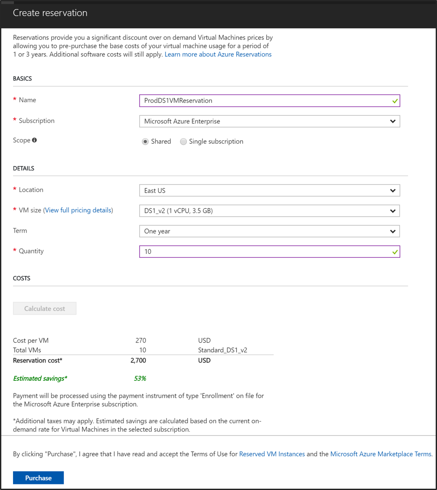
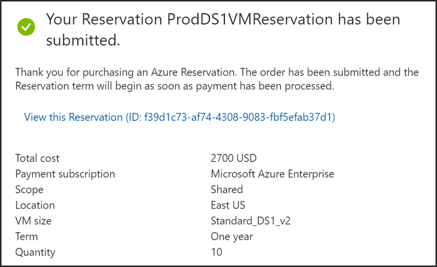

---
author: yashesvi
ms.author: yashar
ms.service: virtual-machines-windows
ms.topic: include
ms.date: 09-05-2018
---
# Prepay for Virtual Machines with Azure Reserved VM Instances

Prepay for virtual machines and save money with Azure Reserved Virtual Machine (VM) Instances. For more information, see [Azure Reserved VM Instances offering](https://azure.microsoft.com/pricing/reserved-vm-instances/).

You can buy a Reserved VM Instance in the [Azure portal](https://portal.azure.com). To buy an instance:

- You must be in an Owner role for at least one Enterprise or Pay-As-You-Go subscription.
- For Enterprise subscriptions, reservation purchases must be enabled in the [EA portal](https://ea.azure.com).
- For the Cloud Solution Provider (CSP) program, only the admin agents or sales agents can buy reservations.

## Determine the right VM size before you buy

The Meter Sub-category and Product fields in the usage data don't distinguish between VM sizes that use premium storage from VMs that don't. If you use these fields to determine the VM size to use for the reservation, you may buy the wrong size and won't get the reservation discount you expect. Use one of the following methods to determine the right VM size when you buy the reservation:

- Refer to the AdditionalInfo field in your usage file or usage API to determine the correct VM size. Don't use the values from Meter Sub-category or Product fields. These fields don't differentiate between S and Non-S versions of a VM.
- Get accurate VM size information using Powershell, Azure Resource Manager, or from the VM details in the Azure portal.

Reserved VM Instances are available for most VM sizes with some exceptions:

- Reservation discount doesn't apply for the following VMs:
  - Classic VMs and Cloud services
  - Constrained vCPU sizes
  - VM Series: A-series, Av2-series, or G-series
  - VMs in Preview: Any VM-series or size that is in preview
- Clouds: Reservations aren't available for purchase in the Azure US Government, Germany, or China regions.
- Insufficient quota: A reservation that is scoped to a single subscription must have vCPU quota available in the subscription for the new RI. For example, if the target subscription has a quota limit of 10 vCPUs for D-Series, then you can't buy a reservation for 11 Standard_D1 instances. The quota check for reservations includes the VMs already deployed in the subscription. For example, if the subscription has a quota of 10 vCPUs for D-Series and has two standard_D1 instances deployed, then you can buy a reservation for 10 standard_D1 instances in this subscription. 
- Capacity restrictions: In rare circumstances, Azure limits the purchase of new reservations for subset of VM sizes, due to low capacity in a region.

## Buy a Reserved VM Instance

1. Sign in to the [Azure portal](https://portal.azure.com).
2. Select **All services** > **Reservations**.
3. Select **Add** to purchase a new reservation.
4. Fill in the required fields. Running VM instances that match the attributes you select qualify to get the reservation discount. The actual number of your VM instances that get the discount depend on the scope and quantity selected.

    | Field      | Description|
    |:------------|:--------------|
    |Name        |The name of this reservation.| 
    |Subscription|The subscription used to pay for the reservation. The payment method on the subscription is charged the upfront costs for the reservation. The subscription type must be an enterprise agreement (offer number: MS-AZR-0017P) or Pay-As-You-Go (offer number: MS-AZR-0003P). For an enterprise subscription, the charges are deducted from the enrollment's monetary commitment balance or charged as overage. For Pay-As-You-Go subscription, the charges are billed to the credit card or invoice payment method on the subscription.|    
    |Scope       |The reservation’s scope can cover one subscription or multiple subscriptions (shared scope). If you select: <ul><li>Single subscription - The reservation discount is applied to VMs in this subscription. </li><li>Shared - The reservation discount is applied to VMs running in any subscriptions within your billing context. For enterprise customers, the shared scope is the enrollment and includes all subscriptions (except dev/test subscriptions) within the enrollment. For Pay-As-You-Go customers, the shared scope is all Pay-As-You-Go subscriptions created by the account administrator.</li></ul>|
    |Region    |The Azure region that’s covered by the reservation.|    
    |VM Size     |The size of the VM instances.|
    |Optimize for     |VM instance size flexibility applies the reservation discount to other VMs in the same [VM size group](https://aka.ms/RIVMGroups). Capacity priority prioritizes data center capacity for your deployments. This offers additional confidence in your ability to launch the VM instances when you need them. Capacity priority is only available when the reservation scope is single subscription. |
    |Term        |One year or three years.|
    |Quantity    |The number of instances being purchased within the reservation. The quantity is the number of running VM instances that can get the billing discount. For example, if you are running 10 Standard_D2 VMs in the East US, then you would specify quantity as 10 to maximize the benefit for all running machines. |
5. You can view the cost of the reservation when you select **Calculate cost**.

    

6. Select **Purchase**.
7. Select **View this Reservation** to see the status of your purchase.

    

## Cancellations and exchanges

If you need to cancel your reservation, there may be a 12% early termination fee. Refunds are based on the lowest price of either your purchase price or the current price of the reservation. Refunds are limited to $50,000 per year. The refund you receive is the remaining pro-rated balance minus the 12% early termination fee. To request a cancellation, go to the reservation in the Azure portal and select **Refund** to create a support request.

If you need to change your Reserved VM Instances reservation to another region, VM size group, or term, you can exchange it for another reservation that's of equal or greater value. The term start date for the new reservation doesn't carry over from the exchanged reservation. The 1 or 3 year term starts from when you create the new reservation. To request an exchange, go to the reservation in the Azure portal, and select **Exchange** to create a support request.

## Next steps

The reservation discount is applied automatically to the number of running virtual machines that match the reservation scope and attributes. You can update the scope of the reservation through [Azure portal](https://portal.azure.com), PowerShell, CLI, or through the API.

To learn how to manage a reservation, see [Manage Azure Reservations](../articles/billing/billing-manage-reserved-vm-instance.md).

To learn more about Azure Reservations, see the following articles:

- [What are Azure Reservations?](../articles/billing/billing-save-compute-costs-reservations.md)
- [Manage Reservations in Azure](../articles/billing/billing-manage-reserved-vm-instance.md)
- [Understand how the reservation discount is applied](../articles/billing/billing-understand-vm-reservation-charges.md)
- [Understand reservation usage for your Pay-As-You-Go subscription](../articles/billing/billing-understand-reserved-instance-usage.md)
- [Understand reservation usage for your Enterprise enrollment](../articles/billing/billing-understand-reserved-instance-usage-ea.md)
- [Windows software costs not included with reservations](../articles/billing/billing-reserved-instance-windows-software-costs.md)
- [Azure Reservations in Partner Center Cloud Solution Provider (CSP) program](https://docs.microsoft.com/partner-center/azure-reservations)

## Need help? Contact support

If you still have further questions, [contact support](https://portal.azure.com/?#blade/Microsoft_Azure_Support/HelpAndSupportBlade) to get your issue resolved quickly.
