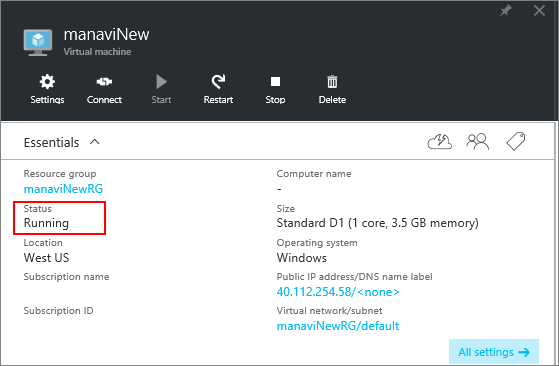
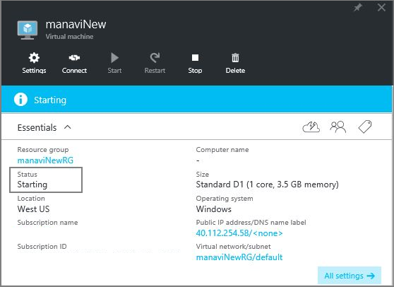
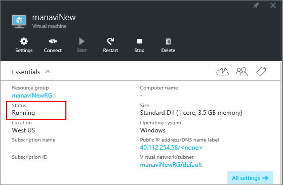

If you have been facing difficulties troubleshooting Remote Desktop (RDP) connection to Windows based Azure virtual machine or in troubleshooting SSH connection to Linux based Azure virtual machine, then this article will help you mitigate them all by yourself, without looping in support and resizing the virtual machine.  Microsoft Azure will redeploy your virtual machine when you invoke redeploy operation through Azure PowerShell. 

Please note that after this operation is completed, ephemeral disk data will be lost and dynamic IP addresses associated with virtual machine will be updated. 

## Using Azure PowerShell

Make sure you have the latest Azure PowerShell 1.x installed on your machine. Please read [How to install and configure Azure PowerShell](../articles/powershell-install-configure.md) for more information.

Use this Azure PowerShell command to redeploy your virtual machine:

	Set-AzureRmVM -Redeploy -ResourceGroupName $rgname -Name $vmname 

While this command is running, check your virtual machine in the [Azure portal](https://portal.azure.com). Notice that the VM's **Status** changes as following:

1. Initial **Status** is *Running*

	

2. **Status** changes to *Updating*

	

3. **Status** changes to *Starting*

	

4. **Status** changes back to *Running*

	

When the **Status** is back to *Running*, the VM has successfully redeployed. 