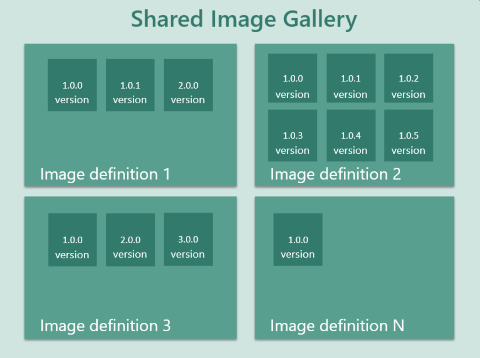
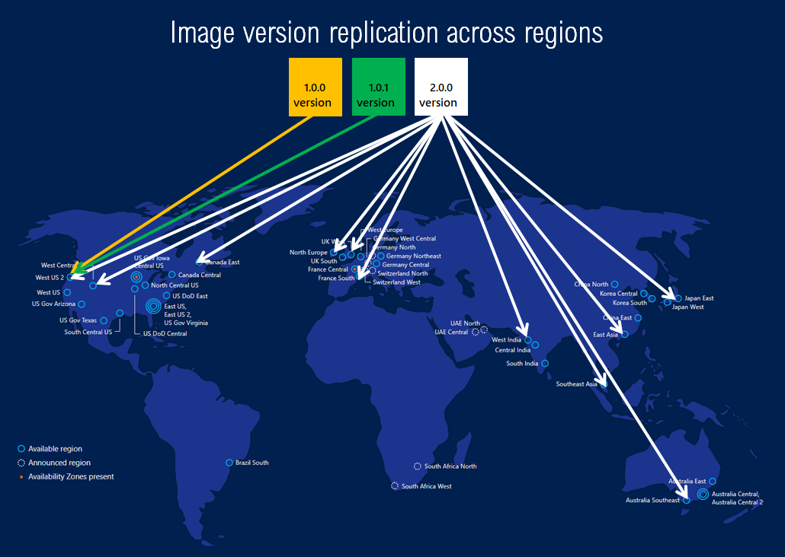

Shared Image Gallery is a service that helps you build structure and organization around your managed images. Shared Image Galleries provide:

- Managed global replication of images.
- Versioning and grouping of images for easier management.
- Highly available images with Zone Redundant Storage (ZRS) accounts in regions that support Availability Zones. ZRS offers better resilience against zonal failures.
- Premium storage support (Premium_LRS).
- Sharing across subscriptions, and even between Active Directory (AD) tenants, using RBAC.
- Scaling your deployments with image replicas in each region.

Using a Shared Image Gallery you can share your images to different users, service principals, or AD groups within your organization. Shared images can be replicated to multiple regions, for quicker scaling of your deployments.

An image is a copy of either a full VM (including any attached data disks) or just the OS disk, depending on how it is created. When you create a VM  from the image, a copy of the VHDs in the image are used to create the disks for the new VM. The image remains in storage and can be used over and over again to create new VMs.

If you have a large number of images that you need to maintain, and would like to make them available throughout your company, you can use a Shared Image Gallery as a repository. 

The Shared Image Gallery feature has multiple resource types:

| Resource | Description|
|----------|------------|
| **Image source** | This is a resource that can be used to create an **image version** in an image gallery. An image source can be an existing Azure VM that is either [generalized or specialized](#generalized-and-specialized-images), a managed image, a snapshot, or an image version in another image gallery. |
| **Image gallery** | Like the Azure Marketplace, an **image gallery** is a repository for managing and sharing images, but you control who has access. |
| **Image definition** | Image definitions are created within a gallery and carry information about the image and requirements for using it internally. This includes whether the image is Windows or Linux, release notes, and minimum and maximum memory requirements. It is a definition of a type of image. |
| **Image version** | An **image version** is what you use to create a VM when using a gallery. You can have multiple versions of an image as needed for your environment. Like a managed image, when you use an **image version** to create a VM, the image version is used to create new disks for the VM. Image versions can be used multiple times. |

<br>



## Image definitions

Image definitions are a logical grouping for versions of an image. The image definition holds information about why the image was created, what OS it is for, and other information about using the image. An image definition is like a plan for all of the details around creating a specific image. You don't deploy a VM from an image definition, but from the image versions created from the definition.

There are three parameters for each image definition that are used in combination - **Publisher**, **Offer** and **SKU**. These are used to find a specific image definition. You can have image versions that share one or two, but not all three values.  For example, here are three image definitions and their values:

|Image Definition|Publisher|Offer|Sku|
|---|---|---|---|
|myImage1|Contoso|Finance|Backend|
|myImage2|Contoso|Finance|Frontend|
|myImage3|Testing|Finance|Frontend|

All three of these have unique sets of values. The format is similar to how you can currently specify publisher, offer, and SKU for [Azure Marketplace images](../articles/virtual-machines/windows/cli-ps-findimage.md) in Azure PowerShell to get the latest version of a Marketplace image. Each image definition needs to have a unique set of these values.

The following are other parameters that can be set on your image definition so that you can more easily track your resources:

* Operating system state - You can set the OS state to [generalized or specialized](#generalized-and-specialized-images).
* Operating system - can be either Windows or Linux.
* Description - use description to give more detailed information on why the image definition exists. For example, you might have an image definition for your front-end server that has the application pre-installed.
* Eula - can be used to point to an end-user license agreement specific to the image definition.
* Privacy Statement and Release notes - store release notes and privacy statements in Azure storage and provide a URI for accessing them as part of the image definition.
* End-of-life date - attach an end-of-life date to your image definition to be able to use automation to delete old image definitions.
* Tag - you can add tags when you create your image definition. For more information about tags, see [Using tags to organize your resources](../articles/azure-resource-manager/management/tag-resources.md)
* Minimum and maximum vCPU and memory recommendations - if your image has vCPU and memory recommendations, you can attach that information to your image definition.
* Disallowed disk types - you can provide information about the storage needs for your VM. For example, if the image isn't suited for standard HDD disks, you add them to the disallow list.
* Hyper-V generation - you can specify whether the image was created from a gen 1 or gen 2 Hyper-V VHD.

## Generalized and specialized images

There are two operating system states supported by Shared Image Gallery. Typically images require that the VM used to create the image has been generalized before taking the image. Generalizing is a process that removes machine and user specific information from the VM. For Windows, the Sysprep tool is used. For Linux, you can use [waagent](https://github.com/Azure/WALinuxAgent) `-deprovision` or `-deprovision+user` parameters.

Specialized VMs have not been through a process to remove machine specific information and accounts. Also, VMs created from specialized images do not have an `osProfile` associated with them. This means that specialized images will have some limitations in addition to some benefits.

- VMs and scale sets created from specialized images can be up and running quicker. Because they are created from a source that has already been through first boot, VMs created from these images boot faster.
- Accounts that could be used to log into the VM can also be used on any VM created using the specialized image that is created from that VM.
- VMs will have the **Computer name** of the VM the image was taken from. You should change the computer name to avoid collisions.
- The `osProfile` is how some sensitive information is passed to the VM, using `secrets`. This may cause issues using KeyVault, WinRM and other functionality that uses `secrets` in the `osProfile`. In some cases, you can use managed service identities (MSI) to work around these limitations.

## Regional Support

Source regions are listed in the table below. All public regions can be target regions, but to replicate to Australia Central and Australia Central 2 you need to have your subscription whitelisted. To request whitelisting, go to: https://azure.microsoft.com/global-infrastructure/australia/contact/


| Source regions        |                   |                    |                    |
| --------------------- | ----------------- | ------------------ | ------------------ |
| Australia Central     | China East        | South India        | West Europe        |
| Australia Central 2   | China East 2      | Southeast Asia     | UK South           |
| Australia East        | China North       | Japan East         | UK West            |
| Australia Southeast   | China North 2     | Japan West         | US DoD Central     |
| Brazil South          | East Asia         | Korea Central      | US DoD East        |
| Canada Central        | East US           | Korea South        | US Gov Arizona     |
| Canada East           | East US 2         | North Central US   | US Gov Texas       |
| Central India         | East US 2 EUAP    | North Europe       | US Gov Virginia    |
| Central US            | France Central    | South Central US   | West India         |
| Central US EUAP       | France South      | West Central US    | West US            |
|                       |                   |                    | West US 2          |


## Limits 

There are limits, per subscription, for deploying resources using Shared Image Galleries:
- 100 shared image galleries, per subscription, per region
- 1,000 image definitions, per subscription, per region
- 10,000 image versions, per subscription, per region
- 10 image version replicas, per subscription, per region
- Any disk attached to the image must be less than or equal to 1TB in size

For more information, see [Check resource usage against limits](https://docs.microsoft.com/azure/networking/check-usage-against-limits) for examples on how to check your current usage.
 
## Scaling
Shared Image Gallery allows you to specify the number of replicas you want Azure to keep of the images. This helps in multi-VM deployment scenarios as the VM deployments can be spread to different replicas reducing the chance of instance creation processing being throttled due to overloading of a single replica.

With Shared Image Gallery, you can now deploy up to a 1,000 VM instances in a virtual machine scale set (up from 600 with managed images). Image replicas provide for better deployment performance, reliability and consistency.  You can set a different replica count in each target region, based on the scale needs for the region. Since each replica is a deep copy of your image, this helps scale your deployments linearly with each extra replica. While we understand no two images or regions are the same, here’s our general guideline on how to use replicas in a region:

- For non-Virtual Machine Scale Set (VMSS) Deployments - For every 20 VMs that you create concurrently, we recommend you keep one replica. For example, if you are creating 120 VMs concurrently using the same image in a region, we suggest you keep at least 6 replicas of your image. 
- For Virtual Machine Scale Set (VMSS) deployments - For every scale set deployment with up to 600 instances, we recommend you keep at least one replica. For example, if you are creating 5 scale sets concurrently, each with 600 VM instances using the same image in a single region, we suggest you keep at least 5 replicas of your image. 

We always recommend you to overprovision the number of replicas due to factors like image size, content and OS type.


## Make your images highly available

[Azure Zone Redundant Storage (ZRS)](https://azure.microsoft.com/blog/azure-zone-redundant-storage-in-public-preview/) provides resilience against an Availability Zone failure in the region. With the general availability of Shared Image Gallery, you can choose to store your images in ZRS accounts in regions with Availability Zones. 

You can also choose the account type for each of the target regions. The default storage account type is Standard_LRS, but you can choose Standard_ZRS for regions with Availability Zones. Check the regional availability of ZRS [here](https://docs.microsoft.com/azure/storage/common/storage-redundancy-zrs).


## Replication
Shared Image Gallery also allows you to replicate your images to other Azure regions automatically. Each Shared Image version can be replicated to different regions depending on what makes sense for your organization. One example is to always replicate the latest image in multi-regions while all older versions are only available in 1 region. This can help save on storage costs for Shared Image versions. 

The regions a Shared Image version is replicated to can be updated after creation time. The time it takes to replicate to different regions depends on the amount of data being copied and the number of regions the version is replicated to. This can take a few hours in some cases. While the replication is happening, you can view the status of replication per region. Once the image replication is complete in a region, you can then deploy a VM or scale-set using that image version in the region.



## Access

As the Shared Image Gallery, Image Definition, and Image version are all resources, they can be shared using the built-in native Azure RBAC controls. Using RBAC you can share these resources to other users, service principals, and groups. You can even share access to individuals outside of the tenant they were created within. Once a user has access to the Shared Image version, they can deploy a VM or a Virtual Machine Scale Set.  Here is the sharing matrix that helps understand what the user gets access to:

| Shared with User     | Shared Image Gallery | Image Definition | Image version |
|----------------------|----------------------|--------------|----------------------|
| Shared Image Gallery | Yes                  | Yes          | Yes                  |
| Image Definition     | No                   | Yes          | Yes                  |

We recommend sharing at the Gallery level for the best experience. We do not recommend sharing individual image versions. For more information about RBAC, see [Manage access to Azure resources using RBAC](../articles/role-based-access-control/role-assignments-portal.md).

Images can also be shared, at scale, even across tenants using a multi-tenant app registration. For more information about sharing images across tenants, see [Share gallery VM images across Azure tenants](../articles/virtual-machines/linux/share-images-across-tenants.md).

## Billing
There is no extra charge for using the Shared Image Gallery service. You will be charged for the following resources:
- Storage costs of storing the Shared Image versions. Cost depends on the number of replicas of the image version and the number of regions the version is replicated to. For example, if you have 2 images and both are replicated to 3 regions, then you will be charged for 6 managed disks based on their size. For more information, see [Managed Disks pricing](https://azure.microsoft.com/pricing/details/managed-disks/).
- Network egress charges for replication of the first image version from the source region to the replicated regions. Subsequent replicas are handled within the region, so there are no additional charges. 

## Updating resources

Once created, you can make some changes to the image gallery resources. These are limited to:
 
Shared image gallery:
- Description

Image definition:
- Recommended vCPUs
- Recommended memory
- Description
- End of life date

Image version:
- Regional replica count
- Target regions
- Exclude from latest
- End of life date

## SDK support

The following SDKs support creating Shared Image Galleries:

- [.NET](https://docs.microsoft.com/dotnet/api/overview/azure/virtualmachines/management?view=azure-dotnet)
- [Java](https://docs.microsoft.com/java/azure/?view=azure-java-stable)
- [Node.js](https://docs.microsoft.com/javascript/api/@azure/arm-compute)
- [Python](https://docs.microsoft.com/python/api/overview/azure/virtualmachines?view=azure-python)
- [Go](https://docs.microsoft.com/azure/go/)

## Templates

You can create Shared Image Gallery resource using templates. There are several Azure Quickstart Templates available: 

- [Create a Shared Image Gallery](https://azure.microsoft.com/resources/templates/101-sig-create/)
- [Create an Image Definition in a Shared Image Gallery](https://azure.microsoft.com/resources/templates/101-sig-image-definition-create/)
- [Create an Image Version in a Shared Image Gallery](https://azure.microsoft.com/resources/templates/101-sig-image-version-create/)
- [Create a VM from Image Version](https://azure.microsoft.com/resources/templates/101-vm-from-sig/)

## Frequently asked questions 

* [How can I list all the Shared Image Gallery resources across subscriptions?](#how-can-i-list-all-the-shared-image-gallery-resources-across-subscriptions) 
* [Can I move my existing image to the shared image gallery?](#can-i-move-my-existing-image-to-the-shared-image-gallery)
* [Can I create an image version from a specialized disk?](#can-i-create-an-image-version-from-a-specialized-disk)
* [Can I move the Shared Image Gallery resource to a different subscription after it has been created?](#can-i-move-the-shared-image-gallery-resource-to-a-different-subscription-after-it-has-been-created)
* [Can I replicate my image versions across clouds such as Azure China 21Vianet or Azure Germany or Azure Government Cloud?](#can-i-replicate-my-image-versions-across-clouds-such-as-azure-china-21vianet-or-azure-germany-or-azure-government-cloud)
* [Can I replicate my image versions across subscriptions?](#can-i-replicate-my-image-versions-across-subscriptions)
* [Can I share image versions across Azure AD tenants?](#can-i-share-image-versions-across-azure-ad-tenants)
* [How long does it take to replicate image versions across the target regions?](#how-long-does-it-take-to-replicate-image-versions-across-the-target-regions)
* [What is the difference between source region and target region?](#what-is-the-difference-between-source-region-and-target-region)
* [How do I specify the source region while creating the image version?](#how-do-i-specify-the-source-region-while-creating-the-image-version)
* [How do I specify the number of image version replicas to be created in each region?](#how-do-i-specify-the-number-of-image-version-replicas-to-be-created-in-each-region)
* [Can I create the shared image gallery in a different location than the one for the image definition and image version?](#can-i-create-the-shared-image-gallery-in-a-different-location-than-the-one-for-the-image-definition-and-image-version)
* [What are the charges for using the Shared Image Gallery?](#what-are-the-charges-for-using-the-shared-image-gallery)
* [What API version should I use to create Shared Image Gallery and Image Definition and Image Version?](#what-api-version-should-i-use-to-create-shared-image-gallery-and-image-definition-and-image-version)
* [What API version should I use to create Shared VM or Virtual Machine Scale Set out of the Image Version?](#what-api-version-should-i-use-to-create-shared-vm-or-virtual-machine-scale-set-out-of-the-image-version)
* [Can I update my Virtual Machine Scale Set created using managed image to use Shared Image Gallery images?]

### How can I list all the Shared Image Gallery resources across subscriptions?

To list all the Shared Image Gallery resources across subscriptions that you have access to on the Azure portal, follow the steps below:

1. Open the [Azure portal](https://portal.azure.com).
1. Scroll down the page and select **All resources**.
1. Select all the subscriptions under which you’d like to list all the resources.
1. Look for resources of type **Shared image gallery**, .
  
To list all the Shared Image Gallery resources across subscriptions that you have permissions to, use the following command in the Azure CLI:

```azurecli
   az account list -otsv --query "[].id" | xargs -n 1 az sig list --subscription
```

For more information, see **Manage gallery resources** using the [Azure CLI](../articles/virtual-machines/update-image-resources-cli.md) or [PowerShell](../articles/virtual-machines/update-image-resources-powershell.md).

### Can I move my existing image to the shared image gallery?
 
Yes. There are 3 scenarios based on the types of images you may have.

 Scenario 1: If you have a managed image, then you can create an image definition and image version from it. For more information, see **Migrate from a managed image to an image version** using the [Azure CLI](../articles/virtual-machines/image-version-managed-image-cli.md) or [PowerShell](../articles/virtual-machines/image-version-managed-image-powershell.md).

 Scenario 2: If you have an unmanaged image, you can create a managed image from it, and then create an image definition and image version from it. 

 Scenario 3: If you have a VHD in your local file system, then you need to upload the VHD to a managed image, then you can create an image definition and image version from it.

- If the VHD is of a Windows VM, see [Upload a VHD](https://docs.microsoft.com/azure/virtual-machines/windows/upload-generalized-managed).
- If the VHD is for a Linux VM, see [Upload a VHD](https://docs.microsoft.com/azure/virtual-machines/linux/upload-vhd#option-1-upload-a-vhd)

### Can I create an image version from a specialized disk?

Yes, support for specialized disks as images is in preview. You can only create a VM from a specialized image using the portal, PowerShell, or API. 


Use [PowerShell to create an image of a specialized VM](../articles/virtual-machines/image-version-vm-powershell.md).

Use the portal to create a [Windows](../articles/virtual-machines/linux/shared-images-portal.md) or [Linux] (../articles/virtual-machines/linux/shared-images-portal.md) image. 


### Can I move the Shared Image Gallery resource to a different subscription after it has been created?

No, you can't move the shared image gallery resource to a different subscription. You can replicate the image versions in the gallery to other regions or copy an image from another gallery using the [Azure CLI](../articles/virtual-machines/image-version-another-gallery-cli.md) or [PowerShell](../articles/virtual-machines/image-version-another-gallery-powershell.md).

### Can I replicate my image versions across clouds such as Azure China 21Vianet or Azure Germany or Azure Government Cloud?

No, you cannot replicate image versions across clouds.

### Can I replicate my image versions across subscriptions?

No, you may replicate the image versions across regions in a subscription and use it in other subscriptions through RBAC.

### Can I share image versions across Azure AD tenants? 

Yes, you can use RBAC to share to individuals across tenants. But, to share at scale, see "Share gallery images across Azure tenants" using [PowerShell](../articles/virtual-machines/windows/share-images-across-tenants.md) or [CLI](../articles/virtual-machines/linux/share-images-across-tenants.md).

### How long does it take to replicate image versions across the target regions?

The image version replication time is entirely dependent on the size of the image and the number of regions it is being replicated to. However, as a best practice, it is recommended that you keep the image small, and the source and target regions close for best results. You can check the status of the replication using the -ReplicationStatus flag.

### What is the difference between source region and target region?

Source region is the region in which your image version will be created, and target regions are the regions in which a copy of your image version will be stored. For each image version, you can only have one source region. Also, make sure that you pass the source region location as one of the target regions when you create an image version.

### How do I specify the source region while creating the image version?

While creating an image version, you can use the **--location** tag in CLI and the **-Location** tag in PowerShell to specify the source region. Please ensure the managed image that you are using as the base image to create the image version is in the same location as the location in which you intend to create the image version. Also, make sure that you pass the source region location as one of the target regions when you create an image version.  

### How do I specify the number of image version replicas to be created in each region?

There are two ways you can specify the number of image version replicas to be created in each region:
 
1. The regional replica count which specifies the number of replicas you want to create per region. 
2. The common replica count which is the default per region count in case regional replica count is not specified. 

To specify the regional replica count, pass the location along with the number of replicas you want to create in that region: “South Central US=2”. 

If regional replica count is not specified with each location, then the default number of replicas will be the common replica count that you specified. 

To specify the common replica count in CLI, use the **--replica-count** argument in the `az sig image-version create` command.

### Can I create the shared image gallery in a different location than the one for the image definition and image version?

Yes, it is possible. But, as a best practice, we encourage you to keep the resource group, shared image gallery, image definition, and image version in the same location.

### What are the charges for using the Shared Image Gallery?

There are no charges for using the Shared Image Gallery service, except the storage charges for storing the image versions and network egress charges for replicating the image versions from source region to target regions.

### What API version should I use to create Shared Image Gallery and Image Definition and Image Version?

To work with shared image galleries, image definitions, and image versions, we recommend you use API version 2018-06-01. Zone Redundant Storage (ZRS) requires version 2019-03-01 or later.

### What API version should I use to create Shared VM or Virtual Machine Scale Set out of the Image Version?

For VM and Virtual Machine Scale Set deployments using an image version, we recommend you use API version 2018-04-01 or higher.

### Can I update my Virtual Machine Scale Set created using managed image to use Shared Image Gallery images?

Yes, you can update the scale set image reference from a managed image to a shared image gallery image, as long as the the OS type, Hyper-V generation, and the data disk layout matches between the images. 
