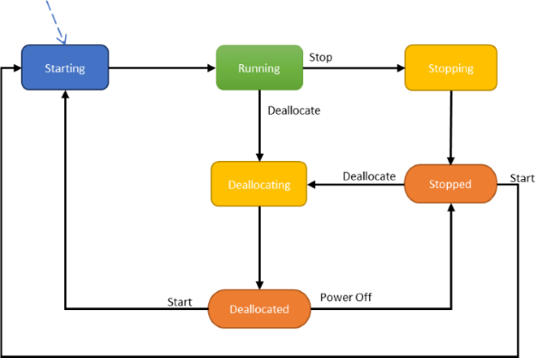

Virtual machines go through different states that can be categorized into *provisioning* and *power* states. The purpose of this article is to describe these states and specifically highlight when customers are billed for hardware and software usage. 

## Power States

The power state represents the last known state of a VM.

<table>
<th>
<td>

<b>State</b>

</td>
<td>

<b>Description</b>

</td>
<td>

<b>Billing</b>

</td>
</th>
<tr>
<td>

<b>Starting</b>

</td>
<td>

VM is starting up.

<code>"statuses": [ 
   { 
      "code": "PowerState/starting", 
       "level": "Info", 
        "displayStatus": "VM starting" 
    } 
    ]</code> 
</td>
<td>

<b>Not Billed</b>

</td>
</tr>
<tr>
<td>

<b>Running</b>

</td>
<td>

Running state for a VM

<code>"statuses": [ 
 { 
 "code": "PowerState/running", 
 "level": "Info", 
 "displayStatus": "VM running" 
 } 
 ]</code> 
</td>
<td>

<b>Billed (Hardware + Software) </b>

</td>
</tr>
<tr>
<td>

<b>Stopping</b>

</td>
<td>

**Stopping** is a transitional state. When completed, it will show as **Stopped**.

<code>"statuses": [ 
 { 
 "code": "PowerState/stopping", 
 "level": "Info", 
 "displayStatus": "VM stopping" 
 } 
 ]</code> 
</td>
<td>

<b>Billed (Hardware + Software)</b>

</td>
</tr>
<tr>
<td>

<b>Stopped</b>

</td>
<td>

Stopped state is observed when a VM has been shut down from the guest OS or client PowerOff APIs.

VM in a stopped state is not removed from the host as compared to deallocated state. 

<code>"statuses": [ 
 { 
 "code": "PowerState/stopped", 
 "level": "Info", 
 "displayStatus": "VM stopped" 
 } 
 ]</code> 
</td>
<td>

<b>Billed (Hardware only)</b>

</td>
</tr>
<tr>
<td>

<b>Deallocating</b>

</td>
<td>

Deallocating is a transitional state of a VM when user performs a deallocate action.

<code>"statuses": [ 
 { 
 "code": "PowerState/deallocating", 
 "level": "Info", 
 "displayStatus": "VM deallocating" 
 } 
 ]</code> 
</td>
<td>

<b>Billed (Hardware only)</b>

</td>
</tr>
<tr>
<td>

<b>Deallocated</b>

</td>
<td>

Deallocated status is observed when CRP has successfully stopped and removed the VM from the host. 

<code>"statuses": [ 
 { 
 "code": "PowerState/deallocated", 
 "level": "Info", 
 "displayStatus": "VM deallocated" 
 } 
 ]</code> 
</td>
<td>

<b>Not billed </b>

</td>
</tr>
</tbody>
</table>

## Provisioning states

A provisioning state is the status of a user-initiated (control plane) operation on the VM. These states are independent of the power state of a VM.

**User Initiated actions**

- **Create** – VM creation.

- **Update** – update model for an existing VM. Some non-model changes to VM such as Start/Restart also fall under update.

- **Delete** – VM deletion.

- **Deallocate** – is where a VM is stopped and removed from the host. Deallocating a VM results into Update of the VM model hence resulting into provisioning states related to updating.

- **Operation states** – transitional states after the platform has
accepted the request for user-initiated action.

<table>
<tbody>
<tr>
<td width="162">

<b>States</b>

</td>
<td width="366">

Description

</td>
</tr>
<tr>
<td width="162">

<b>Creating</b>

</td>
<td width="366">
<code>"statuses": [ 
 { 
 "code": "ProvisioningState/creating", 
 "level": "Info", 
 "displayStatus": "Creating" 
 }</code> 
</td>
</tr>
<tr>
<td width="162">

<b>Updating</b>

</td>
<td width="366">
<code>"statuses": [ 
 { 
 "code": "ProvisioningState/updating", 
 "level": "Info", 
 "displayStatus": "Updating" 
 } 
 ]</code> 
</td>
</tr>
<tr>
<td width="162">

<b>Deleting</b>

</td>
<td width="366">
<code>"statuses": [ 
 { 
 "code": "ProvisioningState/deleting", 
 "level": "Info", 
 "displayStatus": "Deleting" 
 } 
 ]</code> 
</td>
</tr>
<tr>
<td width="162">

<b>OS provisioning states</b>

</td>
<td width="366">

If a VM is created with an OS image and not with a specialized image, then following substates can be observed

<b>1. </b><b>OSProvisioningInprogress</b> &ndash; The VM is running, and installation of guest OS is in progress. 
 
<code> "statuses": [ 
 { 
 "code": "ProvisioningState/creating/OSProvisioningInprogress", 
 "level": "Info", 
 "displayStatus": "OS Provisioning In progress" 
 } 
]</code> 

<b>2. </b><b>OSProvisioningComplete</b> &ndash; Short-lived state, as it quickly transitions to Success unless VM has to install any extensions. Installation of extensions takes time and provides a window to observe this state.  
<code> "statuses": [ 
 { 
 "code": "ProvisioningState/creating/OSProvisioningComplete", 
 "level": "Info", 
 "displayStatus": "OS Provisioning Complete" 
 } 
]</code> 

<b>Note</b>: OS Provisioning can transition to Failed if OS fails or if OS fails to install in time. At this time, customers will be billed for the deployed VM on the infrastructure.

</td>
</tr>
</tbody>
</table>

**Succeeded**– This state represents that user-initiated actions have
completed.

<code>
 "statuses": \[  
 { 
     "code": "ProvisioningState/succeeded", 
     "level": "Info", 
     "displayStatus": "Provisioning succeeded", 
     "time": "time" 
 } 
 \] 
</code>

**Failed** – This state represents a failed operation. Refer to the error codes to get more information and possible
resolution.

<code>
 "statuses": [ 
    { 
      "code": "ProvisioningState/failed/InternalOperationError", 
      "level": "Error", 
      "displayStatus": "Provisioning failed", 
      "message": "Operation abandoned due to internal error. Please try again later.", 
      "time": "time" 
    } 
</code>

**Edge cases**: In cases where a VM was running and in a good state, a
failed management operation will typically leave the VM running with the
original VM model (configuration). If such a case happens, then the
effective running VM model may be different from the latest received and
persisted model by CRP. CRP persisted model gets returned with GetVM API. To resolve this
issue, look at the error message (either from the last failed
operation of the VM instance view). If the error is due to API input validation, then try to fix the inputs. If the error, is due to Azure
internal errors a retry of the management operation should resolve the
issue.

## VM Instance View
Virtual Machine Instance View API provides VM running-state information. [Here] (https://docs.microsoft.com/en-us/rest/api/compute/virtualmachines/instanceview) is the API documentation.

Azure Resources explorer provides a simple UX to view VM running state: [Resource Explorer] (https://resources.azure.com/)

Provisioning states are visible on VM properties and Instance View whereas Power States are available in Instance View of VM. 