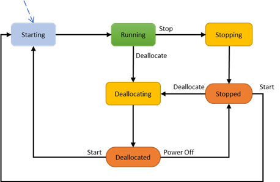

Azure Virtual Machines (VMs) go through different states that can be categorized into *provisioning* and *power* states. The purpose of this article is to describe these states and specifically highlight when customers are billed for instance usage. 

## Power states

The power state represents the last known state of the VM.



<br>
The following table provides a  description of each instance state and indicates whether it is billed for instance usage or not.

<table>
<tr>
<th>
State
</th>
<th>
Description
</th>
<th>
Instance usage billing
</th>
</tr>
<tr>
<td>
<p><b>Starting</b></p>
</td>
<td>
<p>VM is starting up.</p>
<code>"statuses": [<br>
   {<br>
      "code": "PowerState/starting",<br>
       "level": "Info",<br>
        "displayStatus": "VM starting"<br>
    }<br>
    ]</code><br>
</td>
<td>
<p><b>Not billed</b></p>
</td>
</tr>
<tr>
<td>
<p><b>Running</b></p>
</td>
<td>
<p>Normal working state for a VM</p>
<code>"statuses": [<br>
 {<br>
 "code": "PowerState/running",<br>
 "level": "Info",<br>
 "displayStatus": "VM running"<br>
 }<br>
 ]</code><br>
</td>
<td>
<p><b>Billed</b></p>
</td>
</tr>
<tr>
<td>
<p><b>Stopping</b></p>
</td>
<td>
<p>This is a transitional state. When completed, it will show as **Stopped**.</p>
<code>"statuses": [<br>
 {<br>
 "code": "PowerState/stopping",<br>
 "level": "Info",<br>
 "displayStatus": "VM stopping"<br>
 }<br>
 ]</code><br>
</td>
<td>
<p><b>Billed</b></p>
</td>
</tr>
<tr>
<td>
<p><b>Stopped</b></p>
</td>
<td>
<p>The VM has been shut down from within the guest OS or using the PowerOff APIs.</p>
<p>Hardware is still allocated to the VM and it remains on the host. </p>
<code>"statuses": [<br>
 {<br>
 "code": "PowerState/stopped",<br>
 "level": "Info",<br>
 "displayStatus": "VM stopped"<br>
 }<br>
 ]</code><br>
</td>
<td>
<p><b>Billed&#42;</b></p>
</td>
</tr>
<tr>
<td>
<p><b>Deallocating</b></p>
</td>
<td>
<p>Transitional state. When completed, the VM will show as **Deallocated**.</p>
<code>"statuses": [<br>
 {<br>
 "code": "PowerState/deallocating",<br>
 "level": "Info",<br>
 "displayStatus": "VM deallocating"<br>
 }<br>
 ]</code><br>
</td>
<td>
<p><b>Not billed&#42;</b></p>
</td>
</tr>
<tr>
<td>
<p><b>Deallocated</b></p>
</td>
<td>
<p>The VM has been stopped successfully and removed from the host. </p>
<code>"statuses": [<br>
 {<br>
 "code": "PowerState/deallocated",<br>
 "level": "Info",<br>
 "displayStatus": "VM deallocated"<br>
 }<br>
 ]</code><br>
</td>
<td>
<p><b>Not billed</b></p>
</td>
</tr>
</tbody>
</table>


&#42;Some Azure resources, such as Disks and Networking, incur charges. Software licenses on the instance do not incur charges.

## Provisioning states

A provisioning state is the status of a user-initiated, control-plane operation on the VM. These states are separate from the power state of a VM.

- **Create** – VM creation.

- **Update** – updates the model for an existing VM. Some non-model changes to VM such as Start/Restart also fall under update.

- **Delete** – VM deletion.

- **Deallocate** – is where a VM is stopped and removed from the host. Deallocating a VM is considered an update, so it will display provisioning states related to updating.


Here are the transitional operation states after the platform has accepted a user-initiated action:

<br>

<table>
<tbody>
<tr>
<td width="162">
<p><b>States</b></p>
</td>
<td width="366">
<p>Description</p>
</td>
</tr>
<tr>
<td width="162">
<p><b>Creating</b></p>
</td>
<td width="366">
<code>"statuses": [<br>
 {<br>
 "code": "ProvisioningState/creating",<br>
 "level": "Info",<br>
 "displayStatus": "Creating"<br>
 }</code><br>
</td>
</tr>
<tr>
<td width="162">
<p><b>Updating</b></p>
</td>
<td width="366">
<code>"statuses": [<br>
 {<br>
 "code": "ProvisioningState/updating",<br>
 "level": "Info",<br>
 "displayStatus": "Updating"<br>
 }<br>
 ]</code><br>
</td>
</tr>
<tr>
<td width="162">
<p><b>Deleting</b></p>
</td>
<td width="366">
<code>"statuses": [<br>
 {<br>
 "code": "ProvisioningState/deleting",<br>
 "level": "Info",<br>
 "displayStatus": "Deleting"<br>
 }<br>
 ]</code><br>
</td>
</tr>
<tr>
<td width="162">
<p><b>OS provisioning states</b></p>
</td>
<td width="366">
<p>If a VM is created with an OS image and not with a specialized image, then following substates can be observed:</p>
<p>1. <b>OSProvisioningInprogress</b> &ndash; The VM is running, and installation of guest OS is in progress. <p /> 
<code> "statuses": [<br>
 {<br>
 "code": "ProvisioningState/creating/OSProvisioningInprogress",<br>
 "level": "Info",<br>
 "displayStatus": "OS Provisioning In progress"<br>
 }<br>
]</code><br>
<p>2. <b>OSProvisioningComplete</b> &ndash; Short-lived state. The VM quickly transitions to **Success** unless any extensions need to be installed. Installing extensions can take time. <br />
<code> "statuses": [<br>
 {<br>
 "code": "ProvisioningState/creating/OSProvisioningComplete",<br>
 "level": "Info",<br>
 "displayStatus": "OS Provisioning Complete"<br>
 }<br>
]</code><br>
<p><b>Note</b>: OS Provisioning can transition to **Failed** if there is an OS failure or the OS doesn't install in time. Customers will be billed for the deployed VM on the infrastructure.</p>
</td>
</tr>
</table>


Once the operation is complete, the VM will transition into one of the following states:

- **Succeeded** – the user-initiated actions have completed.

    ```
  "statuses": [ 
  {
     "code": "ProvisioningState/succeeded",
     "level": "Info",
     "displayStatus": "Provisioning succeeded",
     "time": "time"
  }
  ]
    ```

 

- **Failed** – represents a failed operation. Refer to the error codes to get more information and possible solutions.

    ```
  "statuses": [
    {
      "code": "ProvisioningState/failed/InternalOperationError",
      "level": "Error",
      "displayStatus": "Provisioning failed",
      "message": "Operation abandoned due to internal error. Please try again later.",
      "time": "time"
    }
	]
    ```


## VM instance view

The instance view API provides VM running-state information. For more information, see the [Virtual Machines - Instance View](https://docs.microsoft.com/rest/api/compute/virtualmachines/instanceview) API documentation.

Azure Resources explorer provides a simple UI for viewing the VM running state: [Resource Explorer](https://resources.azure.com/).

Provisioning states are visible on VM properties and instance view. Power states are available in instance view of VM. 

