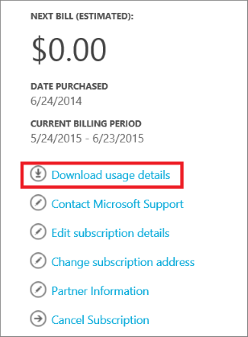

## Viewing your tags in the usage details
Tags placed on Compute, Network, and Storage resources in the Resource Manager deployment model will be populated in your usage details in the [billing portal](https://account.windowsazure.com/).

Click on **Download usage details** to view the usage details in your subscription.

Select your billing statement and the **Version 2** usage details:

From the usage details, you can see all of the tags in the **Tags** column:

By analyzing these tags along with usage, organizations will be able to gain new insights into their consumption data.

