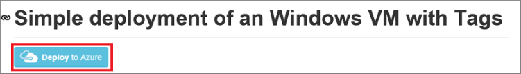
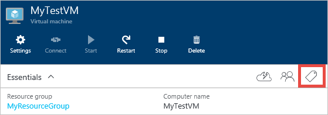
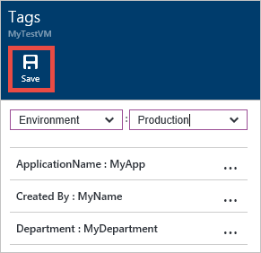

## Tagging a Virtual Machine through Templates
First, let’s look at tagging through templates. [This template](https://github.com/Azure/azure-quickstart-templates/tree/master/101-vm-tags) places tags on the following resources: Compute (Virtual Machine), Storage (Storage Account), and Network (Public IP Address, Virtual Network, and Network Interface). This template is for a Windows VM but can be adapted for Linux VMs.

Click the **Deploy to Azure** button from the [template link](https://github.com/Azure/azure-quickstart-templates/tree/master/101-vm-tags). This will navigate to the [Azure portal](https://portal.azure.com/) where you can deploy this template.

This template includes the following tags: *Department*, *Application*, and *Created By*. You can add/edit these tags directly in the template if you would like different tag names.

As you can see, the tags are defined as key/value pairs, separated by a colon (:). The tags must be defined in this format:

        “tags”: {
            “Key1” : ”Value1”,
            “Key2” : “Value2”
        }

Save the template file after you finish editing it with the tags of your choice.

Next, in the **Edit Parameters** section, you can fill out the values for your tags.

Click **Create** to deploy this template with your tag values.

## Tagging through the Portal
After creating your resources with tags, you can view, add, and delete tags in the portal.

Select the tags icon to view your tags:

Add a new tag through the portal by defining your own Key/Value pair, and save it.

Your new tag should now appear in the list of tags for your resource.

