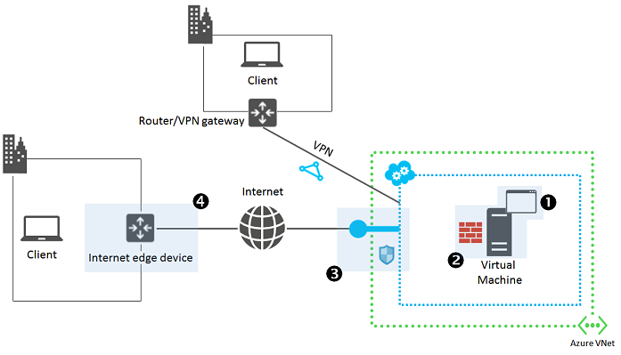

There are various reasons when you cannot start or connect to an application running on an Azure virtual machine (VM) such as the application not running or listening on the expected ports, listening port blocked, or networking rules not correctly passing traffic to the application. This article describes a methodical approach to find and correct the problem.

If you are having issues connecting to your VM using RDP or SSH, please see one of the following articles first:

 - [Troubleshoot Remote Desktop connections to a Windows-based Azure Virtual Machine](../articles/virtual-machines/virtual-machines-windows-troubleshoot-rdp-connection.md)
 - [Troubleshoot Secure Shell (SSH) connections to a Linux-based Azure virtual machine](../articles/virtual-machines/virtual-machines-linux-troubleshoot-ssh-connection.md).

> [AZURE.NOTE] Azure has two different deployment models for creating and working with resources: [Resource Manager and classic](../articles/resource-manager-deployment-model.md). This article covers using both models, but Microsoft recommends that most new deployments use the Resource Manager model.

If you need more help at any point in this article, you can contact the Azure experts on [the MSDN Azure and the Stack Overflow forums](https://azure.microsoft.com/support/forums/). Alternatively, you can also file an Azure support incident. Go to the [Azure support site](https://azure.microsoft.com/support/options/) and select **Get Support**.

## Quick-start Troubleshooting Endpoint Connectivity problems

If you have problems connecting to an application, try the following general troubleshooting steps. After each step, try connecting to your application again :

- Restart the virtual machine
- Recreate the endpoint / firewall rules / network security group (NSG) rules
	- [Classic model - Manage Cloud Services endpoints](../articles/cloud-services/cloud-services-enable-communication-role-instances.md)
	- [Resource Manager model - Manage Network Security Groups](../articles/virtual-network/virtual-networks-create-nsg-arm-pportal.md)
- Connect from different location, such as a different Azure virtual network
- Redeploy the virtual machine
	- [Redeploy Windows VM](../articles/virtual-machines/virtual-machines-windows-redeploy-to-new-node.md)
	- [Redeploy Linux VM](../articles/virtual-machines/virtual-machines-linux-redeploy-to-new-node.md)
- Recreate the virtual machine

For more information, see [Troubleshooting Endpoint Connectivity (RDP/SSH/HTTP, etc. failures)](https://social.msdn.microsoft.com/Forums/azure/en-US/538a8f18-7c1f-4d6e-b81c-70c00e25c93d/troubleshooting-endpoint-connectivity-rdpsshhttp-etc-failures?forum=WAVirtualMachinesforWindows).

## Detailed troubleshooting overview

There are four main areas to troubleshoot the access of an application that is running on an Azure virtual machine.

1.	The application running on the Azure virtual machine.
	- Is the application itself running correctly?
2.	The Azure virtual machine.
	- Is the VM itself running correctly and responding to requests?
3.	Azure endpoints for the cloud service that contains the virtual machine (for virtual machines in classic deployment model), inbound NAT rules (for virtual machines in Resource Manager deployment model), and Network Security Groups.
	- Can traffic flow from users to the VM/application on the expected ports?
4.	Your Internet edge device.
	- Are firewall rules in place preventing traffic from flowing correctly?

For client computers that are accessing the application over a site-to-site VPN or ExpressRoute connection, the main areas that can cause problems are the application and the Azure virtual machine.
To determine the source of the problem and its correction, follow these steps.

## Step 1: Can you access the application from the target VM?

Try to access the application with the appropriate client program from the VM on which it is running. Use the local host name, the local IP address, or the loopback address (127.0.0.1).

For example, if the application is a web server, open a browser on the VM and try to access a web page hosted on the VM.

If you can access the application, go to [Step 2](#step2).

If you cannot access the application, verify the following:

- The application is running on the target virtual machine.
- The application is listening on the expected TCP and UDP ports.

On both Windows and Linux-based virtual machines, use the **netstat -a** command to show the active listening ports. Examine the output for the expected ports on which your application should be listening. Restart the application or configure it to use the expected ports as needed and try to access the application locally again.

## Step 2: Can you access the application from another virtual machine in the same virtual network?

Try to access the application from a different VM but in the same virtual network, using the VM's host name or its Azure-assigned public, private, or provider IP address. For virtual machines created using the classic deployment model, do not use the public IP address of the cloud service.

For example, if the application is a web server, try to access a web page from a browser on a different VM in the same virtual network.

If you can access the application, go to [Step 3](#step3).

If you cannot access the application, verify the following:

- The host firewall on the target VM is allowing the inbound request and outbound response traffic.
- Intrusion detection or network monitoring software running on the target VM is allowing the traffic.
- Cloud Services endpoints or Network Security Groups are allowing the traffic
	- [Classic model - Manage Cloud Services endpoints](../articles/cloud-services/cloud-services-enable-communication-role-instances.md)
	- [Resource Manager model - Manage Network Security Groups](../articles/virtual-network/virtual-networks-create-nsg-arm-pportal.md)
- A separate component running in your VM in the path between the test VM and your VM, such as a load balancer or firewall, is allowing the traffic.

On a Windows-based virtual machine, use Windows Firewall with Advanced Security to determine whether the firewall rules exclude your application's inbound and outbound traffic.

## Step 3: Can you access the application from a computer that is outside the virtual network, but not connected to the same network as your computer?

Try to access the application from a computer outside the virtual network as the VM on which the application is running, but is not on the same network as your original client computer.

For example, if the application is a web server, try to access the web page from a browser running on a computer that is not in the virtual network.

If you cannot access the application, verify the following:

- For VMs created using the classic deployment model:
	- That the endpoint configuration for the VM is allowing the incoming traffic, especially the protocol (TCP or UDP) and the public and private port numbers.
	- That access control lists (ACLs) on the endpoint are not preventing incoming traffic from the Internet.
	- For more information, see [How to Set Up Endpoints to a Virtual Machine](../articles/virtual-machines/virtual-machines-windows-classic-setup-endpoints.md).

- For VMs created using the Resource Manager deployment model:
	- That the inbound NAT rule configuration for the VM is allowing the incoming traffic, especially the protocol (TCP or UDP) and the public and private port numbers.
	- That Network Security Groups are allowing the inbound request and outbound response traffic.
	- For more information, see [What is a Network Security Group (NSG)?](../articles/virtual-network/virtual-networks-nsg.md).

If the virtual machine or endpoint is a member of a load-balanced set:

- Verify that the probe protocol (TCP or UDP) and port number are correct.
- If the probe protocol and port is different than the load-balanced set protocol and port:
	- Verify that the application is listening on the probe protocol (TCP or UDP) and port number (use **netstat –a** on the target VM).
	- The host firewall on the target VM is allowing the inbound probe request and outbound probe response traffic.

If you can access the application, ensure that your Internet edge device is allowing:

- The outbound application request traffic from your client computer to the Azure virtual machine.
- The inbound application response traffic from the Azure virtual machine.

## Additional resources

[Troubleshoot Remote Desktop connections to a Windows-based Azure Virtual Machine](../articles/virtual-machines/virtual-machines-windows-troubleshoot-rdp-connection.md)

[Troubleshoot Secure Shell (SSH) connections to a Linux-based Azure virtual machine](../articles/virtual-machines/virtual-machines-linux-troubleshoot-ssh-connection.md)
