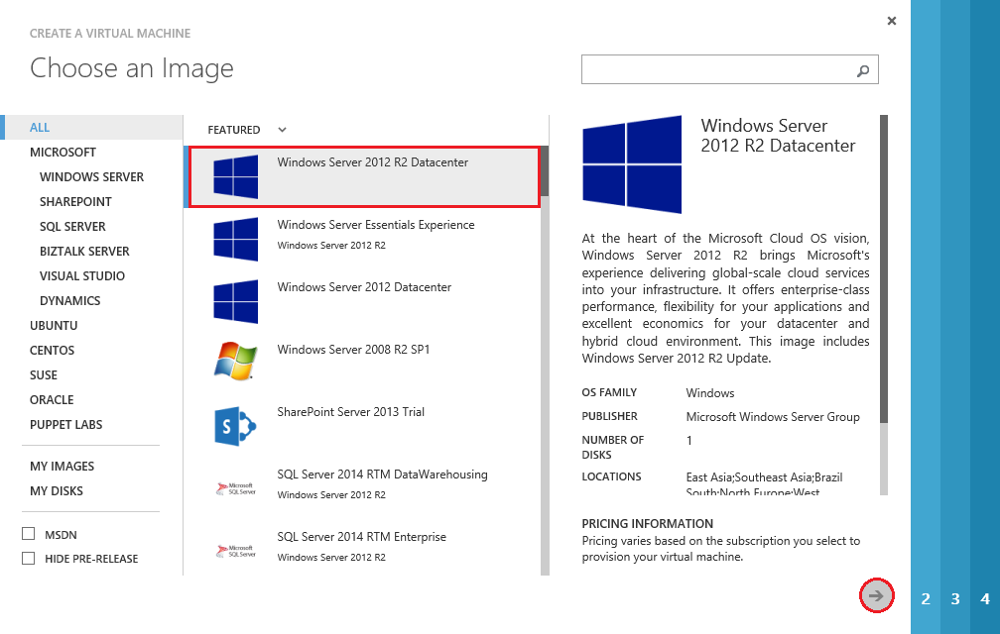
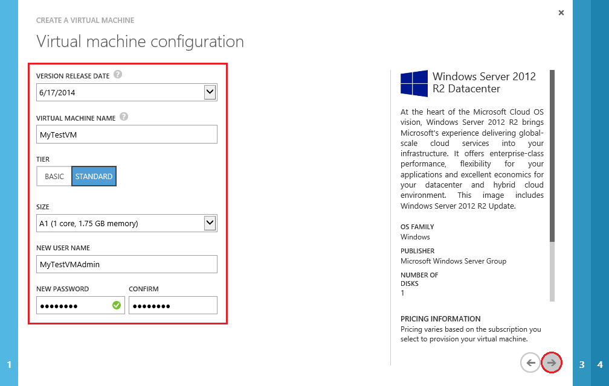
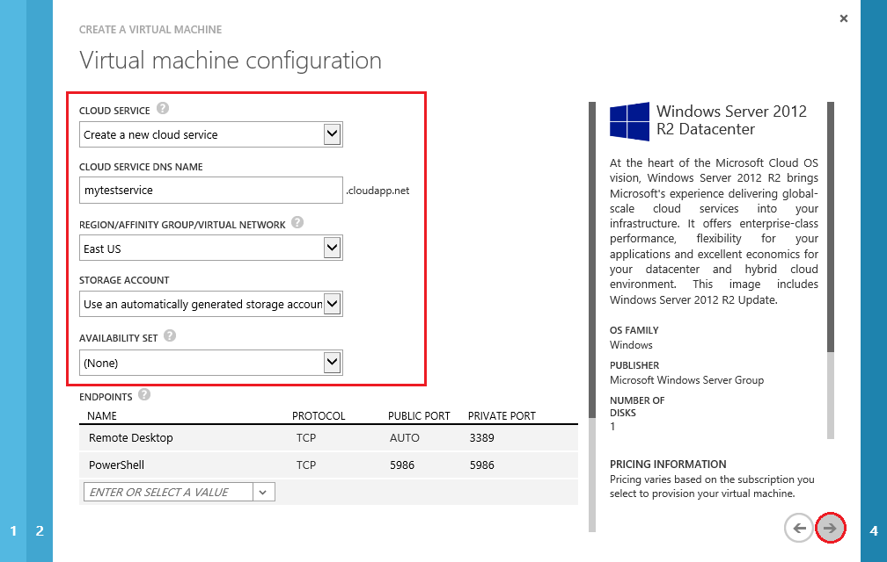
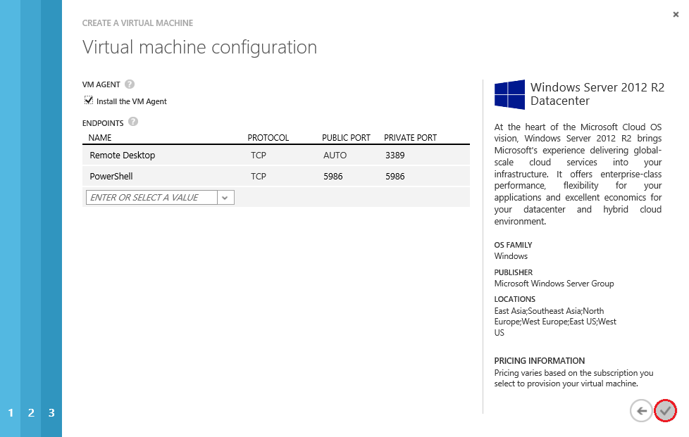

1. Sign in to the Windows Azure [Management Portal](http://manage.windowsazure.com). Check out the [Free Trial](http://www.windowsazure.com/en-us/pricing/free-trial/) offer if you do not have a subscription yet.

2. On the command bar at the bottom of the screen, click **New**.

	

3. Under **Compute**, click **Virtual Machine**, and then click **From Gallery**.

	
	
4. The first configuration screen lets you **Choose an Image** for your virtual machine from one of the lists in the Image Gallery. (The available images may differ depending on the subscription you're using.) For this tutorial, we will select **Windows Server 2012 R2 Datacenter**. Click the arrow to continue.

	

5. The second configuration screen lets you specify **attributes of the virtual machine** itself. For this tutorial, fill in the fields as shown in the image below. Once this screen is complete, click the arrow to continue.

	

	>[WACOM.NOTE]**New User Name** refers to the administrative account that will be used to manage the server. You will need to create your own unique password for this account.

6. The third configuration screen lets you specify attributes for **resources connected to the virtual machine** such as the cloud service and the storage account. For this tutorial, fill in the fields as shown in the image below. Once this screen is complete, click the arrow to continue. 

	

	Note that the **Cloud Service DNS Name** is the global DNS name that becomes part of the URI that is used to contact the virtual machine. You'll need to come up with your own cloud service name since cloud service names must be unique in Azure. Cloud services are important for more complex scenarios using [multiple virtual machines](http://www.windowsazure.com/en-us/documentation/articles/cloud-services-connect-virtual-machine/).
 
	For **Region/Affinity Group/Virtual Network**, use a region that is appropriate to your location. You can also choose to specify a virtual network instead.
 
	>[WACOM.NOTE]If you want a virtual machine to use a virtual network, you must specify the virtual network when you create the virtual machine. You can't join the virtual machine to a virtual network after you create the VM. For more information, see [Azure Virtual Network Overview](http://go.microsoft.com/fwlink/p/?LinkID=294063).

7. The fourth configuration screen lets you configure the **VM Agent and endpoints**. For this tutorial, do not make any changes to this screen. Click the check mark to create the virtual machine.

	

	>[WACOM.NOTE] The VM agent provides the environment for you to install extensions that can help you interact with the virtual machine. For details, see [Using Extensions](http://go.microsoft.com/FWLink/p/?LinkID=390493). For details about configuring endpoints, see [How to Set Up Endpoints to a Virtual Machine](http://www.windowsazure.com/en-us/documentation/articles/virtual-machines-set-up-endpoints/). 
    
8. After the virtual machine is created, the Management Portal lists the new virtual machine under **Virtual Machines**. The corresponding cloud service and storage account are also created under their respective sections. Both the virtual machine and cloud service are started automatically and the Management Portal shows their status as **Running**. 

	