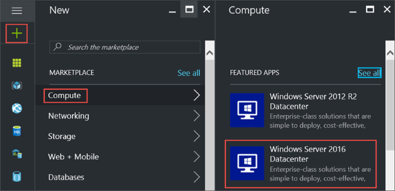
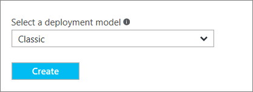
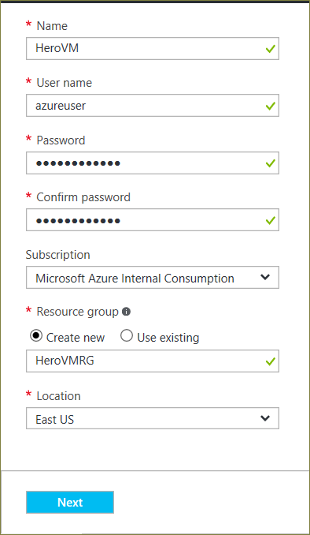
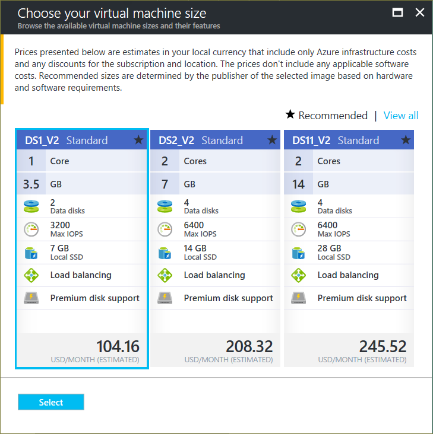
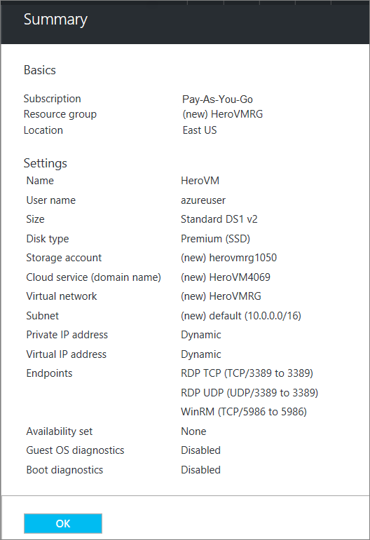
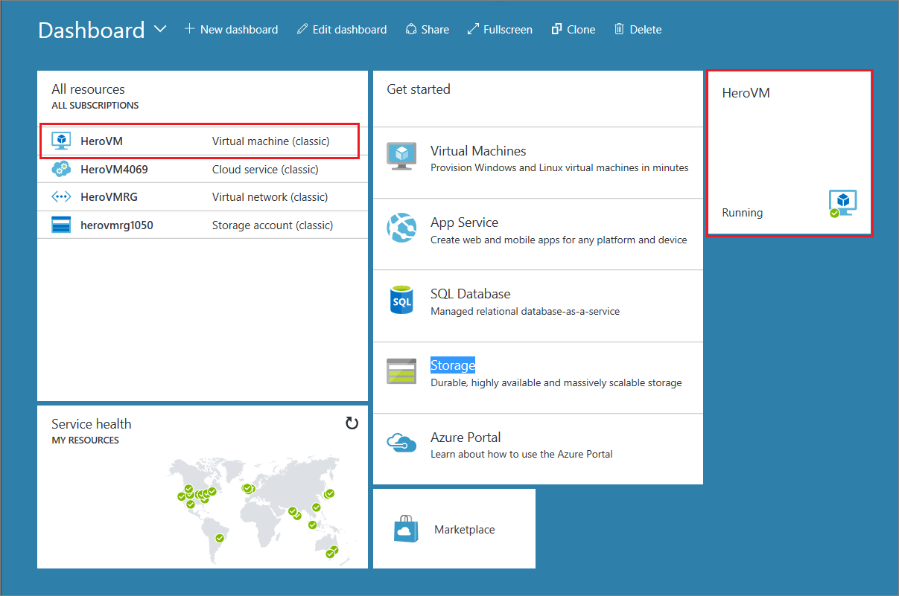

1. Sign in to the [Azure portal](https://portal.azure.com).

2. Starting in the upper left, click **New > Compute > Windows Server 2016 Datacenter**.

    

3. On the Windows Server 2016 Datacenter, select the Classic deployment model. Click Create.

    

## 1. Basics blade

The Basics blade requests administrative information for the virtual machine.

1. Enter a **Name** for the virtual machine. In the example, _HeroVM_ is the name of the virtual machine. The name must be 1-15 characters long and it cannot contain special characters.

2. Enter a **User name** and a strong **Password** that are used to create a local account on the VM. The local account is used to sign in to and manage the VM. In the example, _azureuser_ is the user name.

 The password must be 8-123 characters long and meet three out of the four following complexity requirements: one lower case character, one upper case character, one number, and one special character. See more about [username and password requirements](../articles/virtual-machines/windows/faq.md).

3. The **Subscription** is optional. One common setting is "Pay-As-You-Go".

4. Select an existing **Resource group** or type the name for a new one. In the example, _HeroVMRG_ is the name of the resource group.

5. Select an Azure datacenter **Location** where you want the VM to run. In the example, **East US** is the location.

6. When you are done, click **Next** to continue to the next blade.

    

## 2. Size blade

The Size blade identifies the configuration details of the VM, and lists various choices that include OS, number of processors, disk storage type, and estimated monthly usage costs.  

Choose a VM size, and then click **Select** to continue. In this example, _DS1_\__V2 Standard_ is the VM size.

  

## 3. Settings blade

The Settings blade requests storage and network options. You can accept the default settings. Azure creates appropriate entries where necessary.

If you selected a virtual machine size that supports it, you can try Azure Premium Storage by selecting Premium (SSD) in Disk type.

When you're done making changes, click **OK**.

## 4. Summary blade

The Summary blade lists the settings specified in the previous blades. Click **OK** when you're ready to make the image.

 

After the virtual machine is created, the portal lists the new virtual machine under **All resources**, and displays a tile of the virtual machine on the dashboard. The corresponding cloud service and storage account also are created and listed. Both the virtual machine and cloud service are started automatically and their status is listed as **Running**.

 
