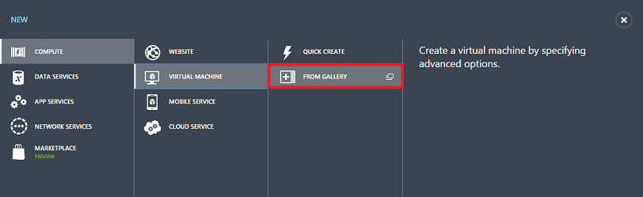
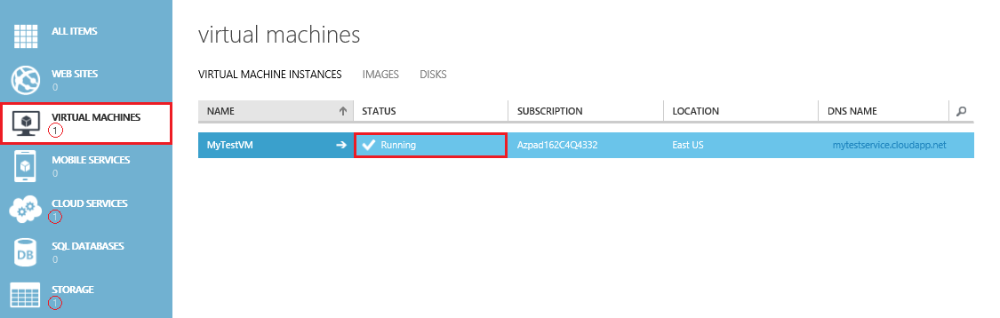

1. Sign in to the [Azure portal](http://manage.windowsazure.com). Check out the [Free Trial](http://azure.microsoft.com/pricing/free-trial/) offer if you don't have a subscription yet.

2. On the command bar at the bottom of the window, click **New**.

3. Under **Compute**, click **Virtual Machine**, and then click **From Gallery**.

	

4. The first screen after this lets you **Choose an Image** for your virtual machine from the list of available images. (The available images may differ depending on the subscription you're using.)

5. The second screen lets you pick a computer name, size, and administrative user name and password. Use the tier and size required to run your app or workload. Here are some tips:

	- **New User Name** refers to the administrative account that you use to manage the server. Create a unique password for this account and make sure to remember it. **You'll need the user name and password to log on to the virtual machine**.

	- A virtual machine's size affects the cost of using it, as well as configuration options such as how many data disks you can attach. For details, see [Sizes for virtual machines](../articles/virtual-machines-size-specs.md).

6. The third screen lets you configure resources for networking, storage, and availability. Here are some tips:

	- The **Cloud Service DNS Name** is the global DNS name that becomes part of the URI that's used to contact the virtual machine. You'll need to come up with your own cloud service name because it must be unique in Azure. Cloud services are important for scenarios using [multiple virtual machines](../articles/cloud-services-connect-virtual-machine.md).

	- For **Region/Affinity Group/Virtual Network**, use a region that's appropriate to your location. You can also choose to specify a virtual network instead.

	>[AZURE.NOTE] If you want a virtual machine to use a virtual network, you **must** specify the virtual network when you create the virtual machine. You can't join the virtual machine to a virtual network after you create the VM. For more information, see [Azure Virtual Network Overview](virtual-networks-overview.md).
	>
	> For details about configuring endpoints, see [How to Set Up Endpoints to a Virtual Machine](../articles/virtual-machines-set-up-endpoints.md).

7. The fourth configuration screen lets you install the VM Agent and configure some of the available extensions.

	>[AZURE.NOTE] The VM agent provides the environment for you to install extensions that can help you interact with or manage the virtual machine. For details, see [About the VM agent and extensions](virtual-machines-extensions-agent-about.md).  

8. After the virtual machine is created, the portal lists the new virtual machine under **Virtual Machines**. The corresponding cloud service and storage account also are created and are listed in those sections. Both the virtual machine and cloud service are started automatically and their status is listed as **Running**.

	
