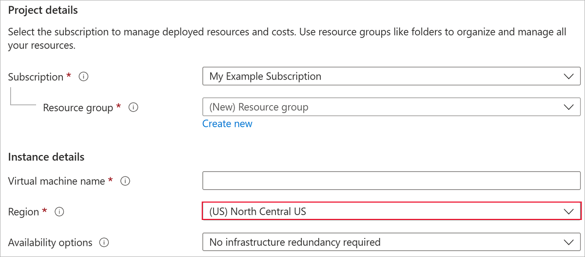
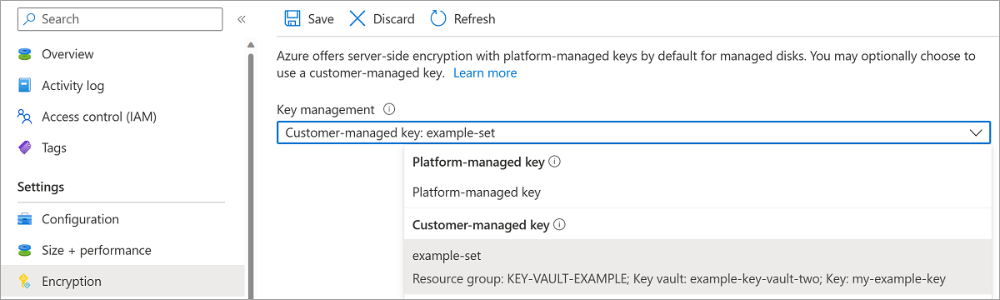

[!INCLUDE [virtual-machines-disks-encryption-create-key-vault-portal](virtual-machines-disks-encryption-create-key-vault-portal.md)]

## Deploy a VM

Now that you've created and set up your key vault and the disk encryption set, you can deploy a VM using the encryption.
The VM deployment process is similar to the standard deployment process, the only differences are that you need to deploy the VM in the same region as your other resources and you opt to use a customer managed key.

1. Search for **Virtual Machines** and select **+ Add** to create a VM.
1. On the **Basic** blade, select the same region as your disk encryption set and Azure Key Vault.
1. Fill in the other values on the **Basic** blade as you like.

    

1. On the **Disks** blade, select **Encryption at rest with a customer-managed key**.
1. Select your disk encryption set in the **Disk encryption set** drop-down.
1. Make the remaining selections as you like.

    

## Enable on an existing disk

> [!CAUTION]
> Enabling disk encryption on any disks attached to a VM will require that you stop the VM.
    
1. Navigate to a VM that is in the same region as one of your disk encryption sets.
1. Open the VM and select **Stop**.

    

1. After the VM has finished stopping, select **Disks** and then select the disk you want to encrypt.

    

1. Select **Encryption** and select **Encryption at rest with a customer-managed key** and then select your disk encryption set in the drop-down list.
1. Select **Save**.

    

1. Repeat this process for any other disks attached to the VM you'd like to encrypt.
1. When your disks finish switching over to customer-managed keys, if there are no there no other attached disks you'd like to encrypt, you may start your VM.
