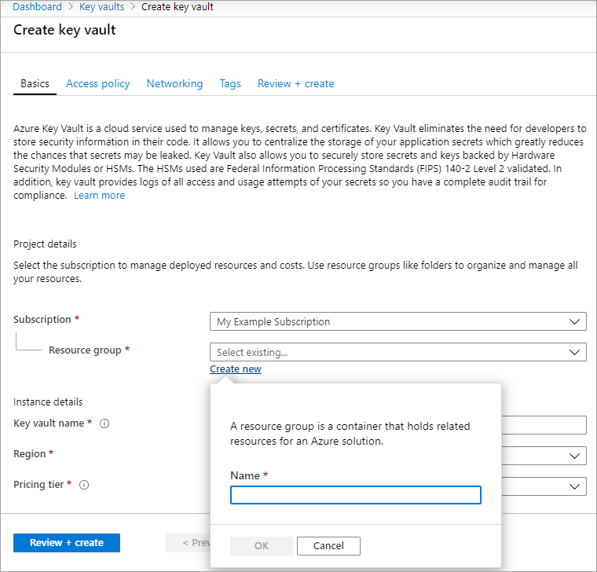
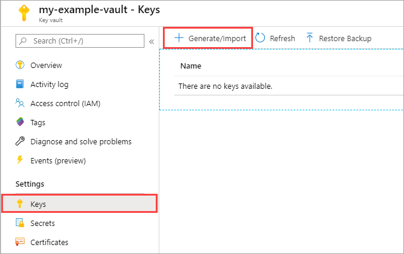
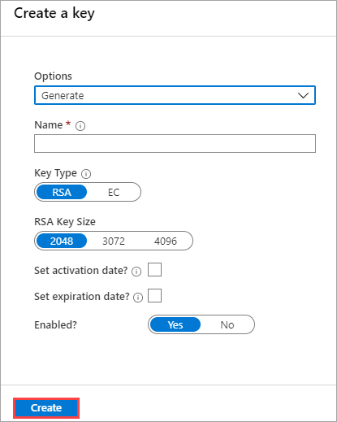
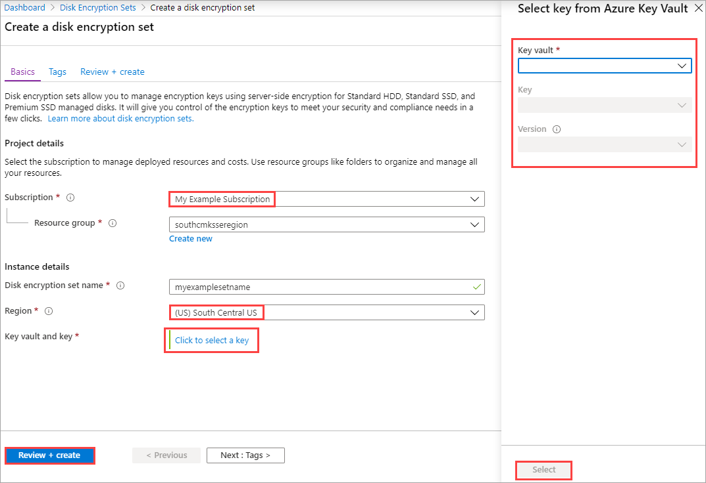
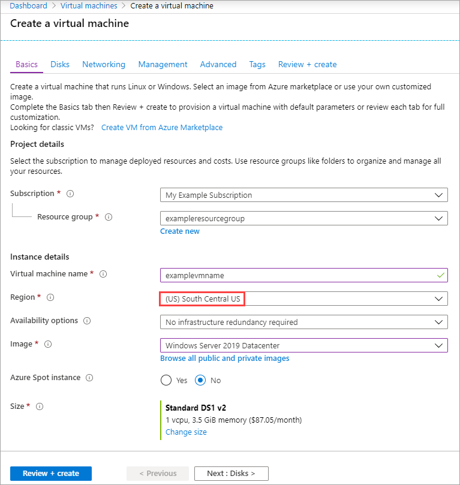

### Portal

Setting up customer-managed keys for your disks will require you to create resources in a particular order, if you're doing it for the first time. First, you will need to create and set up an Azure Key Vault.

#### Setting up your Azure Key Vault

1. Sign into the [Azure portal](https://portal.azure.com/).
1. Search for and select **Key Vaults**.

    

    > [!IMPORTANT]
    > Your Azure key vault, disk encryption set, VM, disks, and snapshots must all be in the same region and subscription for deployment to succeed.

1. Select **+Add** to create a new Key Vault.
1. Create a new resource group.
1. Enter a key vault name, select a region, and select a pricing tier.
1. Select **Review + Create**, verify your choices, then select **Create**.

    

1. Once your key vault finishes deploying, select it.
1. Select **Keys** under **Settings**.
1. Select **Generate/Import**.

    

1. Leave both **Key Type** set to **RSA** and **RSA Key Size** set to **2048**.
1. Fill in the remaining selections as you like and then select **Create**.

    

#### Setting up your disk encryption set

1. Search for **Disk Encryption Sets** and select it.
1. On the **Disk Encryption Sets** blade select **+Add**.

    

1. Select your resource group, name your encryption set, and select the same region as your key vault.
1. Select **Key vault and key**.
1. Select the key vault and key you created previously, as well as the version.
1. Press **Select**.
1. Select **Review + Create** and then **Create**.

    

1. Open the disk encryption set once it finishes creating and select the alert that pops up.

    

Two notifications should pop up and succeed. Doing this will allow you to use the disk encryption set with your key vault.

#### Deploy a VM

Now that you've created and set up your key vault and the disk encryption set, you can deploy a VM using the encryption.
The VM deployment process is similar to the standard deployment process, the only differences are that you need to deploy the VM in the same region as your other resources and you opt to use a customer managed key.

1. Search for **Virtual Machines** and select **+ Add** to create a VM.
1. On the **Basic** tab, select the same region as your disk encryption set and Azure Key Vault.
1. Fill in the other values on the **Basic** tab as you like.

    

1. On the **Disks** tab, select **Encryption at rest with a customer-managed key**.
1. Select your disk encryption set in the **Disk encryption set** drop-down.
1. Make the remaining selections as you like.

    

#### Enable on an existing disk

> [!CAUTION]
> Enabling disk encryption on any disks attached to a VM will require that you stop the VM.
    
1. Navigate to a VM that is in the same region as one of your disk encryption sets.
1. Open the VM and select **Stop**.

    

1. After the VM has finished stopping, select **Disks** and then select the disk you want to encrypt.

    

1. Select **Encryption** and select **Encryption at rest with a customer-managed key** and then select your disk encryption set in the drop-down list.
1. Select **Save**.

    

1. Repeat this process for any other disks attached to the VM you'd like to encrypt.
1. When your disks finish switching over to customer-managed keys, if there are no there no other attached disks you'd like to encrypt, you may start your VM.
