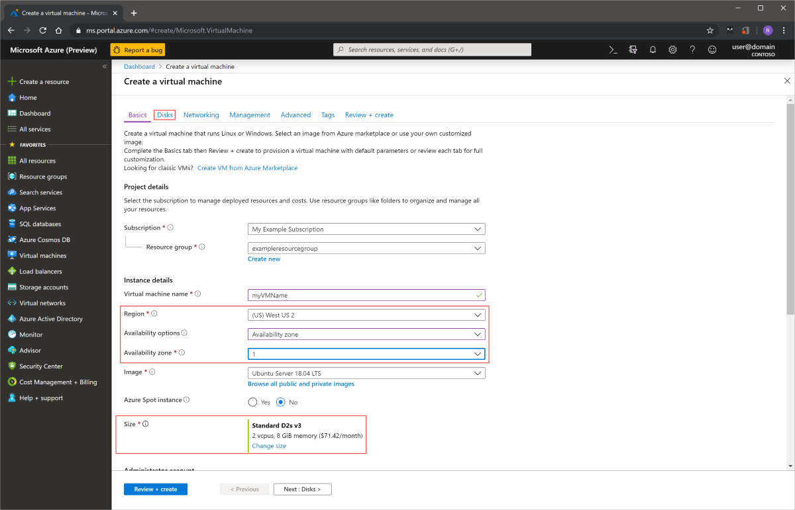
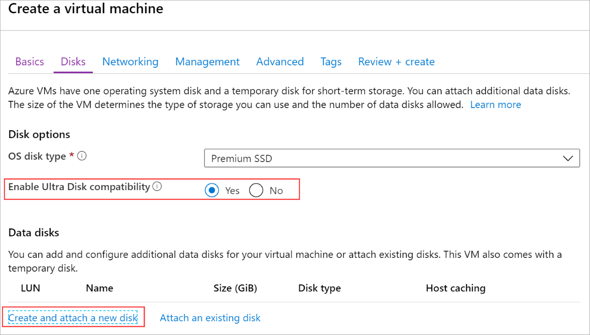
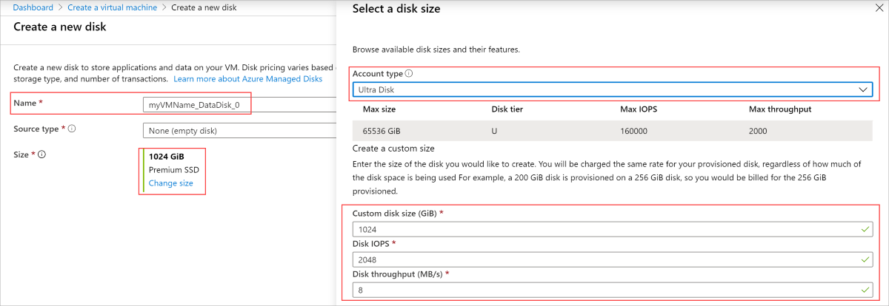
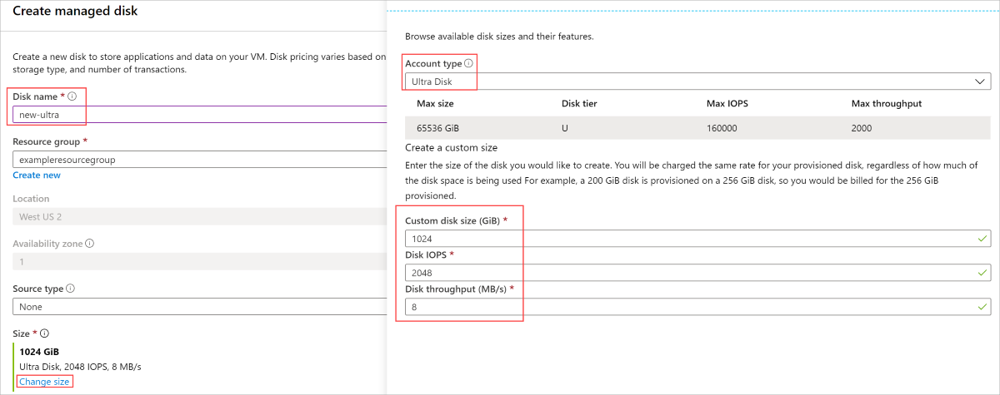
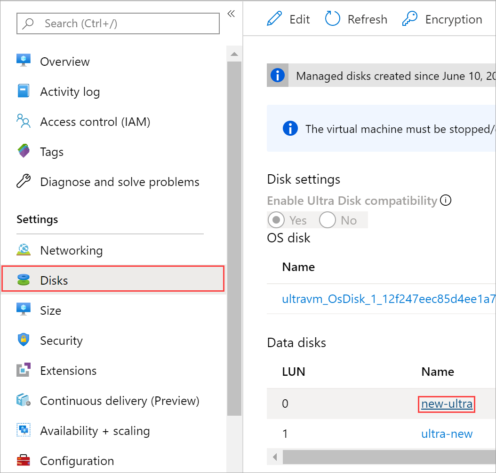
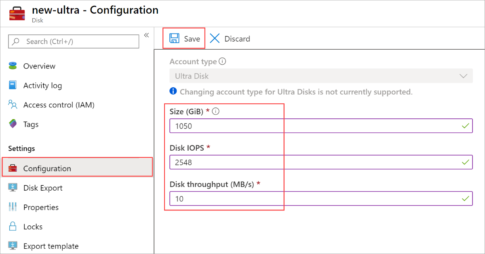

Azure ultra disks offer high throughput, high IOPS, and consistent low latency disk storage for Azure IaaS virtual machines (VMs). This new offering provides top of the line performance at the same availability levels as our existing disks offerings. One major benefit of ultra disks is the ability to dynamically change the performance of the SSD along with your workloads without the need to restart your VMs. Ultra disks are suited for data-intensive workloads such as SAP HANA, top tier databases, and transaction-heavy workloads.

## GA scope and limitations

[!INCLUDE [managed-disks-ultra-disks-GA-scope-and-limitations](managed-disks-ultra-disks-GA-scope-and-limitations.md)]

## Determine VM size and region availability

### VMs using availability zones

To leverage ultra disks, you need to determine which availability zone you are in. Not every region supports every VM size with ultra disks. To determine if your region, zone, and VM size support ultra disks, run either of the following commands, make sure to replace the **region**, **vmSize**, and **subscription** values first:

#### CLI

```azurecli
subscription = "<yourSubID>"
# example value is southeastasia
region = "<yourLocation>"
# example value is Standard_E64s_v3
vmSize = "<yourVMSize>"

az vm list-skus --resource-type virtualMachines  --location $region --query "[?name=='$vmSize'].locationInfo[0].zoneDetails[0].Name" --subscription $subscription
```

#### PowerShell

```powershell
$region = "southeastasia"
$vmSize = "Standard_E64s_v3"
(Get-AzComputeResourceSku | where {$_.Locations.Contains($region) -and ($_.Name -eq $vmSize) -and $_.LocationInfo[0].ZoneDetails.Count -gt 0})[0].LocationInfo[0].ZoneDetails
```

The response will be similar to the form below, where X is the zone to use for deploying in your chosen region. X could be either 1, 2, or 3.

Preserve the **Zones** value, it represents your availability zone and you will need it in order to deploy an Ultra disk.

|ResourceType  |Name  |Location  |Zones  |Restriction  |Capability  |Value  |
|---------|---------|---------|---------|---------|---------|---------|
|disks     |UltraSSD_LRS         |eastus2         |X         |         |         |         |

> [!NOTE]
> If there was no response from the command, then the selected VM size is not supported with ultra disks in the selected region.

Now that you know which zone to deploy to, follow the deployment steps in this article to either deploy a VM with an ultra disk attached or attach an ultra disk to an existing VM.

### VMs with no redundancy options

Ultra disks deployed in West US must be deployed without any redundancy options, for now. However, not every disk size that supports ultra disks may be in this region. To determine which ones in West US support ultra disks, you can use either of the following code snippets. Make sure to replace the `vmSize` and `subscription` values first:

```azurecli
subscription = "<yourSubID>"
region = "westus"
# example value is Standard_E64s_v3
vmSize = "<yourVMSize>"

az vm list-skus --resource-type virtualMachines  --location $region --query "[?name=='$vmSize'].capabilities" --subscription $subscription
```

```azurepowershell
$region = "westus"
$vmSize = "Standard_E64s_v3"
(Get-AzComputeResourceSku | where {$_.Locations.Contains($region) -and ($_.Name -eq $vmSize) })[0].Capabilities
```

The response will be similar to the following form, `UltraSSDAvailable   True` indicates whether the VM size supports ultra disks in this region.

```
Name                                         Value
----                                         -----
MaxResourceVolumeMB                          884736
OSVhdSizeMB                                  1047552
vCPUs                                        64
HyperVGenerations                            V1,V2
MemoryGB                                     432
MaxDataDiskCount                             32
LowPriorityCapable                           True
PremiumIO                                    True
VMDeploymentTypes                            IaaS
vCPUsAvailable                               64
ACUs                                         160
vCPUsPerCore                                 2
CombinedTempDiskAndCachedIOPS                128000
CombinedTempDiskAndCachedReadBytesPerSecond  1073741824
CombinedTempDiskAndCachedWriteBytesPerSecond 1073741824
CachedDiskBytes                              1717986918400
UncachedDiskIOPS                             80000
UncachedDiskBytesPerSecond                   1258291200
EphemeralOSDiskSupported                     True
AcceleratedNetworkingEnabled                 True
RdmaEnabled                                  False
MaxNetworkInterfaces                         8
UltraSSDAvailable                            True
```

## Deploy an ultra disk using Azure Resource Manager

First, determine the VM size to deploy. For a list of supported VM sizes, see the [GA scope and limitations](#ga-scope-and-limitations) section.

If you would like to create a VM with multiple ultra disks, refer to the sample [Create a VM with multiple ultra disks](https://aka.ms/ultradiskArmTemplate).

If you intend to use your own template, make sure that **apiVersion** for `Microsoft.Compute/virtualMachines` and `Microsoft.Compute/Disks` is set as `2018-06-01` (or later).

Set the disk sku to **UltraSSD_LRS**, then set the disk capacity, IOPS, availability zone, and throughput in MBps to create an ultra disk.

Once the VM is provisioned, you can partition and format the data disks and configure them for your workloads.


## Deploy an ultra disk using the Azure portal

This section covers deploying a virtual machine equipped with an ultra disk as a data disk. It assumes you have familiarity with deploying a virtual machine, if you do not, see our [Quickstart: Create a Windows virtual machine in the Azure portal](../articles/virtual-machines/windows/quick-create-portal.md).

- Sign in to the [Azure portal](https://portal.azure.com/) and navigate to deploy a virtual machine (VM).
- Make sure to choose a [supported VM size and region](#ga-scope-and-limitations).
- Select **Availability zone** in **Availability options**.
- Fill in the remaining entries with selections of your choice.
- Select **Disks**.



- On the Disks blade, select **Yes** for **Enable Ultra Disk compatibility**.
- Select **Create and attach a new disk** to attach an ultra disk now.



- On the **Create a new disk** blade, enter a name, then select **Change size**.
- Change the **Account type** to **Ultra Disk**.
- Change the values of **Custom disk size (GiB)**, **Disk IOPS**, and **Disk throughput** to ones of your choice.
- Select **OK** in both blades.
- Continue with the VM deployment, it will be the same as you would deploy any other VM.



## Attach an ultra disk using the Azure portal

Alternatively, if your existing VM is in a region/availability zone that is capable of using ultra disks, you can make use of ultra disks without having to create a new VM. By enabling ultra disks on your existing VM, then attaching them as data disks.

- Navigate to your VM and select **Disks**.
- Select **Edit**.


- Select **Yes** for **Enable Ultra Disk compatibility**.


- Select **Save**.
- Select **Add data disk** then in the dropdown for **Name** select **Create disk**.


- Fill in a name for your new disk, then select **Change size**.
- Change the **Account type** to **Ultra Disk**.
- Change the values of **Custom disk size (GiB)**, **Disk IOPS**, and **Disk throughput** to ones of your choice.
- Select **OK** then select **Create**.



- After you are returned to your disk's blade, select **Save**.


### Adjust the performance of an ultra disk using the Azure portal

Ultra disks offer a unique capability that allows you to adjust their performance. You can make these adjustments from the Azure portal, on the disks themselves.

- Navigate to your VM and select **Disks**.
- Select the ultra disk you'd like to modify the performance of.



- Select **Configuration** and then make your modifications.
- Select **Save**.



## Deploy an ultra disk using CLI

First, determine the VM size to deploy. See the [GA scope and limitations](#ga-scope-and-limitations) section for a list of supported VM sizes.

You must create a VM that is capable of using ultra disks, in order to attach an ultra disk.

Replace or set the **$vmname**, **$rgname**, **$diskname**, **$location**, **$password**, **$user** variables with your own values. Set **$zone**  to the value of your availability zone that you got from the [start of this article](#determine-vm-size-and-region-availability). Then run the following CLI command to create an ultra enabled VM:

```azurecli-interactive
az vm create --subscription $subscription -n $vmname -g $rgname --image Win2016Datacenter --ultra-ssd-enabled true --zone $zone --authentication-type password --admin-password $password --admin-username $user --size Standard_D4s_v3 --location $location
```

### Enable ultra disk compatibility on an existing VM

If your VM meets the requirements outlined in [GA scope and limitations](#ga-scope-and-limitations) and is in the [appropriate zone for your account](#determine-vm-size-and-region-availability), then you can enable ultra disk compatibility on your VM.

To enable ultra disk compatibility, you must stop the VM. After you stop the VM, you may enable compatibility, attach an ultra disk, then restart the VM:

```azurecli
az vm deallocate -n $vmName -g $rgName
az vm update -n $vmName -g $rgName --ultra-ssd-enabled true
az vm start -n $vmName -g $rgName
```

### Create an ultra disk using CLI

Now that you have a VM that is capable of attaching ultra disks, you can create and attach an ultra disk to it.

```azurecli-interactive
location="eastus2"
subscription="xxx"
rgname="ultraRG"
diskname="ssd1"
vmname="ultravm1"
zone=123

#create an ultra disk
az disk create `
--subscription $subscription `
-n $diskname `
-g $rgname `
--size-gb 4 `
--location $location `
--zone $zone `
--sku UltraSSD_LRS `
--disk-iops-read-write 1000 `
--disk-mbps-read-write 50
```

## Attach an ultra disk to a VM using CLI

Alternatively, if your existing VM is in a region/availability zone that is capable of using ultra disks, you can make use of ultra disks without having to create a new VM.

```azurecli
rgName = "<yourResourceGroupName>"
vmName = "<yourVMName>"
diskName = "<yourDiskName>"
subscriptionId = "<yourSubscriptionID>"

az vm disk attach -g $rgName --vm-name $vmName --disk $diskName --subscription $subscriptionId
```

### Adjust the performance of an ultra disk using CLI

Ultra disks offer a unique capability that allows you to adjust their performance, the following command depicts how to use this feature:

```azurecli-interactive
az disk update `
--subscription $subscription `
--resource-group $rgname `
--name $diskName `
--set diskIopsReadWrite=80000 `
--set diskMbpsReadWrite=800
```

## Deploy an ultra disk using PowerShell

First, determine the VM size to deploy. See the [GA scope and limitations](#ga-scope-and-limitations) section for a list of supported VM sizes.

To use ultra disks, you must create a VM that is capable of using ultra disks. Replace or set the **$resourcegroup** and **$vmName** variables with your own values. Set **$zone** to the value of your availability zone that you got from the [start of this article](#determine-vm-size-and-region-availability). Then run the following [New-AzVm](/powershell/module/az.compute/new-azvm) command to create an ultra enabled VM:

```powershell
New-AzVm `
    -ResourceGroupName $resourcegroup `
    -Name $vmName `
    -Location "eastus2" `
    -Image "Win2016Datacenter" `
    -EnableUltraSSD $true `
    -size "Standard_D4s_v3" `
    -zone $zone
```

### Enable ultra disk compatibility on an existing VM

If your VM meets the requirements outlined in [GA scope and limitations](#ga-scope-and-limitations) and is in the [appropriate zone for your account](#determine-vm-size-and-region-availability), then you can enable ultra disk compatibility on your VM.

To enable ultra disk compatibility, you must stop the VM. After you stop the VM, you may enable compatibility, attach an ultra disk, then restart the VM:

```azurepowershell
#stop the VM
$vm1 = Get-AzureRMVM -name $vmName -ResourceGroupName $rgName
Update-AzureRmVM -ResourceGroupName $rgName -VM $vm1 -UltraSSDEnabled 1
#start the VM
```

### Create an ultra disk using PowerShell

Now that you have a VM that is capable of using ultra disks, you can create and attach an ultra disk to it:

```powershell
$diskconfig = New-AzDiskConfig `
-Location 'EastUS2' `
-DiskSizeGB 8 `
-DiskIOPSReadWrite 1000 `
-DiskMBpsReadWrite 100 `
-AccountType UltraSSD_LRS `
-CreateOption Empty `
-zone $zone;

New-AzDisk `
-ResourceGroupName $resourceGroup `
-DiskName 'Disk02' `
-Disk $diskconfig;
```

## Attach an ultra disk to a VM using PowerShell

Alternatively, if your existing VM is in a region/availability zone that is capable of using ultra disks, you can make use of ultra disks without having to create a new VM.

```powershell
# add disk to VM
$subscription = "<yourSubscriptionID>"
$resourceGroup = "<yourResourceGroup>"
$vmName = "<yourVMName>"
$diskName = "<yourDiskName>"
$lun = 1
Login-AzureRMAccount -SubscriptionId $subscription
$vm = Get-AzVM -ResourceGroupName $resourceGroup -Name $vmName
$disk = Get-AzDisk -ResourceGroupName $resourceGroup -Name $diskName
$vm = Add-AzVMDataDisk -VM $vm -Name $diskName -CreateOption Attach -ManagedDiskId $disk.Id -Lun $lun
Update-AzVM -VM $vm -ResourceGroupName $resourceGroup
```

### Adjust the performance of an ultra disk using PowerShell

Ultra disks have a unique capability that allows you to adjust their performance, the following command is an example that adjusts the performance without having to detach the disk:

```powershell
$diskupdateconfig = New-AzDiskUpdateConfig -DiskMBpsReadWrite 2000
Update-AzDisk -ResourceGroupName $resourceGroup -DiskName $diskName -DiskUpdate $diskupdateconfig
```
