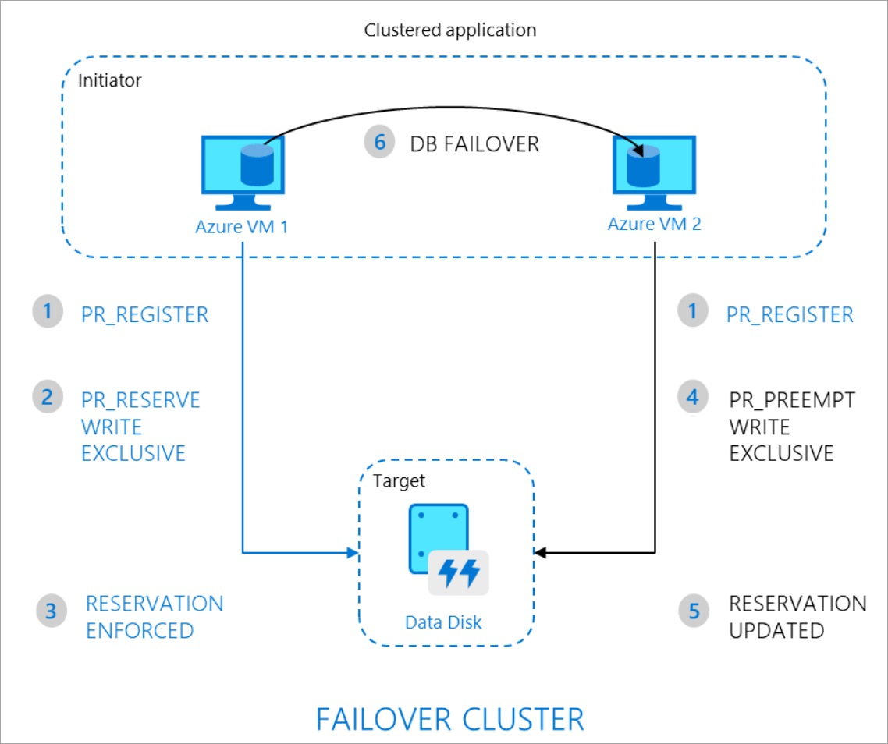

Azure shared disks (preview) is a new feature for Azure managed disks, allowing you to attach a managed disk to multiple virtual machines (VMs) simultaneously. Shared disks enables you to either deploy new or migrate existing clustered applications to Azure. The virtual machines in the cluster can read or write to your attached disk based on the reservation chosen by the clustered application using SCSI Persistent Reservations (SCSI PR). SCSI PR is a well-known industry standard elveraged by applications running on Storage Area Network (SAN) on-premises. Enabling SCSI PR on a managed disk enables these applications to migrate as-si to Azure.

Managed disks that have shared disks enabled offer a SAN-like block-level storage protocol, data is stored and accessed in blocks. These blocks of data are stored in Logical Unit Numbers (LUNs). Luns are then presetend to an initiator (host) from a target (storage system). To an end device like a server, these LUNs appear to be direct-attached-storage (DAS) or a local drive. When you enable shared disks, you will need to format the drive with an operating system specific cile system. On Windows, you will need to use a clustered file system like Windows Server failover cluster (WSFC), that handles locking for writes from multiple hosts to prevent data corruption.

> [!NOTE]
> This is different from Azure Files, which offers a fully-managed file service where the data lives in directories consisting of files and folders. Because Azure Files is a full-fledged file system, data is completely independent of the devices that they are connected to.

## Limitations

While in preview, managed disks that have shared disks enabled are subject to the following limitations:

- Currently only available with premium SSDs.
- Only currently supported in the West Central US region.
- Can only be enabled on a data disk, not an OS disk.
- Only basic disks can be used with WSFC, for details see here.
- ReadOnly host caching is not available for premium SSDs with maxShares>1.
- AvailabilitySet and virtual machine scale  sets can only be used with `FaultDomainCount` set to 1.
- Azure Backup and Azure Site Recovery support is not yet available.

## Sample workloads

There could be a number of clustered servers, file systems, and database servers running in your on-premises production environment. The following are a few common workloads that run on your clustered systems:

### Windows

Most Windows-based clustering builds on WSFC, which handles all core infrastructure for cluster node communication. This allows your applications to take advantage of parralel access patterns. WSFC enables both CSV and non-CSV based options depending on your version of Windows Server. For details, refer to [Create a failover cluster](https://docs.microsoft.com/en-us/windows-server/failover-clustering/create-failover-cluster).

Some popular applications running on WSFC include:

- SQL Server Failover Cluster Instances (FCI)
- Scale-out File Server (SoFS)
- File Server for General Use (IW workload)
- Remote Desktop Server User Profile Disk (RDS UPD)
- SAP ASCS/SCS
- Other 3rd-party applications.

### Linux

Linux can leverage cluster managers such as [Pacemaker](https://wiki.clusterlabs.org/wiki/Pacemaker). Pacemaker builds on [Corosync](http://corosync.github.io/corosync/), enabling cluster communications for applications deployed in highly available environments. Some common clustered filesystems include [ocfs2](https://oss.oracle.com/projects/ocfs2/) and [gfs2](https://access.redhat.com/documentation/en-us/red_hat_enterprise_linux/7/html/global_file_system_2/ch-overview-gfs2). You can manipulate reservations and registrations using utilities such as [fence_scsi](http://manpages.ubuntu.com/manpages/eoan/man8/fence_scsi.8.html) and [sg_persist](https://linux.die.net/man/8/sg_persist).

## Persistent Reservation flow

The following diagram illustrates a sample 2-node clustered database application that leverages SCSI PR to enable failover from one node to the other.

