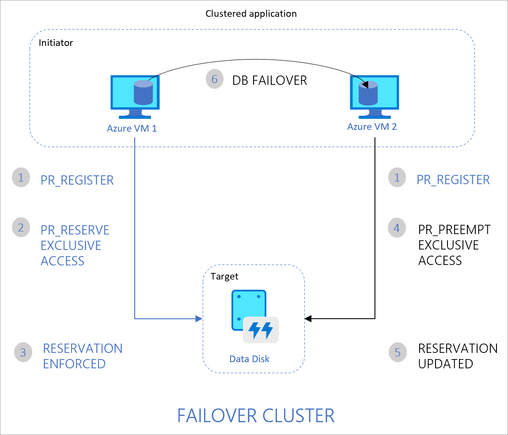

Azure shared disks (preview) is a new feature for Azure managed disks that enables attaching an Azure managed disk to multiple virtual machines (VMs) simultaneously. Attaching a managed disk to multiple VMs allows you to either deploy new or migrate existing clustered applications to Azure.

## How it works

VMs in the cluster can read or write to your attached disk based on the reservation chosen by the clustered application using [SCSI Persistent Reservations](https://www.t10.org/members/w_spc3.htm) (SCSI PR). SCSI PR is a well-known industry standard leveraged by applications running on Storage Area Network (SAN) on-premises. Enabling SCSI PR on a managed disk allows you to migrate these applications to Azure as-is.

Managed disks with shared disks enabled offer shared block storage that can be accessed by multiple VMs, this is exposed as logical unit numbers (LUNs). LUNs are then presented to an initiator (VM) from a target (disk). These LUNs look like direct-attached-storage (DAS) or a local drive to the VM.

Managed disks with shared disks enabled do not natively offer a fully-managed file system that can be accessed using SMB/NFS. You will need to use a cluster manager, like Windows Server Failover Cluster (WSFC) or Pacemaker, that handles cluster node communication as well as write locking.

## Limitations

[!INCLUDE [virtual-machines-disks-shared-limitations](virtual-machines-disks-shared-limitations.md)]

## Disk sizes

[!INCLUDE [virtual-machines-disks-shared-sizes](virtual-machines-disks-shared-sizes.md)]

## Sample workloads

### Windows

Most Windows-based clustering build on WSFC, which handles all core infrastructure for cluster node communication, allowing your applications to take advantage of parallel access patterns. WSFC enables both CSV and non-CSV-based options depending on your version of Windows Server. For details, refer to [Create a failover cluster](https://docs.microsoft.com/windows-server/failover-clustering/create-failover-cluster).

Some popular applications running on WSFC include:

- SQL Server Failover Cluster Instances (FCI)
- Scale-out File Server (SoFS)
- File Server for General Use (IW workload)
- Remote Desktop Server User Profile Disk (RDS UPD)
- SAP ASCS/SCS

### Linux

Linux clusters can leverage cluster managers such as [Pacemaker](https://wiki.clusterlabs.org/wiki/Pacemaker). Pacemaker builds on [Corosync](http://corosync.github.io/corosync/), enabling cluster communications for applications deployed in highly available environments. Some common clustered filesystems include [ocfs2](https://oss.oracle.com/projects/ocfs2/) and [gfs2](https://access.redhat.com/documentation/en-us/red_hat_enterprise_linux/7/html/global_file_system_2/ch-overview-gfs2). You can manipulate reservations and registrations using utilities such as [fence_scsi](http://manpages.ubuntu.com/manpages/eoan/man8/fence_scsi.8.html) and [sg_persist](https://linux.die.net/man/8/sg_persist).

## Persistent Reservation flow

The following diagram illustrates a sample 2-node clustered database application that leverages SCSI PR to enable failover from one node to the other.

The flow is as follows:

1. The clustered application running on both Azure VM1 and VM2 registers its intent to read or write to the disk.
1. The application instance on VM1 then takes exclusive reservation to write to the disk.
1. This reservation is enforced on your Azure disk and the database can now exclusively write to the disk. Any writes from the application instance on VM2 will not succeed.
1. If the application instance on VM1 goes down, the instance on VM2 can now initiate a database failover and take-over of the disk.
1. This reservation is now enforced on the Azure disk and the disk will no longer accept writes from VM1. It will only accept writes from VM2.
1. The clustered application can complete the database failover and serve requests from VM2.

The following diagram illustrates another common clustered workload consisting of multiple nodes reading data from the disk for running parallel processes, such as training of machine learning models.

The flow is as follows:

1. The clustered application running on all VMs registers the intent to read or write to the disk.
1. The application instance on VM1 takes an exclusive reservation to write to the disk while opening up reads to the disk from other VMs.
1. This reservation is enforced on your Azure disk.
1. All nodes in the cluster can now read from the disk. Only one node writes back results to the disk, on behalf of all nodes in the cluster.