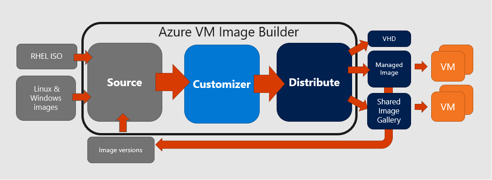
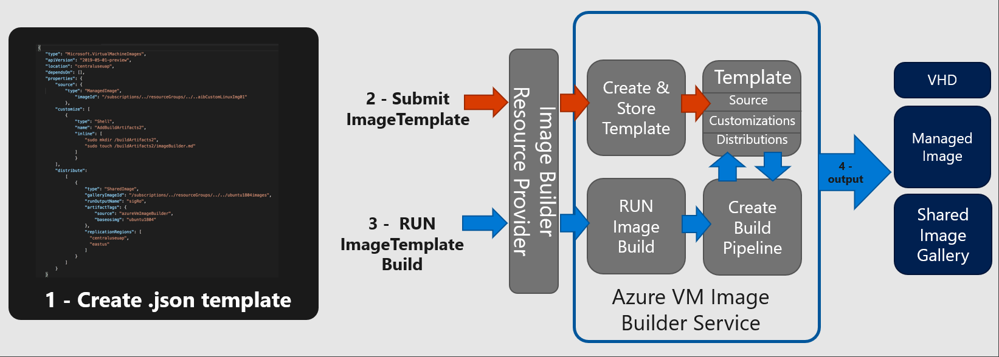

Standardized virtual machine (VM) images allow organizations to migrate to the cloud and ensure consistency in the deployments. Images typically include predefined security and configuration settings and necessary software. Setting up your own imaging pipeline requires time, infrastructure and setup, but with Azure VM Image Builder, just provide a simple configuration describing your image, submit it to the service, and the image is built, and distributed.
 
The Azure VM Image Builder (Azure Image Builder) lets you start with a Windows or Linux-based Azure Marketplace image, existing custom images or Red Hat Enterprise Linux (RHEL) ISO and begin to add your own customizations. Because the Image Builder is built on [HashiCorp Packer](https://packer.io/), you can also import your existing Packer shell provisioner scripts. You can also specify where you would like your images hosted, in the [Azure Shared Image Gallery](https://docs.microsoft.com/azure/virtual-machines/windows/shared-image-galleries), as a managed image or a VHD.

> [!IMPORTANT]
> Azure Image Builder is currently in public preview.
> This preview version is provided without a service level agreement, and it's not recommended for production workloads. Certain features might not be supported or might have constrained capabilities. 
> For more information, see [Supplemental Terms of Use for Microsoft Azure Previews](https://azure.microsoft.com/support/legal/preview-supplemental-terms/).

## Preview features

For the preview, these features are supported:

- Creation of golden baseline images, that includes your minimum security and corporate configurations, and allow departments to customize it further for their needs.
- Patching of existing images, Image Builder will allow you to continually patch existing custom images.
- Integration with the Azure Shared Image Gallery, allows you to distribute, version, and scale images globally, and gives you an image management system.
- Integration with existing image build pipelines, just call Image Builder from your pipeline, or use the simple Preview Image Builder Azure DevOps Task.
- Migrate an existing image customization pipeline to Azure. Use your existing scripts, commands, and processes to customize images.
- Use Red Hat Bring Your Own Subscription support. Create Red Hat Enterprise images for use with your eligible, unused Red Hat subscriptions.
- Creation of images in VHD format.
 

## Regions
The Azure Image Builder Service will be available for preview in these regions. Images can be distributed outside of these regions.
- East US
- East US 2
- West Central US
- West US
- West US 2

## OS support
AIB will support Azure Marketplace base OS images:
- Ubuntu 18.04
- Ubuntu 16.04
- RHEL 7.6, 7.7
- CentOS 7.6, 7.7
- SLES 12 SP4
- SLES 15, SLES 15 SP1
- Windows 10 RS5 Enterprise/Professional/Enterprise for Virtual Desktop (EVD) 
- Windows 2016
- Windows 2019

AIB will support RHEL ISO's, as a source for:
- RHEL 7.3
- RHEL 7.4
- RHEL 7.5

RHEL 7.6 ISOs are not supported, but are being tested.

## How it works




The Azure Image Builder is a fully managed Azure service that is accessible by an Azure resource provider. The Azure Image Builder process has three main parts: source, customize and distribute, these are represented in a template. The diagram below shows the components, with some of their properties. 
 


**Image Builder process** 



1. Create the Image Template as a .json file. This .json file contains information about the image source, customizations, and distribution. There are multiple examples in the [Azure Image Builder GitHub repository](https://github.com/danielsollondon/azvmimagebuilder/tree/master/quickquickstarts).
1. Submit it to the service, this will create an Image Template artifact in the resource group you specify. In the background, Image Builder will download the source image or ISO, and scripts as needed. These are stored in a separate resource group that is automatically created in your subscription, in the format: IT_\<DestinationResourceGroup>_\<TemplateName>. 
1. Once the Image Template is created, you can then build the image. In the background Image Builder uses the template and source files to create a VM (default size: Standard_D1_v2), network, public IP, NSG, and storage in the IT_\<DestinationResourceGroup>_\<TemplateName> resource group.
1. As part of the image creation, Image builder distributes the image it according to the template, then deletes the additional resources in the IT_\<DestinationResourceGroup>_\<TemplateName> resource group that was created for the process.


## Permissions

To allow Azure VM Image Builder to distribute images to either the managed images or to a Shared Image Gallery, you will need to provide 'Contributor' permissions for the service "Azure Virtual Machine Image Builder" (app ID: cf32a0cc-373c-47c9-9156-0db11f6a6dfc) on the resource groups. 

If you are using an existing custom managed image or image version, then the Azure Image Builder will need a minimum of ‘Reader’ access to those resource groups.

You can assign access using the Azure CLI:

```azurecli-interactive
az role assignment create \
    --assignee cf32a0cc-373c-47c9-9156-0db11f6a6dfc \
    --role Contributor \
    --scope /subscriptions/$subscriptionID/resourceGroups/<distributeResoureGroupName>
```

You can assign access using the PowerShell:

```azurePowerShell-interactive
New-AzRoleAssignment -ObjectId ef511139-6170-438e-a6e1-763dc31bdf74 -Scope /subscriptions/$subscriptionID/resourceGroups/<distributeResoureGroupName> -RoleDefinitionName Contributor
```


If the service account is not found, that may mean that the subscription where you are adding the role assignment has not yet registered for the resource provider.


## Costs
You will incur some compute, networking and storage costs when creating, building and storing images with Azure Image Builder. These costs are similar to the costs incurred in manually creating custom images. For the resources, you will be charged at your Azure rates. 

During the image creation process, files are downloaded and stored in the `IT_<DestinationResourceGroup>_<TemplateName>` resource group, which will incur a small storage costs. If you do not want to keep these, delete the **Image Template** after the image build.
 
Image Builder creates a VM using a D1v2 VM size, and the storage, and networking needed for the VM. These resources will last for the duration of the build process, and will be deleted once Image Builder has finished creating the image. 
 
Azure Image Builder will distribute the image to your chosen regions, which might incur network egress charges.
 
## Next steps 
 
To try out the Azure Image Builder, see the articles for building [Linux](../articles/virtual-machines/linux/image-builder.md) or [Windows](../articles/virtual-machines/windows/image-builder.md) images.
 
 
