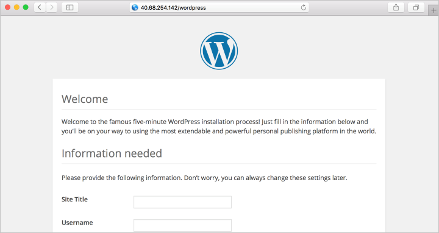

## Install WordPress

If you want to try your stack, install a sample app. As an example, the following steps install the open source [WordPress](https://wordpress.org/) platform to create websites and blogs. Other workloads to try include [Drupal](http://www.drupal.org) and [Moodle](https://moodle.org/). 

This WordPress setup is only for proof of concept. To install the latest WordPress in production with recommended security settings, see the [WordPress documentation](https://codex.wordpress.org/Main_Page). 


### Install the WordPress package

Run the following command:

```bash
sudo apt install wordpress
```

### Configure WordPress

Configure WordPress to use MySQL and PHP.

In a working directory, create a text file `wordpress.sql` to configure the MySQL database for WordPress: 

```bash
sudo sensible-editor wordpress.sql
```

Add the following commands, substituting a database password of your choice for *yourPassword* (leave other values unchanged). If you previously set up a MySQL security policy to validate password strength, make sure the password meets the strength requirements. Save the file.

```sql
CREATE DATABASE wordpress;
GRANT SELECT,INSERT,UPDATE,DELETE,CREATE,DROP,ALTER
ON wordpress.*
TO wordpress@localhost
IDENTIFIED BY 'yourPassword';
FLUSH PRIVILEGES;
```

Run the following command to create the database:

```bash
cat wordpress.sql | sudo mysql --defaults-extra-file=/etc/mysql/debian.cnf
```

Because the file `wordpress.sql` contains database credentials, delete it after use:

```bash
sudo rm wordpress.sql
```

To configure PHP, run the following command to open a text editor of your choice and create the file `/etc/wordpress/config-localhost.php`:

```bash
sudo sensible-editor /etc/wordpress/config-localhost.php
```
Copy the following lines to the file, substituting your WordPress database password for *yourPassword* (leave other values unchanged). Then save the file.

```php
<?php
define('DB_NAME', 'wordpress');
define('DB_USER', 'wordpress');
define('DB_PASSWORD', 'yourPassword');
define('DB_HOST', 'localhost');
define('WP_CONTENT_DIR', '/usr/share/wordpress/wp-content');
?>
```


Move the WordPress installation to the web server document root:

```bash
sudo ln -s /usr/share/wordpress /var/www/html/wordpress

sudo mv /etc/wordpress/config-localhost.php /etc/wordpress/config-default.php
```

Now you can complete the WordPress setup and publish on the platform. Open a browser and go to `http://yourPublicIPAddress/wordpress`. Substitute the public IP address of your VM. It should look similar to this image.

