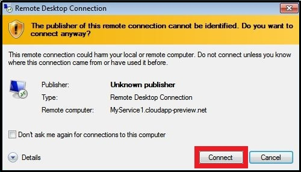

<properties services="virtual-machines" title="How to Log on to a Virtual Machine Running Windows Server" authors="KBDAzure" solutions="" manager="timlt" editor="tysonn" />

>[AZURE.NOTE] If you need to reset the user name or password, or reset RDP in the virtual machine, see [How to Reset a Password or the Remote Desktop Service for Windows Virtual Machines](../articles/virtual-machines-windows-reset-password.md). For detailed troubleshooting steps, see [Troubleshoot Remote Desktop connections to a Windows-based Azure Virtual Machine](../articles/virtual-machines-troubleshoot-remote-desktop-connections.md).

1. If you haven't already done so, sign in to the [Azure Management Portal](http://manage.windowsazure.com).

2. Click **Virtual Machines**, and then select the appropriate virtual machine.

3. On the command bar, click **Connect**.

	

4. Click **Open** to use the Remote Desktop Protocol file that's automatically created for the virtual machine.
	
5. Click **Connect** to continue.

	

6. Type the credentials for the administrative account on the virtual machine, and then click **OK**. 

 >[AZURE.TIP] In most cases, you'll use the user name and password that was specified when the virtual machine was created. Check the user name to make sure it has the correct domain information:

>- If the VM belongs to a domain at your organization, make sure the user name includes the name of that domain.
- If the VM doesn't belong to a domain, either remove any domain information by starting the line with '\' or use the VM name as the domain name. For example, `\MyUserName` or `MyTestVM\MyUserName`. 
- If the VM is a domain controller, type the user name and password of a domain administrator account for that domain.

Click **Yes** to verify the identity of the virtual machine.

You can now work with the virtual machine remotely.

If you cannot log on to the virtual machine, see [How to Reset a Password or the Remote Desktop Service for Windows Virtual Machines](../articles/virtual-machines-windows-reset-password.md).