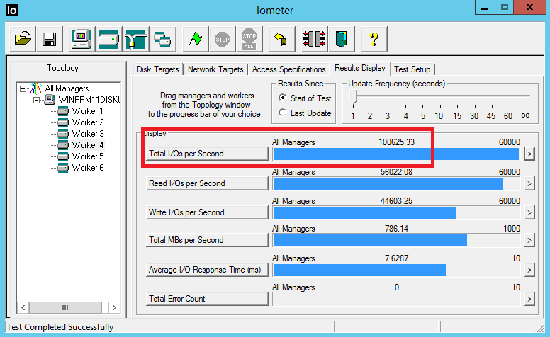
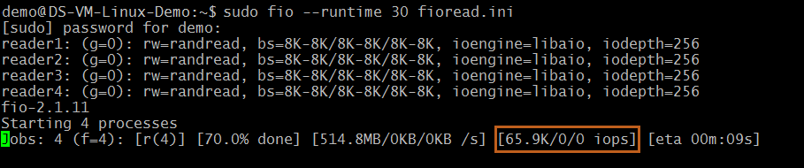
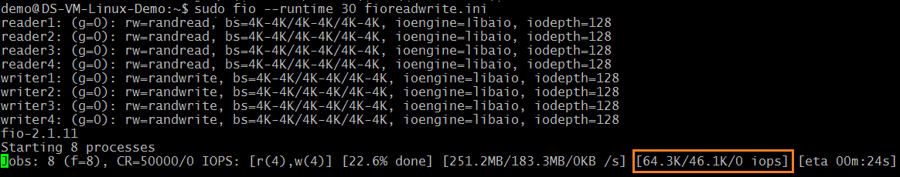

*Warming up the Cache*  
The disk with ReadOnly host caching are able to give higher IOPS than the disk limit. To get this maximum read performance from the host cache, first you must warm up the cache of this disk. This ensures that the Read IOs that the benchmarking tool will drive on CacheReads volume, actually hits the cache, and not the disk directly. The cache hits result in additional IOPS from the single cache enabled disk.

> [!IMPORTANT]
> You must warm up the cache before running benchmarking, every time VM is rebooted.

## Tools

### Iometer

[Download the Iometer tool](https://sourceforge.net/projects/iometer/files/iometer-stable/2006-07-27/iometer-2006.07.27.win32.i386-setup.exe/download) on the VM.

#### Test file

Iometer uses a test file that is stored on the volume on which you run the benchmarking test. It drives Reads and Writes on this test file to measure the disk IOPS and Throughput. Iometer creates this test file if you have not provided one. Create a 200 GB test file called iobw.tst on the CacheReads and NoCacheWrites volumes.

#### Access specifications

The specifications, request IO size, % read/write, % random/sequential are configured using the "Access Specifications" tab in Iometer. Create an access specification for each of the scenarios described below. Create the access specifications and "Save" with an appropriate name like – RandomWrites\_8K, RandomReads\_8K. Select the corresponding specification when running the test scenario.

An example of access specifications for maximum Write IOPS scenario is shown below,  
    

#### Maximum IOPS test specifications

To demonstrate maximum IOPs, use smaller request size. Use 8K request size and create specifications for Random Writes and Reads.

| Access Specification | Request size | Random % | Read % |
| --- | --- | --- | --- |
| RandomWrites\_8K |8K |100 |0 |
| RandomReads\_8K |8K |100 |100 |

#### Maximum throughput test specifications

To demonstrate maximum Throughput, use larger request size. Use 64 K request size and create specifications for Random Writes and Reads.

| Access Specification | Request size | Random % | Read % |
| --- | --- | --- | --- |
| RandomWrites\_64K |64 K |100 |0 |
| RandomReads\_64K |64 K |100 |100 |

#### Run the Iometer test

Perform the steps below to warm up cache

1. Create two access specifications with values shown below,

   | Name | Request size | Random % | Read % |
   | --- | --- | --- | --- |
   | RandomWrites\_1MB |1 MB |100 |0 |
   | RandomReads\_1MB |1 MB |100 |100 |
1. Run the Iometer test for initializing cache disk with following parameters. Use three worker threads for the target volume and a queue depth of 128. Set the "Run time" duration of the test to 2 hrs on the "Test Setup" tab.

   | Scenario | Target Volume | Name | Duration |
   | --- | --- | --- | --- |
   | Initialize Cache Disk |CacheReads |RandomWrites\_1MB |2 hrs |
1. Run the Iometer test for warming up cache disk with following parameters. Use three worker threads for the target volume and a queue depth of 128. Set the "Run time" duration of the test to 2 hrs on the "Test Setup" tab.

   | Scenario | Target Volume | Name | Duration |
   | --- | --- | --- | --- |
   | Warm up Cache Disk |CacheReads |RandomReads\_1MB |2 hrs |

After cache disk is warmed up, proceed with the test scenarios listed below. To run the Iometer test, use at least three worker threads for **each** target volume. For each worker thread, select the target volume, set queue depth and select one of the saved test specifications, as shown in the table below, to run the corresponding test scenario. The table also shows expected results for IOPS and Throughput when running these tests. For all scenarios, a small IO size of 8 KB and a high queue depth of 128 is used.

| Test Scenario | Target Volume | Name | Result |
| --- | --- | --- | --- |
| Max. Read IOPS |CacheReads |RandomWrites\_8K |50,000 IOPS |
| Max. Write IOPS |NoCacheWrites |RandomReads\_8K |64,000 IOPS |
| Max. Combined IOPS |CacheReads |RandomWrites\_8K |100,000 IOPS |
| NoCacheWrites |RandomReads\_8K | &nbsp; | &nbsp; |
| Max. Read MB/sec |CacheReads |RandomWrites\_64K |524 MB/sec |
| Max. Write MB/sec |NoCacheWrites |RandomReads\_64K |524 MB/sec |
| Combined MB/sec |CacheReads |RandomWrites\_64K |1000 MB/sec |
| NoCacheWrites |RandomReads\_64K | &nbsp; | &nbsp; |

Below are screenshots of the Iometer test results for combined IOPS and Throughput scenarios.

#### Combined reads and writes maximum IOPS



#### Combined reads and writes maximum throughput


### FIO

FIO is a popular tool to benchmark storage on the Linux VMs. It has the flexibility to select different IO sizes, sequential or random reads and writes. It spawns worker threads or processes to perform the specified I/O operations. You can specify the type of I/O operations each worker thread must perform using job files. We created one job file per scenario illustrated in the examples below. You can change the specifications in these job files to benchmark different workloads running on Premium Storage. In the examples, we are using a Standard DS 14 VM running **Ubuntu**. Use the same setup described in the beginning of the Benchmarking section and warm up the cache before running the benchmarking tests.

Before you begin, [download FIO](https://github.com/axboe/fio) and install it on your virtual machine.

Run the following command for Ubuntu,

```
apt-get install fio
```

We use four worker threads for driving Write operations and four worker threads for driving Read operations on the disks. The Write workers are driving traffic on the "nocache" volume, which has 10 disks with cache set to "None". The Read workers are driving traffic on the "readcache" volume, which has one disk with cache set to "ReadOnly".

#### Maximum write IOPS

Create the job file with following specifications to get maximum Write IOPS. Name it "fiowrite.ini".

```ini
[global]
size=30g
direct=1
iodepth=256
ioengine=libaio
bs=8k

[writer1]
rw=randwrite
directory=/mnt/nocache
[writer2]
rw=randwrite
directory=/mnt/nocache
[writer3]
rw=randwrite
directory=/mnt/nocache
[writer4]
rw=randwrite
directory=/mnt/nocache
```

Note the follow key things that are in line with the design guidelines discussed in previous sections. These specifications are essential to drive maximum IOPS,  

* A high queue depth of 256.  
* A small block size of 8 KB.  
* Multiple threads performing random writes.

Run the following command to kick off the FIO test for 30 seconds,  

```
sudo fio --runtime 30 fiowrite.ini
```

While the test runs, you are able to see the number of write IOPS the VM and Premium disks are delivering. As shown in the sample below, the DS14 VM is delivering its maximum write IOPS limit of 50,000 IOPS.  
    

#### Maximum read IOPS

Create the job file with following specifications to get maximum Read IOPS. Name it "fioread.ini".

```ini
[global]
size=30g
direct=1
iodepth=256
ioengine=libaio
bs=8k

[reader1]
rw=randread
directory=/mnt/readcache
[reader2]
rw=randread
directory=/mnt/readcache
[reader3]
rw=randread
directory=/mnt/readcache
[reader4]
rw=randread
directory=/mnt/readcache
```

Note the follow key things that are in line with the design guidelines discussed in previous sections. These specifications are essential to drive maximum IOPS,

* A high queue depth of 256.  
* A small block size of 8 KB.  
* Multiple threads performing random writes.

Run the following command to kick off the FIO test for 30 seconds,

```
sudo fio --runtime 30 fioread.ini
```

While the test runs, you are able to see the number of read IOPS the VM and Premium disks are delivering. As shown in the sample below, the DS14 VM is delivering more than 64,000 Read IOPS. This is a combination of the disk and the cache performance.  
    

#### Maximum read and write IOPS

Create the job file with following specifications to get maximum combined Read and Write IOPS. Name it "fioreadwrite.ini".

```ini
[global]
size=30g
direct=1
iodepth=128
ioengine=libaio
bs=4k

[reader1]
rw=randread
directory=/mnt/readcache
[reader2]
rw=randread
directory=/mnt/readcache
[reader3]
rw=randread
directory=/mnt/readcache
[reader4]
rw=randread
directory=/mnt/readcache

[writer1]
rw=randwrite
directory=/mnt/nocache
rate_iops=12500
[writer2]
rw=randwrite
directory=/mnt/nocache
rate_iops=12500
[writer3]
rw=randwrite
directory=/mnt/nocache
rate_iops=12500
[writer4]
rw=randwrite
directory=/mnt/nocache
rate_iops=12500
```

Note the follow key things that are in line with the design guidelines discussed in previous sections. These specifications are essential to drive maximum IOPS,

* A high queue depth of 128.  
* A small block size of 4 KB.  
* Multiple threads performing random reads and writes.

Run the following command to kick off the FIO test for 30 seconds,

```
sudo fio --runtime 30 fioreadwrite.ini
```

While the test runs, you are able to see the number of combined read and write IOPS the VM and Premium disks are delivering. As shown in the sample below, the DS14 VM is delivering more than 100,000 combined Read and Write IOPS. This is a combination of the disk and the cache performance.  
    

#### Maximum combined throughput

To get the maximum combined Read and Write Throughput, use a larger block size and large queue depth with multiple threads performing reads and writes. You can use a block size of 64 KB and queue depth of 128.
