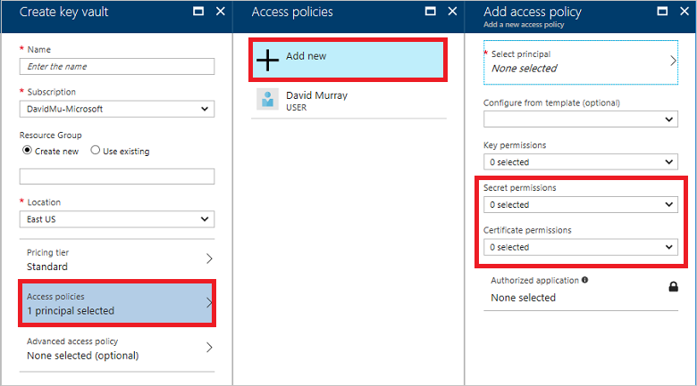
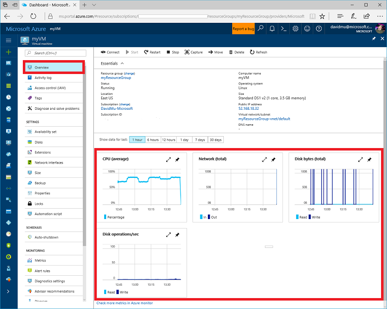
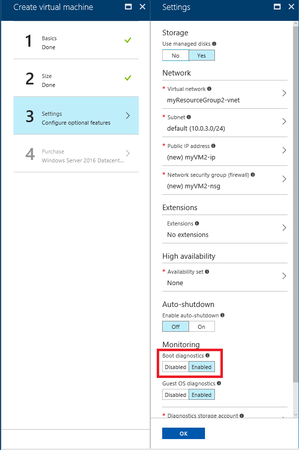

It’s important for you to keep your virtual machine (VM) secure for the applications that you run. To make sure that your applications run as efficiently as possible, it is also important to be able to monitor the health and actions of your VM. This article provides information that enables you to keep your VM secure and to monitor many aspects of it.

## Secure your VM

### Antimalware

The modern threat landscape for cloud environments is dynamic, increasing the pressure to maintain effective protection in order to meet compliance and security requirements. [Microsoft Antimalware for Azure](../articles/security/azure-security-antimalware.md) is a free real-time protection capability that helps identify and remove viruses, spyware, and other malicious software. Alerts can be configured to notify you when known malicious or unwanted software attempts to install itself or run on your VM.

### Azure Security Center

[Azure Security Center](../articles/security-center/security-center-intro.md) helps you prevent, detect, and respond to threats to your VMs. It provides integrated security monitoring and policy management across your Azure subscriptions, helps detect threats that might otherwise go unnoticed, and works with a broad ecosystem of security solutions.

### Encryption

For enhanced [Windows VM](../articles/virtual-machines/windows/encrypt-disks.md) and [Linux VM](../articles/virtual-machines/linux/encrypt-disks.md) security and compliance, virtual disks in Azure can be encrypted. Disks are encrypted using cryptographic keys that are secured in a key vault. You control these cryptographic keys and can audit their use.

### Key Vault and SSH Keys

Secrets and certificates can be modeled as resources and provided by [Key Vault](../articles/key-vault/key-vault-whatis.md). You can use Azure PowerShell to create key vaults for [Windows VMs](../articles/virtual-machines/windows/key-vault-setup.md) and the Azure CLI for [Linux VMs](../articles/virtual-machines/linux/key-vault-setup.md). You can also create keys for encryption.

Key vault access policies grant permissions to keys, secrets, and certificates separately. For example, you can give a user access to only keys, but no permissions for secrets. However, permissions to access keys or secrets or certificates are at the vault level. In other words, key vault access policy does not support object level permissions. You can use [Azure portal](http://portal.azure.com) to [set access policies for a key vault](../articles/key-vault/key-vault-secure-your-key-vault.md):

You can also use the [Azure CLI](https://docs.microsoft.com/cli/azure/keyvault), [Azure PowerShell](https://docs.microsoft.com/powershell/module/azurerm.keyvault/?view=azurermps-4.2.0#key_vault), or the [Key Vault REST APIs](https://docs.microsoft.com/rest/api/keyvault/).

When you connect to VMs, you should use public-key cryptography to provide a more secure way to log in to them. This process involves a public and private key exchange using the secure shell (SSH) command to authenticate yourself rather than a username and password. Passwords are vulnerable to brute-force attacks, especially on Internet-facing VMs such as web servers. With a secure shell (SSH) key pair, you can create [Windows VMs](../articles/virtual-machines/linux/ssh-from-windows.md) and [Linux VMs](../articles/virtual-machines/linux/mac-create-ssh-keys.md) that use SSH keys for authentication, eliminating the need for passwords to log in.

### Policies

[Azure Resource Manager policies](../articles/azure-resource-manager/resource-manager-policy.md) can be used to define the desired behavior for your organization's [Windows VMs](../articles/virtual-machines/windows/policy.md) and [Linux VMs](../articles/virtual-machines/linux/policy.md). By using policies, an organization can enforce various conventions and rules throughout the enterprise. Enforcement of the desired behavior can help mitigate risk while contributing to the success of the organization.

### Role-based access control

Using [role-based access control (RBAC)](../articles/active-directory/role-based-access-control-what-is.md), you can segregate duties within your team and grant only the amount of access to users on your VM that they need to perform their jobs. Instead of giving everybody unrestricted permissions on the VM, you can allow only certain actions. You can configure access control for the VM in the Azure portal:

You can also use the [Azure CLI](https://docs.microsoft.com/cli/azure/role), [Azure PowerShell](../articles/active-directory/role-based-access-control-manage-access-powershell.md), or the [Azure Resource Manager REST APIs](../articles/active-directory/role-based-access-control-manage-access-rest.md).

## Monitor your VM

You can take advantage of many opportunities to monitor your VMs by collecting, viewing, and analyzing diagnostic and log data. To do monitor your VM, you can use the Azure portal, [Azure Monitor](../articles/monitoring-and-diagnostics/monitoring-overview-azure-monitor.md), [Application Insights](../articles/application-insights/app-insights-overview.md), [Log Analytics](../articles/log-analytics/log-analytics-overview.md), and [extensions](../articles/virtual-machines/windows/extensions-features.md).

### Diagnostics and metrics 

You can set up and monitor the collection of [diagnostics data](https://docs.microsoft.com/cli/azure/vm/diagnostics) using [metrics](../articles/monitoring-and-diagnostics/monitoring-overview-metrics.md) in the Azure portal, the Azure CLI, Azure PowerShell, and programming Applications Programming Interfaces (APIs). For example, you can:

- **Observe basic metrics for the VM.** On the Overview screen of the Azure portal, the basic metrics shown include CPU usage, network usage, total of disk bytes, and disk operations per second:

    

- **Enable the collection of boot diagnostics and view it using the Azure portal.** When bringing your own image to Azure or even booting one of the platform images, there can be many reasons why a VM gets into a non-bootable state. You can easily enable boot diagnostics when you create a VM:

    

    As VMs boot, the boot diagnostic agent captures boot output and stores it in Azure storage. This data can be used to troubleshoot VM boot issues. Boot diagnostics are not automatically enabled when you create a VM from command-line tools. Before enabling boot diagnostics, a storage account needs to be created for storing boot logs. If you enable boot diagnostics in the Azure portal, a storage account is automatically created for you.

    If you didn’t enable boot diagnostics when the VM was created, you can always enable it later by using [Azure CLI](https://docs.microsoft.com/cli/azure/vm/boot-diagnostics), [Azure PowerShell](https://docs.microsoft.com/powershell/module/azurerm.compute/set-azurermvmbootdiagnostics?view=azurermps-4.2.0), or [Azure Resource Manager template](../articles/virtual-machines/windows/extensions-diagnostics-template.md).

- **Enable the collection of guest OS diagnostics data.** When you create a VM, you have the opportunity on the settings bade to enable guest OS diagnostics. When you do enable the collection of diagnostics data, the [IaaSDiagnostics extension for Linux](../articles/virtual-machines/linux/diagnostic-extension.md) or the [IaaSDiagnostics extension for Windows](../articles/virtual-machines/windows/ps-extensions-diagnostics.md) is added to the VM, which enables you to collect guest OS data in addition to Host OS data.

    On the Metrics screen in the Azure portal, when guest OS diagnostics data collection is not enabled, you only see opportunities to view Host data:

    

    When guest OS diagnostics data collection is enabled, you get access to many guest OS metrics:

    

### Alerts

You can create [alerts](../articles/monitoring-and-diagnostics/monitoring-overview-alerts.md) based on specific performance metrics. Alerts can be used to notify you when average CPU usage exceeds a certain threshold or available free disk space drops below a certain amount, for example. Alerts are displayed in the Azure portal or can be sent via email:

### Azure Service Health

[Azure Service Health](../articles/service-health/service-health-overview.md) provides personalized guidance and support when issues in Azure services affect you, and helps you prepare for upcoming planned maintenance. Azure Service Health alerts you and your teams using targeted and flexible notifications.

### Azure Resource Health

[Azure Resource health](../articles/service-health/resource-health-overview.md) helps you diagnose and get support when an Azure issue impacts your resources. It informs you about the current and past health of your resources and helps you mitigate issues. Resource health provides technical support when you need help with Azure service issues.

### Logs

The [Azure Activity Log](../articles/monitoring-and-diagnostics/monitoring-overview-activity-logs.md) is a subscription log that provides insight into subscription-level events that have occurred in Azure. The log includes a range of data, from Azure Resource Manager operational data to updates on Service Health events. You can use the Azure portal to view the Activity log for your VM:

Some of the things you can do with the activity log include:

- Create an [alert on an Activity Log event](../articles/monitoring-and-diagnostics/monitoring-overview-activity-logs.md).
- [Stream it to an Event Hub](../articles/monitoring-and-diagnostics/monitoring-stream-activity-logs-event-hubs.md) for ingestion by a third-party service or custom analytics solution such as PowerBI.
- Analyze it in PowerBI using the [PowerBI content pack](https://powerbi.microsoft.com/documentation/powerbi-content-pack-azure-audit-logs/).
- [Save it to a storage account](../articles/monitoring-and-diagnostics/monitoring-archive-activity-log.md) for archival or manual inspection. You can specify the retention time (in days) using the Log Profile.

You can also access activity log data by using [Azure PowerShell](https://docs.microsoft.com/powershell/module/azurerm.insights/?view=azurermps-4.2.0#monitor), the [Azure CLI\(https://docs.microsoft.com/cli/azure/monitor), or [Monitor REST APIs](https://docs.microsoft.com/rest/api/monitor/).

[Azure Diagnostic Logs](../articles/monitoring-and-diagnostics/monitoring-overview-of-diagnostic-logs.md) are logs emitted by your VM that provide rich, frequent data about its operation. Diagnostic logs differ from the activity log by providing insight about operations that were performed within the VM.

Some of the things you can do with diagnostics logs include:

- [Save them to a storage account](../articles/monitoring-and-diagnostics/monitoring-archive-diagnostic-logs.md) for auditing or manual inspection. You can specify the retention time (in days) using Resource Diagnostic Settings.
- [Stream them to Event Hubs](../articles/monitoring-and-diagnostics/monitoring-stream-diagnostic-logs-to-event-hubs.md) for ingestion by a third-party service or custom analytics solution such as PowerBI.
- Analyze them with [OMS Log Analytics](../articles/log-analytics/log-analytics-azure-storage.md).

### Advanced monitoring

- [Operations Management Suite (OMS)](https://docs.microsoft.com/azure/operations-management-suite/) provides monitoring, alerting, and alert remediation capabilities across cloud and on-premises assets. You can install an extension on a [Linux VM](../articles/virtual-machines/linux/extensions-oms.md) or a [Windows VM](../articles/virtual-machines/windows/extensions-oms.md) that installs the OMS agent, and enrolls the VM into an existing OMS workspace.

- [Log Analytics](../articles/log-analytics/log-analytics-overview.md) is a service in OMS that monitors your cloud and on-premises environments to maintain their availability and performance. It collects data generated by resources in your cloud and on-premises environments and from other monitoring tools to provide analysis across multiple sources.

    For Windows and Linux VMs, the recommended method for collecting logs and metrics is by installing the Log Analytics agent. The easiest way to install the Log Analytics agent on a VM is through the [Log Analytics VM Extension](../articles/log-analytics/log-analytics-azure-vm-extension.md). Using the extension simplifies the installation process and automatically configures the agent to send data to the Log Analytics workspace that you specify. The agent is also upgraded automatically, ensuring that you have the latest features and fixes.

- [Network Watcher](../articles/network-watcher/network-watcher-monitoring-overview.md) enables you to monitor your VM and its associated resources as they relate to the network that they are in. You can install the Network Watcher Agent extension on a [Linux VM](../articles/virtual-machines/linux/extensions-nwa.md) or a [Windows VM](../articles/virtual-machines/windows/extensions-nwa.md).

## Next steps

- Walk through the steps in [Monitor a Windows Virtual Machine with Azure PowerShell](../articles/virtual-machines/windows/tutorial-monitoring.md) or [Monitor a Linux Virtual Machine with the Azure CLI](../articles/virtual-machines/linux/tutorial-monitoring.md).
- Learn more about the best practices around [Monitoring and diagnostics](https://docs.microsoft.com/azure/architecture/best-practices/monitoring).

